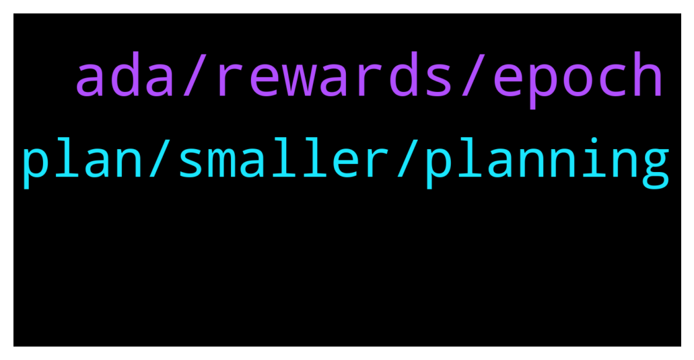

# **@Cardano**
 ## Analysis for **2022-01-31** - **2022-02-01**.

---

## 📊 **Basic Stats**

**n_messages_sent**: 74

---

---

## 🔝 **Top keywords and related messages**

1. **ada, rewards, epoch**

    @tigonik --- *Would someone know what Total Output means in terms of an epoch? The value I see on CardanoScan for epoch 316 exceeds total supply of ADA. See link: https://cardanoscan.io/epoch/316* **--->** [TG Discussion](https://t.me/Cardano/777658)

    @AP_ADA --- *Why i can not make transactions on Yoroi? What happened with this system? And the wallet needs very much time to go online …* **--->** [TG Discussion](https://t.me/Cardano/777237)

    @Cardano_Vechain_fan --- *Does anyone know if you receive sundayswap tokens if you delegated to a selected pool on the 25 of january (before the epoch ended). If so what adress from my Deadelus wallet should I use to check for rewards (the calculation). My Daedelus wallet has several adresses generated.* **--->** [TG Discussion](https://t.me/Cardano/777419)

    @Jace999 --- *I went to the Nami web app wallet to recover my wallet and then seconds later all my assets were sent to another address. I'm still earning rewards from delegating my ADA tho* **--->** [TG Discussion](https://t.me/Cardano/777361)

    @ChrisSTR8 --- *One epoch is 5 days, if e.g. a whale moves her ADA multiple times it adds up* **--->** [TG Discussion](https://t.me/Cardano/777661)

    @Isidor --- *When will Meld tokens drop since been staking ADA for meld? Does anybody know the exchange? Izzy* **--->** [TG Discussion](https://t.me/Cardano/777653)

2. **plan, smaller, planning**

    @Morpheus369 --- *So what is a good paradigm to follow when building a successful project? For example I tought to split up a big projekt into smaller hurdles and testing everything and fixing bugs before implementing it. I also tought that one should begin with the vision and analyzing the market. Then one should split up the plan into smaller hurdles  and plan every detail of the hurdle and then test it. Afterwards do this for the second plan. In the end one should start implementing the test code into the real projekt. But the implementation should also be done in smaller steps. Is this a good plan or what is more efficient? I also heard the biggest enemy of good enough is perfect. Is this plan too perfectionsist? So maybe there needs to be a compromise? What do you think?* **--->** [TG Discussion](https://t.me/Cardano/777572)

    @glitch04 --- *Sounds like a great place to start* **--->** [TG Discussion](https://t.me/Cardano/777602)

    @glitch04 --- *Then move to put that plan into motion, so you are not stuck in the planning phase* **--->** [TG Discussion](https://t.me/Cardano/777592)

    @Morpheus369 --- *what do you mean with "work toward function"* **--->** [TG Discussion](https://t.me/Cardano/777588)

    @glitch04 --- *I would say perfect is not required so long as you are adaptable and can identify the issues along the way* **--->** [TG Discussion](https://t.me/Cardano/777576)

    @glitch04 --- *I would say the small steps but that is personal preference* **--->** [TG Discussion](https://t.me/Cardano/777600)

