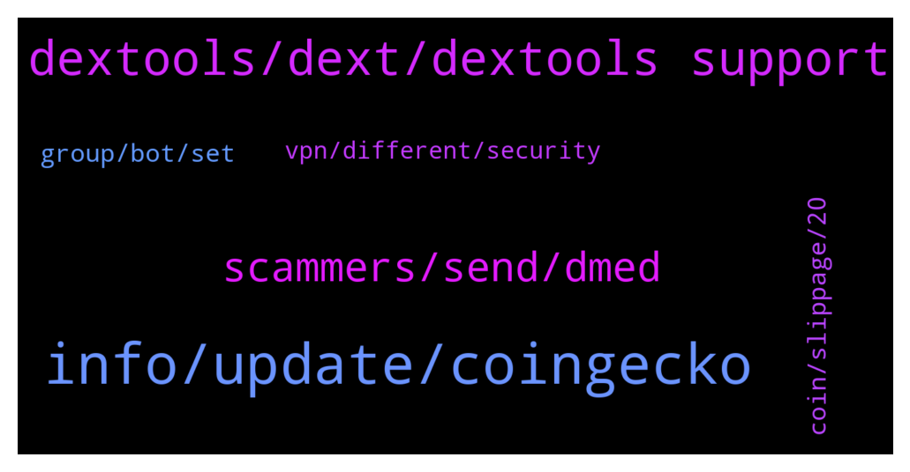

# **@DEXToolsCommunity**
 ## Analysis for **2022-01-30** - **2022-02-01**.

---

## 📊 **Basic Stats**

**n_messages_sent**: 197

---

---

## 🔝 **Top keywords and related messages**

1. **info, update, coingecko**

    @Mojomagick --- *Your charts are not realistic.  You constantly remove the wicks from your charts.   Look at AVT chart for example.  https://www.dextools.io/app/ether/pair-explorer/0xcdff6ddfc9e4807c9927fd58708c2ef3484cc305  It looks completely different on the Etherscan chart than on your chart.  https://etherscan.io/dex/uniswapv3/0xcdff6ddfc9e4807c9927fd58708c2ef3484cc305  I have asked multiple times to resolve.  I keep hearing the team will look into it and nothing happens.   When will this get fixed?* **--->** [TG Discussion](https://t.me/DEXToolsCommunity/330052)

    @covdraddict --- *so the higher the view, the more possibility to trend* **--->** [TG Discussion](https://t.me/DEXToolsCommunity/330213)

    @Trucker427 --- *Is it possible to have more than one wallet for monthly membership? Think I joined from wrong wallet I need to do some history checking on* **--->** [TG Discussion](https://t.me/DEXToolsCommunity/329893)

    @FredericDEXT --- *You need to click on the + next to your buy* **--->** [TG Discussion](https://t.me/DEXToolsCommunity/329557)

    @Jay --- *Lost 5 bnb due to you guys trending a honey pot* **--->** [TG Discussion](https://t.me/DEXToolsCommunity/329973)

    @Jay --- *Bro you guys system was trending it for over 24 hours* **--->** [TG Discussion](https://t.me/DEXToolsCommunity/329984)

2. **dextools, dext, dextools support**

    @whisardly --- *Hey can someone tell me what this contract is? I used dextools to purchase tokens and it interacted here.  https://bscscan.com/address/0xdef1c0ded9bec7f1a1670819833240f027b25eff* **--->** [TG Discussion](https://t.me/DEXToolsCommunity/329520)

    @oni_o_n --- *good morning all, can someone please inform me how to update the dextools info for a token that I deployed* **--->** [TG Discussion](https://t.me/DEXToolsCommunity/330265)

    @Jhongamadeo --- *Hi is dex only on uniswap for buying* **--->** [TG Discussion](https://t.me/DEXToolsCommunity/329475)

    @golh30 --- *From where dext chart data is coming* **--->** [TG Discussion](https://t.me/DEXToolsCommunity/329591)

    @farhad13345 --- *How can i trend my token in dextools* **--->** [TG Discussion](https://t.me/DEXToolsCommunity/329598)

    @Yaknota --- *How can i get the dextool link* **--->** [TG Discussion](https://t.me/DEXToolsCommunity/329603)

3. **scammers, send, dmed**

    @kingkhalil --- *Sorry, I only talk to admins 🤐* **--->** [TG Discussion](https://t.me/DEXToolsCommunity/329663)

    @bastardganpunk --- *For ads and marketing please send a DM to @guillermorodriguez78  Admins NEVER DM FIRST* **--->** [TG Discussion](https://t.me/DEXToolsCommunity/329400)

    @stanes --- *Hi, Please DM @guillermorodriguez78 he is the person-in-charge.  Be aware of scammers, HE WILL NEVER DM YOU FIRST.* **--->** [TG Discussion](https://t.me/DEXToolsCommunity/330040)

    @bastardganpunk --- *That means a scammer DMed you! Careful please, no admin will ever DM you first!* **--->** [TG Discussion](https://t.me/DEXToolsCommunity/329668)

    @granini7 --- *Ok I now, but I must send 319 DXT also yes?* **--->** [TG Discussion](https://t.me/DEXToolsCommunity/329831)

    @czyrs --- *can i send you a dm?* **--->** [TG Discussion](https://t.me/DEXToolsCommunity/330027)

4. **group, bot, set**

    @kingkhalil --- *The issue is that I have set the price bot in the group but it does not let us know about the price* **--->** [TG Discussion](https://t.me/DEXToolsCommunity/329670)

    @bastardganpunk --- *Which group are you referring to?* **--->** [TG Discussion](https://t.me/DEXToolsCommunity/329690)

    @kingkhalil --- *What does it mean I have set DexScreener price bot to the group but it gives this message??????????* **--->** [TG Discussion](https://t.me/DEXToolsCommunity/329664)

    @kingkhalil --- *Can we add price pair list inside in dex pricing bot and then add it to group?* **--->** [TG Discussion](https://t.me/DEXToolsCommunity/329685)

    @bastardganpunk --- *I think you’re talking about the price bot for setting up in other groups (sorry there are a few bots 😅)  Here is a guide on how to set it up. Does this answer your question?  https://youtu.be/nntj0q9sap4* **--->** [TG Discussion](https://t.me/DEXToolsCommunity/329691)

    @stanes --- *You can join the Chinese group here: https://t.me/DEXTChinese* **--->** [TG Discussion](https://t.me/DEXToolsCommunity/329732)

5. **coin, slippage, 20**

    @Monolithof --- *But what I didn't know was, I even wouldn't be able to get a price alert from that coin, when the price alert is not even expired* **--->** [TG Discussion](https://t.me/DEXToolsCommunity/329952)

    @adiju97 --- *Is Atom ETP a Scam Coin?* **--->** [TG Discussion](https://t.me/DEXToolsCommunity/329763)

    @Khmerkickass --- *I was trying to sell some coin and regardless how I set the slippage from 5% to 20%, it keeps saying insufficient. What does it mean?* **--->** [TG Discussion](https://t.me/DEXToolsCommunity/329439)

    @Jay --- *Lol you guys rated it 61/100 even coins that’s not even rugging are listed as 20/100* **--->** [TG Discussion](https://t.me/DEXToolsCommunity/329855)

    @Khmerkickass --- *I only want to sell 20% of the coin so there should be enough for the fee* **--->** [TG Discussion](https://t.me/DEXToolsCommunity/329441)

    @bastardganpunk --- *You can still apply at coingecko* **--->** [TG Discussion](https://t.me/DEXToolsCommunity/329405)

6. **vpn, different, security**

    @Madsumo --- *I have tried both UK and US servers and it is the same for both.* **--->** [TG Discussion](https://t.me/DEXToolsCommunity/329742)

    @JoeyDieleman --- *This has to do with cloudflare not trusting the vpn its ip address* **--->** [TG Discussion](https://t.me/DEXToolsCommunity/329739)

    @Madsumo --- *Hi.  Recently my laptop was compromised and so I rebuilt it from the bottom up, i.e. complete reinstall from the OS up.  I have then set all apps where possible to 2FA and installed Norton360 plus their SecureVPN service.  On startup, with the VPN enabled, I can still access all my apps, exchanges, and wallets but I cannot access the DEXTools App. I get an error stating your site has security to stop security attacks. If I stop the VPN, connect to your site first, and then restart the VPN, it is fine.  I believe this is then bypassing my VPN as the session was started without it enabled.  I am not a security expert but is there anything I can do so I do not have to stop and re-enable the VPN?* **--->** [TG Discussion](https://t.me/DEXToolsCommunity/329736)

    @napascual --- *Maybe try with different countries then uk/us as well, check that the ip comes from a trusted ASN* **--->** [TG Discussion](https://t.me/DEXToolsCommunity/329752)

    @napascual --- *I remember a user that had norton 360 vpn service using non trusted ASNs. I encourage you to use a different vpn provider* **--->** [TG Discussion](https://t.me/DEXToolsCommunity/329750)

    @JoeyDieleman --- *You could try, if the vpn supports, to connect to another node/country or try another vpn service* **--->** [TG Discussion](https://t.me/DEXToolsCommunity/329740)

