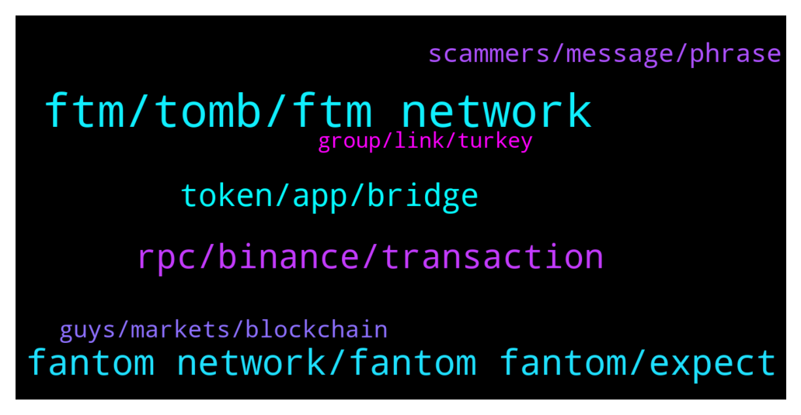

# **@Fantom_English**
 ## Analysis for **2022-01-31** - **2022-02-01**.

---

## 📊 **Basic Stats**

**n_messages_sent**: 156

---

---

## 🔝 **Top keywords and related messages**

1. **ftm, tomb, ftm network**

    @Riquacrpt0 --- *I have a noob question — thanks for your help.  I bought ftm on kucoin and binance us. I withdrew from both places via the FTM network to Metamask FTM network.  Is it possible to just use the FTM on the FTM network for staking and LPs? Or do I need to move them to the native fantom wallet? I want to use the FTM with my ledger, but every guide I look up seems to have FTM on the Eth network.* **--->** [TG Discussion](https://t.me/Fantom_English/645114)

    @maxxmoro --- *I would like to stake my ftm on Tomb. My ftm are on metamask Fantom chain. Can you suggest a tutorial or a procedure ? Thanks* **--->** [TG Discussion](https://t.me/Fantom_English/645047)

    @Grahamers --- *Hi Fantom People, I'm about to go LONG FTM , but need to get verification about one thing. I read somewhere along the way today that it was a STATED intent for FTM dev team to increase TPS (not time to finality) , Transactions per second... can anybody confirm this and direct me to a link/statement? I am ALL OVER FTM. Sol Killer for sure 2022 IMHO. Thanks in advance, G* **--->** [TG Discussion](https://t.me/Fantom_English/645665)

    @Mt --- *however theres no trace of the transaction on ftm scan* **--->** [TG Discussion](https://t.me/Fantom_English/645378)

    @Fjody --- *On official FTM website, there is a chat icon in the bottom right corner to open an official ticket.* **--->** [TG Discussion](https://t.me/Fantom_English/645955)

    @Janevietani --- *change your metamask to bsc network and import FTM Bep20 token on metamask bsc network with this contract address  https://bscscan.com/address/0xad29abb318791d579433d831ed122afeaf29dcfe* **--->** [TG Discussion](https://t.me/Fantom_English/645391)

2. **fantom network, fantom fantom, expect**

    @yanperor --- *no i use metamask app on Android* **--->** [TG Discussion](https://t.me/Fantom_English/645162)

    @slickrick6 --- *Fantom on TG  Official: t.me/Fantom_English Announcements (official) : t.me/fantomfoundation Trading: t.me/FantomTrading French (Française): t.me/FantomFR Chinese (中文): https://t.me/FantomChinese Russian (русский): http://t.me/Fantom_Russian Vietnam : https://t.me/FantomVietnamGroup Turkey : https://t.me/Fantomir1  Fantom on DIscord: chat.fantom.network  Fantom on Twitter: twitter.com/fantomfdn* **--->** [TG Discussion](https://t.me/Fantom_English/645288)

    @leonarrdd991 --- *hello! where can i see fantom ecosystem ? :)* **--->** [TG Discussion](https://t.me/Fantom_English/645617)

    @thiagorochaoc --- *Hi. Can anyone recommend me an article or video about Fantom for further study? It can be a long presentation or a large article.* **--->** [TG Discussion](https://t.me/Fantom_English/645584)

    @Mcjig --- *when using a ledger with fantom/ you will use the eth app with metamask* **--->** [TG Discussion](https://t.me/Fantom_English/645119)

    @Mcjig --- *fantom is fantom. it just depends on what network you want it on* **--->** [TG Discussion](https://t.me/Fantom_English/644977)

3. **rpc, binance, transaction**

    @Derlisfloow --- *It has been two hours and binance has already confirmed the withdrawal but nothing has arrived.* **--->** [TG Discussion](https://t.me/Fantom_English/645748)

    @Mt --- *Hi Team ,  i have recently sent over FTM  from a binance account to my fantom opera wallet-  24hrs ago -  the transaction has been confirmed however i dont have anything in my wallet ?* **--->** [TG Discussion](https://t.me/Fantom_English/645349)

    @Janevietani --- *how to resolve pending txs ?  1. reset metamask go to metamask setting -> advanced -> reset reset metamask will only clear pending tx   2. add other RPC for back up Fantom RPC : a. https://rpc.ftm.tools/ b. https://rpc.ankr.com/fantom c. https://ftmrpc.ultimatenodes.io/   ChainID: 250 Symbol: FTM Browser : https://ftmscan.com  3. after reset metamask and add new rpc re-do your tx, check gas price here https://ftm.guru/fantomscan.html* **--->** [TG Discussion](https://t.me/Fantom_English/645848)

    @Pmoneyworld --- *The transaction is showing as successful but it’s not delivered to my wallet* **--->** [TG Discussion](https://t.me/Fantom_English/645965)

    @Pmoneyworld --- *Hey guys I have a transaction stuck from yesterday 1 day 1hr now.. it’s confirmed in the block but still has so many blocks to go.. how can I speed this up please* **--->** [TG Discussion](https://t.me/Fantom_English/645817)

    @dogemandan --- *Hey guys any idea on a time frame for coinbase listing* **--->** [TG Discussion](https://t.me/Fantom_English/645752)

4. **token, app, bridge**

    @Lucian_08 --- *I need to place a ticket anyone knows what’s the best way to do it?* **--->** [TG Discussion](https://t.me/Fantom_English/645952)

    @wassoB --- *How do we get EverBridge on this list?* **--->** [TG Discussion](https://t.me/Fantom_English/645863)

    @thegreat06 --- *Please how can one bridge it ?admin?* **--->** [TG Discussion](https://t.me/Fantom_English/645779)

    @Mt --- *done so -  is there a token bridge?* **--->** [TG Discussion](https://t.me/Fantom_English/645394)

    @MLH822020 --- *Hello, I supplied some wBTC to Yearn and got a yvBTC token. Is there anywhere I can deposit that token? Thx* **--->** [TG Discussion](https://t.me/Fantom_English/645874)

    @thegreat06 --- *Okay admin how can one get the fusdt* **--->** [TG Discussion](https://t.me/Fantom_English/645561)

5. **scammers, message, phrase**

    @Lucian_08 --- *Admin is here?  It’s a lot of scammers out there that do and calls you here on telegram* **--->** [TG Discussion](https://t.me/Fantom_English/645950)

    @Pmoneyworld --- *Getting calls and lots of messages from different people from this group trying to help.. please only give me your response here. Do not dm me privately* **--->** [TG Discussion](https://t.me/Fantom_English/645819)

    @Juankinginurgarden --- *Dude stop sending people to the discord* **--->** [TG Discussion](https://t.me/Fantom_English/645535)

    @Mt --- *ive got about 30 people claiming to be mods.* **--->** [TG Discussion](https://t.me/Fantom_English/645356)

    @Mt --- *ok i have also recieved about 13 messages so stop now please....* **--->** [TG Discussion](https://t.me/Fantom_English/645352)

    @vesqm --- *You can prevent random people from calling, check TG security settings.  They are all scammers. As are the people who DM you.* **--->** [TG Discussion](https://t.me/Fantom_English/645823)

6. **guys, markets, blockchain**

    @camo1551 --- *Guys crypto venture firm Paradigm just led a 109M Series B investments in phantom... To the moon* **--->** [TG Discussion](https://t.me/Fantom_English/645611)

    @Chippiay --- *Bullish on crypto 2022 and Fantom here🤘. Crypto is creating and shaping the future hard and fast and not a baby to follow markets; so lets go guys👊🔥* **--->** [TG Discussion](https://t.me/Fantom_English/645143)

    @Cryptolover320 --- *India regulations  all crypto assets today 🇮🇳🇮🇳🇮🇳🇮🇳🇮🇳💥💥💥💥* **--->** [TG Discussion](https://t.me/Fantom_English/645829)

    @dully101 --- *Guys what’s the game that we play & earn crypto?* **--->** [TG Discussion](https://t.me/Fantom_English/645344)

    @Adnaan1 --- *Guys who make consistant profit here in crypto?* **--->** [TG Discussion](https://t.me/Fantom_English/645342)

    @ExPwr --- *What is happening with the Popsicle.Finance?* **--->** [TG Discussion](https://t.me/Fantom_English/645075)

7. **group, link, turkey**

    @Janevietani --- *can you send me link ?* **--->** [TG Discussion](https://t.me/Fantom_English/645866)

    @Fjody --- *Someone should correct the text or link. As stated yesterday the Turkey link leads to Iranian group.* **--->** [TG Discussion](https://t.me/Fantom_English/645781)

    @zenkert --- *English please. This is a English language group.* **--->** [TG Discussion](https://t.me/Fantom_English/645521)

    @Maureen --- *Can I get the group link please* **--->** [TG Discussion](https://t.me/Fantom_English/645335)

    @parkerama --- *Hello ama voice chat suggestion dev dm* **--->** [TG Discussion](https://t.me/Fantom_English/645610)

    @slickrick6 --- *You can DM any of the admins your friends proposal and we will forward it* **--->** [TG Discussion](https://t.me/Fantom_English/645434)

