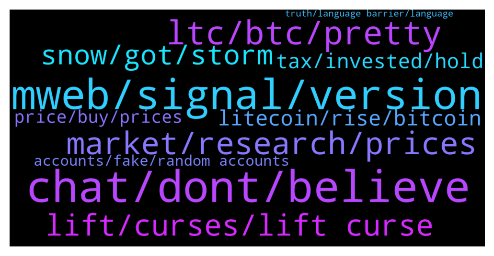

# **@Litecoin**
 ## Analysis for **2022-01-31** - **2022-02-01**.

---

## 📊 **Basic Stats**

**n_messages_sent**: 340

---

---

## 🔝 **Top keywords and related messages**

1. **chat, dont, believe**

    @Macro5674 --- *Wow now bots have upgraded well to chat with each other virtually like humans 🙄* **--->** [TG Discussion](https://t.me/Litecoin/2056175)

    @Congressional_Liason --- *Wrong person, I've never been banned. But you have. Good day.* **--->** [TG Discussion](https://t.me/Litecoin/2055814)

    @FFCosta --- *Even my messages keep getting deleted* **--->** [TG Discussion](https://t.me/Litecoin/2055144)

    @Congressional_Liason --- *Enjoy your day. I am. Some things deserve to be said given the days of gibberish. 😆  Enjoy!* **--->** [TG Discussion](https://t.me/Litecoin/2055794)

    @Kemiodigwe --- *No one asked you to believe* **--->** [TG Discussion](https://t.me/Litecoin/2055300)

    @Kemiodigwe --- *Okay. Speak to you really soon* **--->** [TG Discussion](https://t.me/Litecoin/2055337)

2. **mweb, signal, version**

    @cloudlite15 --- *I sold recently because I was told mweb was never going to be happening* **--->** [TG Discussion](https://t.me/Litecoin/2055970)

    @YuumuraKirika --- *Except they don't need more... It's pretty plug and play. They just have to run the new node software. They try to keep the code up to date... They also get part of each tx in fees.. MWEB included... If it doesn't reach 75% by a certain time, it's going to activate anyway according to BIP8, so I'm sure they want the tx fees from MWEB txs.. else they be missing out on some moolah* **--->** [TG Discussion](https://t.me/Litecoin/2056278)

    @coblee --- *Only mining pools signal. Exchanges will likely not use MWEB, so they won't need to upgrade. But they should upgrade their edge nodes.* **--->** [TG Discussion](https://t.me/Litecoin/2056228)

    @YuumuraKirika --- *@coblee do you guys have contacts for the major exchanges? Emails or something? How hard is it for exchanges to signal for MWEB in terms of backend work on their end?* **--->** [TG Discussion](https://t.me/Litecoin/2056206)

    @Notbiden --- *Is there a place we can see % of flags for mweb?* **--->** [TG Discussion](https://t.me/Litecoin/2055865)

    @SBH --- *What are the benefits for the miner to signal for MWEB?* **--->** [TG Discussion](https://t.me/Litecoin/2056263)

3. **ltc, btc, pretty**

    @schaapje --- *Idk still not converting my btc to ltc  even rough the ratio is insane low. Prob smart but idk i just keep my position as is.* **--->** [TG Discussion](https://t.me/Litecoin/2055572)

    @scratchticket --- *I spotted ltc at a coinstar kiosk at a Safeway!* **--->** [TG Discussion](https://t.me/Litecoin/2056045)

    @Congressional_Liason --- *I never dumped it at all, the wrong person. I'm pretty flush with xrp and xlm, too, along with btc.  This is the LTC forum; try to stick to the subject.* **--->** [TG Discussion](https://t.me/Litecoin/2055835)

    @Congressional_Liason --- *Think, research, and everyone picks your prices. LTC I often use without a single issue.* **--->** [TG Discussion](https://t.me/Litecoin/2055842)

    @Kemiodigwe --- *Ltc will hit 1028 this year* **--->** [TG Discussion](https://t.me/Litecoin/2055272)

    @morningzone --- *ltc will be always faster than btc, cos of smallr avg block time* **--->** [TG Discussion](https://t.me/Litecoin/2055372)

4. **market, research, prices**

    @Congressional_Liason --- *Pick your prices and think for yourself with facts given by Charlie and David, along with other successful crypto people.   Telling people to research and think is honest. You all go back to wrecking noobies if that's who you are. I follow my thoughts.  Also, the person who said community sentiment doesn't affect price should read the Stanford study that came out two years ago (you probably already have.) 😂   Have a good day, everyone. Pick your prices and find where the research is without the fud/fomo.  ✌️* **--->** [TG Discussion](https://t.me/Litecoin/2055808)

    @Congressional_Liason --- *Your posts I have a hard time comprehending.   For others, please do your research, pick your prices, and focus on facts, in my opinion.   I have a series of bids in at these prices; being long and using the coin, I’m good whichever way it goes.   Being a market-wide dip, I’m accumulating many coins, and given the history unfolding, I am glad to accumulate. Even in dips, I’m way ahead anyway, and for me, it’s a great time to collect.   Enjoy everyone, research, critical thinking, and when I see fud Increasing with good news, I’m a contrarian from the incessant fud here and buy.* **--->** [TG Discussion](https://t.me/Litecoin/2055790)

    @Furkan --- *Let's not be too pessimistic.  With the Asian opening, the market moves a little.  Uncle Powell spooked the market.  However, investors have already priced in before these statements.  Support point works fine.  I believe we will easily see 145-174-224 levels.  With the opening of the US stock market, the down nasdaq direction is important for bitcoins.  I am an Ltc investor with spot and leverage.  good luck everybody* **--->** [TG Discussion](https://t.me/Litecoin/2055176)

    @FFCosta --- *Last bull many ones sell houses and buy at top* **--->** [TG Discussion](https://t.me/Litecoin/2055309)

    @adamozi --- *Everything pumps in a bull market* **--->** [TG Discussion](https://t.me/Litecoin/2056154)

    @zhortheflow --- *if this was a bull market would have pumped* **--->** [TG Discussion](https://t.me/Litecoin/2056151)

5. **lift, curses, lift curse**

    @TonyNakamoto --- *Lift curse so ppl want holdl crypt0ad* **--->** [TG Discussion](https://t.me/Litecoin/2055596)

    @TonyNakamoto --- *Might neeB 2 add "bingo" itself to j0j0bingo if I can make room* **--->** [TG Discussion](https://t.me/Litecoin/2055786)

    @TonyNakamoto --- *Dey turn'd m0mdli into a scapem00n* **--->** [TG Discussion](https://t.me/Litecoin/2055592)

    @TonyNakamoto --- *dat C00pler Kupp is a beast* **--->** [TG Discussion](https://t.me/Litecoin/2055981)

    @TonyNakamoto --- *mayB 2nite megachkn say u 2 lift ur curses* **--->** [TG Discussion](https://t.me/Litecoin/2056246)

    @TonyNakamoto --- *neeB fepil 2 lift curse now* **--->** [TG Discussion](https://t.me/Litecoin/2055726)

6. **snow, got, storm**

    @BennyBennyBlanco --- *Some are without heat, this was a strong storm* **--->** [TG Discussion](https://t.me/Litecoin/2055944)

    @Congressional_Liason --- *We have two feet of snow, no big deal. Ice is what can be tricky. But that's off-topic, back to LTC colossal news, and more coming.* **--->** [TG Discussion](https://t.me/Litecoin/2055937)

    @BennyBennyBlanco --- *Snow can be good too. Did u know it cleans the air up from bacteria. Also if snow falls on the weekday, be stuck home and call out from work* **--->** [TG Discussion](https://t.me/Litecoin/2055936)

    @BennyBennyBlanco --- *A lot of snow here came, many cars were stuck in the snow and was hard to drive through* **--->** [TG Discussion](https://t.me/Litecoin/2055927)

    @morningzone --- *Jan 31st. 11:59.999 pm Hawaii Time* **--->** [TG Discussion](https://t.me/Litecoin/2055417)

    @bobby133 --- *Chilling at the beach today ..* **--->** [TG Discussion](https://t.me/Litecoin/2055939)

7. **litecoin, rise, bitcoin**

    @YuumuraKirika --- *Im sure some of them hold Litecoin.. the benefit would be if they think it's beneficial to the Litecoin network and their holdings* **--->** [TG Discussion](https://t.me/Litecoin/2056265)

    @njiawoa --- *Will litecoin rise back to $110?* **--->** [TG Discussion](https://t.me/Litecoin/2055553)

    @DizzyDaystop --- *Maybe litecoin should sponsor a football club like how Polkadot doing with Barcelona.* **--->** [TG Discussion](https://t.me/Litecoin/2056082)

    @onecryptochick --- *I'm extremely bullish on Litecoin idk why* **--->** [TG Discussion](https://t.me/Litecoin/2055956)

    @ForDaTek --- *Litecoin to replace bitcoin as currency with bitcoin being El Salvador’s ‘gold’ reserves. 😁* **--->** [TG Discussion](https://t.me/Litecoin/2055460)

    @Kemiodigwe --- *Many think litecoin is dead. It's the rise of a sleeping lion.* **--->** [TG Discussion](https://t.me/Litecoin/2055297)

8. **tax, invested, hold**

    @Jim --- *Do you think that the executive order for crypto will be bad? 🥲* **--->** [TG Discussion](https://t.me/Litecoin/2055421)

    @Congressional_Liason --- *Charlie has a nice size bag as evidenced by his last years post, and he uses it for development for a reason; advancement of his coin with no premine or downtime. Remember just recently him and his brother along with other crypto elites went to El Salvador.* **--->** [TG Discussion](https://t.me/Litecoin/2055448)

    @Macro5674 --- *Finally india has officially regulated crypto with 30% tax and no profit tax deduction on hacks or losses!* **--->** [TG Discussion](https://t.me/Litecoin/2056038)

    @Alyssa --- *Still won't matter. Crypto is unstoppable.* **--->** [TG Discussion](https://t.me/Litecoin/2055444)

    @Alyssa --- *Maybe Biden will ban US crypto exchanges, mining, and staking* **--->** [TG Discussion](https://t.me/Litecoin/2055443)

    @FFCosta --- *But is good to see one crypto with that option. 👍* **--->** [TG Discussion](https://t.me/Litecoin/2055385)

9. **price, buy, prices**

    @FFCosta --- *Prices are good to re buy. But dont expect they will go further* **--->** [TG Discussion](https://t.me/Litecoin/2055335)

    @TonyNakamoto --- *Wat will price B tmrw sjr?* **--->** [TG Discussion](https://t.me/Litecoin/2055288)

    @FFCosta --- *See prices drops 80% and most people complain after that very sed 🥲* **--->** [TG Discussion](https://t.me/Litecoin/2055323)

    @nimatehranix --- *I bought 220 unit at 210$* **--->** [TG Discussion](https://t.me/Litecoin/2056118)

    @Carlos_PRO_Holder --- *Price is not moving with mweb news 😪* **--->** [TG Discussion](https://t.me/Litecoin/2055743)

    @FFCosta --- *May be price keeps same place* **--->** [TG Discussion](https://t.me/Litecoin/2055587)

10. **accounts, fake, random accounts**

    @FFCosta --- *Even random accounts on telegram make those werid calls* **--->** [TG Discussion](https://t.me/Litecoin/2055305)

    @FFCosta --- *I never believe on random accounts* **--->** [TG Discussion](https://t.me/Litecoin/2055303)

    @Bigcfidolla --- *Why is DAvid Burkett contacting saying he an admin to the=is group and trying to take my money?* **--->** [TG Discussion](https://t.me/Litecoin/2055833)

    @WaLsh_P --- *Be careful on scammers on DM* **--->** [TG Discussion](https://t.me/Litecoin/2055903)

    @Congressional_Liason --- *Probably a scammer and not the honest David. Look at old posts; if you ever wrote him, there shouldn't be two. Also, check the user name and compare; make sure the username is in the right spot. No admin, and I doubt he will write you first.  Block, report, delete.* **--->** [TG Discussion](https://t.me/Litecoin/2055841)

    @FFCosta --- *Moat fudders are those fake accountz* **--->** [TG Discussion](https://t.me/Litecoin/2055193)

