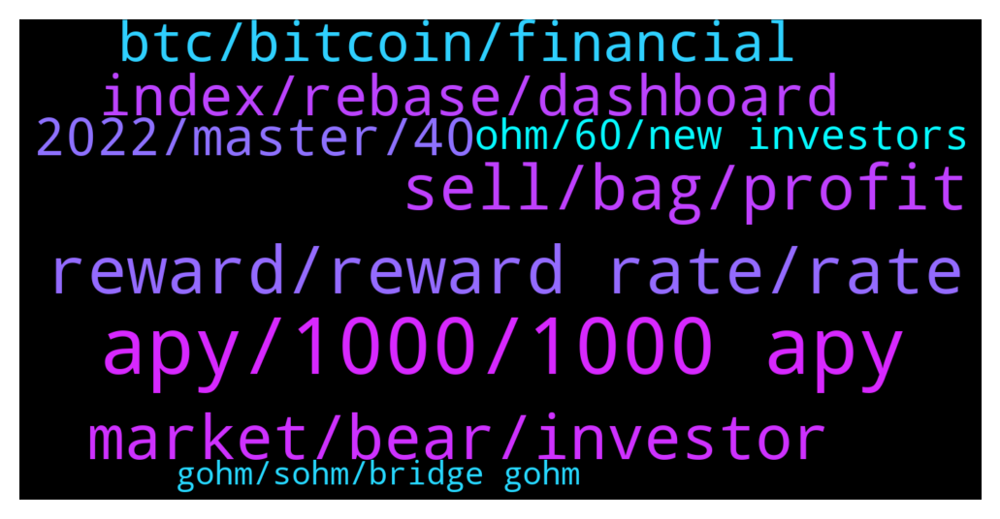

# **@OlympusTG**
 ## Analysis for **2022-01-31** - **2022-02-01**.

---

## 📊 **Basic Stats**

**n_messages_sent**: 912

---

---

## 🔝 **Top keywords and related messages**

1. **apy, 1000, 1000 apy**

    @Al_S1919 --- *Why is the APY so fkn low? It is awesomely dropped below 1000%! When do we need to sell our SOHM and leave the project?* **--->** [TG Discussion](https://t.me/OlympusTG/175752)

    @Alden_168 --- *The 1000% apy will be hovering around 1 year, just buy and chill, buddy~* **--->** [TG Discussion](https://t.me/OlympusTG/176400)

    @nfwaple --- *1000 APY is still a lot, and if you learn more about OHM you'd know that APY doesn't matter, the supply increases at roughly the same rate as the APY so your % of mcap ownership is roughly the same* **--->** [TG Discussion](https://t.me/OlympusTG/175496)

    @MrMann89 --- *How often do you double the amount of Sohm you have now the Apy is at a 1000%* **--->** [TG Discussion](https://t.me/OlympusTG/176696)

    @ishaqniz --- *I had faith in ohm if apy was stable arounf 5000 to.3000 but 1000 apy seems like it hitting 100 soo* **--->** [TG Discussion](https://t.me/OlympusTG/175246)

    @hootie1233 --- *What drives apy up or down* **--->** [TG Discussion](https://t.me/OlympusTG/176717)

2. **reward, reward rate, rate**

    @TNrafi2109 --- *No it is reward yield not reward rate* **--->** [TG Discussion](https://t.me/OlympusTG/176365)

    @TNrafi2109 --- *I have been investing since last year when apy is above 4k%. I cannot put additional investmemt if the apy and price keep decreasing. That why i nees to understand the calculation of reward rate* **--->** [TG Discussion](https://t.me/OlympusTG/176409)

    @TNrafi2109 --- *If you said that the reward rate is variable, how can i calculate ? I donot want to calculate reversely.* **--->** [TG Discussion](https://t.me/OlympusTG/176385)

    @nfwaple --- *it's current index x (1 + next reward yield %)* **--->** [TG Discussion](https://t.me/OlympusTG/176999)

    @TNrafi2109 --- *What is the current reward rate?* **--->** [TG Discussion](https://t.me/OlympusTG/176355)

    @TNrafi2109 --- *3. Total supply 4. Reward rate Please see the formula* **--->** [TG Discussion](https://t.me/OlympusTG/176419)

3. **sell, bag, profit**

    @ilkyilg --- *I’ve made large buys at 300 and 180, I’d instasell at breakeven and so would an army of bag holders* **--->** [TG Discussion](https://t.me/OlympusTG/175921)

    @rasputen1 --- *If I exit at entry of even up to 40% below entry it’s still profit for me* **--->** [TG Discussion](https://t.me/OlympusTG/175585)

    @Palancapa --- *why? im not gonna sell anyway* **--->** [TG Discussion](https://t.me/OlympusTG/176926)

    @Alden_168 --- *This is not the time to sell, just wait for few months until you break-even or in-profit.* **--->** [TG Discussion](https://t.me/OlympusTG/176411)

    @Host_Matt --- *still think there is opportunity cost, if you hold a bag that is down -20% but isn't doing shit for months while everything else is sending, it's imo a huge punt* **--->** [TG Discussion](https://t.me/OlympusTG/175604)

    @LONGDONGWONG --- *well you could buy anything. dosent exactly have to be this.   just make a call and get on with it.  Suboptimal decision better than no decision* **--->** [TG Discussion](https://t.me/OlympusTG/175976)

4. **market, bear, investor**

    @kentkadewell --- *Back to the psychology of it as host Matt spoke of before, during bull run people just throw money at anything but during bear, while price down and probably better time to buy… people hesitate and volume decreases* **--->** [TG Discussion](https://t.me/OlympusTG/175555)

    @minati666 --- *Coz am a 17k$ investor and m down bad* **--->** [TG Discussion](https://t.me/OlympusTG/176088)

    @sbackes --- *Can’t count anything as real market sentiment on a Sunday* **--->** [TG Discussion](https://t.me/OlympusTG/175700)

    @Jonathan --- *Its not even bear market 🙄* **--->** [TG Discussion](https://t.me/OlympusTG/175845)

    @nfwaple --- *in the bear market even good work doesn't really help much* **--->** [TG Discussion](https://t.me/OlympusTG/175538)

    @Host_Matt --- *the lesson to learn here is to be very careful with entries when we are in a bull market/sentiment is euphoric* **--->** [TG Discussion](https://t.me/OlympusTG/175628)

5. **index, rebase, dashboard**

    @Palancapa --- *what will the index be after the next rebase?* **--->** [TG Discussion](https://t.me/OlympusTG/176992)

    @Palancapa --- *on the same page where you can see these metrics, it says that i have 4.6 sOHM* **--->** [TG Discussion](https://t.me/OlympusTG/177025)

    @SecuriTech24 --- *Get off your face with the rebase. Wait* **--->** [TG Discussion](https://t.me/OlympusTG/176587)

    @Host_Matt --- *yeah price of gohm is easier to gauge price appreciation* **--->** [TG Discussion](https://t.me/OlympusTG/175521)

    @nfwaple --- *v1 stopped seeing rebases, missed rebases will be given to you at once when you migrate* **--->** [TG Discussion](https://t.me/OlympusTG/175631)

    @nfwaple --- *because gOHM is index adjusted, gOHM price = OHM price x index (on dashboard), and index increases every rebase* **--->** [TG Discussion](https://t.me/OlympusTG/176163)

6. **btc, bitcoin, financial**

    @Colonelgaddafi --- *Can go even lower if btc breaks this range* **--->** [TG Discussion](https://t.me/OlympusTG/175335)

    @Alden_168 --- *I'd think BTC will consolidate few weeks before take off. At the moment, just chill😁* **--->** [TG Discussion](https://t.me/OlympusTG/175888)

    @Host_Matt --- *btc next leg down has begun* **--->** [TG Discussion](https://t.me/OlympusTG/175699)

    @LONGDONGWONG --- *~10 years ago BTC was born. I knew how to mine it then and wallets and stuff but fuck me I didnt get down to doing it  Dont make the same mistake today* **--->** [TG Discussion](https://t.me/OlympusTG/175974)

    @Alden_168 --- *Ser, if you compare the BTC 4H time frame to BTC daily time frame on March 2020, you may find similarities. Is a V shape recovery.* **--->** [TG Discussion](https://t.me/OlympusTG/175960)

    @rasputen1 --- *Nah btc gonna dump next few days* **--->** [TG Discussion](https://t.me/OlympusTG/175902)

7. **2022, master, 40**

    @nfwaple --- *👌🏻👌🏻 26 more days to go* **--->** [TG Discussion](https://t.me/OlympusTG/177056)

    @sticks_na_beany --- *If that’s the sentiment this project is fucked* **--->** [TG Discussion](https://t.me/OlympusTG/175925)

    @nfwaple --- *please come back and warn me in the future when you see signs* **--->** [TG Discussion](https://t.me/OlympusTG/175558)

    @Flower --- *I got a feeling your timing will prove to be impeccable 🤞* **--->** [TG Discussion](https://t.me/OlympusTG/176515)

    @Martin --- *and let the time do its ting* **--->** [TG Discussion](https://t.me/OlympusTG/176232)

    @Alden_168 --- *I feel it coming, I feel it coming babe~* **--->** [TG Discussion](https://t.me/OlympusTG/175994)

8. **ohm, 60, new investors**

    @SaintJerome --- *OHM is good for now. I'm talking about when OHM supply is close to 100mill. 100mill is a psychological barrier where new investors may deem OHM as being too diluted* **--->** [TG Discussion](https://t.me/OlympusTG/176073)

    @SaintJerome --- *True, Instead give out stable coin as a rebase thus stopping dilution of OHM hence making it more attractive for new investors* **--->** [TG Discussion](https://t.me/OlympusTG/176065)

    @JM --- *Ohm price is $63 and backing per ohm in the treasury is $56. It’s been like this for a while.* **--->** [TG Discussion](https://t.me/OlympusTG/175329)

    @Host_Matt --- *"oh my god Ohm is working, I better sell now"* **--->** [TG Discussion](https://t.me/OlympusTG/175584)

    @JM --- *Surely it does work if borrowing fee is low though. Well and you lend ohm for ohm. If you borrow another coin you open yourself up to spread* **--->** [TG Discussion](https://t.me/OlympusTG/175379)

    @cdp279 --- *Yeah bro. Look. Ohm is new , nothing like it has been done before. I’m not trying to sound like ohm Jesus but BTC was also a problme in the beggining, you know mining halves every x years etc etc* **--->** [TG Discussion](https://t.me/OlympusTG/176044)

