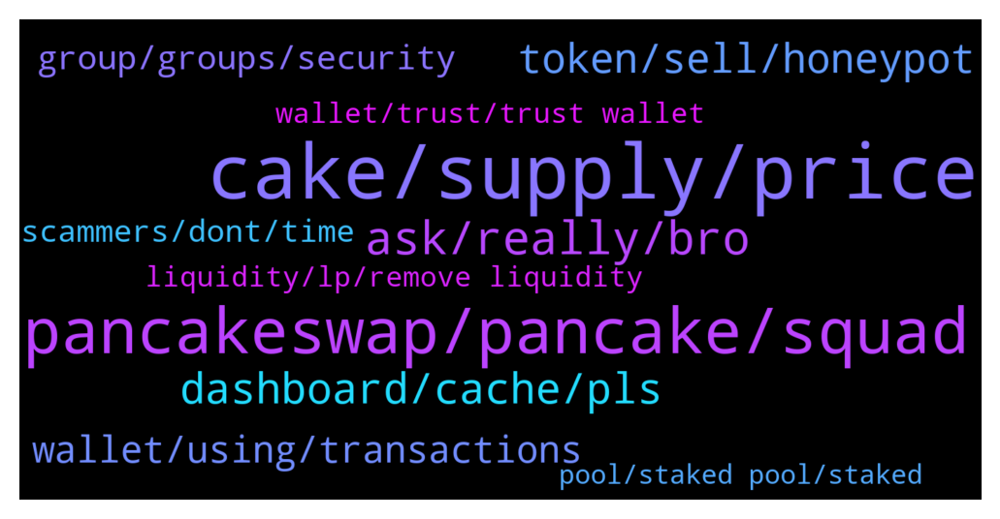

# **@PancakeSwap**
 ## Analysis for **2022-01-31** - **2022-02-01**.

---

## 📊 **Basic Stats**

**n_messages_sent**: 680

---

---

## 🔝 **Top keywords and related messages**

1. **cake, supply, price**

    @hoseiinnnna --- *in discord nobody answer all people is usuall people no admin no chef  many user have question when price improve? becuase as the rest cake go down so much🙏🏽* **--->** [TG Discussion](https://t.me/PancakeSwap/2314563)

    @Amyblaze --- *Why can't I find my rewards after unstaking from the cake autocompound pool* **--->** [TG Discussion](https://t.me/PancakeSwap/2313050)

    @OskarMA90 --- *IF they reduce emissions even further, Then THE apy Will be so oow that no new investors benefits from staking cake. Only THE big bag holders Will benefits cuz their cake Price Will increase.   What would be best is to increase emission and increase burn mechanism they already have in lotteriers etc* **--->** [TG Discussion](https://t.me/PancakeSwap/2315802)

    @Luukku1 --- *Have a read about Cakes tokenomics below!: https://docs.pancakeswap.finance/tokenomics/cake/cake-tokenomics* **--->** [TG Discussion](https://t.me/PancakeSwap/2313802)

    @C Mom 🇳🇱 --- *Not smart. Stupid now I wait till it's over 40$ or more.* **--->** [TG Discussion](https://t.me/PancakeSwap/2314416)

    @FabulousXBT --- *You ask in cake group So CAKE* **--->** [TG Discussion](https://t.me/PancakeSwap/2314760)

2. **pancakeswap, pancake, squad**

    @mrbeandev --- *😤😤 why does pancakeswap supports such a tokens 🙄* **--->** [TG Discussion](https://t.me/PancakeSwap/2314657)

    @jimmy8880 --- *You’ll need to Import them again in pancakeswap when you want to swap* **--->** [TG Discussion](https://t.me/PancakeSwap/2314946)

    @Chris_TOF --- *New system of IFO 3.1 has been announced, I hope you have a Pancake squad 🐇🥞  https://twitter.com/PancakeSwap/status/1486308147291918343?t=FOag4gdaQFbb1m0ZIGjC6w&s=19* **--->** [TG Discussion](https://t.me/PancakeSwap/2313619)

    @Arrazola --- *Wow as soon I look up for the gruop I was contact   by 3 different chats with names like pancake support* **--->** [TG Discussion](https://t.me/PancakeSwap/2315273)

    @Luukku1 --- *Is your BNB Bep20? Pamcakeswap only supports Bep20 tokens!* **--->** [TG Discussion](https://t.me/PancakeSwap/2314674)

    @Belalyazji --- *Hi  I contacted PancakeSwap to exchange, and as soon as I did, I lost all my coins* **--->** [TG Discussion](https://t.me/PancakeSwap/2315424)

3. **ask, really, bro**

    @Clean --- *Anyone else just stay up all night playing prediction? Love it lol* **--->** [TG Discussion](https://t.me/PancakeSwap/2315457)

    @konstantinossw --- *What why u report me Bro haha I said I need help* **--->** [TG Discussion](https://t.me/PancakeSwap/2315841)

    @FabulousXBT --- *can't wait to see the pen killer lol* **--->** [TG Discussion](https://t.me/PancakeSwap/2314925)

    @CakeCompounder --- *Hey   They need to go here please  https://t.me/pancakebanappeal* **--->** [TG Discussion](https://t.me/PancakeSwap/2313362)

    @Infecto36 --- *Can i have a really help ?* **--->** [TG Discussion](https://t.me/PancakeSwap/2316079)

    @Ceddi200 --- *This was meant for u. Loll https://t.me/PancakeSwap/2315508* **--->** [TG Discussion](https://t.me/PancakeSwap/2315519)

4. **dashboard, cache, pls**

    @Shinyu --- *What’s that pls I’m new still learning* **--->** [TG Discussion](https://t.me/PancakeSwap/2314605)

    @TomorrowlandForLife --- *no, everything is ok. Did you check a dashboard?* **--->** [TG Discussion](https://t.me/PancakeSwap/2315030)

    @Iman_nazariii --- *I did it, but doesn't working* **--->** [TG Discussion](https://t.me/PancakeSwap/2313210)

    @TomorrowlandForLife --- *check the dashboard as I told you* **--->** [TG Discussion](https://t.me/PancakeSwap/2315042)

    @Frankjankjink --- *I don't understand the screenshot, that's why I need explaination pls* **--->** [TG Discussion](https://t.me/PancakeSwap/2315510)

    @TomorrowlandForLife --- *Do you know what a dashboard is?* **--->** [TG Discussion](https://t.me/PancakeSwap/2315052)

5. **token, sell, honeypot**

    @Tafadzwa --- *Any info on the floki token,* **--->** [TG Discussion](https://t.me/PancakeSwap/2315711)

    @Dimah_Mimmu82 --- *Could it be non sellable ?? and how can i know this as i m  new in this..!??😕* **--->** [TG Discussion](https://t.me/PancakeSwap/2313156)

    @Luukku1 --- *Check if it is a honeypot (unsellable scam) Honeypot.is* **--->** [TG Discussion](https://t.me/PancakeSwap/2313157)

    @JimboCryptola --- *Honeypot being generic for all pump coins? So how do they then show others selling, or is it just the owner* **--->** [TG Discussion](https://t.me/PancakeSwap/2315541)

    @hoseiinnnna --- *You are constantly warning me that it is important to you that I bought your exchange token and I am in heavy loss and I am worried that you are only threatening me that I will remove it. Well, I am worried that I have lost a lot.* **--->** [TG Discussion](https://t.me/PancakeSwap/2314573)

    @ajchouhan213 --- *Does it happen when the token is scam? Or the approval price goes to the owner who listed the token?* **--->** [TG Discussion](https://t.me/PancakeSwap/2313640)

6. **wallet, using, transactions**

    @CakeCompounder --- *Have you tried a different wallet?* **--->** [TG Discussion](https://t.me/PancakeSwap/2313375)

    @Ceddi200 --- *Once is okay. Except you change your wallet or reinstall it* **--->** [TG Discussion](https://t.me/PancakeSwap/2313632)

    @wydonblockchain --- *that's the weird part bc this is the only wallet ever used* **--->** [TG Discussion](https://t.me/PancakeSwap/2315040)

    @Boriya13 --- *My currency is stolen from my wallet. Although I had a password. How is it possible* **--->** [TG Discussion](https://t.me/PancakeSwap/2313229)

    @Ceddi200 --- *📢 Previously we made a HUGE underlying framework upgrade for our website. Allowing us to further enhance the performance in the future. During the upgrade:  · Wallet Connect was disabled (now fixed) · Custom tokens are cleared.  We apologise for the inconvenience it caused.  ——  We want to point out the upgrade is absolutely worth it, as it enables many more possible performance improvements in the future. 😉* **--->** [TG Discussion](https://t.me/PancakeSwap/2314762)

    @ajchouhan213 --- *I am using onto wallet right now* **--->** [TG Discussion](https://t.me/PancakeSwap/2313030)

7. **group, groups, security**

    @TomorrowlandForLife --- *if nobody answers is maybe because you're asking questions nobody knows And this is not the first time I warned you about Ptalk and you have been warned too when we unbanned you so use the group wisely* **--->** [TG Discussion](https://t.me/PancakeSwap/2314566)

    @TomorrowlandForLife --- *I know that. I have another account and I also recieve messages to this account but we (Admins) see questions in the group and we take the time to read and reply. We don't know which questions are real and which are not and we're here all day long* **--->** [TG Discussion](https://t.me/PancakeSwap/2315205)

    @CezarL --- *There are like 4 accounts messaging&calling me right after joining the group* **--->** [TG Discussion](https://t.me/PancakeSwap/2314940)

    @Dietervonastein --- *The moment I joined, I got four calls and live six dms* **--->** [TG Discussion](https://t.me/PancakeSwap/2314728)

    @devmaheremad96 --- *What exactly do I need to sub. with them? How long is the waiting?* **--->** [TG Discussion](https://t.me/PancakeSwap/2315047)

    @Aosh1ma --- *How to protect your self against spam chat:   ❗️ Read Me So You Can Keep Safe❗️  📌 Please do the following in your Telegram app 📱  1️⃣ Go to: Settings 2️⃣ Select: Privacy and Security -> Groups 3️⃣ Select: Who can add me to group chats? -> My Contacts  🔓 This will protect you from scammers adding you to FAKE groups/chats 🔓  1️⃣ Go to: Settings 2️⃣ Privacy And Security 3️⃣ Phone Number : Nobody 4️⃣ Forwarded Message : Nobody 5️⃣ CALLS : Nobody  Thank you. Stay #SAFU.* **--->** [TG Discussion](https://t.me/PancakeSwap/2316119)

8. **scammers, dont, time**

    @JayHC --- *Only responses I get is from scammers in dm's 😭* **--->** [TG Discussion](https://t.me/PancakeSwap/2315783)

    @Identikit9 --- *I know buddy I was just curious how many scammers would DM me. Lol its INSANE* **--->** [TG Discussion](https://t.me/PancakeSwap/2315201)

    @Ceddi200 --- *That’s is combot command lol, telling you to be careful of scammers* **--->** [TG Discussion](https://t.me/PancakeSwap/2315842)

    @Criptomentoring --- *Just DM you  Scammers dont waste your time DM me* **--->** [TG Discussion](https://t.me/PancakeSwap/2313072)

    @Criptomentoring --- *Just send you a DM  Scammers dont waste your time in DM me* **--->** [TG Discussion](https://t.me/PancakeSwap/2313053)

    @Luukku1 --- *Everyone that DM's you is a scammer!* **--->** [TG Discussion](https://t.me/PancakeSwap/2312941)

9. **wallet, trust, trust wallet**

    @BasquiatJeanMichel --- *But no, they are visible on a pancake wallet. I would just like to get my funds back, there is no technical support? It's a lot of money* **--->** [TG Discussion](https://t.me/PancakeSwap/2314909)

    @HUSEN LiV Never ask for $ --- *Trust wallet is not connecting on Pancakeswap* **--->** [TG Discussion](https://t.me/PancakeSwap/2315751)

    @phamdinhhoang --- *I tried pancake on safepal. It show confirm screen but i cant press confirm* **--->** [TG Discussion](https://t.me/PancakeSwap/2315650)

    @BasquiatJeanMichel --- *I copied and pasted it directly to the pancake address instead of my wallet* **--->** [TG Discussion](https://t.me/PancakeSwap/2314902)

    @CryptoJack2018 --- *👉Try trustwallet or safepal is work on 100%👈  ✅ Metamask - PC ✅ Safepal - iphone, android ✅ Trustwallet - android  Don't use metamask with phone ❌ Don't use Binance wallet with pc ❌ ---------------------------------------------------  You can import your wallet to any other wallets that works with Pancakeswap if you want. You can continue to use same wallet with your seed. That seed is not special for safepal or trust wallet or metamask. You can use it in any wallet app  You will write the seed words to new app with choosing "I have already a wallet" or " Import Wallet"  Trust ➜  Safepal Guide👇🏻👇🏻👇🏻 https://youtu.be/FSGmEW9fFA0* **--->** [TG Discussion](https://t.me/PancakeSwap/2315413)

    @Dinesh --- *Bro trust wallet doesnt trade conegame* **--->** [TG Discussion](https://t.me/PancakeSwap/2315409)

10. **liquidity, lp, remove liquidity**

    @ManBlyat --- *just example when ppl Add liquidity Auto Mint to 0x000 address, when they remove its auto Burn to 0x000 address, its same when ppl stacking / unstacking* **--->** [TG Discussion](https://t.me/PancakeSwap/2313954)

    @Julio --- *I still need some help with liquidity I added a few weeks back but I can't see it when I return to the Trade->Liquidity page even after I use the link below "Don't see a pool you joined". Here is the hash for the liquidity I added. 0x87514685f847532426a890b5810319e247a96eec3dfc2b6f6c3489c6ade7af60* **--->** [TG Discussion](https://t.me/PancakeSwap/2313313)

    @juapia --- *When you add liquidity you receive lp tokens as a proof of your share to the pool and you earn swap fees which gets added to your lp position and can only be withdrawn when you remove your liquidity* **--->** [TG Discussion](https://t.me/PancakeSwap/2316002)

    @Ceddi200 --- *When you add liquidity you receive lp tokens as a proof of your share to the pool and you earn swap fees which gets added to your lp position and can only be withdrawn when you remove your liquidity  You can stake them on farm if the pair is available to earn cake. Take note of impermanentloss also   Staking + lpfees rewards = 12 % at the moment* **--->** [TG Discussion](https://t.me/PancakeSwap/2315508)

    @ManBlyat --- *this is dex dude, anyone can list theyr coin with providing liquidity* **--->** [TG Discussion](https://t.me/PancakeSwap/2313678)

    @juapia --- *yep. unwrapped not. wen you remove the liquidity. The lp fees is increase with lp value* **--->** [TG Discussion](https://t.me/PancakeSwap/2316023)

