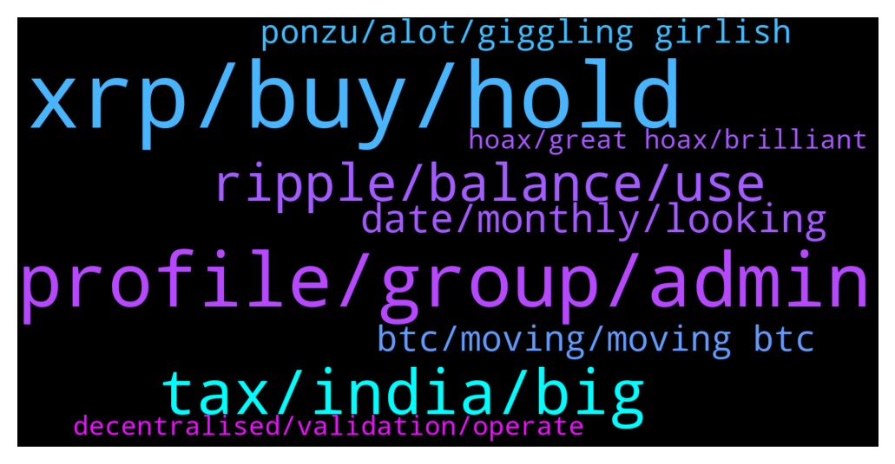

# **@Ripple**
 ## Analysis for **2022-01-31** - **2022-02-01**.

---

## 📊 **Basic Stats**

**n_messages_sent**: 187

---

---

## 🔝 **Top keywords and related messages**

1. **xrp, buy, hold**

    @shaggy --- *Just sold all my xrp as it seems no enthusiasm from admin to convince all their investors for the future prospect...* **--->** [TG Discussion](https://t.me/Ripple/3047840)

    @<UNK> --- *Only holding around 6k XRP though and it seems like most people hold over 100k lol'* **--->** [TG Discussion](https://t.me/Ripple/3047644)

    @Tinkabellagal --- *You can use XUMM Wallet App and connect to the xrpl dex using XUMM and XRPToolkit  https://xumm.app/* **--->** [TG Discussion](https://t.me/Ripple/3048288)

    @Kbron123 --- *After it wins against SEC past September do You believe xrp can go beyond 10$ ?* **--->** [TG Discussion](https://t.me/Ripple/3047813)

    @Akon924 --- *XRP price has done a fantastic job of staving off any further selling during the week. While it is not yet out of the woods, it is positioned for a bullish reversal candlestick against a strong support zone. The first test that bulls need to pass is achieving a daily candlestick close above the Tenkan-Sen at $0.65. However, downside risks do remain. Despite the strong support in the $0.60 zone, there remains an absence of convincing bullish continuation. So far, buyers have rejected lower prices but have not stepped in enough to support higher prices* **--->** [TG Discussion](https://t.me/Ripple/3047894)

    @Tinkabellagal --- *Bitrue Or Uphold afaik  I have this information also  US can buy xrp on atomic wallet Send to XUMM* **--->** [TG Discussion](https://t.me/Ripple/3048277)

2. **profile, group, admin**

    @Chrisesp02 --- *But i have a profile pic* **--->** [TG Discussion](https://t.me/Ripple/3048315)

    @TraderAT --- *I noticed that and i blocked them. Thank you for the Info 👍🙂* **--->** [TG Discussion](https://t.me/Ripple/3047758)

    @AbuRidwan16 --- *Anyone got their solo airdrop on binance?* **--->** [TG Discussion](https://t.me/Ripple/3048180)

    @terrachad --- *this is the chat isn't it ?* **--->** [TG Discussion](https://t.me/Ripple/3048061)

    @JesusJames --- *@TraderAT the solo group you're in is a scam group do not give them your seed phrase* **--->** [TG Discussion](https://t.me/Ripple/3047757)

    @JesusJames --- *oh then that make it publicly visible part pertains to you then* **--->** [TG Discussion](https://t.me/Ripple/3048317)

3. **tax, india, big**

    @Tinkabellagal --- *⁠India to introduce 30% crypto tax, digital rupee CBDC by 2022-23   Finance minister Nirmala Sitharaman believes the introduction of a CBDC will provide a “big boost” to India's digital economy.  https://ct.com/aam3* **--->** [TG Discussion](https://t.me/Ripple/3048159)

    @MerryJ22 --- *Somewhere they want to ban cryptocurrency, why do it?* **--->** [TG Discussion](https://t.me/Ripple/3047866)

    @ravibk --- *Very happy that, there'll be no ban crypto 😊* **--->** [TG Discussion](https://t.me/Ripple/3048175)

    @bachouqu_90 --- *I am about to enter enter cryptocurrency, any ideas about project to invest?* **--->** [TG Discussion](https://t.me/Ripple/3047909)

    @Tinkabellagal --- *If I knew I would be very rich Check TA* **--->** [TG Discussion](https://t.me/Ripple/3048201)

    @legalsahil --- *Cryptocurrency goes legal in India. To tax @ 30% on Income.* **--->** [TG Discussion](https://t.me/Ripple/3048153)

4. **ripple, balance, use**

    @hennyvangemert --- *i have a Ripple Wallet problem, anyone around for advice?* **--->** [TG Discussion](https://t.me/Ripple/3048294)

    @CARXVV --- *But isn't Ripple who choses them?* **--->** [TG Discussion](https://t.me/Ripple/3047885)

    @gerrymchugh --- *The nodes are not owned or controlled by Ripple, so it's not centralised. They are operated by community members* **--->** [TG Discussion](https://t.me/Ripple/3047883)

    @terrachad --- *I see, so this room has no official link to ripple corporation. rip them* **--->** [TG Discussion](https://t.me/Ripple/3048066)

    @Jodxb2311 --- *Yep this is Ripple, everyone is a little crazy but that comes from HODLING for a couple of years.* **--->** [TG Discussion](https://t.me/Ripple/3048053)

    @terrachad --- *lol. I actually saw that video, followed a link here. I don't know the guy, but he was an avid ripple fan, that seemed strange* **--->** [TG Discussion](https://t.me/Ripple/3048050)

5. **date, monthly, looking**

    @iboxx11 --- *xrp and btc monthly candle looking so good* **--->** [TG Discussion](https://t.me/Ripple/3047937)

    @Likeitorpumpit --- *What candle you looking at ?? Looks shocking to me* **--->** [TG Discussion](https://t.me/Ripple/3047938)

    @Jodxb2311 --- *Hasn't closed monthly candles above or below that range* **--->** [TG Discussion](https://t.me/Ripple/3047943)

    @Jodxb2311 --- *We have been in a range between 1560-1820 sats the last 8 months* **--->** [TG Discussion](https://t.me/Ripple/3047942)

    @Kingbtc1234 --- *Research but if u need guess probably soon 35k below* **--->** [TG Discussion](https://t.me/Ripple/3047933)

    @Akon924 --- *The date is set to september? Cool* **--->** [TG Discussion](https://t.me/Ripple/3047834)

6. **btc, moving, moving btc**

    @theExchanger --- *i dont see a fast moving btc... are you watching 1 minute chart? 😁* **--->** [TG Discussion](https://t.me/Ripple/3048301)

    @Umeshchandak --- *Why are not alts moving much though btc is moving so fast* **--->** [TG Discussion](https://t.me/Ripple/3048300)

    @ibnusob666 --- *Btc bull but we still stuck* **--->** [TG Discussion](https://t.me/Ripple/3047992)

    @Riiggo --- *You be on of them guys that lost there patience and sold btc at $14 lol* **--->** [TG Discussion](https://t.me/Ripple/3047845)

    @marcoocampoo --- *No more btc crash? Im waiting for the next crash* **--->** [TG Discussion](https://t.me/Ripple/3047800)

    @Riaje2 --- *We are not stuck, sometimes people's just try to get a little profit on the BTC side to come back into altcoin. It's just a normal trading activity's* **--->** [TG Discussion](https://t.me/Ripple/3047994)

7. **ponzu, alot, giggling girlish**

    @Jodxb2311 --- *I was enjoying with popcorn 🍿😁* **--->** [TG Discussion](https://t.me/Ripple/3048049)

    @Rektallstar --- *It's basically citrus sweet soy sauce. So alot of stuff 😁😁* **--->** [TG Discussion](https://t.me/Ripple/3047629)

    @vroomhmhmmhmmm --- *Chef, what is great to eat with Ponzu 😎* **--->** [TG Discussion](https://t.me/Ripple/3047627)

    @<UNK> --- *I am giggling with girlish delight. That was funny.* **--->** [TG Discussion](https://t.me/Ripple/3047686)

    @JesusJames --- *cat got your tongue  ?* **--->** [TG Discussion](https://t.me/Ripple/3047687)

    @marianmp --- *I've heard something amazing this days* **--->** [TG Discussion](https://t.me/Ripple/3047665)

8. **decentralised, validation, operate**

    @CARXVV --- *Well, I believe, decentralizing validation is critical for a blockchain, they can basically reverte anything if they agree. I assume Bitcoin wallet concentration is a consequence of the mining process and early adopters, not sure why aren't Reipple nodes more distributed or open for anyone to participate.* **--->** [TG Discussion](https://t.me/Ripple/3047895)

    @gerrymchugh --- *Eth are changing to concensus too, in fact they don't really seem to know what they're doing yet. BTC has most supply controlled by very small number of wallets, so while the validation is decentralised the supply is most definitely not.* **--->** [TG Discussion](https://t.me/Ripple/3047892)

    @CARXVV --- *Well, if you choose people that operate them, that is not very descentralized, anyone can mine bitcoin or Eth, I wonder why is it that way* **--->** [TG Discussion](https://t.me/Ripple/3047891)

    @gerrymchugh --- *I dont know that for definite, maybe someone else here does but even if it is, they don't own/operate them... Still decentralised* **--->** [TG Discussion](https://t.me/Ripple/3047888)

    @gerrymchugh --- *Each node can select the validators that it trusts, can't get a lot more decentralised* **--->** [TG Discussion](https://t.me/Ripple/3047903)

    @JesusJames --- *that is not anyone's business but mine* **--->** [TG Discussion](https://t.me/Ripple/3047690)

9. **hoax, great hoax, brilliant**

    @marianmp --- *Either it's something great or a hoax* **--->** [TG Discussion](https://t.me/Ripple/3047656)

    @<UNK> --- *It's a decision to believe at the end of the day. There's tons of sources to support whatever narrative you decide to pursue.* **--->** [TG Discussion](https://t.me/Ripple/3047637)

    @Juicynela --- *I don't know , may be , do a research on goggle , that's why it is created* **--->** [TG Discussion](https://t.me/Ripple/3048323)

    @marianmp --- *Just saying aliens are real .....doesn t mean you are right...you need to have something to back it up* **--->** [TG Discussion](https://t.me/Ripple/3047679)

    @<UNK> --- *Not sure I agree with that dichotomy, there's a lot between great and hoax :) smart people rigging for themselves isn't neccessarily a hoax. It can still be wildly successful for everyone else.* **--->** [TG Discussion](https://t.me/Ripple/3047657)

    @<UNK> --- *It's a brilliant focused distraction on top of a brilliant solution to a real-world problem, I feel you* **--->** [TG Discussion](https://t.me/Ripple/3047641)

