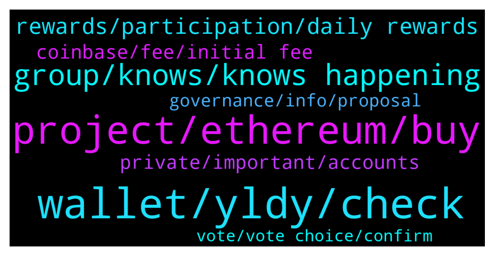

# **@algorand**
 ## Analysis for **2022-01-31** - **2022-02-01**.

---

## 📊 **Basic Stats**

**n_messages_sent**: 153

---

---

## 🔝 **Top keywords and related messages**

1. **wallet, yldy, check**

    @MackDenver --- *Did you check your wallet balance in the Algo explorer?* **--->** [TG Discussion](https://t.me/algorand/336119)

    @rikaponti --- *Yes there are $Algo left but there is no trace of the $YLDY* **--->** [TG Discussion](https://t.me/algorand/336120)

    @Dee --- *It worked!!! Thank you so much!* **--->** [TG Discussion](https://t.me/algorand/336210)

    @Leugim_21 --- *It happens to me too, check your wallet sessions on your app, you will notice a very high amount of connections struggling, just empty them all, then reconnect the ones that you use.* **--->** [TG Discussion](https://t.me/algorand/336175)

    @Elo82Elo --- *hello everyone, i have trouble collecting airdrop.  At the beginning, everything worked as it should and I have been getting an error for 3 weeks.  how can i solve this problem?* **--->** [TG Discussion](https://t.me/algorand/336139)

    @defirlkp --- *check your transactions for when the $YLDY left your address and to which address it went to* **--->** [TG Discussion](https://t.me/algorand/336121)

2. **project, ethereum, buy**

    @KAPIBAYSIDE --- *It was asking questions about algo stake, but I don't know if mentioning algo projects are against the rules* **--->** [TG Discussion](https://t.me/algorand/336163)

    @MackDenver --- *You can stake just by holding ALGO in your wallet, you can also participate in the governance for extra APY* **--->** [TG Discussion](https://t.me/algorand/336343)

    @nolambojustcivic --- *It’s always a good time to buy Algo* **--->** [TG Discussion](https://t.me/algorand/336305)

    @MackDenver --- *The signup period for the governance has over. At the moment, you can hold ALGO in official wallet and earn staking rewards.* **--->** [TG Discussion](https://t.me/algorand/336146)

    @DiggityDoge --- *Where is there nothing on the official algorand website? Or have I missed it somehow.* **--->** [TG Discussion](https://t.me/algorand/336114)

    @Alfalfaseeker --- *how do I buy ALGO coin on meta mask ethereum?* **--->** [TG Discussion](https://t.me/algorand/336122)

3. **group, knows, knows happening**

    @DiggityDoge --- *They might be trying to strategize a PR message which spins it the right way* **--->** [TG Discussion](https://t.me/algorand/336226)

    @DlHKl --- *wonder what marketing does all day, for a high profile ceo departure you normal make advance notice and thank them for their service etc.* **--->** [TG Discussion](https://t.me/algorand/336224)

    @Cezkoa --- *Do you have some noticies about opulous?* **--->** [TG Discussion](https://t.me/algorand/336390)

    @DiggityDoge --- *No one knows if anything is actually happening, everything is speculation based on the linkedin update* **--->** [TG Discussion](https://t.me/algorand/336242)

    @DlHKl --- *you make it sound like he was sacked and there are no plans or replacement* **--->** [TG Discussion](https://t.me/algorand/336239)

    @DiggityDoge --- *Meanwhile he went ahead and updated his linked in* **--->** [TG Discussion](https://t.me/algorand/336227)

4. **rewards, participation, daily rewards**

    @MackDenver --- *That is called Algorand governance rewards.* **--->** [TG Discussion](https://t.me/algorand/336142)

    @Malvo --- *Greetings can anyone tell me since awards will only be governance rewards and receiving daily rewards as Algo holder when will the daily rewards stop being distributed?* **--->** [TG Discussion](https://t.me/algorand/336263)

    @etzYoung --- *Please how can i participate in the reward activities?* **--->** [TG Discussion](https://t.me/algorand/336145)

    @patrick_crypto --- *Pretty sure it’s true.  Participation rewards end soon - only rewards are through governance.  Governance rewards are quarterly.* **--->** [TG Discussion](https://t.me/algorand/336089)

    @MackDenver --- *Governors will receive their rewards by February 27th, 2022.* **--->** [TG Discussion](https://t.me/algorand/336144)

    @NightAlgorand --- *Participation rewards is being phased out in 2022* **--->** [TG Discussion](https://t.me/algorand/336266)

5. **private, important, accounts**

    @MackDenver --- *Sure, how can I assist you?* **--->** [TG Discussion](https://t.me/algorand/336127)

    @rikaponti --- *some scams are writing me in private ... is it possible to get help from you?* **--->** [TG Discussion](https://t.me/algorand/336124)

    @DiggityDoge --- *Alright, sorry if I'm not stalking ppls social accounts* **--->** [TG Discussion](https://t.me/algorand/336179)

    @MackDenver --- *Hey KAPI, If it was something important, you can resend the message.* **--->** [TG Discussion](https://t.me/algorand/336162)

    @DiggityDoge --- *I'm just saying that messaging is important* **--->** [TG Discussion](https://t.me/algorand/336241)

    @patrick_crypto --- *That literally makes no sense.. you a scammer?  🤣* **--->** [TG Discussion](https://t.me/algorand/336093)

6. **coinbase, fee, initial fee**

    @Delmas56 --- *Hello what’s the initial fee you hav to pay Algorand befor you can purchase the coin thanks* **--->** [TG Discussion](https://t.me/algorand/336286)

    @Abusaid01 --- *yes I am asking when distribute* **--->** [TG Discussion](https://t.me/algorand/336143)

    @Shane --- *Cue  coin bureau running algorand down and pumping solana* **--->** [TG Discussion](https://t.me/algorand/336298)

    @patrick_crypto --- *I don’t hold on coinbase…. they take 25% cut of any rewards they choose to pass on. I hold in my own wallets.* **--->** [TG Discussion](https://t.me/algorand/336091)

    @Adders28 --- *Its true, look on coinbase algo overview all info is there* **--->** [TG Discussion](https://t.me/algorand/336086)

    @earlyearner --- *Got an email from Coinbase, saying the staking payments are going to be quarterly soon, instead of daily.. is that true? 🤔* **--->** [TG Discussion](https://t.me/algorand/336059)

7. **governance, info, proposal**

    @Rory --- *Does governance auto vote with foundation in case of absence* **--->** [TG Discussion](https://t.me/algorand/336327)

    @Patdogbaby --- *it is just me or is the governance info more difficult to find than it should be ?* **--->** [TG Discussion](https://t.me/algorand/336132)

    @yabris --- *The first period of governance the apy was 16 PERC. What did it end? Because in this period apy is 10per a lot less* **--->** [TG Discussion](https://t.me/algorand/336056)

    @Onwudiwe --- *Please someone help I tried to cast my vote on the Algorand governance.but I am seeing popup of account does not exist in the storage* **--->** [TG Discussion](https://t.me/algorand/336363)

    @MackDenver --- *Hello @Patdogbaby, Algorand governance information are easily accessible. You can take a look here: https://governance.algorand.foundation/* **--->** [TG Discussion](https://t.me/algorand/336134)

    @rikaponti --- *Thanks .. I want answers only with administrators ...* **--->** [TG Discussion](https://t.me/algorand/336123)

8. **vote, vote choice, confirm**

    @yunusp24 --- *Sir why i cant confir my vote in my wallet* **--->** [TG Discussion](https://t.me/algorand/336236)

    @Onwudiwe --- *Ok if I click for a choice it's done* **--->** [TG Discussion](https://t.me/algorand/336377)

    @MackDenver --- *You had to confirm a transaction to vote* **--->** [TG Discussion](https://t.me/algorand/336378)

    @MackDenver --- *You can't vote 2 times, that could be the reason* **--->** [TG Discussion](https://t.me/algorand/336374)

    @MackDenver --- *Did you vote for a choice already? I can see it says 1 of 1 completed* **--->** [TG Discussion](https://t.me/algorand/336372)

    @ljbDeFi --- *How do I get back to Where I can vote. When I go to my wallet there’s no measures there for me to vote on* **--->** [TG Discussion](https://t.me/algorand/336345)

