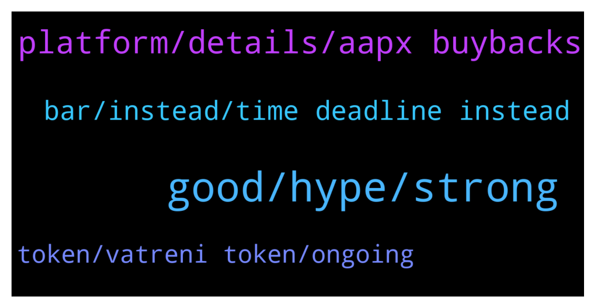

# **@ampnetapxchat**
 ## Analysis for **2022-01-27** - **2022-02-01**.

---

## 📊 **Basic Stats**

**n_messages_sent**: 62

---

---

## 🔝 **Top keywords and related messages**

1. **good, hype, strong**

    @jakovtradingmentor --- *but the community, you guys, you can do so if you're motivated to* **--->** [TG Discussion](https://t.me/ampnetapxchat/36780)

    @DexTrade_Listing_Dennis --- *Hello Who is the right person to discuss listing proposal?* **--->** [TG Discussion](https://t.me/ampnetapxchat/36846)

    @runex_x1 --- *almost feel sorry to have not invested in biznisport 😊, but can't invest everywhere :)* **--->** [TG Discussion](https://t.me/ampnetapxchat/36893)

    @runex_x1 --- *as an early investor too :)* **--->** [TG Discussion](https://t.me/ampnetapxchat/36884)

    @runex_x1 --- *I wish the team all the luck on this one. We can use some positive investment news after all this technical progress* **--->** [TG Discussion](https://t.me/ampnetapxchat/36883)

    @North --- *Three I've made money from are Unibright, Strong, Thor. Countless others.  You couldn't even be bothered to research who is raising funds here, so I'm not surprised you miss these opportunities* **--->** [TG Discussion](https://t.me/ampnetapxchat/36825)

2. **platform, details, aapx buybacks**

    @jakovtradingmentor --- *well i'm told we as ampnet cant really go around and shill the projects on our platform, something about the legality around it doesnt allow us to do so* **--->** [TG Discussion](https://t.me/ampnetapxchat/36779)

    @MelonHusk --- *Don't tell me Ampnet is raising more money?* **--->** [TG Discussion](https://t.me/ampnetapxchat/36814)

    @jakovtradingmentor --- *ofc if raise is successful, which seems like it is, a percentage of that raise is going to ampnet for aapx buybacks* **--->** [TG Discussion](https://t.me/ampnetapxchat/36817)

    @jakovtradingmentor --- *which is a project that's using the ampnet platform* **--->** [TG Discussion](https://t.me/ampnetapxchat/36816)

    @jakovtradingmentor --- *if the 2nd comes and goes and the sale is fully funded, a percentage of the sale goes to ampnet as commission which is then used for aapx buybacks* **--->** [TG Discussion](https://t.me/ampnetapxchat/36857)

    @North --- *Fomo will increase as it gets towards  $500K. No way this doesn't get funded. Great news and hopefully we get some more details for AmpNet once we know it's going ahead* **--->** [TG Discussion](https://t.me/ampnetapxchat/36773)

3. **bar, instead, time deadline instead**

    @Tinus_Tussengas_1984 --- *thanks m8. that loading bar is looking strange btw... i assume its to see the progress in time to the deadline instead of the percentage of funding 😋* **--->** [TG Discussion](https://t.me/ampnetapxchat/36806)

    @runex_x1 --- *there is clearly something wrong with the progress bar (brave)* **--->** [TG Discussion](https://t.me/ampnetapxchat/36882)

    @jakovtradingmentor --- *i'm not a 100% sure as I haven't been told so maybe one of the devs can answer this* **--->** [TG Discussion](https://t.me/ampnetapxchat/36859)

    @matejmz --- *Yeah, it is bugged apparently. (Time would be at 50%, so this is not the case)  @mislavjavor* **--->** [TG Discussion](https://t.me/ampnetapxchat/36807)

    @mislavjavor --- *there is a bug though, it seems* **--->** [TG Discussion](https://t.me/ampnetapxchat/36811)

    @runex_x1 --- *ok, is there a lockup period?* **--->** [TG Discussion](https://t.me/ampnetapxchat/36892)

4. **token, vatreni token, ongoing**

    @<UNK> --- *They just had Croatian national football team partnership and Vatreni token launch. Next comes PontoonDao (Q1) on Near protocol (which is damn hot atm). Then later this year licensing whole product to "reputable and large" brand (ongoing talks).  All this and 3.72m total marketcap. Upside is tremendous* **--->** [TG Discussion](https://t.me/ampnetapxchat/36757)

    @jakovtradingmentor --- *it is a utility token by croatian football organization where basically holders of it get bonuses in shops, access to events, discounts, they can pay with it and early access to ticket sales for games* **--->** [TG Discussion](https://t.me/ampnetapxchat/36891)

    @Tinus_Tussengas_1984 --- *ah oke, so no actual token sale. thanks :) (Y)* **--->** [TG Discussion](https://t.me/ampnetapxchat/36831)

    @jakovtradingmentor --- *The only fan token seed sale ongoing right now on AMPnet platform is Vatreni Token* **--->** [TG Discussion](https://t.me/ampnetapxchat/36830)

    @jakovtradingmentor --- *thats the raise for vatreni token* **--->** [TG Discussion](https://t.me/ampnetapxchat/36815)

    @runex_x1 --- *is there some info about this token actually?* **--->** [TG Discussion](https://t.me/ampnetapxchat/36888)

