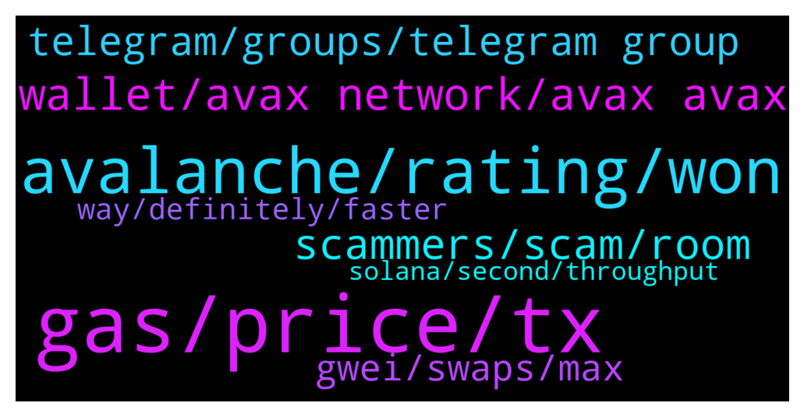

# **@avalancheavax**
 ## Analysis for **2022-01-31** - **2022-02-01**.

---

## 📊 **Basic Stats**

**n_messages_sent**: 190

---

---

## 🔝 **Top keywords and related messages**

1. **gas, price, tx**

    @bubee82 --- *Anyone experiencing issues with txs in MM? I have multiple txs pending even after cancellation. No trace can be found on Snowtrace. I can't use the network. I have tried on BSC and it just works.* **--->** [TG Discussion](https://t.me/avalancheavax/325728)

    @YoshiBowser --- *yes same here, I reset MM and tried to enter another transaction still the same. So i was supposed to buy XAVA at 6.6..* **--->** [TG Discussion](https://t.me/avalancheavax/325735)

    @TheSEOdude --- *Clear transaction log on the trader joe site.* **--->** [TG Discussion](https://t.me/avalancheavax/325723)

    @cutyflame --- *it worked, but the tx on trader joe still pending. weird. thank u my friend* **--->** [TG Discussion](https://t.me/avalancheavax/325722)

    @TheSEOdude --- *Reset your metamask, then do the transaction again.* **--->** [TG Discussion](https://t.me/avalancheavax/325717)

    @oathtobarbatos --- *Try increasing the gas price, the current med gas price is 57 nAVAX ($0.08)* **--->** [TG Discussion](https://t.me/avalancheavax/325565)

2. **avalanche, rating, won**

    @Patrick --- *Good morning. Please can anyone here confirm that Patrick Sutton works with avalanche and is a customer care representative ?* **--->** [TG Discussion](https://t.me/avalancheavax/325649)

    @Nicolas_A --- *Hey Jonathan, Binance doesn't support direct withdrawals to Avalanche for USDT / USDT.e.  What you can do is withdraw USDT to another network such as BSC for Binance and then bridge it over to Avalanche with a bridge such as Celer Network or Synapse protocol* **--->** [TG Discussion](https://t.me/avalancheavax/325690)

    @cutyflame --- *i just make my first tx on avalanche.  bad first time experience using avalanche* **--->** [TG Discussion](https://t.me/avalancheavax/325716)

    @oathtobarbatos --- *Avalanche administrators won't DM you first, also, they won't ask you for money. Be careful with anyone's DM!* **--->** [TG Discussion](https://t.me/avalancheavax/325658)

    @xChrisMoneyMakerx --- *watch out for Avalanche Support he is lurking around here lmao with whack ass game* **--->** [TG Discussion](https://t.me/avalancheavax/325533)

    @oathtobarbatos --- *Be careful with anyone's DM, Avalanche administrators won't DM you first and, they won't ask you for money* **--->** [TG Discussion](https://t.me/avalancheavax/325547)

3. **wallet, avax network, avax avax**

    @BOA_L --- *Hi guys, what is the quickest way of moving BUSD on VELAS to AVAX?* **--->** [TG Discussion](https://t.me/avalancheavax/325538)

    @DillonRookMN --- *Is Nino a legit Avax support? He told me in the group chat to dm him for instructions on how to stake. He asked if I had  validator and if I have connected to the Avax firmware Bridge.* **--->** [TG Discussion](https://t.me/avalancheavax/325657)

    @cutyflame --- *well thank u serr, so just import the avax web wallet & use metamask for dapps* **--->** [TG Discussion](https://t.me/avalancheavax/325642)

    @Jimmy --- *Brother what do you think .... Avax will drop to 53 dollar support or 33 dollar support???* **--->** [TG Discussion](https://t.me/avalancheavax/325552)

    @Lab_fe --- *Killing it on avax. Lfg! Please help me when https://discord.gg/icecream* **--->** [TG Discussion](https://t.me/avalancheavax/325640)

    @Gengar622inu --- *Is there a brige between AVAX and BSC?* **--->** [TG Discussion](https://t.me/avalancheavax/325792)

4. **scammers, scam, room**

    @Vico007 --- *To all the scammers: i wish that all your children pay the karma that you have left them through theft. I condemn them to eternal poverty.* **--->** [TG Discussion](https://t.me/avalancheavax/325591)

    @vicflair564 --- *Holy shit bro getting 7 spam calls from scammers in this group* **--->** [TG Discussion](https://t.me/avalancheavax/325588)

    @xChrisMoneyMakerx --- *this room is full of scammers lmao* **--->** [TG Discussion](https://t.me/avalancheavax/325540)

    @Gengar622inu --- *Many scammers around here are sending me DMs.* **--->** [TG Discussion](https://t.me/avalancheavax/325799)

    @moonWilly --- *Yah..same here ...just exited scam chat room..dont know how they got in..* **--->** [TG Discussion](https://t.me/avalancheavax/325870)

    @BOA_L --- *Anyone? (Not scammers please there were like 4 of you in 30 seconds)* **--->** [TG Discussion](https://t.me/avalancheavax/325542)

5. **telegram, groups, telegram group**

    @TheSEOdude --- *Lol, he said you was trying to make fud in the group.* **--->** [TG Discussion](https://t.me/avalancheavax/325849)

    @DillonRookMN --- *Is that an actual Avax Telegram group?* **--->** [TG Discussion](https://t.me/avalancheavax/325663)

    @ccnkk --- *ı try but "Avalaunch telegram group"Sorry, this group is not accessible."* **--->** [TG Discussion](https://t.me/avalancheavax/325834)

    @m4rtin_tr --- *You can ask to Avalaunch telegram group* **--->** [TG Discussion](https://t.me/avalancheavax/325833)

    @ccnkk --- *yes i know but i can't join that group i don't understand why* **--->** [TG Discussion](https://t.me/avalancheavax/325841)

    @Patrick --- *Everyone who has sent a dm is either trying to get me to click a link to obtain access to my metamask* **--->** [TG Discussion](https://t.me/avalancheavax/325674)

6. **gwei, swaps, max**

    @apollox --- *What is the max you can set to? How high can you go* **--->** [TG Discussion](https://t.me/avalancheavax/325567)

    @TheSEOdude --- *Would  you just tell me about the overall fee for the process ?  I am also thinking of doing the same now.* **--->** [TG Discussion](https://t.me/avalancheavax/325694)

    @julien17200 --- *lp with Cshare is lpy 72 percent per day !!* **--->** [TG Discussion](https://t.me/avalancheavax/325875)

    @ramziakram --- *for now 75 gwei seem ok* **--->** [TG Discussion](https://t.me/avalancheavax/325587)

    @apollox --- *What is the max AMOUNT of gwei you can use in swaps on traderjoe?* **--->** [TG Discussion](https://t.me/avalancheavax/325559)

    @apollox --- *What is the max gwei you can use in swaps on traderjoe?* **--->** [TG Discussion](https://t.me/avalancheavax/325556)

7. **way, definitely, faster**

    @bubee82 --- *I'd want to avoid that. Everything else works just fine. Is that really the only way?* **--->** [TG Discussion](https://t.me/avalancheavax/325730)

    @lovingcrypto_mytelegram --- *So you're saying excluding those nodes would make it faster* **--->** [TG Discussion](https://t.me/avalancheavax/325476)

    @ccnkk --- *there will definitely be a mistake, I don't do such a thing* **--->** [TG Discussion](https://t.me/avalancheavax/325851)

    @ccnkk --- *there will definitely be something wrong to do something like this* **--->** [TG Discussion](https://t.me/avalancheavax/325850)

    @Nicolas_A --- *That’s one good way to do it* **--->** [TG Discussion](https://t.me/avalancheavax/325756)

    @TheSEOdude --- *It won't change anything, so feel free to do it, and yes, the only way* **--->** [TG Discussion](https://t.me/avalancheavax/325731)

8. **solana, second, throughput**

    @B_sh999 --- *Ddos attack is not new. there are many solutions to identify the fake requests before leads to affecting the network performance . Solana team also considered Ddos  attacks they will overcome this issue in the next updates. It's not a big problem* **--->** [TG Discussion](https://t.me/avalancheavax/325488)

    @neirenoir --- *I think Solana is a total engineering blunder. Not sure how they have managed to get away with it.* **--->** [TG Discussion](https://t.me/avalancheavax/325483)

    @B_sh999 --- *Solana distinguishes itself from other blockchain projects through its Proof of History (PoH) approach to reach consensus. As a result, the Solana network can scale and process a faster transaction throughput of up to 50,000 transactions per second (TPS). The platform is able to support a hypothetical upper bound throughput of 710,000 TPS on a standard gigabit structure and a throughput of 28.4 million transactions per second on a 40-gigabit structure.* **--->** [TG Discussion](https://t.me/avalancheavax/325480)

    @neirenoir --- *Basically, whenever a transaction is sent to the network, all validating nodes vote on it to determine if it is valid or not. Those votes are usually done via a side channel because there is no point in recording all of them, but Solana does them on-chain.* **--->** [TG Discussion](https://t.me/avalancheavax/325475)

    @B_sh999 --- *Don't agree. Solana main net is beta . Ddos attack could be occurred on all blockchains.  U mentioned finding node for attacking is easy in POH but even without  consideration  a solution  for this, due to increasing the amount of node validators attacking on all them is impossible . Just like what makes attack on Bitcoin  is very hard and costly* **--->** [TG Discussion](https://t.me/avalancheavax/325484)

    @lovingcrypto_mytelegram --- *What's the road map of 2022 any updates, upgrades, any chance of besting solana in the coming years...I strongly believe in avalanche to be better than ethereum in the future* **--->** [TG Discussion](https://t.me/avalancheavax/325864)

