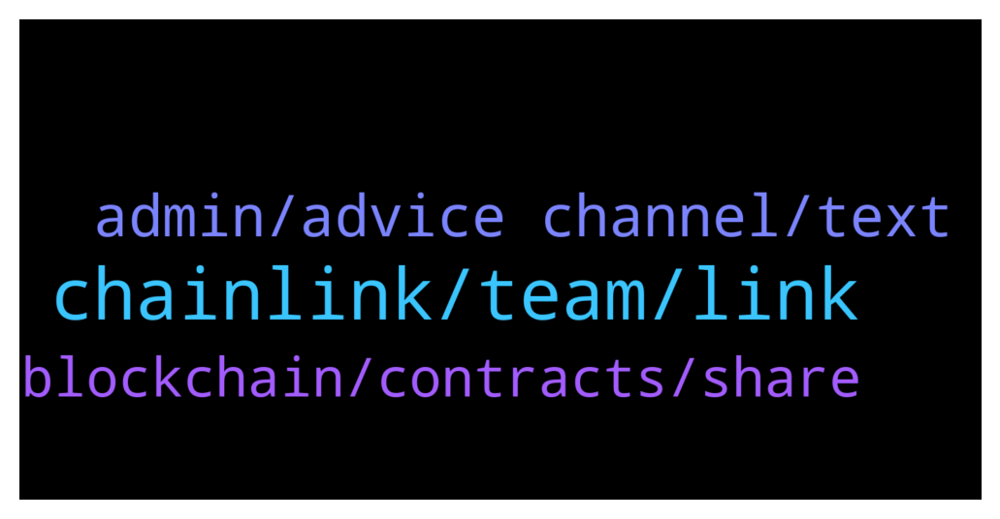

# **@chainlinkofficial**
 ## Analysis for **2022-01-31** - **2022-02-01**.

---

## 📊 **Basic Stats**

**n_messages_sent**: 41

---

---

## 🔝 **Top keywords and related messages**

1. **chainlink, team, link**

    @gicappaemme --- *Hello everyone! I am the guy who developed AI Alghorithm for NFTs price estimation! I have a question for admins or polygon devs:  I told with some devs in ChainLink ecosystem looking for someone helping me to run a node.   In the while I am thinking about providing other kind of jobs as node in order to make it more various and usable. So I am here asking this:  **Except from NFT Price Estimation (that we Re already going to integrate) is there any other off-chain data (about NFTs or even not) that I could provide from my node you would need? I am able to scrape ‘static’ data and retrieve estimated data through Machine Learning algorithm. Every answer is appreciated! Thank you all !* **--->** [TG Discussion](https://t.me/chainlinkofficial/370676)

    @zipulya_wb --- *We'd like to talk over listing LINK on WhiteBIT.* **--->** [TG Discussion](https://t.me/chainlinkofficial/370729)

    @marcromeron --- *Details have not been released yet. Feel free to check out this video to learn some aspects of staking among others for the future of Chainlink https://youtu.be/YShbzR7mlog* **--->** [TG Discussion](https://t.me/chainlinkofficial/370744)

    @rodrigokduarte --- *ive heard about news about link staking in the next few months* **--->** [TG Discussion](https://t.me/chainlinkofficial/370742)

    @Sylvarantt --- *Interesting question. If I were you I'd browse https://chainlinkecosystem.com/ecosystem, fetch Chainlink integrations by "NFTs" and see what sort of data or computation service are those projects using Chainlink for and reflect on where are the niche market opportunities as a data provider* **--->** [TG Discussion](https://t.me/chainlinkofficial/370702)

    @Sylvarantt --- *Hi there, the Chainlink Labs team doesn’t offer timelines for development targets. Although you can assume that a certain solution will be deployed on a given network when the engineering team considers that it's safe and fail-proof to do so 👍* **--->** [TG Discussion](https://t.me/chainlinkofficial/370734)

2. **admin, advice channel, text**

    @Sylvarantt --- *Also I'd suggest hopping onto our technical Discord and asking the same in the #developers-advice channel   https://chain.link/discord* **--->** [TG Discussion](https://t.me/chainlinkofficial/370703)

    @gicappaemme --- *Your answers are always amazing 🤙 I tried to text in dev advice channel but nobody answered me* **--->** [TG Discussion](https://t.me/chainlinkofficial/370705)

    @elifhilalumucu --- *😇😇 you’re welcome! I hope it will be useful for you!* **--->** [TG Discussion](https://t.me/chainlinkofficial/370817)

    @Linkederic --- *Thanks so much for all these!* **--->** [TG Discussion](https://t.me/chainlinkofficial/370816)

    @gicappaemme --- *Would be great to talk with one of them if only answered 😅 thank you anyway!* **--->** [TG Discussion](https://t.me/chainlinkofficial/370728)

    @Shogun187 --- *That's copied from a previous admin response* **--->** [TG Discussion](https://t.me/chainlinkofficial/370577)

3. **blockchain, contracts, share**

    @Sandeep_9879 --- *Could anyone please tell me uses cases of random number except Lottery* **--->** [TG Discussion](https://t.me/chainlinkofficial/370645)

    @huang --- *Hi MOD, please share the latest roadmap* **--->** [TG Discussion](https://t.me/chainlinkofficial/370837)

    @Sylvarantt --- *There is no formal roadmap. The Whitepaper indicates future features (and some that are now live), this blogpost gives a good overview https://blog.chain.link/chainlink-2-0-lays-foundation-for-adoption-of-hybrid-smart-contracts/* **--->** [TG Discussion](https://t.me/chainlinkofficial/370841)

    @elifhilalumucu --- *I would like to share with you a website where I am aware of training and events about DeFi, smart contracts and Blockchain🎊🎊🎊  It's a useful website for me, I hope you will too😇  https://solange.dev/events/* **--->** [TG Discussion](https://t.me/chainlinkofficial/370815)

    @elifhilalumucu --- *If you say you want to be interested in blockchain but don't know where to start, I would recommend this article to you:  https://blog.chain.link/what-is-blockchain/. 🙏🏻  Because, first of all, knowing how the Blockchain mechanism works and what it is makes things easier.  🙂If you are familiar with Blockchain but want to understand what smart contracts are, my recommendation is this article: https://chain.link/education/smart-contracts  Through this article you will understand the difference between real legal contracts and smart contracts ⚡️* **--->** [TG Discussion](https://t.me/chainlinkofficial/370813)

    @elifhilalumucu --- *Hello, I just saw a great announcement.  I want to share with you.  🤩 A great opportunity for those who want to develop themselves in the field of Blockchain!   PhD opportunity as external doctoral candidate (m/f/d).  Isabell Welpe and Phillip Sander are searching for doctoral candidates in two fields. Please see the two offers below:  1) Blockchain technology, crypto assets, DeFi👌🏻  https://philippsandner.medium.com/phd-opportunity-as-external-doctoral-candidate-m-f-d-blockchain-technology-crypto-assets-defi-8b2fd3e0d388  2) Interdisciplinary (computer science/entrepreneurship) 👌🏻 research project on predicting startup success from secondary and trace data  https://philippsandner.medium.com/phd-opportunity-as-external-doctoral-candidate-m-f-d-interdisciplinary-computer-90907eca0355* **--->** [TG Discussion](https://t.me/chainlinkofficial/370811)

