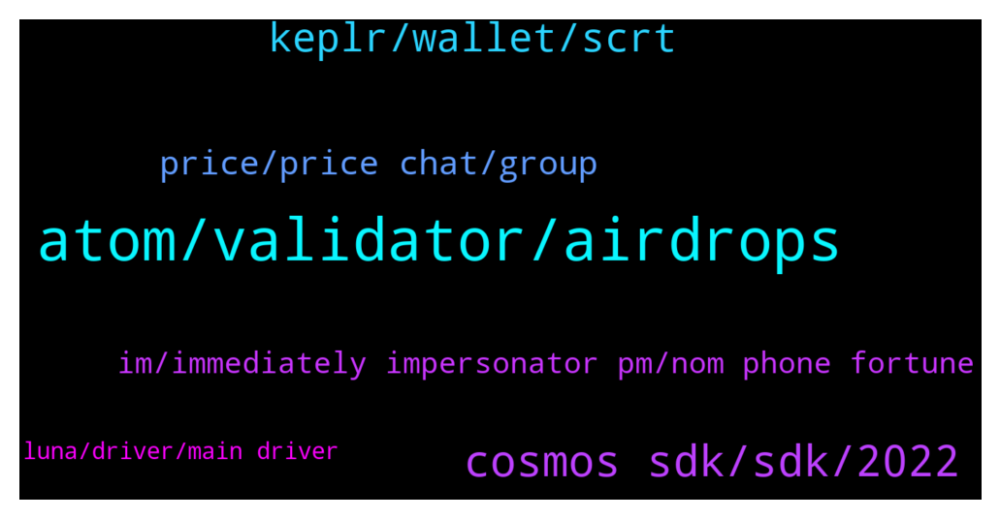

# **@cosmosproject**
 ## Analysis for **2022-01-31** - **2022-02-01**.

---

## 📊 **Basic Stats**

**n_messages_sent**: 189

---

---

## 🔝 **Top keywords and related messages**

1. **atom, validator, airdrops**

    @Altaf1111 --- *Price will dump in future to less than 1$ if more coin daily comes in circulation* **--->** [TG Discussion](https://t.me/cosmosproject/484151)

    @ZoltanAtom --- *Make sure you avoid exchange validators! Other than that...The best validator is always subjective, here are some factors that might help:   - Commission Rate:  This is the % of earned rewards that go to the validator. Not the % of your total stake, just to eliminate that confusion.   - Self-Bonded rate:  This is the % of bonded ATOM that belong to the validator. Think of this as their skin in the game.   - Decentralization:  Choosing the smaller validators helps to decentralize the network which improves security overall. Again, decentralization should be a priority. On this point, centralized exchanges are not the best choice as they don't really support the network at all.   You can learn more about each validator in their profiles on the wallets and explorers.  The 8-10% is almost for everyone, feel free to use this reward calculator  https://www.stakingrewards.com/earn/cosmos  Commissions can be changed anytime so keep an eye on your validator via telegram or twitter* **--->** [TG Discussion](https://t.me/cosmosproject/484330)

    @Marcincrypto --- *All in one - Cosmos Ecosystem : 🚀 Airdrop's | ⛲️ APR% | 🧪 DEX's | 🌆 NFT https://docs.google.com/spreadsheets/u/0/d/1xQJ1YwE4gv2zXduScgN71wYCv8nb9MhVMdiXb8yexxc/htmlview* **--->** [TG Discussion](https://t.me/cosmosproject/484160)

    @ZoltanAtom --- *Hi there, Emeris will be your best shout. Via moonpay you will get your atom directly to your Keplr wallet. Join Emeris channel and check the pinned message for guide ;  https://t.me/EmerisHQ* **--->** [TG Discussion](https://t.me/cosmosproject/483905)

    @ZoltanAtom --- *You should join Osmosis community and learn more details of Osmosis ;  https://t.me/osmosis_chat* **--->** [TG Discussion](https://t.me/cosmosproject/484114)

    @ZoltanAtom --- *This is link of Atom price chat.   https://t.me/AtomPrice* **--->** [TG Discussion](https://t.me/cosmosproject/483952)

2. **cosmos sdk, sdk, 2022**

    @AtomJazz --- *It's the best and most used cosmos wallet https://medium.com/chainapsis/how-to-use-keplr-wallet-40afc80907f6?source=user_profile---------0----------------------------* **--->** [TG Discussion](https://t.me/cosmosproject/483991)

    @AtomJazz --- *It's a very interesting project co-founded by Zaki Manian and Jack Zampolin (core cosmos devs). You can read more about it by joining their telegram chat https://t.me/getsomm* **--->** [TG Discussion](https://t.me/cosmosproject/484191)

    @LATOKEN_Jogiyat --- *Hey Zoltan, does the team at Cosmos do AMA's?  I'd love to update our community on ATOM's  plans for 2022* **--->** [TG Discussion](https://t.me/cosmosproject/484281)

    @AtomJazz --- *Can't help you much. We don't recommend using Trust wallet for Cosmos assets and I have 0 idea what poocoin app is 😁* **--->** [TG Discussion](https://t.me/cosmosproject/484041)

    @Andi_EWM --- *At Kava platform! You get around 50% when you supply Atom to there lending protocol! Cool thing is you can leverage your position without risk when you borrow the same asset and supply again and so on.... Kava have their own chain on Cosmos ecosystem.... For me the best Defi platform I used so far... Only  thing that is perhaps negative for some people is that you have to lock your rewards(which you get in KAVA and HARD) for 12 or 1month. With 12 month lock you get the full Rewards with 1 Month only 1/5.* **--->** [TG Discussion](https://t.me/cosmosproject/483739)

    @g0_Hans --- *If I want to learn how to develop and help Cosmos, what kind of training do I need?* **--->** [TG Discussion](https://t.me/cosmosproject/484310)

3. **keplr, wallet, scrt**

    @TalcHands --- *I withrew my SCRT from OSMO to my scrt address. Where can I find the place to stake scrt?  I’m on mobile* **--->** [TG Discussion](https://t.me/cosmosproject/484108)

    @defi_intern --- *Hello. the entire page is not updated since 19 Jan. Any idea?? https://cosmoscan.net/cosmos/network-charts* **--->** [TG Discussion](https://t.me/cosmosproject/483682)

    @kml_bgn --- *Thank you for your insight. How come there isn't much detailed info regarding the tokenomics (seeds rounds, vesting etc...) and also a basic whitepaper? been  hearing of that project since last April. that's my only concern : the lack of information* **--->** [TG Discussion](https://t.me/cosmosproject/484214)

    @ls -al --- *No problem at all, will wait and see what official announcement says.  My gut feel is maybe they are waiting for shared security.  Completely guessing here.* **--->** [TG Discussion](https://t.me/cosmosproject/484129)

    @ggwashinton1 --- *no issue. Just eth maxis making shit up* **--->** [TG Discussion](https://t.me/cosmosproject/483666)

    @ls -al --- *Thanks.  Is there any approximation to when it will debut?  It's okay of there is none, just want to make sure I get it on my calendar if there is a date.* **--->** [TG Discussion](https://t.me/cosmosproject/484124)

4. **price, price chat, group**

    @defi_intern --- *Erm I clicked it but still says private though  https://cosmoscan.net/cosmos* **--->** [TG Discussion](https://t.me/cosmosproject/483727)

    @ZoltanAtom --- *Unfortunately I do not have any date to share with you.* **--->** [TG Discussion](https://t.me/cosmosproject/484125)

    @Xszeanx --- *I lost the Indonesian atomic chat group, because my Telegram account was delted* **--->** [TG Discussion](https://t.me/cosmosproject/483954)

    @defi_intern --- *Yeap. I have a screenshot of it* **--->** [TG Discussion](https://t.me/cosmosproject/483721)

    @ZoltanAtom --- *You should try to pass the bot or you have been blocked before from their telegram. Try to reach them via twitter.* **--->** [TG Discussion](https://t.me/cosmosproject/483728)

    @defi_intern --- *I just dropped u a pm of it though 😅 do u mind sending the group tele link* **--->** [TG Discussion](https://t.me/cosmosproject/483724)

5. **im, immediately impersonator pm, nom phone fortune**

    @Fredmeister --- *If you say so im a little more tranquil* **--->** [TG Discussion](https://t.me/cosmosproject/484168)

    @AtomJazz --- *No and you shouldn't be either 😉* **--->** [TG Discussion](https://t.me/cosmosproject/484167)

    @Fredmeister --- *Im Dot bulliever but jesus christ it sucks* **--->** [TG Discussion](https://t.me/cosmosproject/484187)

    @kml_bgn --- *i did... but no answer ^^* **--->** [TG Discussion](https://t.me/cosmosproject/484222)

    @ZoltanAtom --- *Always. Wish to know more details with you. But don’t have.* **--->** [TG Discussion](https://t.me/cosmosproject/484127)

    @AtomJazz --- *I'm not a fan either hehe* **--->** [TG Discussion](https://t.me/cosmosproject/484186)

6. **luna, driver, main driver**

    @bloodonthemarket --- *Cos LUNA have a problem with 20% APY via ANCHOR__fear around that project hitting cosmos* **--->** [TG Discussion](https://t.me/cosmosproject/483628)

    @hleb_albau --- *we are all interconnected here and luna was main driver for months* **--->** [TG Discussion](https://t.me/cosmosproject/483780)

    @hleb_albau --- *till luna will fall, but when gravity will online it maybe bounces back* **--->** [TG Discussion](https://t.me/cosmosproject/483778)

    @AtomJazz --- *Agree to disagree. For sure ATOM JUNO and OSMO are correlated but not LUNA. This will probably change in the future since now we have it on IBC too but historically speaking this has not been the case* **--->** [TG Discussion](https://t.me/cosmosproject/483783)

    @AtomJazz --- *No it wasn't. Luna was a main driver for Luna not for ATOM* **--->** [TG Discussion](https://t.me/cosmosproject/483781)

    @AtomJazz --- *Wut? Luna is an application specific cosmos chain that has nothing to do with cosmos hub and ATOM specifically* **--->** [TG Discussion](https://t.me/cosmosproject/483779)

