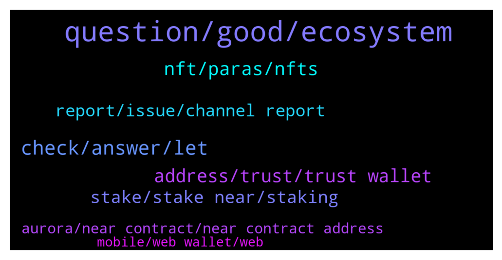

# **@cryptonear**
 ## Analysis for **2022-01-31** - **2022-02-01**.

---

## 📊 **Basic Stats**

**n_messages_sent**: 338

---

---

## 🔝 **Top keywords and related messages**

1. **question, good, ecosystem**

    @kv9990 --- *Isn't that a personal question? I don't see a reason why I should answer that ;)* **--->** [TG Discussion](https://t.me/cryptonear/323934)

    @harryfrottercrypto --- *Why near ton not near town* **--->** [TG Discussion](https://t.me/cryptonear/323941)

    @larry_lang --- *well we have 2 special events coming for u guys* **--->** [TG Discussion](https://t.me/cryptonear/322155)

    @iamkemoo --- *Hey, feel free to ask your question here* **--->** [TG Discussion](https://t.me/cryptonear/324244)

    @oppzsmoKe --- *I’m guessing that’s why it’s doing good* **--->** [TG Discussion](https://t.me/cryptonear/323886)

    @Zhu --- *Gotcha.. I wish they did it'll be easier to confirm =)* **--->** [TG Discussion](https://t.me/cryptonear/322390)

2. **check, answer, let**

    @Taurus990 --- *Still don’t know how to do the latter* **--->** [TG Discussion](https://t.me/cryptonear/323802)

    @rahulgoel007 --- *https://t.me/cryptonear/322121  Check here, all the important links are present* **--->** [TG Discussion](https://t.me/cryptonear/324156)

    @rahulgoel007 --- *Please refer to the below post https://t.me/cryptonear/324236* **--->** [TG Discussion](https://t.me/cryptonear/324260)

    @larry_lang --- *we believe that the further details is included in this article* **--->** [TG Discussion](https://t.me/cryptonear/322495)

    @GeorgePro1 --- *I understand.. I'm reading it now.* **--->** [TG Discussion](https://t.me/cryptonear/322449)

    @larry_lang --- *it should show a section like this* **--->** [TG Discussion](https://t.me/cryptonear/322817)

3. **nft, paras, nfts**

    @AfroRick --- *Hey team. I'm trying to find out how I can implement attributes for NFTs using NEAR. I don't see a section in the standard for defining attributes as I would with OpenSea.   In the spec I see that in type TokenMetadata {} there is "extra" which can hold other stuff I want to store, but I'm not sure that's what I'm looking for.* **--->** [TG Discussion](https://t.me/cryptonear/321832)

    @Taurus990 --- *I clicked on the NFT on the collectibles and it showed me that* **--->** [TG Discussion](https://t.me/cryptonear/323711)

    @kv9990 --- *If you've a Nft doesn't mean it has a value =)) list it on a marketplace like Paras/Mintbase ,if it's part of a collection then check it's floor price 👀* **--->** [TG Discussion](https://t.me/cryptonear/323712)

    @Pixx99 --- *hey, how can i send nfts between accounts with near wallet?* **--->** [TG Discussion](https://t.me/cryptonear/323958)

    @Taurus990 --- *Hello please how do i check the price of NFT’s on my NEAR WALLET ?* **--->** [TG Discussion](https://t.me/cryptonear/323703)

    @GeorgePro1 --- *Hip pop NFT was also posted there* **--->** [TG Discussion](https://t.me/cryptonear/323892)

4. **address, trust, trust wallet**

    @preeti4141 --- *Sir last question clear me i want to withdraw near from binance what address should I give 64 digit correct?* **--->** [TG Discussion](https://t.me/cryptonear/322563)

    @larry_lang --- *Well if u withdraw\deposit the fund the balance would still change, but that will be the balance of the id.near* **--->** [TG Discussion](https://t.me/cryptonear/322557)

    @rahulgoel007 --- *Hey there was change in wallet creation process, please follow below guide  https://link.medium.com/9koby6J3fnb* **--->** [TG Discussion](https://t.me/cryptonear/324102)

    @preeti4141 --- *Thanks done sir i have login my account in trust wallet but there balance showing 0?* **--->** [TG Discussion](https://t.me/cryptonear/322538)

    @preeti4141 --- *Ok if i take address from trust wallet and withdraw from binance my balance is safe sir it will succesful with in my both account like trust wallet and I'd.near?* **--->** [TG Discussion](https://t.me/cryptonear/322550)

    @larry_lang --- *Ah there is 2 address the one that u are using to interact with DApps is the id.near, while the funding address has 64 digits are used for...u know funding first time* **--->** [TG Discussion](https://t.me/cryptonear/322542)

5. **stake, stake near, staking**

    @PLAY2EARNCOMMUNITY --- *Looking for feedback on what is the best way to stake Near.  I mean for the best APY?* **--->** [TG Discussion](https://t.me/cryptonear/324259)

    @iamkemoo --- *You can stake $Near and earn $Near back (~11% APY) Guide -> https://t.me/cryptonear/154221  On Metapool you can liquid stake $NEAR and get $NEAR(~10.5% APY) + $META {Liquid staking --> Instant Unstake by paying extra fees} Guide--> https://www.producthunt.com/posts/meta-pool  What's $META? Here's the answer! https://twitter.com/Nearius_/status/1431208822895374337?s=19* **--->** [TG Discussion](https://t.me/cryptonear/324237)

    @rahulgoel007 --- *There are couple of ways you can stake near  Metapool  Near wallet  Binance   For Near wallet and metapool  Refer to below links and you will get the idea  https://t.me/cryptonear/289255  https://t.me/cryptonear/282216  For binance, they have locked system with 30 and 60 days and apy varies on that* **--->** [TG Discussion](https://t.me/cryptonear/324236)

    @catalinstanescu --- *there is an article on how to chose a pool for staking?* **--->** [TG Discussion](https://t.me/cryptonear/324154)

    @catalinstanescu --- *Hello, guys! I'am trying to understand why there are staking pools with 100% fee?* **--->** [TG Discussion](https://t.me/cryptonear/324140)

    @becausetelegram --- *so i understand clearly.what does  fees exactly refer to? and is the highest apy currently is 11.15?* **--->** [TG Discussion](https://t.me/cryptonear/323401)

6. **report, issue, channel report**

    @Laurenjamie --- *I got an issue  Any help team here Or admin Please i need assistance* **--->** [TG Discussion](https://t.me/cryptonear/323198)

    @iforbusiness2 --- *you must be part of our validator group to catch all other validator and community https://t.me/near_validators* **--->** [TG Discussion](https://t.me/cryptonear/323057)

    @agathearts --- *Its okey sir, we created a back up plans in case this is happen.    but i really hope that devs will do some action that can protect our nears for those cruel hackers.* **--->** [TG Discussion](https://t.me/cryptonear/322790)

    @agathearts --- *@zubairansari07 in what channel should i report this.* **--->** [TG Discussion](https://t.me/cryptonear/322804)

    @zubairansari07 --- *I guess you can complaint about it in https://near.chat #dev channel* **--->** [TG Discussion](https://t.me/cryptonear/322788)

    @becausetelegram --- *trying to see a list of admins. since you sent a link am just trying to make sure you are one* **--->** [TG Discussion](https://t.me/cryptonear/323376)

7. **aurora, near contract, near contract address**

    @harryfrottercrypto --- *How many algorithmic lending protocols are arriving on aurora 😅😅* **--->** [TG Discussion](https://t.me/cryptonear/323851)

    @meekmary --- *Please what is the near contract address on Aurora* **--->** [TG Discussion](https://t.me/cryptonear/322807)

    @web0x --- *https://gov.near.org/t/proposal-1-000-billion-hak-airdrop-on-aurora-for-near-community/13286  Experience a crypto world without gas fees on Aurora* **--->** [TG Discussion](https://t.me/cryptonear/322422)

    @nearpunk --- *Hey guys! Somebody know a near wallet of Aurora CEO ?* **--->** [TG Discussion](https://t.me/cryptonear/321804)

    @Kripto_Raptor --- *you can check al defi on Near/Aurora at https://awesomenear.com/categories/defi* **--->** [TG Discussion](https://t.me/cryptonear/321772)

    @iamkemoo --- *Validators can choose how much fee they take from delegators to operate as validators. I think you speak about the Aurora Validator and that's because they take 100% of the $NEAR rewards and pay you in $AURORA.* **--->** [TG Discussion](https://t.me/cryptonear/324143)

