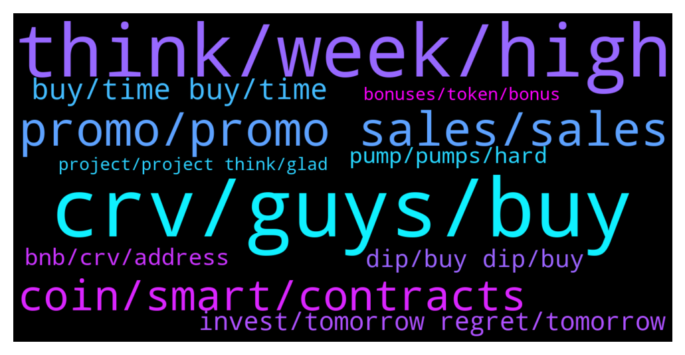

# **@curvedaotoken_official**
 ## Analysis for **2022-01-31** - **2022-02-01**.

---

## 📊 **Basic Stats**

**n_messages_sent**: 383

---

---

## 🔝 **Top keywords and related messages**

1. **crv, guys, buy**

    @Sarah Williams --- *I just received my 20bnb purchase of CRV* **--->** [TG Discussion](https://t.me/curvedaotoken_official/25240)

    @Bull_hunter --- *I have also received my purchase. But how and when will we be able to use the crv tokens on the bsc?* **--->** [TG Discussion](https://t.me/curvedaotoken_official/25244)

    @Dennis --- *I'm definitely buying as much CRV as I can and holding on* **--->** [TG Discussion](https://t.me/curvedaotoken_official/26027)

    @Harry --- *Dont know how to start telling you guys how CRV have touch my life. I am so grateful to this team and also the admin He was a great help to me* **--->** [TG Discussion](https://t.me/curvedaotoken_official/25496)

    @Tammy --- *CRV looks like it's beginning the process of correcting* **--->** [TG Discussion](https://t.me/curvedaotoken_official/25714)

    @Fred --- *CRV is amazing and a great longterm investment.* **--->** [TG Discussion](https://t.me/curvedaotoken_official/25707)

2. **think, week, high**

    @Terry --- *A good pull back is good, next time higher high!* **--->** [TG Discussion](https://t.me/curvedaotoken_official/25187)

    @Abdul --- *I think it will move high* **--->** [TG Discussion](https://t.me/curvedaotoken_official/25798)

    @Jack --- *Recovery is right by the corner* **--->** [TG Discussion](https://t.me/curvedaotoken_official/25477)

    @Cryptomacy --- *I believe it will rise to a high position* **--->** [TG Discussion](https://t.me/curvedaotoken_official/25759)

    @Mark --- *I expect this swing to keep climbing after a series of tests and retests and minor correction* **--->** [TG Discussion](https://t.me/curvedaotoken_official/25784)

    @Real --- *I expect a pull back region then continue upwards* **--->** [TG Discussion](https://t.me/curvedaotoken_official/25745)

3. **promo, promo sales, sales**

    @Feng --- *There's Never A Better Time To Buy In The promo Sales Than Now Guys* **--->** [TG Discussion](https://t.me/curvedaotoken_official/25624)

    @Mark --- *Promo sales is still on don't miss out* **--->** [TG Discussion](https://t.me/curvedaotoken_official/25903)

    @Terry --- *There is no middle ground  from the promo sales.* **--->** [TG Discussion](https://t.me/curvedaotoken_official/25507)

    @Fxethe4 --- *There's still promo sales going on* **--->** [TG Discussion](https://t.me/curvedaotoken_official/25773)

    @Harry --- *I'm not missing out at all  BUYING from the promo sales* **--->** [TG Discussion](https://t.me/curvedaotoken_official/25263)

    @Fxethe4 --- *Keep buying from the promo guys* **--->** [TG Discussion](https://t.me/curvedaotoken_official/25872)

4. **coin, smart, contracts**

    @Jensinety🥰🥰 --- *we are so early!  such an amazing team behind this project.  fundamentals is the key to long term success, and this is one of the best crypto ecosystems live today 🤘🏻* **--->** [TG Discussion](https://t.me/curvedaotoken_official/25297)

    @Cryptomacy --- *Probably the best crypto community to be* **--->** [TG Discussion](https://t.me/curvedaotoken_official/25430)

    @Joshua --- *alexa play CryptoFace - Scared Money Dont Make No Money* **--->** [TG Discussion](https://t.me/curvedaotoken_official/25597)

    @Adams --- *I've chosen and will keep choosing crypto over and over🚀* **--->** [TG Discussion](https://t.me/curvedaotoken_official/25649)

    @Love4th --- *This is a problem right now in the crypto market* **--->** [TG Discussion](https://t.me/curvedaotoken_official/25790)

    @Crypto --- *alexa play CryptoFace - Scared Money Dont Make No Money* **--->** [TG Discussion](https://t.me/curvedaotoken_official/25658)

5. **buy, time buy, time**

    @Sam --- *Great time to buy and Accumulate bonus🤲🏽🤲🏽💰💰* **--->** [TG Discussion](https://t.me/curvedaotoken_official/25679)

    @Fred --- *Buy as much as you can afford right now* **--->** [TG Discussion](https://t.me/curvedaotoken_official/25653)

    @John C. --- *Congrats dude  That is one huge buy* **--->** [TG Discussion](https://t.me/curvedaotoken_official/25537)

    @Paul --- *I'm still in support zone  Buy buy buy now 🚀🚀🚀🚀🚀🚀* **--->** [TG Discussion](https://t.me/curvedaotoken_official/25452)

    @Fxethe4 --- *Atm better to buy and keep and see what this year has to offer* **--->** [TG Discussion](https://t.me/curvedaotoken_official/25413)

    @Jim --- *Buy as much as you can afford right now* **--->** [TG Discussion](https://t.me/curvedaotoken_official/25593)

6. **invest, tomorrow regret, tomorrow**

    @Sam --- *If you have money invest more now* **--->** [TG Discussion](https://t.me/curvedaotoken_official/25680)

    @Kayla --- *Or you invest today and tomorrow you will regret you bought when a day later it was 80% cheaper* **--->** [TG Discussion](https://t.me/curvedaotoken_official/25655)

    @Kayla --- *You are afraid today and do not invest, and tomorrow you will regret why you did not invest* **--->** [TG Discussion](https://t.me/curvedaotoken_official/25654)

    @Rachel --- *I was thinking of 3-5 years minimum hold. Then maybe take profit along the line* **--->** [TG Discussion](https://t.me/curvedaotoken_official/25626)

    @Harry --- *Or you invest today and tomorrow you will regret you bought when a day later it was 80% cheaper.* **--->** [TG Discussion](https://t.me/curvedaotoken_official/25595)

    @Sylvester --- *The best investment for me so far* **--->** [TG Discussion](https://t.me/curvedaotoken_official/25399)

7. **dip, buy dip, buy**

    @Robert B. --- *I’ve seen so many people wishing for dips but when the dip actually comes they get scared and don’t buy because of it. Then later they FOMO in again at a higher price. This is just human nature but with some discipline you can change that.* **--->** [TG Discussion](https://t.me/curvedaotoken_official/25879)

    @Jim --- *I'll wait for it to dip further and after it doesn't, buy right before the next dip.* **--->** [TG Discussion](https://t.me/curvedaotoken_official/25695)

    @Adams --- *I’ve seen so many people wishing for dips but when the dip actually comes they get scared and don’t buy because of it. Then later they FOMO in again at a higher price. This is just human nature but with some discipline you can change that.* **--->** [TG Discussion](https://t.me/curvedaotoken_official/25690)

    @Love4th --- *I still have to buy the dip* **--->** [TG Discussion](https://t.me/curvedaotoken_official/25353)

    @Mark Phillips --- *Now we have to buy the dip and wait for it to dip* **--->** [TG Discussion](https://t.me/curvedaotoken_official/25194)

    @Youkno713who26778 --- *I see alot of people who bought the dip* **--->** [TG Discussion](https://t.me/curvedaotoken_official/25870)

8. **bnb, crv, address**

    @wolfofberkeleyst --- *Is there a curve trading chat?* **--->** [TG Discussion](https://t.me/curvedaotoken_official/25763)

    @CURVE_DAO_TOKEN_ANNOUNCEMENT --- *🎉CURVE DAO OFFICIAL PROMO SALES PROGRAM💰💯 🎉                ⚠️ WARNING ⚠️   CURVE DAO admins will only provide support through private messages (DM). CURVE DAO Admins will  never message you first. If you require personal assistance, please send a direct message to one of the admins.   Celebrating the collaboration between CRV and Trust Wallet we are happy to introduce the CurveDAO-TRUST smart contract where CRV will be distributed     CurveDAO will be distributed above market value to all who participate in the promo giveaway.   The giveaway would be done via contract address.   The contract automatically sends  back  CRV to the  sender address.   The giveaway contract stays active until the 95,500 BNB promo is exhausted    5 BNB =   568     CRV + 20%bonus   10 BNB =  1,137  CRV + 25% bonus   20 BNB =  2,275  CRV +  35%bonus   30 BNB = 3,413  CRV + 40% bonus   50 BNB =  6,689 CRV + 45%bonus   100 BNB =  11,379 CRV + 75%bonus   ======================= You will receive your CRV tokens automatically after sending BNB with the binance smart chain (bsc)  Network to the contract address.  __________________________________   Contract address: 👇 👇   0xc2cC78D563b796F449f8bF4c964fE48Cf6618DAB __________________________________   0xc2cC78D563b796F449f8bF4c964fE48Cf6618DAB  __________________________________   Set Gas Limit: 100,000 Gwei: 300 Decimal: 18 Symbol: CRV Accepted Payment: BNB (Smart Chain)  __________________________________ Listed on  __________________________________   Step(1): Go to any wallet of your choice. Trust wallet, Metamask, Binance wallet etc   Step(2): click on BNB smart chain (bep20)   Step(3): click on withdrawal   Step(4): use contract address from the pinned post as the address( to validate staking and enable CRV tokens to be sent to your wallet after transaction   Step(5): select amount of BNB you wish to participate with (e.g 10, 20,100...)   Step(6): make your deposit to the contract address   Step(7): wait at least 4 to 8 minutes before getting your CRV + bonus   Step(8): if bonus not received, message an official admin   The process is automatic , do not send to any other address other than the contract address here☝️  For any help dm CRV Admins 👇👇   @CURVE_DAO_TOKEN_ADMIN    @CURVE_DAO_TOKEN_ANNOUNCEMENT  @CURVE_DAO_TOKEN_GROUP_SUPPORT    https://coinmarketcap.com/currencies/curve-dao-token/* **--->** [TG Discussion](https://t.me/curvedaotoken_official/25977)

    @CURVE_DAO_TOKEN_ANNOUNCEMENT --- *🎉PROGRAMA OFICIAL DE VENTAS DE CURVE DAO💰💯 🎉    ⚠️ ADVERTENCIA ⚠️   Los administradores de CURVE DAO solo brindarán soporte a través de mensajes privados (DM).  Los administradores de CURVE DAO nunca te enviarán un mensaje primero.  Si necesita asistencia personal, envíe un mensaje directo a uno de los administradores.    Celebrando la colaboración entre CRV y Trust Wallet, nos complace presentar el contrato inteligente CurveDAO-TRUST donde se distribuirá CRV      CurveDAO se distribuirá por encima del valor de mercado a todos los que participen en el sorteo promocional.   El sorteo se haría a través de la dirección del contrato.   El contrato devuelve automáticamente CRV a la dirección del remitente.    El contrato de regalo permanece activo hasta que se agote la promoción de 95,500 BNB     5 BNB =    619 CRV + 20 % de bonificación   10 BNB = 1,239 CRV + 25% de bonificación   20 BNB = 2478 CRV + 35 % de bonificación   30 BNB = 3717 CRV + 40% de bonificación   50 BNB = 6195 CRV + 45 % de bonificación   100 BNB = 12,390 CRV + 75% de bonificación    =======================  Recibirá sus tokens CRV automáticamente después de enviar BNB con la red binance smart chain (bsc)  a la dirección del contrato.  __________________________________   Dirección del contrato: 👇 👇    0xc2cC78D563b796F449f8bF4c964fE48Cf6618DAB  __________________________________   0xc2cC78D563b796F449f8bF4c964fE48Cf6618DAB   __________________________________   Establecer límite de gas: 100,000  Gwi: 300  decimales: 18  Símbolo: CRV  Pago Aceptado: BNB (Cadena Inteligente)  __________________________________  Listado en  __________________________________   Paso (1): Vaya a cualquier billetera de su elección.  Trust wallet, Metamask, Binance wallet, etc.   Paso (2): haga clic en la cadena inteligente BNB (bep20)   Paso (3): haga clic en retiro   Paso (4): use la dirección del contrato de la publicación fijada como la dirección (para validar el replanteo y permitir que los tokens CRV se envíen a su billetera después de la transacción)   Paso (5): seleccione la cantidad de BNB con la que desea participar (por ejemplo, 10, 20,100...)   Paso (6): haga su depósito a la dirección del contrato   Paso (7): espere al menos de 4 a 8 minutos antes de obtener su bono CRV +   Paso (8): si no recibe el bono, envíe un mensaje a un administrador oficial   El proceso es automático, no envíe a ninguna otra dirección que no sea la dirección del contrato aquí☝️   Para cualquier ayuda, dm CRV Admins 👇👇    @CURVE_DAO_TOKEN_ADMIN    @CURVE_DAO_TOKEN_ANNOUNCEMENT  @CURVE_DAO_TOKEN_GROUP_SUPPORT    https://coinmarketcap.com/currencies/curve-dao-token/* **--->** [TG Discussion](https://t.me/curvedaotoken_official/25515)

    @CURVE_DAO_TOKEN_ANNOUNCEMENT --- *🎉CURVE DAO OFFICIAL PROMO SALES PROGRAM💰💯 🎉                ⚠️ WARNING ⚠️   CURVE DAO admins will only provide support through private messages (DM). CURVE DAO Admins will  never message you first. If you require personal assistance, please send a direct message to one of the admins.   Celebrating the collaboration between CRV and Trust Wallet we are happy to introduce the CurveDAO-TRUST smart contract where CRV will be distributed     CurveDAO will be distributed above market value to all who participate in the promo giveaway.   The giveaway would be done via contract address.   The contract automatically sends  back  CRV to the  sender address.   The giveaway contract stays active until the 95,500 BNB promo is exhausted    5 BNB =    619    CRV + 20%bonus   10 BNB =  1,239  CRV + 25% bonus   20 BNB =  2,478  CRV +  35%bonus   30 BNB = 3,717  CRV + 40% bonus   50 BNB =  6,195 CRV + 45%bonus   100 BNB =  12,390 CRV + 75%bonus   ======================= You will receive your CRV tokens automatically after sending BNB with the binance smart chain (bsc)  Network to the contract address.  __________________________________   Contract address: 👇 👇   0xc2cC78D563b796F449f8bF4c964fE48Cf6618DAB __________________________________   0xc2cC78D563b796F449f8bF4c964fE48Cf6618DAB  __________________________________   Set Gas Limit: 100,000 Gwei: 300 Decimal: 18 Symbol: CRV Accepted Payment: BNB (Smart Chain)  __________________________________ Listed on  __________________________________   Step(1): Go to any wallet of your choice. Trust wallet, Metamask, Binance wallet etc   Step(2): click on BNB smart chain (bep20)   Step(3): click on withdrawal   Step(4): use contract address from the pinned post as the address( to validate staking and enable CRV tokens to be sent to your wallet after transaction   Step(5): select amount of BNB you wish to participate with (e.g 10, 20,100...)   Step(6): make your deposit to the contract address   Step(7): wait at least 4 to 8 minutes before getting your CRV + bonus   Step(8): if bonus not received, message an official admin   The process is automatic , do not send to any other address other than the contract address here☝️  For any help dm CRV Admins 👇👇   @CURVE_DAO_TOKEN_ADMIN    @CURVE_DAO_TOKEN_ANNOUNCEMENT  @CURVE_DAO_TOKEN_GROUP_SUPPORT    https://coinmarketcap.com/currencies/curve-dao-token/* **--->** [TG Discussion](https://t.me/curvedaotoken_official/25511)

    @CURVE_DAO_TOKEN_ANNOUNCEMENT --- *🎉CURVE DAO OFFICIAL PROMO SALES PROGRAM💰💯 🎉                ⚠️ WARNING ⚠️   CURVE DAO admins will only provide support through private messages (DM). CURVE DAO Admins will  never message you first. If you require personal assistance, please send a direct message to one of the admins.   Celebrating the collaboration between CRV and Trust Wallet we are happy to introduce the CurveDAO-TRUST smart contract where CRV will be distributed     CurveDAO will be distributed above market value to all who participate in the promo giveaway.   The giveaway would be done via contract address.   The contract automatically sends  back  CRV to the  sender address.   The giveaway contract stays active until the 95,500 BNB promo is exhausted    5 BNB =    603    CRV + 20%bonus   10 BNB =  1,206  CRV + 25% bonus   20 BNB =  2,412  CRV +  35%bonus   30 BNB = 3,618  CRV + 40% bonus   50 BNB =  6,031 CRV + 45%bonus   100 BNB =  12,062 CRV + 75%bonus   ======================= You will receive your CRV tokens automatically after sending BNB with the binance smart chain (bsc)  Network to the contract address.  __________________________________   Contract address: 👇 👇   0xc2cC78D563b796F449f8bF4c964fE48Cf6618DAB __________________________________   0xc2cC78D563b796F449f8bF4c964fE48Cf6618DAB  __________________________________   Set Gas Limit: 100,000 Gwei: 300 Decimal: 18 Symbol: CRV Accepted Payment: BNB (Smart Chain)  __________________________________ Listed on  __________________________________   Step(1): Go to any wallet of your choice. Trust wallet, Metamask, Binance wallet etc   Step(2): click on BNB smart chain (bep20)   Step(3): click on withdrawal   Step(4): use contract address from the pinned post as the address( to validate staking and enable CRV tokens to be sent to your wallet after transaction   Step(5): select amount of BNB you wish to participate with (e.g 10, 20,100...)   Step(6): make your deposit to the contract address   Step(7): wait at least 4 to 8 minutes before getting your CRV + bonus   Step(8): if bonus not received, message an official admin   The process is automatic , do not send to any other address other than the contract address here☝️  For any help dm CRV Admins 👇👇   @CURVE_DAO_TOKEN_ADMIN    @CURVE_DAO_TOKEN_ANNOUNCEMENT  @CURVE_DAO_TOKEN_GROUP_SUPPORT    https://coinmarketcap.com/currencies/curve-dao-token/* **--->** [TG Discussion](https://t.me/curvedaotoken_official/25206)

    @CURVE_DAO_TOKEN_ANNOUNCEMENT --- *🎉CURVE DAO 官方促销销售计划💰💯 🎉    ⚠️警告⚠️   CURVE DAO 管理员将仅通过私人消息 (DM) 提供支持。  CURVE DAO 管理员绝不会先向您发送消息。  如果您需要个人帮助，请直接向其中一位管理员发送消息。    为庆祝 CRV 和 Trust Wallet 之间的合作，我们很高兴推出 CurveDAO-TRUST 智能合约，CRV 将在其中分发      CurveDAO 将以高于市场价值的价格分发给所有参与促销赠品的人。   赠品将通过合同地址完成。   合约会自动将 CRV 发送回发件人地址。    赠品合约一直有效，直到 95,500 BNB 促销用完     5 BNB = 619 CRV + 20% 红利   10 BNB = 1,239 CRV + 25% 奖金   20 BNB = 2,478 CRV + 35%红利   30 BNB = 3,717 CRV + 40% 奖金   50 BNB = 6,195 CRV + 45% 奖金   100 BNB = 12,390 CRV + 75%红利    ========================  使用币安智能链 (bsc) 网络向合约地址发送 BNB 后，您将自动收到您的 CRV 代币。  __________________________________   合约地址：👇👇    0xc2cC78D563b796F449f8bF4c964fE48Cf6618DAB  __________________________________   0xc2cC78D563b796F449f8bF4c964fE48Cf6618DAB   __________________________________   设置气体限制：100,000  贵：300  十进制：18  符号：CRV  接受付款：BNB（智能链）  __________________________________  上市时间  __________________________________   步骤（1）：转到您选择的任何钱包。  Trust 钱包、Metamask、Binance 钱包等   Step(2)：点击BNB智能链（bep20）   步骤（3）：点击提款   步骤（4）：使用置顶帖子中的合约地址作为地址（以验证 Staking 并启用 CRV 代币在交易后发送到您的钱包   步骤（5）：选择您希望参与的 BNB 数量（例如 10、20,100...）   步骤（6）：将您的存款存入合约地址   步骤（7）：至少等待 4 到 8 分钟，然后才能获得您的 CRV + 奖金   步骤（8）：如果没有收到奖金，请给官方管理员发消息   这个过程是自动的，不要发送到这里除了合约地址以外的任何其他地址☝️   如需任何帮助，请联系 dm CRV 管理员👇👇    @CURVE_DAO_TOKEN_ADMIN    @CURVE_DAO_TOKEN_ANNOUNCEMENT  @CURVE_DAO_TOKEN_GROUP_SUPPORT    https://coinmarketcap.com/currencies/curve-dao-token/* **--->** [TG Discussion](https://t.me/curvedaotoken_official/25513)

9. **pump, pumps, hard**

    @Love4th --- *This whole community will be happy during the pump* **--->** [TG Discussion](https://t.me/curvedaotoken_official/25845)

    @Real --- *Don't panic guys the pump is near* **--->** [TG Discussion](https://t.me/curvedaotoken_official/25752)

    @Douglas --- *Market looking greener, CRV wanting to pump higher* **--->** [TG Discussion](https://t.me/curvedaotoken_official/25485)

    @Mark --- *Pump coming there's a big buying activity* **--->** [TG Discussion](https://t.me/curvedaotoken_official/25450)

    @Sylvester --- *I just pray for the pump to be soon* **--->** [TG Discussion](https://t.me/curvedaotoken_official/25400)

    @Mark --- *And by doing this they miss out a great deal when it pumps* **--->** [TG Discussion](https://t.me/curvedaotoken_official/25334)

10. **bonuses, token, bonus**

    @Ridwan --- *Yes I did, this is my second participation the first didn't take long, I've been waiting for 15mins now.* **--->** [TG Discussion](https://t.me/curvedaotoken_official/26036)

    @Mark --- *Waiting for my token and bonuses* **--->** [TG Discussion](https://t.me/curvedaotoken_official/25956)

    @Cryptomacy --- *And get to receive our bonus and tokens* **--->** [TG Discussion](https://t.me/curvedaotoken_official/25860)

    @Tammy --- *Participate now and receive your token and bonuses* **--->** [TG Discussion](https://t.me/curvedaotoken_official/25392)

    @Love4th --- *Make sure I get my bonuses and activation done tomorrow* **--->** [TG Discussion](https://t.me/curvedaotoken_official/25355)

    @Robert B. --- *You have to activate your tokens , the admins helped me with mine earlier and I got my a 75% bonus* **--->** [TG Discussion](https://t.me/curvedaotoken_official/25246)

