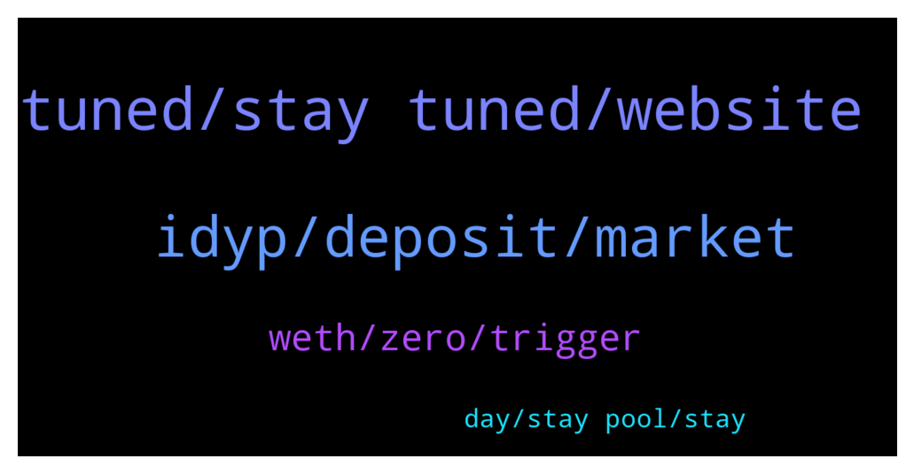

# **@dypfinance**
 ## Analysis for **2022-01-31** - **2022-02-01**.

---

## 📊 **Basic Stats**

**n_messages_sent**: 122

---

---

## 🔝 **Top keywords and related messages**

1. **tuned, stay tuned, website**

    @cryptolobster --- *Ne website design is on roadmap ? I think it would worth a lot   more people would come.  had already recommended DYP to others.  some didn't trust the thing because the website is not that appealingly high quality #nohate :)♥️* **--->** [TG Discussion](https://t.me/dypfinance/243810)

    @hemanrock --- *Please follow this post 🙌 and wait for results https://t.me/dypfinance/243726* **--->** [TG Discussion](https://t.me/dypfinance/243833)

    @brandom --- *i have a proposal for the group* **--->** [TG Discussion](https://t.me/dypfinance/243867)

    @cryptocade --- *The page is blank when I click on the bsc page.* **--->** [TG Discussion](https://t.me/dypfinance/243978)

    @Disguy125 --- *team needs to create some hype and tiktok insta influencers!!* **--->** [TG Discussion](https://t.me/dypfinance/243663)

    @Melvin --- *Why the approve button is not functioning? Want to approve WBNB* **--->** [TG Discussion](https://t.me/dypfinance/243966)

2. **idyp, deposit, market**

    @joesumn --- *Was the listing on a new CEX a lie? The rumour been going round since November and is it legal to buy 1 million of your own DYP if you know it’s about to get listed on a new exchange? Doesn’t particularly add up* **--->** [TG Discussion](https://t.me/dypfinance/243769)

    @timdyp --- *How to buy #DYP using #CoinbaseWallet👇 https://www.coinbase.com/how-to-buy/defi-yield-protocol* **--->** [TG Discussion](https://t.me/dypfinance/243993)

    @hemanrock --- *DYP is native token of Defi yield Protocol. both are different tokens. both can be increased or decreased.  iDYP you can read more about it from here  https://dypfinance.medium.com/the-new-contracts-and-idyp-token-snapshot-airdrop-and-community-allocation-760a2be599c* **--->** [TG Discussion](https://t.me/dypfinance/243682)

    @DhoniMSD516 --- *Yes you can stake DYP on ETH or BSC or AVAX chains https://dyp.finance/stakev2* **--->** [TG Discussion](https://t.me/dypfinance/243818)

    @DhoniMSD516 --- *iDYP is part of the new smart contracts strategies https://dypfinance.medium.com/the-new-contracts-and-idyp-token-snapshot-airdrop-and-community-allocation-760a2be599c* **--->** [TG Discussion](https://t.me/dypfinance/243932)

    @hodlergang --- *I wanted the ask can I deposit dyp to yield farm?  or can I deposit another asset and get rewards in dyp?  thank you 😊* **--->** [TG Discussion](https://t.me/dypfinance/243927)

3. **weth, zero, trigger**

    @DhoniMSD516 --- *The WETH balance updates if someone from pool triggers claim, this is why you can choose to wait for rewards to show or if you want to claim rewards you can just go ahead and claim* **--->** [TG Discussion](https://t.me/dypfinance/243795)

    @DhoniMSD516 --- *Yes it shows 0 ETH because rewards are paid in WETH, once your claim transaction is success you get WETH in your wallet* **--->** [TG Discussion](https://t.me/dypfinance/243784)

    @DhoniMSD516 --- *Hey rewards are allotted every 24H and for the rewards to showup someone or you should click claim  Claim is the trigger to show up rewards on dApp screen, on desktop you can hover on Rewards and see if it says feel free to execute then rewards are ready to be claimed, as ETH fees are high ppl generally claim once in a while and not daily* **--->** [TG Discussion](https://t.me/dypfinance/243782)

    @DhoniMSD516 --- *When you click claim and complete transaction you get rewards in WETH* **--->** [TG Discussion](https://t.me/dypfinance/243788)

    @DanielFraser --- *OK should the WETH rewards box show some rewards though because that's zero but the box next to it for DYP rewards is not zero.* **--->** [TG Discussion](https://t.me/dypfinance/243785)

    @DanielFraser --- *It says I can claim when hovering over the button but it shows zero ETH rewards to claim which I should have some over 2 days. I don't want to claim just now but wondering why I don't see any ETH to claim.* **--->** [TG Discussion](https://t.me/dypfinance/243783)

4. **day, stay pool, stay**

    @DanielFraser --- *I deposited into the locked 3 days ETH pool using USDC just over 2 days ago. I see I have some DYP rewards but no ETH. Do ETH rewards get added each day or is it after the lock period is over?* **--->** [TG Discussion](https://t.me/dypfinance/243781)

    @Barry --- *Can you guys raise APY in the 30 day pool as opposed to 3 day?* **--->** [TG Discussion](https://t.me/dypfinance/243749)

    @DanielFraser --- *OK thanks I will stay in the pool for now. Didn't want to lose tokens by withdrawing and having permanent loss due to the token price fluctuations.* **--->** [TG Discussion](https://t.me/dypfinance/243798)

    @DhoniMSD516 --- *Hey which pool you are looking for?* **--->** [TG Discussion](https://t.me/dypfinance/243964)

    @DanielFraser --- *OK that makes sense. I will wait a bit and see what happens. Also once the 3 days lock period ends can I stay in the pool without relocking or do I need to withdraw?* **--->** [TG Discussion](https://t.me/dypfinance/243796)

