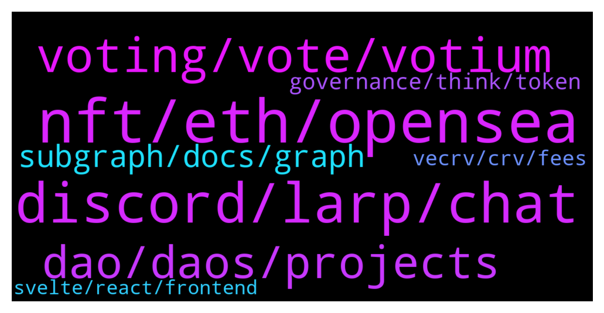

# **@lobsters_chat**
 ## Analysis for **2022-01-31** - **2022-02-01**.

---

## 📊 **Basic Stats**

**n_messages_sent**: 386

---

---

## 🔝 **Top keywords and related messages**

1. **nft, eth, opensea**

    @Ghost_Of_Projection --- *Total now is around 150k ETH, so prob around 5%?  https://dune.xyz/poma/tornado-cash_1* **--->** [TG Discussion](https://t.me/lobsters_chat/321869)

    @DrGorilla_md --- *I might be too naive, but are banks that competent - ie to raise a flag of “hey that nft project looks like bought only by bots on OS” 😅?* **--->** [TG Discussion](https://t.me/lobsters_chat/321859)

    @andrecronje --- *~8k in ETH withdrawal should be noticeable, even if split across a few wallets* **--->** [TG Discussion](https://t.me/lobsters_chat/321837)

    @twpks --- *Yes, but if you 100x an NFT with no market except for your bots there is no chance in hell a competent bank will accept those funds.* **--->** [TG Discussion](https://t.me/lobsters_chat/321850)

    @FredFa --- *what can u do with tainted coins ? don't get it* **--->** [TG Discussion](https://t.me/lobsters_chat/321845)

    @Figu3 --- *I'm probably the worst person to ask, I'm their competitor and we have 20x their TVL* **--->** [TG Discussion](https://t.me/lobsters_chat/322005)

2. **discord, larp, chat**

    @Eviln9ne --- *Hey guys, does anyone have some decentralized social media to recommend looking into?* **--->** [TG Discussion](https://t.me/lobsters_chat/321598)

    @alexpgc21 --- *Hey 👋   We re using our bot:  https://t.me/lobster_watcher  And also filtering such recommendations to select only topics worth attention.  ~5 people are in duty every day.* **--->** [TG Discussion](https://t.me/lobsters_chat/321712)

    @KeyedDepartment --- *who writes https://t.me/lobsters_daily ?  i love it and would like to know more about methodologies used (how many people are needed, how often do they review the chat, etc.)  i'd like to implement recaps like that for my communities and want to optimize it in the best way* **--->** [TG Discussion](https://t.me/lobsters_chat/321709)

    @Joel_john --- *hi admin @ivangbi pls dont ban me sir  https://twitter.com/joel_john95/status/1488430992310292484* **--->** [TG Discussion](https://t.me/lobsters_chat/321827)

    @Jecherio --- *there is  https://t.me/NFT_avenue so people like you can post without fear of getting banned.* **--->** [TG Discussion](https://t.me/lobsters_chat/321828)

    @van0k --- *https://rss3.io/#/ Came across this recently, although this is more like infra for distributed social media* **--->** [TG Discussion](https://t.me/lobsters_chat/321606)

3. **voting, vote, votium**

    @giganuke --- *What is the best voting protocol? (best tech currently)* **--->** [TG Discussion](https://t.me/lobsters_chat/321961)

    @banteg --- *voting with money is beyond dumb. the fact someone has 100x money doesn't mean they have 100x better judgement. on the contrary, after some point, they are probably checked out and too busy chilling.* **--->** [TG Discussion](https://t.me/lobsters_chat/321721)

    @SD107 --- *But the vote is "no" then they should give the keys to the community and leave, no control over treausury* **--->** [TG Discussion](https://t.me/lobsters_chat/321389)

    @clemensotto --- *"voter extractable value" sounds interesting. no idea if this concept has a chance though...* **--->** [TG Discussion](https://t.me/lobsters_chat/321987)

    @ivangbi --- *What model, voting with money? These are all money-making protocols wdym* **--->** [TG Discussion](https://t.me/lobsters_chat/321513)

    @justsomedeveloper --- *why do a vote in the first place then* **--->** [TG Discussion](https://t.me/lobsters_chat/321392)

4. **dao, daos, projects**

    @Swader --- *Been discussing something with a mate, wondering where this modern anti-DAO drive seems to come from: products like syndicate.io/clubs and more broadly treasuries like these wonderland thing etc.  Why did the ecosystem collectively move towards this ez-rug mode where share tokens are no longer used to govern by issuing collective decisions in a quadratic voting or positive turnout bias kind of way, but rather only signal so that the cartel of founders can maybe decide to listen to the community and execute how they vote?   Like… where did all the aragon / colony / daostack people go with their plans to have actual governable multisigs?* **--->** [TG Discussion](https://t.me/lobsters_chat/321636)

    @Sunny --- *DAOs would not exist if companies could legally create protocols in jurisdictions lol, they're a patchwork fill in the gap. Give them time and they will work but fuck right now if they're not unbelievably incompetent, shortsighted and idiotic. I remember reading a compound snapshot post resolving to require the developers to raise the price of a comp token to 2k. It passed. Unregistered securities need patchwork fixes otherwise the regulator shits on them from a great height* **--->** [TG Discussion](https://t.me/lobsters_chat/321458)

    @RobAnon --- *Depends on the DAO structure as well* **--->** [TG Discussion](https://t.me/lobsters_chat/321481)

    @SpikeSpiege1 --- *Dao=whales deciding.  The team usual reserves the right to over rule community by exercising their tokens so it's kind of a farce.* **--->** [TG Discussion](https://t.me/lobsters_chat/321460)

    @ivangbi --- *We didn’t resort to doing it because it feels constrictive yet benefits are opaque. The idea is cool, but it didn’t seem so trivial when it came to the details. Like, there is a reason why a DAO is not at governor alpha stage yet, which means it should probably be more flexibly before it becomes an issue. That is only concerning legit projects though, anon rugs should be as safe as they can be even at the cost of customization* **--->** [TG Discussion](https://t.me/lobsters_chat/321657)

    @nourharidy --- *"The DAO Era is coming to a halt" smh* **--->** [TG Discussion](https://t.me/lobsters_chat/321449)

5. **subgraph, docs, graph**

    @muditg --- *yea, did it a couple of weeks ago.* **--->** [TG Discussion](https://t.me/lobsters_chat/321994)

    @van0k --- *https://docs.snapshot.org/plugins/safesnap I don’t know the details either, it’s mentioned on the snapshot docs though* **--->** [TG Discussion](https://t.me/lobsters_chat/321654)

    @zhongfu --- *uniswap v3 subgraph? not sure if that'll work* **--->** [TG Discussion](https://t.me/lobsters_chat/321695)

    @DrGorilla_md --- *you can use graph queries for snapshots;) Tally (not yet shipped iirc) and Zodiac looks pretty cool too* **--->** [TG Discussion](https://t.me/lobsters_chat/321976)

    @xecordoteth --- *use the one that uniswap uses: https://thegraph.com/hosted-service/subgraph/ianlapham/arbitrum-minimal* **--->** [TG Discussion](https://t.me/lobsters_chat/321718)

    @xecordoteth --- *you are using a non-official one* **--->** [TG Discussion](https://t.me/lobsters_chat/321717)

6. **governance, think, token**

    @ivangbi --- *Can you go do some work again @banteg. Do the wind down but inatead give them Yearn LP tokens so some might stay and just yield, some might withdraw haha* **--->** [TG Discussion](https://t.me/lobsters_chat/321407)

    @Sunny --- *Yeah its decentralization theatre that gives janet yellen ammo to go and regulate us to a dark corner of the internet. Bring on soulbound governance* **--->** [TG Discussion](https://t.me/lobsters_chat/321462)

    @limfx8 --- *Would be interesting to propose an independent third party to conduct an orderly wind down* **--->** [TG Discussion](https://t.me/lobsters_chat/321406)

    @banteg --- *idk, do you think small traders sit on governance forums? i think it's accurate if you think of it as a mental model.* **--->** [TG Discussion](https://t.me/lobsters_chat/321733)

    @bout3fiddy --- *I think the is shareholder model of governance is broken/outdated. I guess it is borrowed from tradfi?* **--->** [TG Discussion](https://t.me/lobsters_chat/321511)

    @SD107 --- *I wouldn't give the current team any control over the treasury in any way, nit even to "unwind"* **--->** [TG Discussion](https://t.me/lobsters_chat/321398)

7. **vecrv, crv, fees**

    @garydefi --- *If all value accrued to veCRV + it kept its governance powers  Currently, veCRV admin fees accrue 50% of platform fees  What if they accrued 100% of fees, and CRV accrued none?* **--->** [TG Discussion](https://t.me/lobsters_chat/321565)

    @van0k --- *It’s split 50/50 between veCRV and LPs afaik, giving all of that to veCRV means LPs are rekt. Unless you want to make CRV issuance the entire LP business model, in which case everyone is rekt.* **--->** [TG Discussion](https://t.me/lobsters_chat/321575)

    @garydefi --- *What if veCRV holders rather had to declare T time before they could exchange back to CRV, at which point vote power went to 0, instead of the global vote power decay function? Would that also work? What T?* **--->** [TG Discussion](https://t.me/lobsters_chat/321584)

    @godefi --- *What do you mean by, buy the position? veCRV isn't transferrable, right?  What value does the CRV token accrue? Half the dex fees? Anything else? Admin fees take the other half for veCRV holders, right?* **--->** [TG Discussion](https://t.me/lobsters_chat/321432)

    @van0k --- *This is irrelevant to governance attacks though - the attacker in this particular threat model just wants to get a lot of CRV, snipe a proposal, and then sell CRV back as fast as they can. They don’t care about long-term CRV or veCRV yield.* **--->** [TG Discussion](https://t.me/lobsters_chat/321568)

    @garydefi --- *What if veCRV holders earned all the fees and CRV was only a way to get veCRV?* **--->** [TG Discussion](https://t.me/lobsters_chat/321553)

