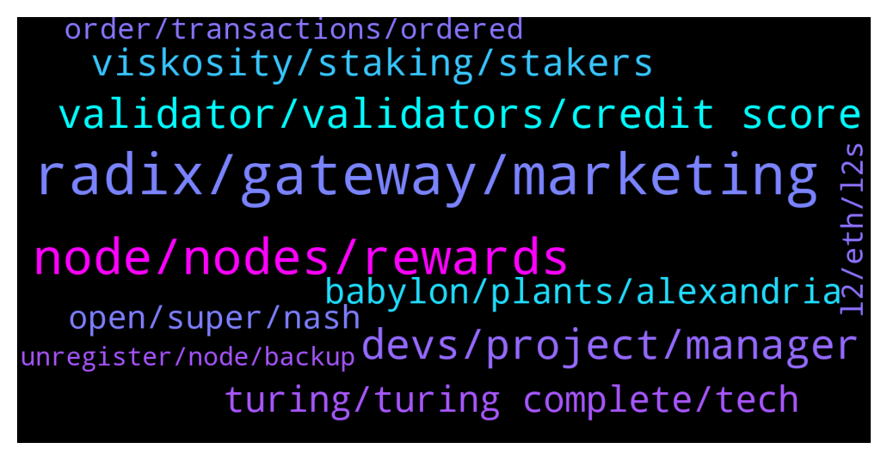

# **@radix_dlt**
 ## Analysis for **2022-01-31** - **2022-02-01**.

---

## 📊 **Basic Stats**

**n_messages_sent**: 949

---

---

## 🔝 **Top keywords and related messages**

1. **radix, gateway, marketing**

    @Tom --- *It was kind of a joke bro. But having industry veterans in the team would not hurt for sure. Many people here don‘t understand that radix builds on top of existing concepts, that‘s all.* **--->** [TG Discussion](https://t.me/radix_dlt/349072)

    @tesslerc --- *I'll be brutally honest here. Biggest confusion, especially talking as a long time follower of Radix, is why amazing progress isn't shared.  We're at a stage in the project where there isn't a lot of fancy stuff to share and Dan has been delivering amazing results which official marketing is totally ignoring. Instead of using this material or helping it look "better" from a marketing POV, it's just "dismissed".  So instead of using this material to show Radix is alive, we look from the outside kinda dead.* **--->** [TG Discussion](https://t.me/radix_dlt/348665)

    @pspk_janasena --- *An excerpt from one of the devs of ethereum - Radix please save us  It is becoming an impossibility to operate the way we originally intended on Ethereum. We designed the protocol(dapp) the way we wanted it to work, but gas fees disrupt the business model. Ethereum is too expensive to operate intricate systems with many functions like ours. Our contracts are too many, too complex, and too large; it will work beautifully on other chains, just not Ethereum.* **--->** [TG Discussion](https://t.me/radix_dlt/348699)

    @Tom --- *That‘s not production. Introduce malicious nodes, introduce slow, fcked up nodes etc. As far as I remember, earlier radix iterations were shelved bcuz one dude with a shit connection joined, which caused unfixable issues* **--->** [TG Discussion](https://t.me/radix_dlt/349033)

    @Jacob_XRD --- *Basically we need to be careful that Radix Labs work, and Radix road map work isn't confused. Dans work is purely research, and may not form any part of RDX Works development in the future. If we market it heavily it can cause confusion on what we are delivering.* **--->** [TG Discussion](https://t.me/radix_dlt/348649)

    @Jazzer9F --- *Excellent article from Coin Telegraph highlighting the current issues faced by Solidity developers, and detailing how Radix will give developers the power to build quickly, securely, and know that scale will never be a bottleneck!  https://cointelegraph.com/news/watch-out-solidity-new-project-aims-to-tackle-downsides-of-coding-defi-projects* **--->** [TG Discussion](https://t.me/radix_dlt/349334)

2. **node, nodes, rewards**

    @tesslerc --- *Foundation nodes have 1.7% of the total stake, each. So if one goes down it's not ideal but much better than the top-10 nodes sitting over 2% and the top-3 at over 3% each.* **--->** [TG Discussion](https://t.me/radix_dlt/349484)

    @tesslerc --- *Ideally you'd want the amount of rewards a node receives to grow non-linearly with the % of total stake. That way you're incentivized to stake with smaller nodes more than with larger ones.  But then in a way the protocol pushes you towards staking with smaller nodes regardless of whether they are trustful or not.* **--->** [TG Discussion](https://t.me/radix_dlt/349496)

    @propeterly --- *When you own 1 million XRD, you get ~10k from staking a month. Why not run a node for free then? I would do it.* **--->** [TG Discussion](https://t.me/radix_dlt/349617)

    @PeterFATAss --- *Where can I see my staking rewards in the wallet??* **--->** [TG Discussion](https://t.me/radix_dlt/349598)

    @PeterFATAss --- *I don't understand why people are staking at delegators with higher fees* **--->** [TG Discussion](https://t.me/radix_dlt/349612)

    @Avaunt --- *It's a global setting so not really. Intrigued why you wouldn't want your rewards to be compounding?* **--->** [TG Discussion](https://t.me/radix_dlt/349718)

3. **devs, project, manager**

    @Tom --- *Hire more devs, as simple as that* **--->** [TG Discussion](https://t.me/radix_dlt/348916)

    @Tom --- *If you are adding more devs to your projects and this does not speed up the project much, and almost proportionally (after the new devs had time to get to know everything) , then you probably are not as great a project manager as you think you are.* **--->** [TG Discussion](https://t.me/radix_dlt/349253)

    @Tom --- *Do you have experience in project management, or are you guessing? Obviously it‘s hard. Getting the talent (devs) getting them up to speed etc. It takes time and is expensive. Especially getting the project managers for a team is also difficult. They are the most important part imo.* **--->** [TG Discussion](https://t.me/radix_dlt/348948)

    @Tom --- *The devs usually only see and really understand parts or certain features of the codebase, they usually never completely understand the full project, that‘s why just letting them do what they want is usually not the best way in my experience, especially if they are working on features which depend on each other. An orchestrator (project manager) with the big picture in his mind is absolutely necessary and more important than any dev imo.* **--->** [TG Discussion](https://t.me/radix_dlt/349276)

    @ashley_tele --- *We've found the best devs are happiest when given the autonomy and scope to operate in their own space and make the decisions they think needs to be made. More senior the dev the more scope they get. Give them features / modules / sizeable chunks of code / apps / libraries / whatever to own and let them get to work. A project manager or TL or manager micromanaging on a daily or sometimes even weekly basis will just make them angry and they'll leave. If the dev make decisions that are not in the best interest of the company or wrong or anything else then it's reflected in their perf. When devs are asked what they want and value, one of the most common responses is autonomy* **--->** [TG Discussion](https://t.me/radix_dlt/349268)

    @ashley_tele --- *Without doxxing anything about myself, I have over 2 decades of experience in r&d in both hardware and software, with around 1/3 being a team leader, in both product dev and agile feature based dev. Everything in my experience disagrees with you. The company I work in which aggressively performance manages and is in the top of its industry disagrees with you. Admittedly this is an appeal to authority but what you’re saying smacks of consultant speak and isn’t grounded in reality imho. Agree to disagree I guess.* **--->** [TG Discussion](https://t.me/radix_dlt/349243)

4. **validator, validators, credit score**

    @iBelly --- *I don't know either...I'm not even sure if it's an issue, maybe everything is working as intended...but seems weird to me that 1 validator can slow down the entire network and mean everyone gets less staking rewards even if you arn't staking to that particular validator...* **--->** [TG Discussion](https://t.me/radix_dlt/348876)

    @Mik3ology --- *The counter argument is that people stake within the top 10 or 0% fee validators regardless of whether or not they're trustful.  I would suggest a  2% emmisions cap per validator. Any emmisions over 2% of total network emmisions for the epoch are burnt.  Just an idea, no idea if this would be possible or what security edge cases would bring* **--->** [TG Discussion](https://t.me/radix_dlt/349584)

    @Shang En --- *Oh hope they give a decent answer. I don’t want to wait another 14 days to change my validator lol* **--->** [TG Discussion](https://t.me/radix_dlt/348850)

    @Alex --- *I mean the issue there is simple and will only be resolved with Xi‘an really. As long as only the top 100 Validators receive compensation and unstaking takes 2weeks, people are scared to stake on the bottom 50 of the top 100 validators, since they fear that their validator may end up not being in the top 100 anymore after a marketing push of a new node through NFTs or whatsoever and don’t want to miss out on staking rewards while unstaking. So the obvious choice is to go safe and choose the top 50 validators. The thought behind is, why should I stake below and risk it and not someone else…* **--->** [TG Discussion](https://t.me/radix_dlt/349489)

    @Ee09Vee --- *Oh so you can not accept more validators at the moment?* **--->** [TG Discussion](https://t.me/radix_dlt/348486)

    @iBelly --- *So 1 validator goes down and it has a big impact on the whole network?* **--->** [TG Discussion](https://t.me/radix_dlt/348859)

5. **viskosity, staking, stakers**

    @CrypViskosity --- *Dear Radix community, the issue with Viskosity Staking’s node has been solved!!! 🎉🚀 The team began troubleshooting last night and went until 2:30am, then again this morning. We would like to send a special shout out to Shambu from Radix 👏🙏 he spent 3 hrs on a conference call solving the problem. His dedication and brilliance was amazing and represents the passion that we have felt from ALL members of the team since we invested in this project many years ago. To highlight our dedication we will be reimbursing the lost emission rewards to those who staked to our node from an allocation of 10,000 XRD as previously mentioned. More details will come to follow. Currently the node is in “Syncing” status, and we hope this this gesture of good will of reimbursement will reflect our dedication to this project. -Viskosity Staking* **--->** [TG Discussion](https://t.me/radix_dlt/349746)

    @CrypViskosity --- *Dear Radix community, thank you to all who reached out to alert us of the issue with our Viskosity Staking node. Our team is largely based in the United States in the Northeast, we got hit by a bad blizzard over the weekend and have only been able to start troubleshooting for the last 6 hours. We have decided to allocate 10,000 XRD to compensate our stakers based on % of total staked. We hope to have the node running by 2/1/2022, and we don’t want to see anybody penalized for the downtime. By being compensated by the 10,000 XRD it should make up for the downtime, and certainly will be more profitable than the penalty faced by unstaking and missing 500 epochs. We will keep you updated on our progress and after the node is up and running, distribution of XRD will take place over the following week. We hope you choose to stick with us in the future. May the staking rewards be with you 💪* **--->** [TG Discussion](https://t.me/radix_dlt/349363)

    @Blind5ight --- *The only thing at risk are your future rewards: https://learn.radixdlt.com/article/what-happens-to-my-tokens-when-i-stake-them-could-the-node-i-delegate-to-steal-them Your delegated stake is not at risk* **--->** [TG Discussion](https://t.me/radix_dlt/349140)

    @Radstakes --- *where did I say they were obligated to compensate others?  The fact is they have chosen to compensate their own stakers, where as every staker has suffered as a result.  This is just a statement of fact.* **--->** [TG Discussion](https://t.me/radix_dlt/349463)

    @korone_stan --- *my understanding is that if enough people unstake from viskocity and they fall out of the top 100, then they won't receive rewards anymore either, right? so that is a risk to a delegator to consider as well, if they choose to remain staked there* **--->** [TG Discussion](https://t.me/radix_dlt/349607)

    @Wekkel --- *I can't follow the following reasoning "Every staker is affected by this yet only Viskosity stakers will be compensated". Every staker simply endures what the code results in. It was preset from the start. Why would Viskosity be obliged to compensate other stakers from other nodes?* **--->** [TG Discussion](https://t.me/radix_dlt/349462)

6. **turing, turing complete, tech**

    @Tom --- *Thats not how it works in the IT industry* **--->** [TG Discussion](https://t.me/radix_dlt/348928)

    @eosadmin --- *The UTXO is the thing I see as different but other than that it's DPoS sharding right, or am I missing something* **--->** [TG Discussion](https://t.me/radix_dlt/349207)

    @Radstakes --- *The hardware requirements will be significantly lower than other networks too - even a Raspberry Pi will be able to validate and earn emissions.* **--->** [TG Discussion](https://t.me/radix_dlt/348478)

    @Magal36 --- *It's currently DPoS, yes, but it's actually a revolutionary Consensus that will deliver unlimited scalability in 2023.* **--->** [TG Discussion](https://t.me/radix_dlt/349195)

    @mx471 --- *First they would have to find a solution and then to build a network based on it* **--->** [TG Discussion](https://t.me/radix_dlt/348696)

    @saeglopur10 --- *Just need to see the adoption, the best tech doesnt always win. I hope it does though!* **--->** [TG Discussion](https://t.me/radix_dlt/348789)

7. **babylon, plants, alexandria**

    @Jacob_XRD --- *Sorry to jump in here, but we all agreed to refer Babylon as Babs from now on* **--->** [TG Discussion](https://t.me/radix_dlt/348967)

    @CornAF --- *is there a date for babylon?* **--->** [TG Discussion](https://t.me/radix_dlt/348759)

    @Blind5ight --- *Are you seriously asking "wen Babylon" when we're hours away from Alexandria release? 😂  As we've said, we're not even considering providing a better estimate of Babylon delivery until we've gotten through a good quarter of post-Alexandria work on Babylon when we have a much clearer idea of what is involved. It's not like we secretly have a well-estimated schedule... we have to actually *do some work* before we know. Currently our guess is toward the end of next year, but it's still very much up in the air.* **--->** [TG Discussion](https://t.me/radix_dlt/348507)

    @NotBen --- *We should hire octomom to develop babylon* **--->** [TG Discussion](https://t.me/radix_dlt/349021)

    @iBelly --- *No...I'm saying the purpose of Alexandria is to test and figure out problems like this...and fix them before Babs* **--->** [TG Discussion](https://t.me/radix_dlt/348866)

    @far_idk --- *When babylon sir, est ? Q1, Q2, Q3, Q4??* **--->** [TG Discussion](https://t.me/radix_dlt/348605)

8. **open, super, nash**

    @TheWoodsman --- *I wonder what the play is there. They don't want a fight where they have to compete with a decentralised, open metaverse? Instead they want an open source world where they are free to monetise and monopolise attention? 🤔* **--->** [TG Discussion](https://t.me/radix_dlt/349162)

    @ITProfligate --- *Oh I don’t see anything noble in it at all. I find the very idea of FB Metaverse uterly repugnant. It is a very dangerous move which is an attempt to monetise people in their very essence. Governments complain about the existing crypto world while only having an arms length relationship to it so not having any understanding. Meanwhile it is perfectly OK for a huge corporation to create fictitious meta worlds that suck on people’s imaginations and basic feelings, and btw also pays as little tax as possible. So Meta will come along with virtual glasses into low income people’s worlds who live in tight conditions and offer them to purchase huge properties they can enjoy in the game verse. Meanwhile the super computer maps their every move. It is utterly dystopic.* **--->** [TG Discussion](https://t.me/radix_dlt/349184)

    @ITProfligate --- *@TheWoodsman  Yes, this is what I think. This must be true since there would be such a powerful supercomputer behind it which can analyse all the data (preferences) produced. Now I have something to share. I’m a psychotherapist (I have also worked in IT too) and the main reason I don’t have my name here is more todo with how it went on Twitter, since it would be unethical in my opinion for people I see or might see and find my interest in crypto if they did a search on me. However, the “real me” did run a conference in September 2019 broadly on the influence of AI in this field. “Psychotherapy and Ethics: Ideas for Our Time “ Could have been better and, well, certainly nothing about crypto or big data if it comes to that.* **--->** [TG Discussion](https://t.me/radix_dlt/349188)

    @mx471 --- *Facebook simply wants to capture the entire human personality, and not just on the browser and smartphone. I could imagine that every action you make in the metaverse will be analyzed in detail.  I don't think Facebook will have even one good intention.* **--->** [TG Discussion](https://t.me/radix_dlt/349185)

    @Kafkafrate --- *They have the users already, it's easy to sell them some open source wrapped in FB branding. Users are lazy and many clueless and for the sake of convenience would let fb hold their wallet keys* **--->** [TG Discussion](https://t.me/radix_dlt/349165)

    @chrisijoyah --- *"The metaverse should be more interoperable and open than any computing platform before. Meta is proud to join the Crypto Open Patent Alliance to make our crypto patents available for anyone to use so we can all build this future together."— Mark Zuckerberg 👀* **--->** [TG Discussion](https://t.me/radix_dlt/349159)

9. **l2, eth, l2s**

    @rmf55 --- *The question I always think of when I see ETH maxis on CT talking about how great L2, modular chains, rollups, etc, are is "Would you be saying this if ETH had been able to scale its L1?"    it's a rhetorical question really because the answer is pretty obviously no. A scalable L1 is the solution, adding L2's (even now talking about L3 😂) is nothing more than a workaround because they failed to solve the problem and now have big bags to protect.* **--->** [TG Discussion](https://t.me/radix_dlt/348777)

    @NotBen --- *which is insane because if the L2s work as claimed, there is minimal reason for the L1 coin to grow in value or even retain its value* **--->** [TG Discussion](https://t.me/radix_dlt/348782)

    @pspk_janasena --- *They are trying to migrate/offload some of the functionality to L2 / polygon just to  avoid the pain of Gas fees* **--->** [TG Discussion](https://t.me/radix_dlt/348703)

    @NotBen --- *Sure. But from what we have seen in the last 6 months, other L1s and L2s are farther from the solution than they have claimed* **--->** [TG Discussion](https://t.me/radix_dlt/348801)

    @NotBen --- *IMO L2s will not work as claimed. My point here is that even if they do, eth maxis think it will keep pumping their bags but it wont* **--->** [TG Discussion](https://t.me/radix_dlt/348784)

    @ITProfligate --- *Coming in late. I think the idea of L3 is L2, L3, L4… iterating on L2. Although why quite I’m unsure. I think it would be scaling.  So a particular L2 is highly scalable in some dimensions and within that same L2.  There are cross L2 L2 solutions too.  I don’t know the important details of any of this, eg what scales in one L2 or the compatibility as well as ac finality across different L2s.  I do know, looking at Starkware that it isn’t really permissionless or decentralised. It actually offers a strange IMHO self contradictory license to use.  Does any of this matter? The answer must be yes.  They will scale up plenty to absorb imminent anticipated usage need.  That will undercut the value of ETH since fewer txs on it cf @TaschaLabs on this.  Tasch thinks this favours other L1s but I would have to read again as I don’t follow her reasoning.  One central issue is how security is maintained on an L2.  Other L1s are PoS. I’m unclear of the relationship between ETH1 ETH2 PoS security token value and L2s* **--->** [TG Discussion](https://t.me/radix_dlt/349242)

10. **order, transactions, ordered**

    @NotBen --- *No. The network orders related transactions* **--->** [TG Discussion](https://t.me/radix_dlt/349235)

    @NotBen --- *There is time stamping. But the network doesnt need to know the precise order within milliseconds* **--->** [TG Discussion](https://t.me/radix_dlt/349231)

    @eosadmin --- *How will my dapp know the order if there is no time stamping* **--->** [TG Discussion](https://t.me/radix_dlt/349229)

    @eosadmin --- *Couldn't that present issues especially with DeFi that is time and order sensitive* **--->** [TG Discussion](https://t.me/radix_dlt/349233)

    @Blind5ight --- *Not if you don’t send in stablecoins or fiat iirc* **--->** [TG Discussion](https://t.me/radix_dlt/348550)

    @eosadmin --- *What you are suggesting if my undertsnading is correct transaction can appear as though they happened at the same time* **--->** [TG Discussion](https://t.me/radix_dlt/349230)

