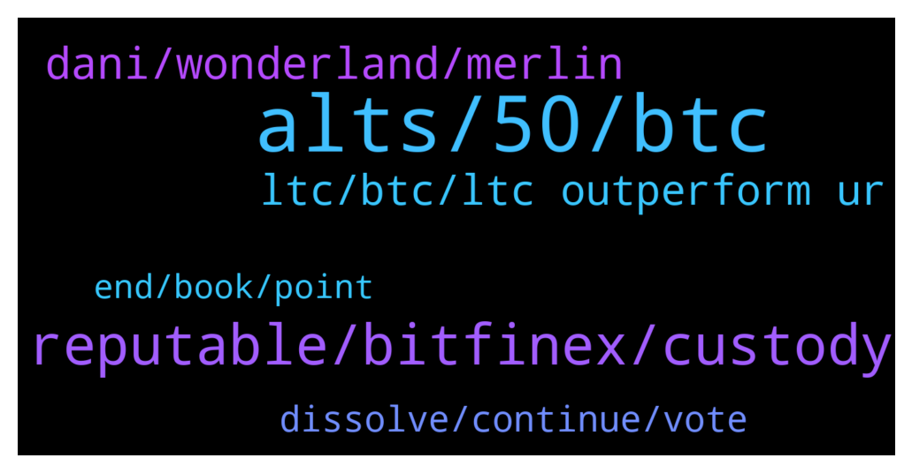

# **@shitpool**
 ## Analysis for **2022-01-31** - **2022-02-01**.

---

## 📊 **Basic Stats**

**n_messages_sent**: 147

---

---

## 🔝 **Top keywords and related messages**

1. **alts, 50, btc**

    @kekurikekukaka --- *Why are EOS and XRP not at 1000$ yet ?* **--->** [TG Discussion](https://t.me/shitpool/721946)

    @tdotballing --- *Are people actually making tons of money on all these nft drops? I keep seeing on Instagram basically copy pastes of bored apes with different animals like bulls and goats and the channels claiming ppl bought them for like 800 and then sell for 300k. Is this actually happening or is it just like wash trading and the channels hyping them up* **--->** [TG Discussion](https://t.me/shitpool/721970)

    @Moon --- *Just hodl it down to 4 cents again 😉* **--->** [TG Discussion](https://t.me/shitpool/722044)

    @da0man --- *Then exchange listings and another 50% from that.* **--->** [TG Discussion](https://t.me/shitpool/722067)

    @onchainjoe --- *stupidest move.. this is the planned monthly escrow unlock. literally nothing to see here* **--->** [TG Discussion](https://t.me/shitpool/722246)

    @Moon --- *I bought on 10 almost -50* **--->** [TG Discussion](https://t.me/shitpool/722016)

2. **reputable, bitfinex, custody**

    @MoneroPal --- *Any jabronis here work for reputable firms like BitGo, Gemini, CoinBase, Bitcoin Suisse, NYdig?* **--->** [TG Discussion](https://t.me/shitpool/722069)

    @Moon --- *How is bitcoin suisse a reputable anything? 🤣 with all those turks and indians working there another swiss quality rugpull like shitfinity 🤣🤣🤣* **--->** [TG Discussion](https://t.me/shitpool/722072)

    @arbullz --- *there is a long distance between things being scams and centralized and it going to 0.. you know how things can pump out of the blue and with no fundamental reason whatsoever* **--->** [TG Discussion](https://t.me/shitpool/722033)

    @MoneroPal --- *I’m not attempting to go back and forth over which exchange is ones preferred. These are all companies with massive investment and fundmentals. That is all that is really being discussed. The worlds largest institutions utilize them.* **--->** [TG Discussion](https://t.me/shitpool/722104)

    @MoneroPal --- *I see some Turks, but they’re mostly German turks with TradeFi experience. Not sure I see a connection with seedy Turkish money launderers or other scammers here* **--->** [TG Discussion](https://t.me/shitpool/722220)

    @MoneroPal --- *How is it not reputable? Largest and first public crypto currency exchange based in the US; the most regulated jursidiction in the world and arguably the safest for investors.* **--->** [TG Discussion](https://t.me/shitpool/722103)

3. **dani, wonderland, merlin**

    @OxZilla --- *I don’t think merlin is dani* **--->** [TG Discussion](https://t.me/shitpool/722169)

    @pizza_dog --- *Looks like the wonderland saga is going to continue with Dani just straight up ignoring the community vote to continue under new management and he’s just going to take the hundreds of mill* **--->** [TG Discussion](https://t.me/shitpool/722018)

    @MoneroPal --- *nah, not this project, zero chance, there are way too many other distractions right now the nodes and all the forks of nodes, nobody is going to put anything into Wonderland no matter how the clown Daniele and his gang spin it* **--->** [TG Discussion](https://t.me/shitpool/722034)

    @MoneroPal --- *There is zero upside, the entire frog nation is a gang of total idiots, it’s never going to recover, it should be dissolved as it was voted to be. As mentioned DAO’s are bullshit, wallet, domain, hosting, dns, all in the hands of a few, in the case of Wonderland a supposedly doxxed team ended up being a gigafraud not to mention there are at least 30 other people that are undoxxed behind the scenes. Dani is the puppet in all of this.* **--->** [TG Discussion](https://t.me/shitpool/722031)

    @MoneroPal --- *This is comedy its all over Twitter he is mad and is just blaming it all on 3rd persons (shorters, attackers, haters)* **--->** [TG Discussion](https://t.me/shitpool/722132)

    @Alwayscooked --- *Is the guy who lumped into GLMR still here?* **--->** [TG Discussion](https://t.me/shitpool/722011)

4. **ltc, btc, ltc outperform ur**

    @besselBeat --- *LTC MWeb is become. Activation could happen within 2 weeks. Arrize Chikun* **--->** [TG Discussion](https://t.me/shitpool/722243)

    @IsmailOtis --- *Inversed ltcbtc chart is on a years long ascending wedge. Must be nothing.* **--->** [TG Discussion](https://t.me/shitpool/722114)

    @da0man --- *LTC so slow instead of being the testnet for new features, now they implement them after a year* **--->** [TG Discussion](https://t.me/shitpool/722085)

    @MoneroPal --- *So what, LTC won’t pump, lol* **--->** [TG Discussion](https://t.me/shitpool/722294)

    @IsmailOtis --- *Ofc, fully in ltc bc why not* **--->** [TG Discussion](https://t.me/shitpool/722089)

    @da0man --- *Don’t fud LTC it will outperform all of ur portfolios* **--->** [TG Discussion](https://t.me/shitpool/721956)

5. **dissolve, continue, vote**

    @pizza_dog --- *he was pushing the dissolve narrative pretty hard* **--->** [TG Discussion](https://t.me/shitpool/722150)

    @pizza_dog --- *the vote was to dissolve it or keep it going. Yes for dissolve no for continue* **--->** [TG Discussion](https://t.me/shitpool/722148)

    @pizza_dog --- *he's calling it a failed experiment* **--->** [TG Discussion](https://t.me/shitpool/722147)

    @pizza_dog --- *he's straight up just ignoring the vote* **--->** [TG Discussion](https://t.me/shitpool/722141)

    @MoneroPal --- *There is nothing to continue the project is finished it’s never going to recover* **--->** [TG Discussion](https://t.me/shitpool/722149)

    @MoneroPal --- *The vote was to dissolve it I thought? He wants to continue it, no?* **--->** [TG Discussion](https://t.me/shitpool/722144)

6. **end, book, point**

    @MoneroPal --- *End of the world as we know it ser* **--->** [TG Discussion](https://t.me/shitpool/722314)

    @onchainjoe --- *book and movie are so sad 😭* **--->** [TG Discussion](https://t.me/shitpool/722232)

    @MoneroPal --- *eh this shit too just has to end at some point it’s so repetitive and without any purpose lol* **--->** [TG Discussion](https://t.me/shitpool/722157)

    @pizza_dog --- *doge to the moon i guess* **--->** [TG Discussion](https://t.me/shitpool/722156)

    @Rjknew --- *Lol I was just thinking this* **--->** [TG Discussion](https://t.me/shitpool/722012)

    @gonubie --- *i think there’s definitely more to come out of this whole thing* **--->** [TG Discussion](https://t.me/shitpool/722178)

