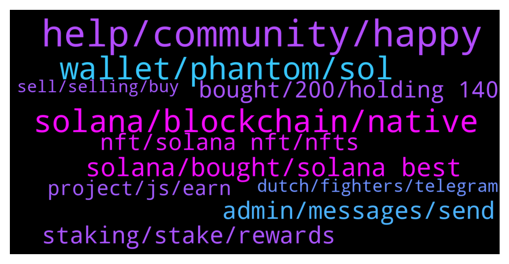

# **@solana**
 ## Analysis for **2022-01-31** - **2022-02-01**.

---

## 📊 **Basic Stats**

**n_messages_sent**: 352

---

---

## 🔝 **Top keywords and related messages**

1. **help, community, happy**

    @RealPrinceOla --- *There is a tag close to my name 😉* **--->** [TG Discussion](https://t.me/solana/926426)

    @mahib45 --- *Hello 👋  Thank you! Tell your friend to join again!* **--->** [TG Discussion](https://t.me/solana/926376)

    @mahib45 --- *Hello 👋  How may we help you?* **--->** [TG Discussion](https://t.me/solana/927722)

    @Danieleea --- *A special day and Sol is green 😍 Happy Birthday Boss* **--->** [TG Discussion](https://t.me/solana/926153)

    @Monterrey_Rice --- *everyone wish @mahib45 a Happy Birthday!!!!* **--->** [TG Discussion](https://t.me/solana/926141)

    @Monterrey_Rice --- *Sure! You can always check here too: https://status.solana.com/* **--->** [TG Discussion](https://t.me/solana/926209)

2. **solana, blockchain, native**

    @sunsetjesus0 --- *is there any solana dev, I have some basic questions* **--->** [TG Discussion](https://t.me/solana/927688)

    @CryptoAirck --- *So what's good area to find jobs using Solana* **--->** [TG Discussion](https://t.me/solana/927424)

    @nixanu --- *Can you guide me with a link or something? I am interested in Solana and I don t want to get scammed* **--->** [TG Discussion](https://t.me/solana/925776)

    @sunsetjesus0 --- *Is there any dev group for solana?* **--->** [TG Discussion](https://t.me/solana/927640)

    @chinyere01 --- *please  I need Solana  contract  address.* **--->** [TG Discussion](https://t.me/solana/925660)

    @mahib45 --- *Hello!  Mainnet is launched! It was launched in March 2020 and is successfully working and updating, (done billion transactions already) as well as getting new functions. For your understanding - Yes, we were first calling it beta because it was just launched and not every function was available.   We will keep the suffix "beta" for a year or so because we want to check the mainnet stability in long term and make sure we have a great product. But it's a working network.* **--->** [TG Discussion](https://t.me/solana/927728)

3. **wallet, phantom, sol**

    @Kulmie --- *The Solana explore shows that I have 268 Sol  the I created the Solana wallet  called sollet  in order to add manually,  but iam getting  an error* **--->** [TG Discussion](https://t.me/solana/926431)

    @thenoseycrow --- *Hi. Can anybody help with missing SOL that I sent from Phantom to KuCoin? KuCoin are not helping at all and Solscan shows all completed* **--->** [TG Discussion](https://t.me/solana/926169)

    @humpherylut --- *Hello I have issue with my wallet* **--->** [TG Discussion](https://t.me/solana/926302)

    @RealPrinceOla --- *Try to send small SOL into the wallet before minting wallet address. Minting requires little SOL as fee.* **--->** [TG Discussion](https://t.me/solana/926457)

    @Kulmie --- *I was checking the status of migration..it has been done successfully.. I checked on Solana explore to see how many Solana coins I have, it is almost 269 Solano. I created a Solano account called sollett in order to add  sollet wallet manually like this : 1. Minted contract address .2.name(Solano) 3. Sol. i followed instructions But I am getting an error. I don't know why?    it shows the solana explore that  i have 269 sol after kin token was minted... but how can i transfer to my new solana wallet" sollet wallet" in order to hold it or to sell in future?* **--->** [TG Discussion](https://t.me/solana/926453)

    @Wen --- *Hello thank you what hard wallet can we carry sol on ?* **--->** [TG Discussion](https://t.me/solana/925820)

4. **solana, bought, solana best**

    @ashfoleywtf --- *I bought solana last decmeber, shouldve bought by this time tho!* **--->** [TG Discussion](https://t.me/solana/927310)

    @Kareemelazab --- *It will get worse with the solana token blowing up now* **--->** [TG Discussion](https://t.me/solana/927250)

    @katryv --- *how do you surf when solana's always down* **--->** [TG Discussion](https://t.me/solana/926380)

    @G_McC --- *I lost all my Solana when the network last crashed. WTF!* **--->** [TG Discussion](https://t.me/solana/924995)

    @Kbs --- *I cud bought as many as double solana with same amount.. So its a big loss* **--->** [TG Discussion](https://t.me/solana/926618)

    @CrappyCrypto --- *Does anyone know why Solana is skyrocketing in these last days?* **--->** [TG Discussion](https://t.me/solana/927215)

5. **admin, messages, send**

    @McNicholas --- *Well spotted, I have removed them! Do let an admin know if you see activity like this and we'll take care of it :)* **--->** [TG Discussion](https://t.me/solana/925786)

    @viXll90 --- *Wanted to show screenshot of messages by @ChloeAbegnale. She is asking people to send her 21usdt* **--->** [TG Discussion](https://t.me/solana/926922)

    @viXll90 --- *That @ChloeAbegnale is asking me to send her $21. Admins inbox me. I have screenshot of her messages* **--->** [TG Discussion](https://t.me/solana/926915)

    @The_Cryptionian --- *Oh ur an admin haha. Wanted to reply with a gif* **--->** [TG Discussion](https://t.me/solana/927475)

    @mahib45 --- *Please explain your issue here! Always remember that Admin won't PM first ❤* **--->** [TG Discussion](https://t.me/solana/926315)

    @senalj0 --- *No no pleaase select me admin* **--->** [TG Discussion](https://t.me/solana/924877)

6. **staking, stake, rewards**

    @R --- *Can you stake SOL using trust wallet?* **--->** [TG Discussion](https://t.me/solana/927009)

    @Seba --- *what is max apr for staking SOL ?* **--->** [TG Discussion](https://t.me/solana/927017)

    @Eddyblow --- *Thanks . Is staking same as providing liquidity ?* **--->** [TG Discussion](https://t.me/solana/926145)

    @pravin_333 --- *Are folks using everstake in phantom wallet for staking? Heard they are also based off Ukraine, anyone worried about war issues impacting everstake?* **--->** [TG Discussion](https://t.me/solana/926498)

    @KasyWillss --- *Atomicwallet supports SOL staking I suppose.* **--->** [TG Discussion](https://t.me/solana/926722)

    @marcooo_98 --- *Someone use phantom wallet to store his Solana?And what are the best validators to stake at the moment?* **--->** [TG Discussion](https://t.me/solana/926206)

7. **nft, solana nft, nfts**

    @kraytos1 --- *Any tips of getting into solana nfts?* **--->** [TG Discussion](https://t.me/solana/927231)

    @fumipurio --- *sorana official sent present NFT to my wallrt this Official Solana NFT Launch | Only 1500 NFTs! Anatoly YakovenkoJanuary 28, 2022  it was real?* **--->** [TG Discussion](https://t.me/solana/924973)

    @mahib45 --- *you can try Solana nft marketplace  https://t.me/solana/895277* **--->** [TG Discussion](https://t.me/solana/927518)

    @KryptoKuhn --- *Where ist the best to go nft market Solana ?* **--->** [TG Discussion](https://t.me/solana/927513)

    @genuinedeveloper --- *Hello everyone. please help me. Who can explain the rust contract for selling nft?* **--->** [TG Discussion](https://t.me/solana/925856)

    @Kareemelazab --- *Yeah the solana nft market is really going up thanks to the new projects creating hype in the community* **--->** [TG Discussion](https://t.me/solana/927229)

8. **bought, 200, holding 140**

    @lovingcrypto_mytelegram --- *Lucky you bro....imagine if you had recovered when it was 200+* **--->** [TG Discussion](https://t.me/solana/924830)

    @itsschad --- *i will id jus like to know how i can pull it out when it’s 200-300 again* **--->** [TG Discussion](https://t.me/solana/925997)

    @Kbs --- *Nope I'm still lost by holding at 140.. Instead I sud sell n buy now* **--->** [TG Discussion](https://t.me/solana/926612)

    @Kbs --- *Got rekt while holding from 140 to 84....now I sold at 98..got rekti again... Hahaha damn crypto things* **--->** [TG Discussion](https://t.me/solana/926610)

    @Robert --- *Last year I bought at 118... Now I am buying at 108. 🙈🙈🙈 Let's see where it goes.* **--->** [TG Discussion](https://t.me/solana/927401)

    @CryptoTheDreamer --- *Nice buy. I had the chance at 50 but didnt* **--->** [TG Discussion](https://t.me/solana/927367)

9. **project, js, earn**

    @selfmadegeek --- *How’s the project looking like ?* **--->** [TG Discussion](https://t.me/solana/926317)

    @cryptoambassador --- *Hey yall, could i get a fresh roadmap, please?* **--->** [TG Discussion](https://t.me/solana/925416)

    @Hannah --- *It’s an innovative gaming show which is metaverse built. Its an asymmetric multiplayer game as well where PC players battle up with a VC player who takes the role of the “Boss”* **--->** [TG Discussion](https://t.me/solana/925595)

    @Anandsingh786 --- *Is it a play to earn game?* **--->** [TG Discussion](https://t.me/solana/925598)

    @Thomaspalmer_01 --- *Hello Administrative    I am an innovative and process-oriented  Full Stack/Blockchain Engineer, specifically in DEFI, DEX, NFT projects so far .Build Smart Contracts Using Solidity and deploy them to Ethereum and BSC using HardHat and Truffle, and interact web3.js /ethers.js,React.Js,Vue Js with Smart Contract and more with industry basis , with a strong academic background. I love learning new technologies and have the ability to adapt to any changes quickly. I have 10 years of development and implementation experience, spanning applications from small, single-user applications, to large-scale, complex enterprise solutions.  I Hope I can get a post here in your group* **--->** [TG Discussion](https://t.me/solana/926946)

    @Ahtci --- *It's an augmented reality metaverse project. Check it out it's really cool. You can buy land in the real world and add augmented reality objects to it.* **--->** [TG Discussion](https://t.me/solana/925543)

10. **dutch, fighters, telegram**

    @Goede_start --- *This is the link to the Dutch telegram group* **--->** [TG Discussion](https://t.me/solana/927701)

    @KryptoKuhn --- *Link for Boss Fighters ? Telegram* **--->** [TG Discussion](https://t.me/solana/925648)

    @Hannah --- *It’s called Boss Fighters mate! You should check them out 😉* **--->** [TG Discussion](https://t.me/solana/925604)

    @Hannah --- *Agree mate! VR really is making noice right now. It’s called Boss Fighters! If u wanna check them out, you can join their TG group so you wouldn’t miss any exciting news 😀* **--->** [TG Discussion](https://t.me/solana/925603)

    @daebak1972 --- *The robot channel can't be updated.* **--->** [TG Discussion](https://t.me/solana/925406)

    @cryptolover1987 --- *It’s not only for this channel. They are everywhere* **--->** [TG Discussion](https://t.me/solana/927035)

