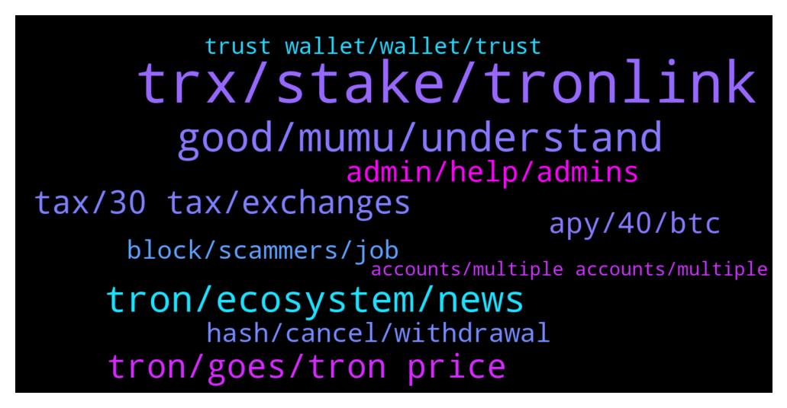

# **@tronnetworkEN**
 ## Analysis for **2022-01-31** - **2022-02-01**.

---

## 📊 **Basic Stats**

**n_messages_sent**: 268

---

---

## 🔝 **Top keywords and related messages**

1. **trx, stake, tronlink**

    @Apareechit --- *I've lost 90% trusting in TRX...  😭😔😔😭* **--->** [TG Discussion](https://t.me/tronnetworkEN/3863903)

    @chrizzy000 --- *hey can anyone help me with the tronlink wallet? when i stake my trx do i only get bandwith and energy? do i not get trx? 🤔* **--->** [TG Discussion](https://t.me/tronnetworkEN/3866454)

    @Vaamanvaa --- *Yes for 1000 trx how much max I earn daily* **--->** [TG Discussion](https://t.me/tronnetworkEN/3864078)

    @PiterSpain --- *Login? That sounds fishy.  Create your TRON wallet (Tronlink.org is advised), freeze TRX and vote https://tron7010.zendesk.com/hc/en-us/articles/360043589352-How-to-Vote-and-Gain-Reward* **--->** [TG Discussion](https://t.me/tronnetworkEN/3863963)

    @simon866 --- *You can check the different rates and rewards here as some rewards are the project tokens and not TRX   https://www.tokengoodies.com/* **--->** [TG Discussion](https://t.me/tronnetworkEN/3864159)

    @PiterSpain --- *📣Thrilled to announce that Two-token Mining Pools are NOW LIVE on SUN.io   💰Two-token mining rewards are able to be earned by staking LP tokens in the corresponding LP pools in #GovernanceMining (Phase II)  👉Learn more https://sunio.zendesk.com/hc/en-us/articles/4415762280473-Announcement-on-the-Launch-of-New-Mining-Pools-Supporting-Two-Token-Mining  Two-token Mining Reward  🎁 $SUN Token 🔖Provided by SUN platform 🔖Determined by voting weights of the liquidity mining pools 🔖Lock $SUN to boost rewards up to 2.5x  🎁 Project Token - teams reserve the right to update the reward distribution   For #Stablecoin- #TRX LP 🔖Provided by @TronnetworkEN to incentivize users to build #TRON ecosystem  For other LPs 🔖 Provided by project teams to promote users’ engagement in the pool  https://twitter.com/defi_sunio/status/1486410019348561921* **--->** [TG Discussion](https://t.me/tronnetworkEN/3863618)

2. **good, mumu, understand**

    @danielcryptomafia --- *go to hell, I hate it(((* **--->** [TG Discussion](https://t.me/tronnetworkEN/3866264)

    @Vaamanvaa --- *Ok thanks sir, let me anyway watch them for a few days, I have already invested 100, now you guys are saying this😕* **--->** [TG Discussion](https://t.me/tronnetworkEN/3864125)

    @R.E.D --- *Where I come from we say.  Your words. In gods ears* **--->** [TG Discussion](https://t.me/tronnetworkEN/3865248)

    @georgewhite01 --- *did you just speak to me?* **--->** [TG Discussion](https://t.me/tronnetworkEN/3866265)

    @Haywhy_milla --- *Really! Seriously I don’t know how to explain it.* **--->** [TG Discussion](https://t.me/tronnetworkEN/3864351)

    @Tutor_rxce --- *But sir , he made has hurt me.* **--->** [TG Discussion](https://t.me/tronnetworkEN/3864516)

3. **tron, ecosystem, news**

    @Carlos_TRX --- *check https://tronwiki.com to get more info about TRON ecosystem and voting process for example* **--->** [TG Discussion](https://t.me/tronnetworkEN/3866464)

    @Haywhy_milla --- *Yeah, it’s daily. A tron is added every 24hrs* **--->** [TG Discussion](https://t.me/tronnetworkEN/3864391)

    @nitin --- *what is tron RPC UPC url* **--->** [TG Discussion](https://t.me/tronnetworkEN/3866170)

    @JiggiJackson --- *i have to check these.  I've only recently started using tron* **--->** [TG Discussion](https://t.me/tronnetworkEN/3864333)

    @JiggiJackson --- *which projects use the tron chain?* **--->** [TG Discussion](https://t.me/tronnetworkEN/3864320)

    @PiterSpain --- *🥳#TRON is gaining global recognition and making remarkable achievements in developing decentralization.  ⚒️#TRON has never stopped to delivering impressive achievements since the MainNet launch. Let's review #TRON's 2021 Keywords of the Year in a video.  https://twitter.com/trondao/status/1487976679179882497* **--->** [TG Discussion](https://t.me/tronnetworkEN/3863616)

4. **tron, goes, tron price**

    @Carlos_TRX --- *Is going down like the rest of the market, not only TRON* **--->** [TG Discussion](https://t.me/tronnetworkEN/3864509)

    @Moneyversac --- *I have no idea.  In 4 years i have never seen anyone doing a correct forecast in crypto 😂* **--->** [TG Discussion](https://t.me/tronnetworkEN/3865755)

    @Tutor_rxce --- *Why tron price goes so much down? Will it rise?* **--->** [TG Discussion](https://t.me/tronnetworkEN/3864456)

    @hsudheer --- *Will tron ever reach $1 ?* **--->** [TG Discussion](https://t.me/tronnetworkEN/3864358)

    @zenen69 --- *Someone think that if btc goes down is an small probability that Tron will be up?* **--->** [TG Discussion](https://t.me/tronnetworkEN/3863448)

    @Tutor_rxce --- *Oh so if only 10000 people have tron, then it will become the most expensive currency,  right?* **--->** [TG Discussion](https://t.me/tronnetworkEN/3864531)

5. **tax, 30 tax, exchanges**

    @Fabs_trx --- *Maybe. In some countries there is a tax for professional crypto traders and exchanges already. They might do the same* **--->** [TG Discussion](https://t.me/tronnetworkEN/3865922)

    @Fabs_trx --- *Better 30% tax than a crypto ban* **--->** [TG Discussion](https://t.me/tronnetworkEN/3865916)

    @Gomer77777 --- *I think 30% tax is not for ordinary holders and crypto players... This tax is primarily for Indian crypto exchanges* **--->** [TG Discussion](https://t.me/tronnetworkEN/3865920)

    @agentpiki --- *No. If buying power is stronger than selling power* **--->** [TG Discussion](https://t.me/tronnetworkEN/3864536)

    @Vaamanvaa --- *Ooh ok but still why so low profit sir?* **--->** [TG Discussion](https://t.me/tronnetworkEN/3864099)

    @simon866 --- *Use exchanges and dex listed below* **--->** [TG Discussion](https://t.me/tronnetworkEN/3866125)

6. **apy, 40, btc**

    @Vaamanvaa --- *🙄Sir they are saying not 5 % but 40 % ,* **--->** [TG Discussion](https://t.me/tronnetworkEN/3864106)

    @sanitarysourcingservices --- *i think none of official project is there that offer 40% APY ... or is any? he might intend to some other project?* **--->** [TG Discussion](https://t.me/tronnetworkEN/3865384)

    @agentpiki --- *9% APY is way more than bank bro.  You want those 5% daily and you'll get scammed 100% and come back here crying* **--->** [TG Discussion](https://t.me/tronnetworkEN/3864100)

    @kamelion --- *That's 800% apy. Sounds like a scam.* **--->** [TG Discussion](https://t.me/tronnetworkEN/3865706)

    @TopCat4u2c --- *40% not sure if I put that in the two good to be true column or it’s a real deal?* **--->** [TG Discussion](https://t.me/tronnetworkEN/3865369)

    @agentpiki --- *Done reading and you still ask how much a day?* **--->** [TG Discussion](https://t.me/tronnetworkEN/3864077)

7. **admin, help, admins**

    @Tutor_rxce --- *You're not an admin but why so much concerned about this? 🤔* **--->** [TG Discussion](https://t.me/tronnetworkEN/3864432)

    @Carlos_TRX --- *He is just as trustworthy as an admin, and a great help within the group, so you can trust anything he tells you.* **--->** [TG Discussion](https://t.me/tronnetworkEN/3864504)

    @Haywhy_milla --- *I guess the admin should say something first* **--->** [TG Discussion](https://t.me/tronnetworkEN/3864322)

    @agentpiki --- *You think admins and mods are fools?* **--->** [TG Discussion](https://t.me/tronnetworkEN/3866269)

    @agentpiki --- *Yes I am not admin, just the janitor here.  As a tronic, I care about Tron and all the members and aspiring tronics.   I won't tolerate scam activities here, so as admins and moderators, and will protect all members here from such scam activities. Now if you'll excuse me.* **--->** [TG Discussion](https://t.me/tronnetworkEN/3864436)

    @Gosh --- *People are just using the group icon changing themselves as administrators* **--->** [TG Discussion](https://t.me/tronnetworkEN/3864667)

8. **hash, cancel, withdrawal**

    @simon866 --- *You will get that for a few days then be back here asking why you cant withdraw* **--->** [TG Discussion](https://t.me/tronnetworkEN/3864114)

    @Vaamanvaa --- *But profit amount is getting credited in wallet* **--->** [TG Discussion](https://t.me/tronnetworkEN/3864130)

    @davedine --- *I think you can cancel it directly on smart contract. But you need the hash to do it. You should searching the hash order. And you need energy to triggering it* **--->** [TG Discussion](https://t.me/tronnetworkEN/3864329)

    @michael_aka_b --- *Thanks for answering. Well well well, what shall i do once i found my hash* **--->** [TG Discussion](https://t.me/tronnetworkEN/3864334)

    @michael_aka_b --- *So there's no chance for me to cancel my open orders on polonidex anymore?* **--->** [TG Discussion](https://t.me/tronnetworkEN/3864309)

    @Vaamanvaa --- *Will wait till my withdrawl and check* **--->** [TG Discussion](https://t.me/tronnetworkEN/3864140)

9. **block, scammers, job**

    @davedine --- *Yeah. They are scammer. Please block and report.* **--->** [TG Discussion](https://t.me/tronnetworkEN/3864340)

    @k0de12 --- *This very true, I am getting a lot of scammers messaging me first since I joined this group. Be careful and stay vigilant everyone!* **--->** [TG Discussion](https://t.me/tronnetworkEN/3865952)

    @simon866 --- *They never DM first, anyone that does is a pure scammer, check rules below 👍* **--->** [TG Discussion](https://t.me/tronnetworkEN/3865927)

    @Apareechit --- *Been doing that for quite a long time... I wish I had a part-time job blocking scammer... and being paid in Trx for blocking them.... 😁😁🍻* **--->** [TG Discussion](https://t.me/tronnetworkEN/3864982)

    @agentpiki --- *You will look like a scammer if you greet everyone 😂* **--->** [TG Discussion](https://t.me/tronnetworkEN/3864137)

    @agentpiki --- *#Tip:  Scammers will message you first. BLOCK USER + REPORT SPAM immediately!  Scammers will change job and quit scamming eventually  IF YOU BLOCK ALL PRIVATE MESSAGES.* **--->** [TG Discussion](https://t.me/tronnetworkEN/3863594)

10. **trust wallet, wallet, trust**

    @Dandy1808 --- *I have staked 3 days but can't unstake in trust wallet* **--->** [TG Discussion](https://t.me/tronnetworkEN/3864619)

    @Musabelloshelleng --- *I bought it transferred it to trust wallet and i want to swap it but it's not showing in pancake swap* **--->** [TG Discussion](https://t.me/tronnetworkEN/3863295)

    @ebrahimpour_b --- *Can I do it in trust wallet ?* **--->** [TG Discussion](https://t.me/tronnetworkEN/3863967)

    @Carlos_TRX --- *I dont know trust wallet, i recommend you import your wallet to tronlink, reslly friendly than other wallets* **--->** [TG Discussion](https://t.me/tronnetworkEN/3864634)

    @PiterSpain --- *No, trustwallet is not the better choice :/ but has easy way to fix it. Import your account using the Mnemonic (seed phrase) in Tronlink.org app* **--->** [TG Discussion](https://t.me/tronnetworkEN/3864210)

    @Carlos_TRX --- *I don't know it personally, I've looked back a long time and there are other users who recommend it, anyway I can't tell you that it's legal either, my advice is that if it's the only place you've found to swap, do a test with one small amount and carry out the whole process until your wallet, if it works out for you, then go ahead.* **--->** [TG Discussion](https://t.me/tronnetworkEN/3866139)

