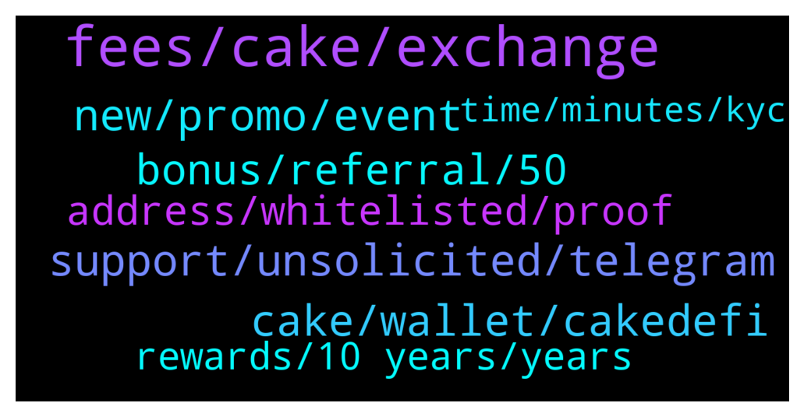

# **@CakeDeFi_EN**
 ## Analysis for **2022-02-01** - **2022-02-02**.

---

## 📊 **Basic Stats**

**n_messages_sent**: 269

---

---

## 🔝 **Top keywords and related messages**

1. **fees, cake, exchange**

    @Kassius84 --- *Hey, you can use an exchange, which has DFI listed or you're using the DeFiChain DEX https://coinmarketcap.com/currencies/defichain/markets/* **--->** [TG Discussion](https://t.me/CakeDeFi_EN/170368)

    @Generalmuhatsi --- *I use Coin base it not the case. I use Onus its not the case. I use Byit its not the case. It was my suggestion and have got my level. You need 10000$ 20000$ people* **--->** [TG Discussion](https://t.me/CakeDeFi_EN/170638)

    @Generalmuhatsi --- *I have a suggestion To Cake management. This withdraw fee of Approximately $20 is tooo much. Imagine you invested $100 and at end of month you profits are $23 😂 😂 Now if am withdrawing $123 am getting $103... 😂 Meaning whole month I was working for Cake. You should look into this. Maybe you should say form this amount to this withdraw fee is $5 and other limits $10, but I think for now this buisness is useless. Can invest all month and get $3 on $100* **--->** [TG Discussion](https://t.me/CakeDeFi_EN/170627)

    @Razali --- *CakeDefi's investors are generally very long term.. I myself froze all of my DFI for 10 years and have set the freezer to auto-renew.. $100 will go a long way in 10 years.. so I wouldn't worry about withdrawal fees as they are right now, which is normal in my opinion..   Besides, as mentioned earlier, there are cheaper alternatives to make withdrawals..* **--->** [TG Discussion](https://t.me/CakeDeFi_EN/170655)

    @Tracey --- *How to get USDC onto DefiChain? Is the the same as decentralized asset  dUSDC ?* **--->** [TG Discussion](https://t.me/CakeDeFi_EN/170579)

    @montoderooij --- *Can i send it to Metamask? To swap on uniswap?* **--->** [TG Discussion](https://t.me/CakeDeFi_EN/170783)

2. **support, unsolicited, telegram**

    @fabioandreatta --- *Fill in the form and contact our Customer Support with your request. There is no direct Support here on Telegram* **--->** [TG Discussion](https://t.me/CakeDeFi_EN/170983)

    @@uv99 --- *Hello who is marketing staff here?* **--->** [TG Discussion](https://t.me/CakeDeFi_EN/171048)

    @agisma1 --- *A lot of people are texting me, who can I trust?* **--->** [TG Discussion](https://t.me/CakeDeFi_EN/170521)

    @Welcomeus --- *Hello who is marketing staff here?* **--->** [TG Discussion](https://t.me/CakeDeFi_EN/170744)

    @DmgBautista --- *Moderators here! What can we help? :)* **--->** [TG Discussion](https://t.me/CakeDeFi_EN/170710)

    @Rathi2007 --- *Today I got this email...... What about this... Is it genuine?* **--->** [TG Discussion](https://t.me/CakeDeFi_EN/170665)

3. **new, promo, event**

    @Wu --- *Yes, I did. Maybe the promotion only works once* **--->** [TG Discussion](https://t.me/CakeDeFi_EN/170996)

    @javvy_007 --- *yes Registered on January 14, 2021 9:57 PM* **--->** [TG Discussion](https://t.me/CakeDeFi_EN/170686)

    @KlausLberger --- *Can only assume that currently many people register again* **--->** [TG Discussion](https://t.me/CakeDeFi_EN/170351)

    @Michael_Schredl --- *No, but you can create a ticket* **--->** [TG Discussion](https://t.me/CakeDeFi_EN/170608)

    @javvy_007 --- *@admin have successfully completed learn and earn Quiz but not get rewards* **--->** [TG Discussion](https://t.me/CakeDeFi_EN/170682)

    @oksoyer --- *I'm talking about the $50 dash event.* **--->** [TG Discussion](https://t.me/CakeDeFi_EN/170718)

4. **cake, wallet, cakedefi**

    @montoderooij --- *And one last question, tranfering DFI from cake to the dfi wallet.. how long does it take? I’ve always been a holder so its my first time withdrawing dfi* **--->** [TG Discussion](https://t.me/CakeDeFi_EN/170791)

    @art_vandaly --- *hi, i can't withdrawal because "withdrawals to addresses of other Cake users are not allowed." how can i fixed this problem?* **--->** [TG Discussion](https://t.me/CakeDeFi_EN/170846)

    @montoderooij --- *Is it normal that i cannot see my dETH transaction to my cake wallet?* **--->** [TG Discussion](https://t.me/CakeDeFi_EN/170802)

    @Kiełbik --- *How long does it take to get my deposit back? I made a deposit and it's missing, you've been looking for it for 6 days with no result* **--->** [TG Discussion](https://t.me/CakeDeFi_EN/170946)

    @Kassius84 --- *You need to send them back to Cake DeFi, if you want to unwrap them 👍* **--->** [TG Discussion](https://t.me/CakeDeFi_EN/170373)

    @DmgBautista --- *Hi! Transactions need a minimum of 30 confirmations before being processed at Cake, so a minimum 15 minutes. I would go and say that between processing and depositing, you could consider about half an hour* **--->** [TG Discussion](https://t.me/CakeDeFi_EN/170891)

5. **bonus, referral, 50**

    @epoxyn --- *But it says both. But my referral gets 50 usd why am I get 30 ?* **--->** [TG Discussion](https://t.me/CakeDeFi_EN/170320)

    @Kassius84 --- *Are you talking about the referrer or the referee bonus? To receive the sign up bonus, you need to deposit at least crypto worth $50.* **--->** [TG Discussion](https://t.me/CakeDeFi_EN/171066)

    @erikaa1997 --- *Tell me about the $50 referral bonus* **--->** [TG Discussion](https://t.me/CakeDeFi_EN/171032)

    @omeryldrm3469 --- *I have 37 references and my balance is increasing every week. I don't know if my registration bonus is a referral bonus, how can I understand it?* **--->** [TG Discussion](https://t.me/CakeDeFi_EN/171068)

    @fabioandreatta --- *Check your referral page, if you have valid Referrals, you only get rewards if your referrals have enough assets (more than $50 USD) - All referral rewards were paid out yesterday, meaning there is/was no issue* **--->** [TG Discussion](https://t.me/CakeDeFi_EN/170548)

    @KlausLberger --- *U also get monthly your ref bonus. It’s a good deal for you and your referral 😊* **--->** [TG Discussion](https://t.me/CakeDeFi_EN/170322)

6. **address, whitelisted, proof**

    @fabioandreatta --- *Press withdrawal and add your address there* **--->** [TG Discussion](https://t.me/CakeDeFi_EN/170962)

    @fabioandreatta --- *Like i stated above, there is no confirmation email for whitelisted addresses* **--->** [TG Discussion](https://t.me/CakeDeFi_EN/170965)

    @Emonkhan05 --- *sir you don't understand my problem  Please tell, what I do to Whitelist my address* **--->** [TG Discussion](https://t.me/CakeDeFi_EN/170984)

    @X4LPHAX --- *Good day, I have verified my identity, but my address has not been verified for 3 times. Although I chose the government document, it asks me to throw out the phone bill.* **--->** [TG Discussion](https://t.me/CakeDeFi_EN/170941)

    @Emonkhan05 --- *but my address not Whitelisted sir  understand please* **--->** [TG Discussion](https://t.me/CakeDeFi_EN/170971)

    @fabioandreatta --- *There is no confirmation email for whitelisted addresses* **--->** [TG Discussion](https://t.me/CakeDeFi_EN/170970)

7. **rewards, 10 years, years**

    @Spikeboibeigel --- *Hmm, in that case I am confused. I have been testing it around a week. But the rewards are not near that on avg 90-91%. More like close to 60%. (I have frozen for 120 months)* **--->** [TG Discussion](https://t.me/CakeDeFi_EN/170500)

    @zachgax --- *I freeze Staked DFI for 10 years to get the 2X rewards, but I don’t think LM freezing has such additional bonus.   So I normally freeze LM for 12 months, as it seemed to me to be the best balance of fee reduction, additional % rewards and duration.   LM is something I might want to remove and reinvest in other pool. 10 years is too long a time.* **--->** [TG Discussion](https://t.me/CakeDeFi_EN/170501)

    @zachgax --- *Apy is based on best case scenario of compounding interest over a year.* **--->** [TG Discussion](https://t.me/CakeDeFi_EN/170488)

    @Spikeboibeigel --- *So the average is that 91.49%? In the above snip* **--->** [TG Discussion](https://t.me/CakeDeFi_EN/170495)

    @Michael_Schredl --- *Correct, that is the 7 day average* **--->** [TG Discussion](https://t.me/CakeDeFi_EN/170496)

    @Michael_Schredl --- *Cake already shows the average  But keep in mind that Rewards are dropping 1,65% every 11 days* **--->** [TG Discussion](https://t.me/CakeDeFi_EN/170494)

