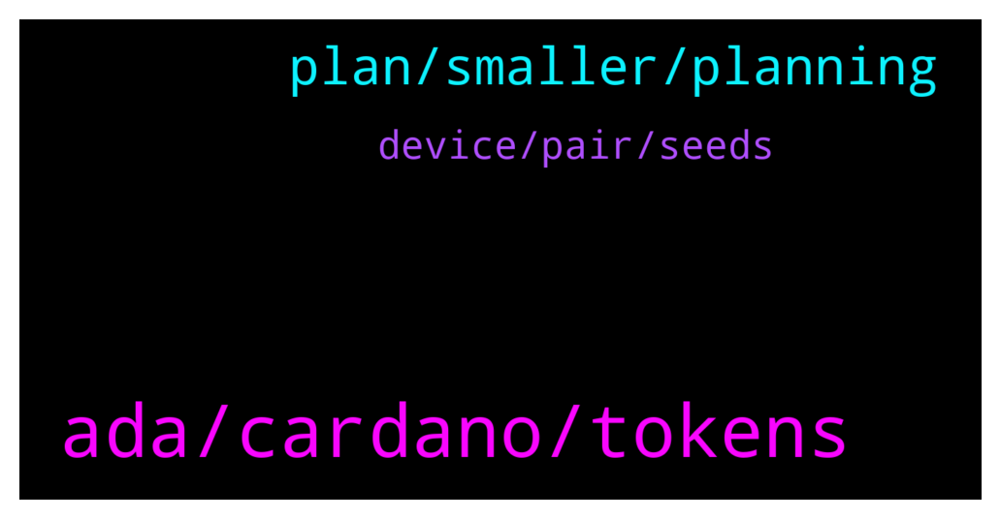

# **@Cardano**
 ## Analysis for **2022-02-01** - **2022-02-02**.

---

## 📊 **Basic Stats**

**n_messages_sent**: 93

---

---

## 🔝 **Top keywords and related messages**

1. **ada, cardano, tokens**

    @tigonik --- *Would someone know what Total Output means in terms of an epoch? The value I see on CardanoScan for epoch 316 exceeds total supply of ADA. See link: https://cardanoscan.io/epoch/316* **--->** [TG Discussion](https://t.me/Cardano/777658)

    @Denicio_Bernier --- *The network is heavily congested atm. There have been more reports of failed transactions from other wallets as well   Viewing you posted this several hours before, is it safe to assume you’ve now been successful to submit your transaction?* **--->** [TG Discussion](https://t.me/Cardano/777748)

    @Cardano_Vechain_fan --- *Does anyone know if you receive sundayswap tokens if you delegated to a selected pool on the 25 of january (before the epoch ended). If so what adress from my Deadelus wallet should I use to check for rewards (the calculation). My Daedelus wallet has several adresses generated.* **--->** [TG Discussion](https://t.me/Cardano/777419)

    @Isidor --- *When will Meld tokens drop since been staking ADA for meld? Does anybody know the exchange? Izzy* **--->** [TG Discussion](https://t.me/Cardano/777653)

    @ChrisSTR8 --- *One epoch is 5 days, if e.g. a whale moves her ADA multiple times it adds up* **--->** [TG Discussion](https://t.me/Cardano/777661)

    @trollthetyrants --- *Hi.   so i have accessed my yoroi wallet in ccvault.io  I can see my ADA on the left hand side.  Over on the right side under the Staking tab, it correctly lists the pool where my account is delegated to.  my question is, should i have received any sundae tokens by now? if so, where can i see them?  thank you* **--->** [TG Discussion](https://t.me/Cardano/777693)

2. **plan, smaller, planning**

    @Morpheus369 --- *So what is a good paradigm to follow when building a successful project? For example I tought to split up a big projekt into smaller hurdles and testing everything and fixing bugs before implementing it. I also tought that one should begin with the vision and analyzing the market. Then one should split up the plan into smaller hurdles  and plan every detail of the hurdle and then test it. Afterwards do this for the second plan. In the end one should start implementing the test code into the real projekt. But the implementation should also be done in smaller steps. Is this a good plan or what is more efficient? I also heard the biggest enemy of good enough is perfect. Is this plan too perfectionsist? So maybe there needs to be a compromise? What do you think?* **--->** [TG Discussion](https://t.me/Cardano/777572)

    @glitch04 --- *Then move to put that plan into motion, so you are not stuck in the planning phase* **--->** [TG Discussion](https://t.me/Cardano/777592)

    @glitch04 --- *Sounds like a great place to start* **--->** [TG Discussion](https://t.me/Cardano/777602)

    @glitch04 --- *I would say perfect is not required so long as you are adaptable and can identify the issues along the way* **--->** [TG Discussion](https://t.me/Cardano/777576)

    @Morpheus369 --- *what do you mean with "work toward function"* **--->** [TG Discussion](https://t.me/Cardano/777588)

    @Morpheus369 --- *I think I got it now. What do you think?  Plan broad then implement.  Then write down mistakes and difficulties from implementing and change the plan and start implementing from scratch.  Do all this in smaller hurdles so its always easy to improve plan and start from scratch since one mistake has little influence on smaller functions. Also splitting up allows working in parallel.* **--->** [TG Discussion](https://t.me/Cardano/777601)

3. **device, pair, seeds**

    @glitch04 --- *You just sync the device with the new ccvault wallet* **--->** [TG Discussion](https://t.me/Cardano/777943)

    @glitch04 --- *click the "pair" option after you click the "add wallet" section* **--->** [TG Discussion](https://t.me/Cardano/777978)

    @WhirrledPeas --- *Hi Thanks for a ray of hope. Are there any instructions out there to synch my Trezor with CCvault? Do I enter Trezor seeds to ccvault?* **--->** [TG Discussion](https://t.me/Cardano/777975)

    @CesarVapor --- *Do we have a ccvault guide?* **--->** [TG Discussion](https://t.me/Cardano/777703)

    @glitch04 --- *You only "pair" the device to that wallet just the same as you originally did with the previous wallet* **--->** [TG Discussion](https://t.me/Cardano/777977)

    @Denicio_Bernier --- *Please visite the source site for more detail: ccvault.io* **--->** [TG Discussion](https://t.me/Cardano/777746)

