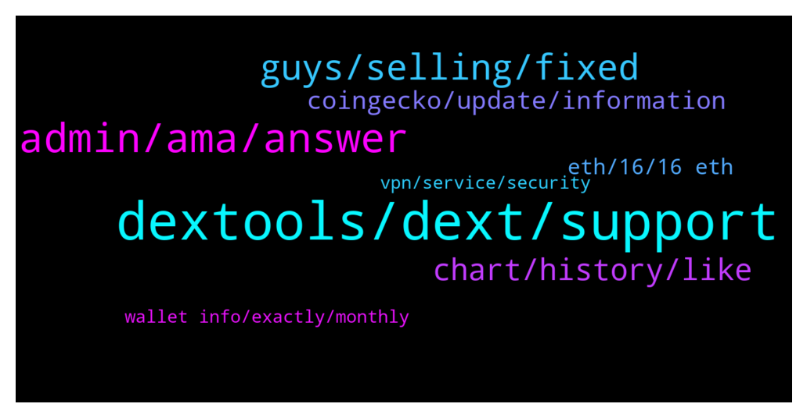

# **@DEXToolsCommunity**
 ## Analysis for **2022-01-31** - **2022-02-02**.

---

## 📊 **Basic Stats**

**n_messages_sent**: 222

---

---

## 🔝 **Top keywords and related messages**

1. **dextools, dext, support**

    @whaleishh --- *Smh dextools. Get your shit together.* **--->** [TG Discussion](https://t.me/DEXToolsCommunity/330546)

    @Yaknota --- *How can i get the dextool link* **--->** [TG Discussion](https://t.me/DEXToolsCommunity/329603)

    @EJ_FarmWars --- *How can I run ads on dextools* **--->** [TG Discussion](https://t.me/DEXToolsCommunity/330123)

    @Mr --- *Where Can I stake DEXT ?Admin,plz* **--->** [TG Discussion](https://t.me/DEXToolsCommunity/330013)

    @bastardganpunk --- *must be a general issue on dextools side I guess. The devs are looking into it now 🙂* **--->** [TG Discussion](https://t.me/DEXToolsCommunity/330495)

    @oni_o_n --- *good morning all, can someone please inform me how to update the dextools info for a token that I deployed* **--->** [TG Discussion](https://t.me/DEXToolsCommunity/330265)

2. **admin, ama, answer**

    @bastardganpunk --- *That means a scammer DMed you! Careful please, no admin will ever DM you first!* **--->** [TG Discussion](https://t.me/DEXToolsCommunity/329668)

    @stanes --- *Hi, Please DM @guillermorodriguez78 he is the person-in-charge.  Be aware of scammers, HE WILL NEVER DM YOU FIRST.* **--->** [TG Discussion](https://t.me/DEXToolsCommunity/330040)

    @kingkhalil --- *Sorry, I only talk to admins 🤐* **--->** [TG Discussion](https://t.me/DEXToolsCommunity/329663)

    @pabloescobaris --- *Admin needs to change SHAMAN KING telegram official link group to this : https://t.me/shamankinglnuofficial* **--->** [TG Discussion](https://t.me/DEXToolsCommunity/329890)

    @granini7 --- *Ok I now, but I must send 319 DXT also yes?* **--->** [TG Discussion](https://t.me/DEXToolsCommunity/329831)

    @Josh --- *fs, would you be able to assist me at all?* **--->** [TG Discussion](https://t.me/DEXToolsCommunity/329639)

3. **guys, selling, fixed**

    @napascual --- *It has been fixed and regenerated already* **--->** [TG Discussion](https://t.me/DEXToolsCommunity/330530)

    @HOBOCRUNCH --- *says a team wallet is selling* **--->** [TG Discussion](https://t.me/DEXToolsCommunity/330484)

    @Tether --- *Lost 5 bnb due to you guys trending a honey pot* **--->** [TG Discussion](https://t.me/DEXToolsCommunity/329973)

    @Tether --- *Bro you guys system was trending it for over 24 hours* **--->** [TG Discussion](https://t.me/DEXToolsCommunity/329984)

    @Tether --- *Better fix your systems curse to you guys I’m out bruv* **--->** [TG Discussion](https://t.me/DEXToolsCommunity/329985)

    @stanes --- *Devs just fixed the issue. Thanks for reporting 👍* **--->** [TG Discussion](https://t.me/DEXToolsCommunity/330399)

4. **chart, history, like**

    @COVDRMANAGER --- *so the higher the view, the more possibility to trend* **--->** [TG Discussion](https://t.me/DEXToolsCommunity/330213)

    @Mojomagick --- *Your charts are not realistic.  You constantly remove the wicks from your charts.   Look at AVT chart for example.  https://www.dextools.io/app/ether/pair-explorer/0xcdff6ddfc9e4807c9927fd58708c2ef3484cc305  It looks completely different on the Etherscan chart than on your chart.  https://etherscan.io/dex/uniswapv3/0xcdff6ddfc9e4807c9927fd58708c2ef3484cc305  I have asked multiple times to resolve.  I keep hearing the team will look into it and nothing happens.   When will this get fixed?* **--->** [TG Discussion](https://t.me/DEXToolsCommunity/330052)

    @Trucker427 --- *Yeah I remember doing that in last version. If you could implement something like what poocoin has,.. where you hover over the red or green dots on chart it gives you good data ie: purchase values then/now etc... That would be very helpful. Far faster in calculating ROI on charts like this then going through etherscan* **--->** [TG Discussion](https://t.me/DEXToolsCommunity/330192)

    @Trucker427 --- *Now I am trying to see first buy of a token I got 12 days ago but can only see last 1211 trades. Any way to see full history of trades?* **--->** [TG Discussion](https://t.me/DEXToolsCommunity/329906)

    @Trucker427 --- *I used to be able to see green buy and red sell dots on dext chart on any asset I traded when my wallets are connected. Kinda like poocoin. I have my wallets connected but cannot see buys on most assets as they are around 2-4 weeks old. Are you saying I am limited to the last 1200ish trxs to see my own trading history?* **--->** [TG Discussion](https://t.me/DEXToolsCommunity/330190)

    @Mojomagick --- *can you add monthly view to your sharts please ?* **--->** [TG Discussion](https://t.me/DEXToolsCommunity/329998)

5. **coingecko, update, information**

    @HODLnomix --- *Howdy. I have a token, and I'm curious how do we add the information needed like reddit, telegram, etc... so we can crease our information score?* **--->** [TG Discussion](https://t.me/DEXToolsCommunity/330381)

    @num_ber7 --- *How do tokens enter the hot area?* **--->** [TG Discussion](https://t.me/DEXToolsCommunity/330420)

    @bastardganpunk --- *What do you mean by that? You just need to hold the tokens in one wallet.* **--->** [TG Discussion](https://t.me/DEXToolsCommunity/329897)

    @tflowe --- *im having issues with my token's marketcap* **--->** [TG Discussion](https://t.me/DEXToolsCommunity/330314)

    @Crownadel --- *How can I get new tokens info like telegram and website* **--->** [TG Discussion](https://t.me/DEXToolsCommunity/330007)

    @bastardganpunk --- *About social Information for your token, please update etherscan.io or bscscan.com or coingecko.com  We pull info from there.    For the logo update coinGecko or TrustWallet* **--->** [TG Discussion](https://t.me/DEXToolsCommunity/329891)

6. **eth, 16, 16 eth**

    @bastardganpunk --- *well the tx failed, so a swpa didnt happen* **--->** [TG Discussion](https://t.me/DEXToolsCommunity/330525)

    @Jcpsey --- *So why the charge of 0.16 eth ?* **--->** [TG Discussion](https://t.me/DEXToolsCommunity/330529)

    @Jcpsey --- *Is says the transaction has failed but it has taken 0.16 Eth?* **--->** [TG Discussion](https://t.me/DEXToolsCommunity/330509)

    @Josh --- *Hello I am trying to fix an issue with a transaction. Would any dev be able to help?* **--->** [TG Discussion](https://t.me/DEXToolsCommunity/329624)

    @Jcpsey --- *I wouldnt pay 0.16 Eth in gas fees* **--->** [TG Discussion](https://t.me/DEXToolsCommunity/330517)

    @stanes --- *Hi, the limit always been around 1200 txs.* **--->** [TG Discussion](https://t.me/DEXToolsCommunity/330182)

7. **vpn, service, security**

    @Madsumo --- *I have tried both UK and US servers and it is the same for both.* **--->** [TG Discussion](https://t.me/DEXToolsCommunity/329742)

    @JoeyDieleman --- *This has to do with cloudflare not trusting the vpn its ip address* **--->** [TG Discussion](https://t.me/DEXToolsCommunity/329739)

    @Madsumo --- *Hi.  Recently my laptop was compromised and so I rebuilt it from the bottom up, i.e. complete reinstall from the OS up.  I have then set all apps where possible to 2FA and installed Norton360 plus their SecureVPN service.  On startup, with the VPN enabled, I can still access all my apps, exchanges, and wallets but I cannot access the DEXTools App. I get an error stating your site has security to stop security attacks. If I stop the VPN, connect to your site first, and then restart the VPN, it is fine.  I believe this is then bypassing my VPN as the session was started without it enabled.  I am not a security expert but is there anything I can do so I do not have to stop and re-enable the VPN?* **--->** [TG Discussion](https://t.me/DEXToolsCommunity/329736)

    @napascual --- *Maybe try with different countries then uk/us as well, check that the ip comes from a trusted ASN* **--->** [TG Discussion](https://t.me/DEXToolsCommunity/329752)

    @napascual --- *I remember a user that had norton 360 vpn service using non trusted ASNs. I encourage you to use a different vpn provider* **--->** [TG Discussion](https://t.me/DEXToolsCommunity/329750)

    @JoeyDieleman --- *You could try, if the vpn supports, to connect to another node/country or try another vpn service* **--->** [TG Discussion](https://t.me/DEXToolsCommunity/329740)

