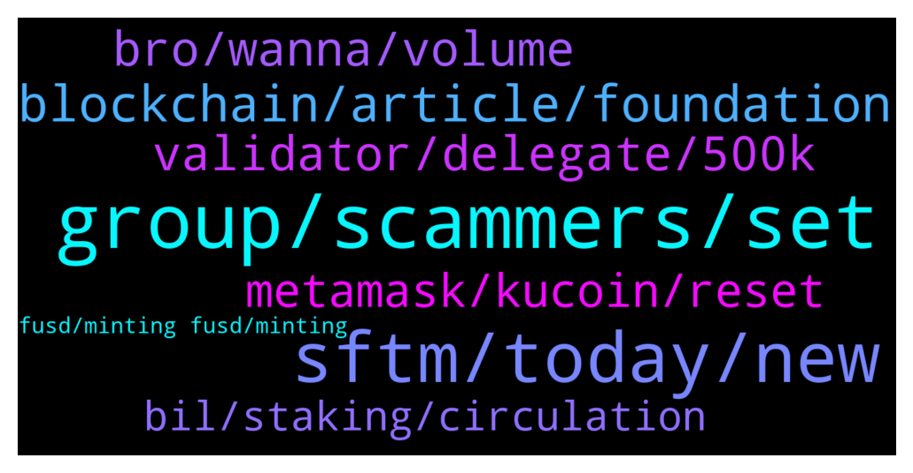

# **@Fantom_English**
 ## Analysis for **2022-02-01** - **2022-02-02**.

---

## 📊 **Basic Stats**

**n_messages_sent**: 186

---

---

## 🔝 **Top keywords and related messages**

1. **group, scammers, set**

    @Pmoneyworld --- *Getting calls and lots of messages from different people from this group trying to help.. please only give me your response here. Do not dm me privately* **--->** [TG Discussion](https://t.me/Fantom_English/645819)

    @Haro_House --- *Its okey but i am looking for offical  Turkish group as many people have already asked for it here. Making Turkish group ll be good for creating turkish community* **--->** [TG Discussion](https://t.me/Fantom_English/646303)

    @Lucian_08 --- *Admin is here?  It’s a lot of scammers out there that do and calls you here on telegram* **--->** [TG Discussion](https://t.me/Fantom_English/645950)

    @SamSakamoto --- *Migrating this group to discord would help with eliminating all these bots* **--->** [TG Discussion](https://t.me/Fantom_English/646418)

    @Mcjig --- *⬢ How to secure your #Telegram account? Use all of the tips below to stay safe from scammers and impersonators.  1️⃣ Change the default Privacy Settings of your account ≡ ➔⚙️ Settings ➔ Privacy and Security a) Phone number ➔ Set to »My Contacts« b) Calls ➔ Set to »My Contacts« c) Groups ➔ Set to »My Contacts« d) Security ➔ Two-Step Verification e) Advanced ➔ Set »Delete my account if away for« to »1 year«  2️⃣ Set unique username and profile bio ≡ ➔⚙️ Settings ➔ Edit profile a) Username b) Bio* **--->** [TG Discussion](https://t.me/Fantom_English/645986)

    @daily paper --- *scammers get fck out from me* **--->** [TG Discussion](https://t.me/Fantom_English/646131)

2. **sftm, today, new**

    @Fjody --- *FTM mainet deposits and withdrawals are now also supported on AscendEx.* **--->** [TG Discussion](https://t.me/Fantom_English/646029)

    @jj --- *What exchange to use in swapping MIM to ftm?* **--->** [TG Discussion](https://t.me/Fantom_English/646038)

    @Grahamers --- *Hi Fantom People, I'm about to go LONG FTM , but need to get verification about one thing. I read somewhere along the way today that it was a STATED intent for FTM dev team to increase TPS (not time to finality) , Transactions per second... can anybody confirm this and direct me to a link/statement? I am ALL OVER FTM. Sol Killer for sure 2022 IMHO. Thanks in advance, G* **--->** [TG Discussion](https://t.me/Fantom_English/645665)

    @Fjody --- *On official FTM website, there is a chat icon in the bottom right corner to open an official ticket.* **--->** [TG Discussion](https://t.me/Fantom_English/645955)

    @Jay --- *Hi, i sent some ftm token from one of my mm wallet addres to another (no cross bridge used) i haven't received them in my second wallet* **--->** [TG Discussion](https://t.me/Fantom_English/646469)

    @Apemonkeyallin --- *Been looking to get heavy in ftm instead of Btc. But I guess it’s smart to wait a bit. Love ftm though* **--->** [TG Discussion](https://t.me/Fantom_English/646517)

3. **blockchain, article, foundation**

    @Janevietani --- *community can make one but fantom foundations will not paid* **--->** [TG Discussion](https://t.me/Fantom_English/646304)

    @oppzsmoKe --- *Does Fantom have a NFT marketplace* **--->** [TG Discussion](https://t.me/Fantom_English/646175)

    @Mcjig --- *look in the links there are a few of them* **--->** [TG Discussion](https://t.me/Fantom_English/646178)

    @leonarrdd991 --- *hello! where can i see fantom ecosystem ? :)* **--->** [TG Discussion](https://t.me/Fantom_English/645617)

    @thiagorochaoc --- *Where can I track Fantom's on-chain governance?* **--->** [TG Discussion](https://t.me/Fantom_English/645690)

    @Subhamoy --- *Where I can learn fantom tutorial for Blockchain programing ?* **--->** [TG Discussion](https://t.me/Fantom_English/645926)

4. **validator, delegate, 500k**

    @Mcjig --- *validator and delegating is 2 different things* **--->** [TG Discussion](https://t.me/Fantom_English/646005)

    @thiagorochaoc --- *I know. Let me explain again: anyone needs 500k FTM staked to be a validator. My question is, does it really need 500k FTM or does that amount take into account the delegated values for that validator?* **--->** [TG Discussion](https://t.me/Fantom_English/646010)

    @thiagorochaoc --- *do you need 500k FTM to become a network validator or is it enough to have 500k delegated?* **--->** [TG Discussion](https://t.me/Fantom_English/645999)

    @Mcjig --- *The response is considered valid when ⅔ + 1 nodes send the same response.* **--->** [TG Discussion](https://t.me/Fantom_English/646086)

    @Mcjig --- *the vote is lower the requirement to become a validator/ so it would make a easier entry to become one* **--->** [TG Discussion](https://t.me/Fantom_English/646494)

    @slickrick6 --- *You can select a validator of your choosing from the above list* **--->** [TG Discussion](https://t.me/Fantom_English/646356)

5. **bro, wanna, volume**

    @mrFrankle --- *If you wanna buy USDT you can DM me bro* **--->** [TG Discussion](https://t.me/Fantom_English/645554)

    @dogemandan --- *Hey guys any idea on a time frame for coinbase listing* **--->** [TG Discussion](https://t.me/Fantom_English/645752)

    @Manu --- *The markets are rekt right now.. please send for free* **--->** [TG Discussion](https://t.me/Fantom_English/645507)

    @Seamarshal --- *I wanna invest heavily but I'm not convinced with the supply, someone advice me please 🙏* **--->** [TG Discussion](https://t.me/Fantom_English/646321)

    @DenB --- *I like when the markets are rekt. I can farm some more tombs :)* **--->** [TG Discussion](https://t.me/Fantom_English/645512)

    @lifesgoodman --- *Bullish indeed. on 24H trading volume we are 5th.* **--->** [TG Discussion](https://t.me/Fantom_English/646239)

6. **metamask, kucoin, reset**

    @Pmoneyworld --- *The transaction is showing as successful but it’s not delivered to my wallet* **--->** [TG Discussion](https://t.me/Fantom_English/645965)

    @Janevietani --- *how to resolve pending txs ?  1. reset metamask go to metamask setting -> advanced -> reset reset metamask will only clear pending tx   2. add other RPC for back up Fantom RPC : a. https://rpc.ftm.tools/ b. https://rpc.ankr.com/fantom c. https://ftmrpc.ultimatenodes.io/   ChainID: 250 Symbol: FTM Browser : https://ftmscan.com  3. after reset metamask and add new rpc re-do your tx, check gas price here https://ftm.guru/fantomscan.html* **--->** [TG Discussion](https://t.me/Fantom_English/645848)

    @BauPhan --- *I think I messed up.  Sent USDC from Metamask on Fantom Opera to Kucoin and havent recieved the funds after 4 hours.  Is there something I can do?  Thanks in advance.* **--->** [TG Discussion](https://t.me/Fantom_English/646246)

    @Janevietani --- *try checking it on abracadabra if they accept yvBTC* **--->** [TG Discussion](https://t.me/Fantom_English/645886)

    @Pmoneyworld --- *Hey guys I have a transaction stuck from yesterday 1 day 1hr now.. it’s confirmed in the block but still has so many blocks to go.. how can I speed this up please* **--->** [TG Discussion](https://t.me/Fantom_English/645817)

    @Mcjig --- *kucoin supports mainnet and erc20 but at the moment kucoin isnt letting mainnet ftm withdraws* **--->** [TG Discussion](https://t.me/Fantom_English/646402)

7. **bil, staking, circulation**

    @Mcjig --- *the reserved rewards will run out in about 2 years* **--->** [TG Discussion](https://t.me/Fantom_English/646502)

    @stevenn00 --- *so if circulation supply max 3.1Bil how can give the reward staking* **--->** [TG Discussion](https://t.me/Fantom_English/646499)

    @Mcjig --- *no, there are 2.5 bil ftm in circulation and the remainder is reserved for staking rewards/ max supply is 3.1 bil* **--->** [TG Discussion](https://t.me/Fantom_English/646498)

    @stevenn00 --- *after 2years can we stake or no?* **--->** [TG Discussion](https://t.me/Fantom_English/646505)

    @slickrick6 --- *You can select the lock period when staking* **--->** [TG Discussion](https://t.me/Fantom_English/646109)

    @Mcjig --- *because there is 2.5 bil in circulation. the rest are reserved as staking rewards* **--->** [TG Discussion](https://t.me/Fantom_English/646501)

8. **fusd, minting fusd, minting**

    @Mcjig --- *i wouldnt reccomend minting anything other than fusd. and not trying to sell the fusd. since there isnt liquidity for fusd* **--->** [TG Discussion](https://t.me/Fantom_English/646405)

    @thegreat06 --- *Okay admin how can one get the fusdt* **--->** [TG Discussion](https://t.me/Fantom_English/645561)

    @EmaPede --- *Sorry other 2 questions: 1) I cannot find the fee for minting fUSD from sFTM. How much they are? 2) How much they are the wFTM reward for minting fUSD from fFTM?* **--->** [TG Discussion](https://t.me/Fantom_English/646398)

    @Lee_CryptoNFT --- *is there anything to do in the fwallet with fmint? or is all that not functioning?* **--->** [TG Discussion](https://t.me/Fantom_English/645496)

    @MLH822020 --- *Hello, I supplied some wBTC to Yearn and got a yvBTC token. Is there anywhere I can deposit that token? Thx* **--->** [TG Discussion](https://t.me/Fantom_English/645874)

    @Mcjig --- *fmint isnt worth the hassle of doing* **--->** [TG Discussion](https://t.me/Fantom_English/645500)

