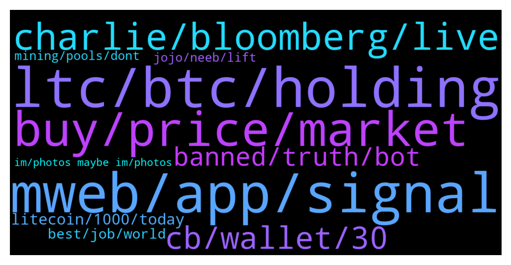

# **@Litecoin**
 ## Analysis for **2022-02-01** - **2022-02-02**.

---

## 📊 **Basic Stats**

**n_messages_sent**: 343

---

---

## 🔝 **Top keywords and related messages**

1. **mweb, app, signal**

    @J --- *What mweb? Dude.. mweb is already calculated in the price.. pleaze dyor* **--->** [TG Discussion](https://t.me/Litecoin/2056314)

    @Notbiden --- *Is there a place we can see % of flags for mweb?* **--->** [TG Discussion](https://t.me/Litecoin/2055865)

    @cloudlite15 --- *I sold recently because I was told mweb was never going to be happening* **--->** [TG Discussion](https://t.me/Litecoin/2055970)

    @YuumuraKirika --- *@coblee do you guys have contacts for the major exchanges? Emails or something? How hard is it for exchanges to signal for MWEB in terms of backend work on their end?* **--->** [TG Discussion](https://t.me/Litecoin/2056206)

    @YuumuraKirika --- *Except they don't need more... It's pretty plug and play. They just have to run the new node software. They try to keep the code up to date... They also get part of each tx in fees.. MWEB included... If it doesn't reach 75% by a certain time, it's going to activate anyway according to BIP8, so I'm sure they want the tx fees from MWEB txs.. else they be missing out on some moolah* **--->** [TG Discussion](https://t.me/Litecoin/2056278)

    @coblee --- *Only mining pools signal. Exchanges will likely not use MWEB, so they won't need to upgrade. But they should upgrade their edge nodes.* **--->** [TG Discussion](https://t.me/Litecoin/2056228)

2. **ltc, btc, holding**

    @coblee --- *I don't remember saying on TV to buy BTC and not LTC. I mean it's possible. If you can find the interview, show me* **--->** [TG Discussion](https://t.me/Litecoin/2056634)

    @FFCosta --- *Why did you dumped all yours xrp to flare. I dont get it. 🥲* **--->** [TG Discussion](https://t.me/Litecoin/2055829)

    @scratchticket --- *I spotted ltc at a coinstar kiosk at a Safeway!* **--->** [TG Discussion](https://t.me/Litecoin/2056045)

    @FFCosta --- *i quit here for gud time, i decided back  to see and all still same. If you are angry with LTC you always free to leave any time.* **--->** [TG Discussion](https://t.me/Litecoin/2056324)

    @J --- *Why would it? Ltc is a dinosaur* **--->** [TG Discussion](https://t.me/Litecoin/2056323)

    @J --- *Who says i have ltc? MayB i can only effort 0,1ltc* **--->** [TG Discussion](https://t.me/Litecoin/2056325)

3. **buy, price, market**

    @TonyNakamoto --- *Lol u try 2 convince ppl not to look at the price chart and you're still ban'd 4 misinformation and lying* **--->** [TG Discussion](https://t.me/Litecoin/2055812)

    @Congressional_Liason --- *Pick your prices and think for yourself with facts given by Charlie and David, along with other successful crypto people.   Telling people to research and think is honest. You all go back to wrecking noobies if that's who you are. I follow my thoughts.  Also, the person who said community sentiment doesn't affect price should read the Stanford study that came out two years ago (you probably already have.) 😂   Have a good day, everyone. Pick your prices and find where the research is without the fud/fomo.  ✌️* **--->** [TG Discussion](https://t.me/Litecoin/2055808)

    @Congressional_Liason --- *Your posts I have a hard time comprehending.   For others, please do your research, pick your prices, and focus on facts, in my opinion.   I have a series of bids in at these prices; being long and using the coin, I’m good whichever way it goes.   Being a market-wide dip, I’m accumulating many coins, and given the history unfolding, I am glad to accumulate. Even in dips, I’m way ahead anyway, and for me, it’s a great time to collect.   Enjoy everyone, research, critical thinking, and when I see fud Increasing with good news, I’m a contrarian from the incessant fud here and buy.* **--->** [TG Discussion](https://t.me/Litecoin/2055790)

    @adamozi --- *Everything pumps in a bull market* **--->** [TG Discussion](https://t.me/Litecoin/2056154)

    @FFCosta --- *He need stop buy on high and sell on low* **--->** [TG Discussion](https://t.me/Litecoin/2056627)

    @FFCosta --- *If prices equal at least with xmr could be already gud* **--->** [TG Discussion](https://t.me/Litecoin/2056317)

4. **charlie, bloomberg, live**

    @Bugattij --- *Charlie Lee will be live on Bloomberg in 10 or so mins.. https://www.bloomberg.com/live* **--->** [TG Discussion](https://t.me/Litecoin/2056448)

    @Musashi_Kansai --- *For those of you who missed Charlie, skip to -51:00:  https://www.youtube.com/watch?v=dp8PhLsUcFE* **--->** [TG Discussion](https://t.me/Litecoin/2056559)

    @Tdstr2 --- *I'd say your best bloomberg interview coblee, good job.* **--->** [TG Discussion](https://t.me/Litecoin/2056486)

    @coblee --- *it definitely takes practice to be able to do these live interviews where they don’t tell you what they will ask* **--->** [TG Discussion](https://t.me/Litecoin/2056527)

    @Tdstr2 --- *I know...I was waiting for it...lol don't worry about it. Lol right. All considered crazy under pressure like that not to mess up.* **--->** [TG Discussion](https://t.me/Litecoin/2056522)

    @Safu_LTC --- *Guys, pls like and retweet the latest tweet from charlie lee* **--->** [TG Discussion](https://t.me/Litecoin/2056041)

5. **cb, wallet, 30**

    @Bigcfidolla --- *Why is DAvid Burkett contacting saying he an admin to the=is group and trying to take my money?* **--->** [TG Discussion](https://t.me/Litecoin/2055833)

    @Jon --- *Hi All, I have 20 LTC in my CB wallet, but whenever I try to send any amount I get a MINER FEE error stopping me, any ideas? Thanks..* **--->** [TG Discussion](https://t.me/Litecoin/2055757)

    @Macro5674 --- *Finally india has officially regulated crypto with 30% tax and no profit tax deduction on hacks or losses!* **--->** [TG Discussion](https://t.me/Litecoin/2056038)

    @losh1212 --- *no, you probably set a super low fee or something* **--->** [TG Discussion](https://t.me/Litecoin/2056030)

    @bienveP --- *you may not be able to for a few days.  CB wants to avoid the flight of funds.  they are criminals.  Make sure you have your funds in NON-CUSTODY wallets* **--->** [TG Discussion](https://t.me/Litecoin/2055768)

    @RabbitL0v3r --- *So u get hacked u pay 30% ?* **--->** [TG Discussion](https://t.me/Litecoin/2056062)

6. **banned, truth, bot**

    @Macro5674 --- *Wow now bots have upgraded well to chat with each other virtually like humans 🙄* **--->** [TG Discussion](https://t.me/Litecoin/2056175)

    @Congressional_Liason --- *Wrong person, I've never been banned. But you have. Good day.* **--->** [TG Discussion](https://t.me/Litecoin/2055814)

    @DJFrohFace --- *afaik Tony has never been banned* **--->** [TG Discussion](https://t.me/Litecoin/2055815)

    @coblee --- *I do. I will reach out to them. But people should also do so via social media.* **--->** [TG Discussion](https://t.me/Litecoin/2056231)

    @RabbitL0v3r --- *Its funny because sometime u can see when one go offline the other comes online etc* **--->** [TG Discussion](https://t.me/Litecoin/2056178)

    @coblee --- *someone or some bot keeps deleting @moonsie posts. lmao* **--->** [TG Discussion](https://t.me/Litecoin/2056514)

7. **litecoin, 1000, today**

    @YuumuraKirika --- *Im sure some of them hold Litecoin.. the benefit would be if they think it's beneficial to the Litecoin network and their holdings* **--->** [TG Discussion](https://t.me/Litecoin/2056265)

    @Aniekanb13 --- *So 1000 dollars per litecoin is not possible?* **--->** [TG Discussion](https://t.me/Litecoin/2056365)

    @onecryptochick --- *I'd take a long, hard, good look at Litecoin ($LTC).  🚀* **--->** [TG Discussion](https://t.me/Litecoin/2056864)

    @Nightmare7763 --- *=) Litecoin moved today by 4% with a correction 80% before, And somebody already talks about 10x movements in future)* **--->** [TG Discussion](https://t.me/Litecoin/2056363)

    @ForDaTek --- *Imagine if people in litecoin were as loyal as dogecoin and shiba, and hodl longer than 2-3x gains, we would be well above $2000 in 2021 and probably be at $1000 in the current downtrend.* **--->** [TG Discussion](https://t.me/Litecoin/2056715)

    @SBH --- *honestly litecoin to act  stable is the best* **--->** [TG Discussion](https://t.me/Litecoin/2056716)

8. **best, job, world**

    @coblee --- *Thanks. I thought I did ok. Could be better.* **--->** [TG Discussion](https://t.me/Litecoin/2056495)

    @onecryptochick --- *Thank you for policing this group, I do believe I speak for the entire group when I say we're so glad you're here.* **--->** [TG Discussion](https://t.me/Litecoin/2056216)

    @Congressional_Liason --- *Enjoy your day. I am. Some things deserve to be said given the days of gibberish. 😆  Enjoy!* **--->** [TG Discussion](https://t.me/Litecoin/2055794)

    @T3L3GR4MU53R0 --- *You make the most exciting thing in my entire life since, first personal computer and internet. You are a messie, making freedom better for everybody.* **--->** [TG Discussion](https://t.me/Litecoin/2056687)

    @cloudlite15 --- *How did my life turn out like this? 😔* **--->** [TG Discussion](https://t.me/Litecoin/2055972)

    @MiiArtist --- *World is forever changed, humanity is in your debt and ready to experience the new world.. 👏👏 Congratulations.* **--->** [TG Discussion](https://t.me/Litecoin/2055749)

9. **mining, pools, dont**

    @YuumuraKirika --- *Sorry, I meant mining pools.. not sure why I typed exchanges, lol. Do we have the contacts for some of the major mining pools I mean* **--->** [TG Discussion](https://t.me/Litecoin/2056229)

    @RabbitL0v3r --- *Why should they listen to someone not even mining on their pool?* **--->** [TG Discussion](https://t.me/Litecoin/2056241)

    @SBH --- *Yeah, but there is no increased mining benefit in doing it?* **--->** [TG Discussion](https://t.me/Litecoin/2056268)

    @YuumuraKirika --- *@coblee encouraged us to also contact the pools via social media. So I'm going to do it* **--->** [TG Discussion](https://t.me/Litecoin/2056264)

    @Tdstr2 --- *Seems pretty much the top 3 pools will be enough for activation(a few small ones would be nice so it's not too close)* **--->** [TG Discussion](https://t.me/Litecoin/2056090)

    @RabbitL0v3r --- *You wanna participate and do good to the network? Start (solo) mining and use your right of 1-CPU-1-Vote as intended* **--->** [TG Discussion](https://t.me/Litecoin/2056279)

10. **jojo, neeb, lift**

    @TonyNakamoto --- *Might neeB 2 add "bingo" itself to j0j0bingo if I can make room* **--->** [TG Discussion](https://t.me/Litecoin/2055786)

    @Nightmare7763 --- *Yes, but do not live in fairy tale)* **--->** [TG Discussion](https://t.me/Litecoin/2056369)

    @RabbitL0v3r --- *But we only love m0onsie ser* **--->** [TG Discussion](https://t.me/Litecoin/2056832)

    @TonyNakamoto --- *No sjr my imvitation must have gotten lost somehow* **--->** [TG Discussion](https://t.me/Litecoin/2056455)

    @FFCosta --- *Still with jojo .. deep reckt* **--->** [TG Discussion](https://t.me/Litecoin/2055925)

    @TonyNakamoto --- *J0j0 always FUDing the LiteCoim community* **--->** [TG Discussion](https://t.me/Litecoin/2055799)

