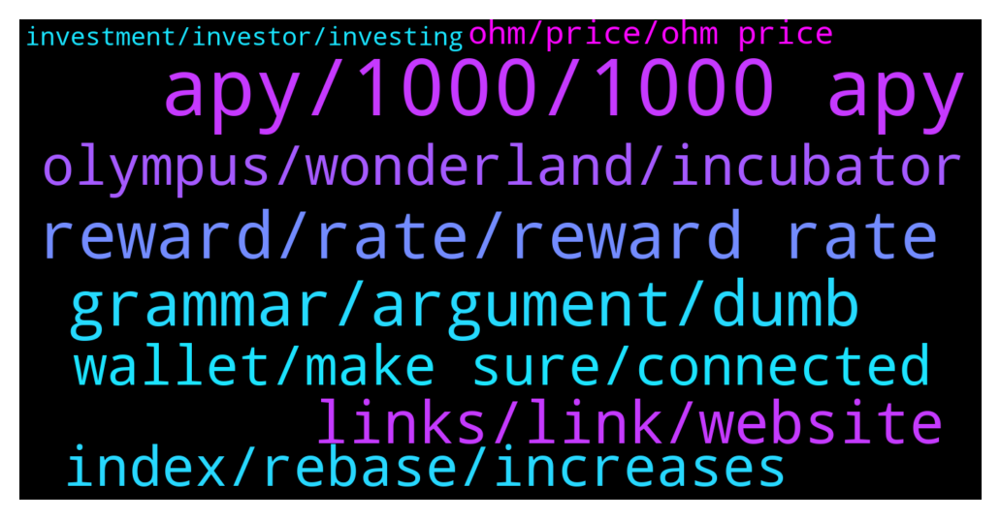

# **@OlympusTG**
 ## Analysis for **2022-02-01** - **2022-02-02**.

---

## 📊 **Basic Stats**

**n_messages_sent**: 1047

---

---

## 🔝 **Top keywords and related messages**

1. **apy, 1000, 1000 apy**

    @nfwaple --- *no I am pretty sure it will stay 500% minimum within the token supply range at the moment, if they want to decrease the APY before we hit the upper token supply range, there would probably be a proposal* **--->** [TG Discussion](https://t.me/OlympusTG/177903)

    @timon_k --- *how much is the apy going to go down in the next few months?  I don’t think the price would go down much more, but the APY keeps declining, can’t calculate against that if I don’t know* **--->** [TG Discussion](https://t.me/OlympusTG/178103)

    @TNrafi2109 --- *So if we keep on formula, apy can keep decreasing* **--->** [TG Discussion](https://t.me/OlympusTG/177901)

    @David IL --- *Lol APY is already at 800% and keeps decreasing 🤣🤣🤣* **--->** [TG Discussion](https://t.me/OlympusTG/177882)

    @Alden_168 --- *The 1000% apy will be hovering around 1 year, just buy and chill, buddy~* **--->** [TG Discussion](https://t.me/OlympusTG/176400)

    @nfwaple --- *learn about the protocol, the apy is not for this purpose, the supply expands by the same percentage as well* **--->** [TG Discussion](https://t.me/OlympusTG/177221)

2. **reward, rate, reward rate**

    @TNrafi2109 --- *I have been investing since last year when apy is above 4k%. I cannot put additional investmemt if the apy and price keep decreasing. That why i nees to understand the calculation of reward rate* **--->** [TG Discussion](https://t.me/OlympusTG/176409)

    @TNrafi2109 --- *No it is reward yield not reward rate* **--->** [TG Discussion](https://t.me/OlympusTG/176365)

    @TNrafi2109 --- *If i know how apy is derived, i wont have more question why apy is always decreasing. Because it is depend on reward rate, supply and staked. Thats why i need to understand the apy calculation* **--->** [TG Discussion](https://t.me/OlympusTG/176397)

    @nfwaple --- *it's current index x (1 + next reward yield %)* **--->** [TG Discussion](https://t.me/OlympusTG/176999)

    @TNrafi2109 --- *Not APY, but reward rate based on this formula of the apy* **--->** [TG Discussion](https://t.me/OlympusTG/176357)

    @TNrafi2109 --- *Pls let me know how to calcuate the rewRd rate* **--->** [TG Discussion](https://t.me/OlympusTG/176381)

3. **grammar, argument, dumb**

    @crypto_7an --- *I understand but the current method is just an overkill.* **--->** [TG Discussion](https://t.me/OlympusTG/177098)

    @NHRAracer --- *Tell y’all what. I’m an old dude. This instant gratification generation ain’t gonna make it!* **--->** [TG Discussion](https://t.me/OlympusTG/177382)

    @Host_Matt --- *im now down many iq points* **--->** [TG Discussion](https://t.me/OlympusTG/177709)

    @SinisterCyclops --- *Can you explain this to me, in layman's terms.  I only have a 105 IQ* **--->** [TG Discussion](https://t.me/OlympusTG/176329)

    @Ossyboi --- *Wise one is the smartest in the world I think* **--->** [TG Discussion](https://t.me/OlympusTG/177613)

    @WhaleOfWallStreet --- *it may happen only in a dream 😔* **--->** [TG Discussion](https://t.me/OlympusTG/176629)

4. **links, link, website**

    @Palancapa --- *''download our app'' and then on the page you see a link to ios and google playstore* **--->** [TG Discussion](https://t.me/OlympusTG/177079)

    @Palancapa --- *oh shit gonna download it right now* **--->** [TG Discussion](https://t.me/OlympusTG/177035)

    @walter0331 --- *you can find it on the website sir* **--->** [TG Discussion](https://t.me/OlympusTG/177978)

    @nfwaple --- *there is another line for it* **--->** [TG Discussion](https://t.me/OlympusTG/176875)

    @minati666 --- *Could u please highlight us the answer if u can find? Being a mod* **--->** [TG Discussion](https://t.me/OlympusTG/176087)

    @nfwaple --- *don't want people to click it accidentally* **--->** [TG Discussion](https://t.me/OlympusTG/176810)

5. **olympus, wonderland, incubator**

    @Anselmo007 --- *If not the apy what is the reason for invest in olympus?* **--->** [TG Discussion](https://t.me/OlympusTG/177402)

    @SMNFT7 --- *Jessie did a well job explaining what is happening with Olympus, watch this video:   https://www.youtube.com/watch?v=jETcS1nnv8U* **--->** [TG Discussion](https://t.me/OlympusTG/178062)

    @alfredojpontara --- *Hallo, why Olympus Lost 92% in the last 60 days?* **--->** [TG Discussion](https://t.me/OlympusTG/176111)

    @nfwaple --- *suggest reading Olympus12 and Econohmly articles, the latest 2* **--->** [TG Discussion](https://t.me/OlympusTG/177406)

    @Ap0l1o --- *In short, Olympus does not control or plans to control the price whatsoever* **--->** [TG Discussion](https://t.me/OlympusTG/176117)

    @Ap0l1o --- *Olympus does not guide or look for value in APY, rather than in what in brings with the money from the treasury* **--->** [TG Discussion](https://t.me/OlympusTG/177269)

6. **wallet, make sure, connected**

    @Ap0l1o --- *You should just add the same contract, the token is there, you just don’t see it since your contract is not added* **--->** [TG Discussion](https://t.me/OlympusTG/178034)

    @Ap0l1o --- *Clearing cache and hard reload helps :)* **--->** [TG Discussion](https://t.me/OlympusTG/177032)

    @Palancapa --- *i connected my wallet and still only see this lol* **--->** [TG Discussion](https://t.me/OlympusTG/176987)

    @nfwaple --- *also make sure that you're connected to the right wallet, sometimes people have multiple wallets and the website is connected to a wrong one* **--->** [TG Discussion](https://t.me/OlympusTG/176733)

    @nfwaple --- *yea just open the website, connect to the right wallet then leave it there for a couple min* **--->** [TG Discussion](https://t.me/OlympusTG/176761)

    @Palancapa --- *but not in my wallet hahah* **--->** [TG Discussion](https://t.me/OlympusTG/177027)

7. **index, rebase, increases**

    @Palancapa --- *what will the index be after the next rebase?* **--->** [TG Discussion](https://t.me/OlympusTG/176992)

    @Ap0l1o --- *That is why it doesn’t show you the rebases* **--->** [TG Discussion](https://t.me/OlympusTG/178008)

    @Ap0l1o --- *With the next rebase, you will have for example 77 sOhm* **--->** [TG Discussion](https://t.me/OlympusTG/178076)

    @SecuriTech24 --- *OHM looking good today. Can see those rebases working at this price range.* **--->** [TG Discussion](https://t.me/OlympusTG/177830)

    @SecuriTech24 --- *Get off your face with the rebase. Wait* **--->** [TG Discussion](https://t.me/OlympusTG/176587)

    @nfwaple --- *there is a 'current index' on the website dashboard, gOHM is a wrapped staked version of OHM, 1 gOHM = (current index) OHM. If the index is 70, it means 1 gOHM contains 70 sOHM. That index increases every rebase* **--->** [TG Discussion](https://t.me/OlympusTG/176791)

8. **ohm, price, ohm price**

    @Palancapa --- *you guys will regret selling ohm in a year or two* **--->** [TG Discussion](https://t.me/OlympusTG/177146)

    @SaintJerome --- *OHM is good for now. I'm talking about when OHM supply is close to 100mill. 100mill is a psychological barrier where new investors may deem OHM as being too diluted* **--->** [TG Discussion](https://t.me/OlympusTG/176073)

    @Sonnie --- *What happened with OHM price drop down 60$ ? Market price is lower than Bonding.* **--->** [TG Discussion](https://t.me/OlympusTG/176446)

    @RichR7 --- *Those who find OHM undervalued and cheap.  I would buy if I had more money.* **--->** [TG Discussion](https://t.me/OlympusTG/176110)

    @noexec --- *I just got into ohm when it was below 100 and kept dca-ing . Long term hold for me, let's see how this will play out* **--->** [TG Discussion](https://t.me/OlympusTG/177840)

    @Colonelgaddafi --- *Guys ohm just pumped like 4% wgmi* **--->** [TG Discussion](https://t.me/OlympusTG/177140)

