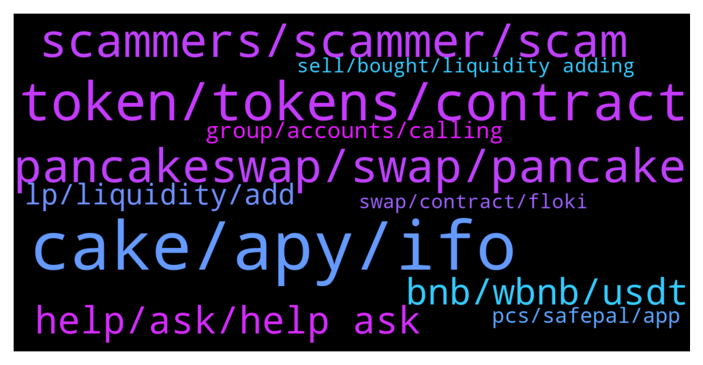

# **@PancakeSwap**
 ## Analysis for **2022-02-01** - **2022-02-02**.

---

## 📊 **Basic Stats**

**n_messages_sent**: 713

---

---

## 🔝 **Top keywords and related messages**

1. **cake, apy, ifo**

    @OskarMA90 --- *IF they reduce emissions even further, Then THE apy Will be so oow that no new investors benefits from staking cake. Only THE big bag holders Will benefits cuz their cake Price Will increase.   What would be best is to increase emission and increase burn mechanism they already have in lotteriers etc* **--->** [TG Discussion](https://t.me/PancakeSwap/2315802)

    @FabulousXBT --- *You ask in cake group So CAKE* **--->** [TG Discussion](https://t.me/PancakeSwap/2314760)

    @wilmone --- *hi! i got many cakes in auto pool, is it possible that i lost some recent profit when i added more in staking? i was waiting for harvesting a couple of cake but they gone to 0 after placing new cakes in stake...* **--->** [TG Discussion](https://t.me/PancakeSwap/2317444)

    @LeonardoOtto --- *Hi guys, i'm new. I'm considering the idea of investing 400 $ in cake and stake those cake to obtain 65% apy. Is there anyone of you that have made the same thing?? Let me know, Thank you very much.* **--->** [TG Discussion](https://t.me/PancakeSwap/2317138)

    @OskarMA90 --- *THE Price of cake Will Go Up even IF emissions are increased once crypto takes off with the masses. Not many People Invest in crypto. Like less than 1% does that, and 99% of those 1% are into cryptos that we see om coinbase, not any dexe, just coins of THE biggest chains and No tokens.* **--->** [TG Discussion](https://t.me/PancakeSwap/2315814)

    @phamluan90 --- *mind admin let me know your plan to increase the amount of cake burned in the future? example: increase the number of burned per 0.25cake/block per month or every 2 months* **--->** [TG Discussion](https://t.me/PancakeSwap/2316067)

2. **token, tokens, contract**

    @TomorrowlandForLife --- *Nothing can be locked. I don't understand what you mean Please explain in detail* **--->** [TG Discussion](https://t.me/PancakeSwap/2317319)

    @god_rider --- *I must say that It's not a scam token It seems that my tokens are "locked in approval transaction" so I can not make other transaction any idea please!* **--->** [TG Discussion](https://t.me/PancakeSwap/2317318)

    @Tafadzwa --- *Any info on the floki token,* **--->** [TG Discussion](https://t.me/PancakeSwap/2315711)

    @TomorrowlandForLife --- *your tokens are in your wallet* **--->** [TG Discussion](https://t.me/PancakeSwap/2317299)

    @Ride2Esc --- *HOW? I can get the contract address ?  I had MANY tokens. I dont remember all :D* **--->** [TG Discussion](https://t.me/PancakeSwap/2314796)

    @Re1naldoch4 --- *Hey...any admins around? My nft tokens are gone from trustwallet* **--->** [TG Discussion](https://t.me/PancakeSwap/2316825)

3. **scammers, scammer, scam**

    @Identikit9 --- *I know buddy I was just curious how many scammers would DM me. Lol its INSANE* **--->** [TG Discussion](https://t.me/PancakeSwap/2315201)

    @Petkyn --- *Guys, these flash loan attacks are scam, right?* **--->** [TG Discussion](https://t.me/PancakeSwap/2315938)

    @Ceddi200 --- *That’s is combot command lol, telling you to be careful of scammers* **--->** [TG Discussion](https://t.me/PancakeSwap/2315842)

    @JayHC --- *Only responses I get is from scammers in dm's 😭* **--->** [TG Discussion](https://t.me/PancakeSwap/2315783)

    @dannn1230 --- *Is it possible to swap ETHM and how ERC20  Scammer don’t dm* **--->** [TG Discussion](https://t.me/PancakeSwap/2317504)

    @ManBlyat --- *beware from fake admin / support dm u ser, they're scammer* **--->** [TG Discussion](https://t.me/PancakeSwap/2316872)

4. **pancakeswap, swap, pancake**

    @mrbeandev --- *😤😤 why does pancakeswap supports such a tokens 🙄* **--->** [TG Discussion](https://t.me/PancakeSwap/2314657)

    @FabulousXBT --- *I dont have any pancakesquad but BULLISH EM 📈📈📈* **--->** [TG Discussion](https://t.me/PancakeSwap/2314755)

    @jimmy8880 --- *You’ll need to Import them again in pancakeswap when you want to swap* **--->** [TG Discussion](https://t.me/PancakeSwap/2314946)

    @Spoletik --- *Is it real to publish my own pictures like NFTs on pancakeswap?* **--->** [TG Discussion](https://t.me/PancakeSwap/2317127)

    @WisdomINaction --- *So this happens to everyone that does a swap in pancakeswap? sorry because im new to crypto and wondering how these fake airdrops happens to me when i didnt visit or do anything shady* **--->** [TG Discussion](https://t.me/PancakeSwap/2316995)

    @Belalyazji --- *Hi  I contacted PancakeSwap to exchange, and as soon as I did, I lost all my coins* **--->** [TG Discussion](https://t.me/PancakeSwap/2315424)

5. **help, ask, help ask**

    @Shitcoin --- *im dev to ser pls dont ban me* **--->** [TG Discussion](https://t.me/PancakeSwap/2316321)

    @al7842 --- *You just appeared here for me to not freak out 😂* **--->** [TG Discussion](https://t.me/PancakeSwap/2316567)

    @jShiz --- *Thanks I’m usually never in here haha* **--->** [TG Discussion](https://t.me/PancakeSwap/2316565)

    @ManBlyat --- *just ask, maybe we can help* **--->** [TG Discussion](https://t.me/PancakeSwap/2316875)

    @Ceddi200 --- *This was meant for u. Loll https://t.me/PancakeSwap/2315508* **--->** [TG Discussion](https://t.me/PancakeSwap/2315519)

    @konstantinossw --- *What why u report me Bro haha I said I need help* **--->** [TG Discussion](https://t.me/PancakeSwap/2315841)

6. **bnb, wbnb, usdt**

    @Mark_LCL --- *Yes.  Looking at the TXN it looks like it was transferred back to me as wrapped BNB* **--->** [TG Discussion](https://t.me/PancakeSwap/2317527)

    @Mark_LCL --- *Sorry keep asking questions but when I try to unwrap using my account (0x52b23Fc2a5C796B34da4a6f6e2D6aA82333D9dA8) it shows a wbnb balance of 0 so I can't exchange into BNB* **--->** [TG Discussion](https://t.me/PancakeSwap/2317551)

    @Ceddi200 --- *Here is your balance. Go to the exchange and unwrap 0.419 wbnb to bnb* **--->** [TG Discussion](https://t.me/PancakeSwap/2317541)

    @foolofall --- *Have you added / imported  BNB token in your wallet?* **--->** [TG Discussion](https://t.me/PancakeSwap/2317526)

    @elliot13458 --- *i swapped bnb for eartha on the pancakseswap site* **--->** [TG Discussion](https://t.me/PancakeSwap/2316620)

    @Mark_LCL --- *But I've checked my WBNB and BNB on meta wallet and neither of them are showing through* **--->** [TG Discussion](https://t.me/PancakeSwap/2317529)

7. **lp, liquidity, add**

    @jShiz --- *Question about migration on renounced contracts.  Will there be any way in the future for PCS to move our liquidity from V1 to V2?* **--->** [TG Discussion](https://t.me/PancakeSwap/2316460)

    @Shitcoin --- *you can remove liquidity from V1 and add again to V2 rounter* **--->** [TG Discussion](https://t.me/PancakeSwap/2316503)

    @Shitcoin --- *Yeah,i just answer you, i do same like that to my old contract, i just remove liquidity and add again to V2 with new smart contract. i talk about  Liquidity my own coin, not LP from farm or other Pool* **--->** [TG Discussion](https://t.me/PancakeSwap/2316515)

    @Shitcoin --- *you can't remove ur Liquidity ? 😂 send me smart contract let me check* **--->** [TG Discussion](https://t.me/PancakeSwap/2316518)

    @Ceddi200 --- *When you add liquidity you receive lp tokens as a proof of your share to the pool and you earn swap fees which gets added to your lp position and can only be withdrawn when you remove your liquidity  You can stake them on farm if the pair is available to earn cake. Take note of impermanentloss also   Staking + lpfees rewards = 12 % at the moment* **--->** [TG Discussion](https://t.me/PancakeSwap/2315508)

    @juapia --- *When you add liquidity you receive lp tokens as a proof of your share to the pool and you earn swap fees which gets added to your lp position and can only be withdrawn when you remove your liquidity* **--->** [TG Discussion](https://t.me/PancakeSwap/2316002)

8. **group, accounts, calling**

    @CezarL --- *There are like 4 accounts messaging&calling me right after joining the group* **--->** [TG Discussion](https://t.me/PancakeSwap/2314940)

    @matt --- *Wow. only been on here 2 minutes.  had 4 phone calls. whats that all about ?* **--->** [TG Discussion](https://t.me/PancakeSwap/2316676)

    @stevensmith001 --- *I have 3 Squad NFT’s bro….😎 + A Panurai* **--->** [TG Discussion](https://t.me/PancakeSwap/2317469)

    @Putra423 --- *just type, too many people are calling* **--->** [TG Discussion](https://t.me/PancakeSwap/2315971)

    @devmaheremad96 --- *What exactly do I need to sub. with them? How long is the waiting?* **--->** [TG Discussion](https://t.me/PancakeSwap/2315047)

    @Tigerhawk89 --- *Join our squad group man and let us discuss* **--->** [TG Discussion](https://t.me/PancakeSwap/2317466)

9. **pcs, safepal, app**

    @Shinyu --- *Yes I have TrustWallet send me the PCS link* **--->** [TG Discussion](https://t.me/PancakeSwap/2314610)

    @TomorrowlandForLife --- *PCS doesn't have an app To access to PCS from a phone you need to use a wallet Trust Wallet, SafePal or Token Pocket* **--->** [TG Discussion](https://t.me/PancakeSwap/2314607)

    @TomorrowlandForLife --- *yes sir, on ETH network, not on PCS* **--->** [TG Discussion](https://t.me/PancakeSwap/2317517)

    @forc3r --- *Sure, it's pretty easy. Just ask CORE team* **--->** [TG Discussion](https://t.me/PancakeSwap/2317212)

    @jShiz --- *We launched on eth and fegex as well* **--->** [TG Discussion](https://t.me/PancakeSwap/2316531)

    @Shinnanigans --- *Not a metamask user myself but I've set it up before a few times, I'd personally recommend just importing everything to trustwallet or safepal, they are both mobile wallets but neither have failed me and are very reliable with the dapp browser I've always found (especially safepal you can even change rpc, trustwallet is great just if congestion hits no rpc changing). Other than that, for support about meta, your probably better off directly contacting metamask themselves if they have an email just shoot one over to them and ask what your issue is, friendly customer support from what I've heard 👍* **--->** [TG Discussion](https://t.me/PancakeSwap/2316372)

10. **swap, contract, floki**

    @glorious167 --- *Im trying to swap $IPX and getting error message* **--->** [TG Discussion](https://t.me/PancakeSwap/2317701)

    @G --- *Can anyone help me? I wanted to swap more, but the first swapping is not showing at my own end* **--->** [TG Discussion](https://t.me/PancakeSwap/2317374)

    @jShiz --- *renounced contract if you read what i wrote.  Thanks!* **--->** [TG Discussion](https://t.me/PancakeSwap/2316505)

    @Carlos_Filh0 --- *I need support in this swap 0xdc7b477e3bdfb8f6cc58787f0c9f3502952917117e315e523c3d6a92353c56a7 I don't receive BUSD's* **--->** [TG Discussion](https://t.me/PancakeSwap/2315297)

    @jShiz --- *We renounced ownership when we launched last march  0x92a42db88ed0f02c71d439e55962ca7cab0168b5* **--->** [TG Discussion](https://t.me/PancakeSwap/2316523)

    @god_rider --- *Hi devs, I can't swap my tokens , It always shows this error: execution reverted: TransferHelper: TRANSFER_FROM_FAILED please help* **--->** [TG Discussion](https://t.me/PancakeSwap/2317604)

