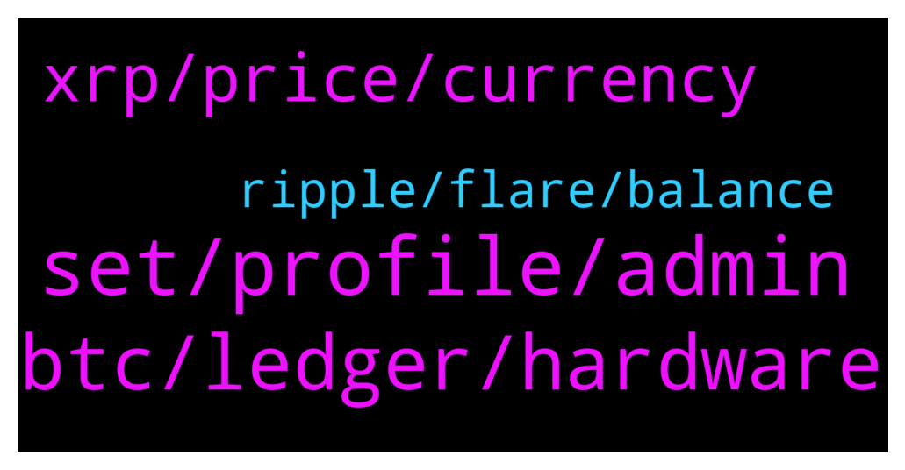

# **@Ripple**
 ## Analysis for **2022-02-01** - **2022-02-02**.

---

## 📊 **Basic Stats**

**n_messages_sent**: 139

---

---

## 🔝 **Top keywords and related messages**

1. **set, profile, admin**

    @TheRealPrussian --- *Let me know how easy or hard the setup is.  I like to hear from real people.* **--->** [TG Discussion](https://t.me/Ripple/3048348)

    @Chrisesp02 --- *But i have a profile pic* **--->** [TG Discussion](https://t.me/Ripple/3048315)

    @terrachad --- *this is the chat isn't it ?* **--->** [TG Discussion](https://t.me/Ripple/3048061)

    @TheRealPrussian --- *Glad I went with my guy on that one.  You never know.* **--->** [TG Discussion](https://t.me/Ripple/3048286)

    @Tinkabellagal --- *Very nice gesture   Set an @username in settings* **--->** [TG Discussion](https://t.me/Ripple/3048289)

    @JesusJames --- *oh then that make it publicly visible part pertains to you then* **--->** [TG Discussion](https://t.me/Ripple/3048317)

2. **btc, ledger, hardware**

    @Tinkabellagal --- *⁠India to introduce 30% crypto tax, digital rupee CBDC by 2022-23   Finance minister Nirmala Sitharaman believes the introduction of a CBDC will provide a “big boost” to India's digital economy.  https://ct.com/aam3* **--->** [TG Discussion](https://t.me/Ripple/3048159)

    @Chrisesp02 --- *Ok guys, so isn't ledger a hardware wallet?* **--->** [TG Discussion](https://t.me/Ripple/3048322)

    @ravibk --- *Very happy that, there'll be no ban crypto 😊* **--->** [TG Discussion](https://t.me/Ripple/3048175)

    @anuj90322 --- *U are complicating things or u do not understand the simplicity of crypto transfer* **--->** [TG Discussion](https://t.me/Ripple/3048017)

    @TheRealPrussian --- *Yea, ledger nano and ledger x are hardware wallets.  Nano can’t be used on Apple devices but X can.  I personally don’t like X because of its Bluetooth capabilities.  If I’m getting a hardware wallet I want it cold but that’s user’s choice.* **--->** [TG Discussion](https://t.me/Ripple/3048338)

    @AbuRidwan16 --- *Anyone got their solo airdrop on binance?* **--->** [TG Discussion](https://t.me/Ripple/3048180)

3. **xrp, price, currency**

    @JustNNM --- *Price wise i have no idea.  It doesn’t need to be a stable currency to bridge different currencies.  Ill break it down to the most simple understanding Us sends $10 > XRP bridges with $10 worth > out pops the other currency equivalent to the $10  XRP could be priced at 1 billion but you only need $10 worth for that bridge, so a drop of an XRP* **--->** [TG Discussion](https://t.me/Ripple/3048495)

    @Riaje2 --- *One day, xrp became the new dollar us for international exchange.* **--->** [TG Discussion](https://t.me/Ripple/3048088)

    @arunmaster --- *Xrp behaving like dead coin. my god* **--->** [TG Discussion](https://t.me/Ripple/3048486)

    @Jake_ripple_XRP --- *It would be good for one country after another... to adopt XRP as an official currency... This is likely what the SEC and others in the US are worried about...* **--->** [TG Discussion](https://t.me/Ripple/3048097)

    @Dandreb --- *If xrp explode this year, I will buy mom a car , Mark my words* **--->** [TG Discussion](https://t.me/Ripple/3048287)

    @TheRealPrussian --- *What’s the best place to buy XRP for US based buyers?  All of the wallets I currently hold no longer offer XRP.* **--->** [TG Discussion](https://t.me/Ripple/3048276)

4. **ripple, flare, balance**

    @hennyvangemert --- *i have a Ripple Wallet problem, anyone around for advice?* **--->** [TG Discussion](https://t.me/Ripple/3048294)

    @Baptiste_EOS --- *I am looking to know more.. If I can use ripple to start transfer money for my company. I can start a big project with that blockchain.* **--->** [TG Discussion](https://t.me/Ripple/3048376)

    @Baptiste_EOS --- *I have one question about Ripple. To do money transfer, we need to have licence of money transfer right ? How it s work if I use ripple ? I need to have this licence before to use ripple ?* **--->** [TG Discussion](https://t.me/Ripple/3048005)

    @terrachad --- *I see, so this room has no official link to ripple corporation. rip them* **--->** [TG Discussion](https://t.me/Ripple/3048066)

    @Jodxb2311 --- *Yep this is Ripple, everyone is a little crazy but that comes from HODLING for a couple of years.* **--->** [TG Discussion](https://t.me/Ripple/3048053)

    @iboxx11 --- *i believe ripple will be wild* **--->** [TG Discussion](https://t.me/Ripple/3048531)

