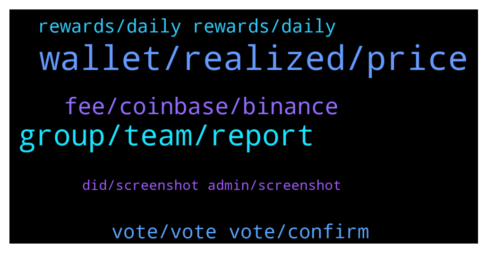

# **@algorand**
 ## Analysis for **2022-02-01** - **2022-02-02**.

---

## 📊 **Basic Stats**

**n_messages_sent**: 133

---

---

## 🔝 **Top keywords and related messages**

1. **wallet, realized, price**

    @CtrlAD --- *Anyone have any insight on how algoexporer calculates realized price, and specifically what likely happened on the 25th between 1000 and 1100 UTC? https://algoexplorer.io/top-statistics (look at Realized Price/Realized Cap 1 week chart)* **--->** [TG Discussion](https://t.me/algorand/336253)

    @Az --- *How likely is Algo bull run at 0.98 to 1.28 going to happen ?? ALGO nudging $0.98 now...source Liquidity Hunters* **--->** [TG Discussion](https://t.me/algorand/336407)

    @MrNice28 --- *The current annual yield is 0.6% I thought it was fixed at 5/6%. Did it go down because of the market? In the event for example of a bull run, will it go back up?* **--->** [TG Discussion](https://t.me/algorand/336414)

    @nolambojustcivic --- *It’s always a good time to buy Algo* **--->** [TG Discussion](https://t.me/algorand/336305)

    @willywonkaflavour --- *So guys which tokken can one get on algo that will make a good profit in short time* **--->** [TG Discussion](https://t.me/algorand/336444)

    @MackDenver --- *It works fine unless someone moves Algo from the wallet.* **--->** [TG Discussion](https://t.me/algorand/336519)

2. **group, team, report**

    @billy_7 --- *Guess I'll have to leave the group then, I was looking forward to being part of it but I'm not subjecting myself to unsolicited messages just by joining a group* **--->** [TG Discussion](https://t.me/algorand/336530)

    @Shane --- *Type in this chat and within 1 minute receive scam message lol.* **--->** [TG Discussion](https://t.me/algorand/336492)

    @MackDenver --- *You can hear more from Chivo or their team, we don't have any information about it atm.* **--->** [TG Discussion](https://t.me/algorand/336520)

    @MackDenver --- *Hey Mamad, Feel free to ask it.* **--->** [TG Discussion](https://t.me/algorand/336534)

    @MackDenver --- *I don't have any news information about it.* **--->** [TG Discussion](https://t.me/algorand/336510)

    @MackDenver --- *Please use the report and block button.* **--->** [TG Discussion](https://t.me/algorand/336532)

3. **fee, coinbase, binance**

    @Delmas56 --- *Hello what’s the initial fee you hav to pay Algorand befor you can purchase the coin thanks* **--->** [TG Discussion](https://t.me/algorand/336286)

    @alli_dunn --- *Good morning, a question what do you think of Coinbase? I have always used binance* **--->** [TG Discussion](https://t.me/algorand/336552)

    @AbuRidwan16 --- *Hi!  I have a online store, how can i accept Algorand as payment method?* **--->** [TG Discussion](https://t.me/algorand/336558)

    @. --- *Hi i have some question anyone ask me ? What is the total amount of fees generated on Algorand since the first block* **--->** [TG Discussion](https://t.me/algorand/336549)

    @Az --- *Gm, coinbase is designed for ease of user but doesn't have anywhere as near nr of coins as  binance does.  Coinbase Pro I think is better than coinbase as it has functionality to place stop limit buys and sells.* **--->** [TG Discussion](https://t.me/algorand/336560)

    @Emily11235578 --- *I've been diving right now, I'm making big purchases of mainstream currencies as I wait for the market to bottom. Fortunately, I have passive income.* **--->** [TG Discussion](https://t.me/algorand/336470)

4. **vote, vote vote, confirm**

    @Onwudiwe --- *Please someone help I tried to cast my vote on the Algorand governance.but I am seeing popup of account does not exist in the storage* **--->** [TG Discussion](https://t.me/algorand/336363)

    @Steven --- *Hi all, I accidentally went under my committed amount for governance and now I'm ineligible. Is there anyway to get back in? I already voted before.  I'm so mad at myself. Was swapping ASA tokens on tinyman and took too much algo out of my wallet.* **--->** [TG Discussion](https://t.me/algorand/336432)

    @MackDenver --- *You had to confirm a transaction to vote* **--->** [TG Discussion](https://t.me/algorand/336378)

    @ljbDeFi --- *How do I get back to Where I can vote. When I go to my wallet there’s no measures there for me to vote on* **--->** [TG Discussion](https://t.me/algorand/336345)

    @MackDenver --- *You have to vote by yourself, Rory.* **--->** [TG Discussion](https://t.me/algorand/336329)

    @MackDenver --- *You can't vote 2 times, that could be the reason* **--->** [TG Discussion](https://t.me/algorand/336374)

5. **rewards, daily rewards, daily**

    @Pablo_cast --- *they will halve and halve again and then dissapear. I think in 2 years* **--->** [TG Discussion](https://t.me/algorand/336273)

    @Malvo --- *Greetings can anyone tell me since awards will only be governance rewards and receiving daily rewards as Algo holder when will the daily rewards stop being distributed?* **--->** [TG Discussion](https://t.me/algorand/336263)

    @NightAlgorand --- *Nope, they are intending to phase it out by changing it to governance.* **--->** [TG Discussion](https://t.me/algorand/336418)

    @patrick_crypto --- *See table at bottom of: https://algorand.foundation/governance/algo-dynamics ending around end of February* **--->** [TG Discussion](https://t.me/algorand/336282)

    @patrick_crypto --- *Ends in 30 days or so* **--->** [TG Discussion](https://t.me/algorand/336279)

    @patrick_crypto --- *participation rewads go to 0 by end of February* **--->** [TG Discussion](https://t.me/algorand/336276)

6. **did, screenshot admin, screenshot**

    @M6R6T --- *Hi admin I have a question* **--->** [TG Discussion](https://t.me/algorand/336533)

    @Nicksof --- *Oh how did you do that* **--->** [TG Discussion](https://t.me/algorand/336445)

    @NightAlgorand --- *Yes, you can do it there too 😉* **--->** [TG Discussion](https://t.me/algorand/336466)

    @NightAlgorand --- *We do not do that here.* **--->** [TG Discussion](https://t.me/algorand/336448)

    @M6R6T --- *But I did not find it. Can you please explain with a screenshot?* **--->** [TG Discussion](https://t.me/algorand/336539)

