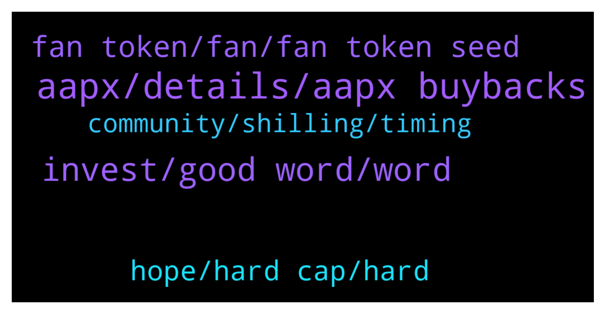

# **@ampnetapxchat**
 ## Analysis for **2022-01-28** - **2022-02-02**.

---

## 📊 **Basic Stats**

**n_messages_sent**: 59

---

---

## 🔝 **Top keywords and related messages**

1. **aapx, details, aapx buybacks**

    @MelonHusk --- *I have never seen a project recover from -98.5% losses.* **--->** [TG Discussion](https://t.me/ampnetapxchat/36820)

    @jakovtradingmentor --- *well i'm told we as ampnet cant really go around and shill the projects on our platform, something about the legality around it doesnt allow us to do so* **--->** [TG Discussion](https://t.me/ampnetapxchat/36779)

    @MelonHusk --- *Don't tell me Ampnet is raising more money?* **--->** [TG Discussion](https://t.me/ampnetapxchat/36814)

    @jakovtradingmentor --- *ofc if raise is successful, which seems like it is, a percentage of that raise is going to ampnet for aapx buybacks* **--->** [TG Discussion](https://t.me/ampnetapxchat/36817)

    @North --- *Fomo will increase as it gets towards  $500K. No way this doesn't get funded. Great news and hopefully we get some more details for AmpNet once we know it's going ahead* **--->** [TG Discussion](https://t.me/ampnetapxchat/36773)

    @jakovtradingmentor --- *which is a project that's using the ampnet platform* **--->** [TG Discussion](https://t.me/ampnetapxchat/36816)

2. **invest, good word, word**

    @runex_x1 --- *almost feel sorry to have not invested in biznisport 😊, but can't invest everywhere :)* **--->** [TG Discussion](https://t.me/ampnetapxchat/36893)

    @runex_x1 --- *as an early investor too :)* **--->** [TG Discussion](https://t.me/ampnetapxchat/36884)

    @runex_x1 --- *I wish the team all the luck on this one. We can use some positive investment news after all this technical progress* **--->** [TG Discussion](https://t.me/ampnetapxchat/36883)

    @North --- *Three I've made money from are Unibright, Strong, Thor. Countless others.  You couldn't even be bothered to research who is raising funds here, so I'm not surprised you miss these opportunities* **--->** [TG Discussion](https://t.me/ampnetapxchat/36825)

    @North --- *Nice! +$65k in the past 16 hours alone then* **--->** [TG Discussion](https://t.me/ampnetapxchat/36771)

    @RUK2354 --- *The project fundamentals are strong; we are hoping that you will deliver on the huge potential this project has.* **--->** [TG Discussion](https://t.me/ampnetapxchat/36819)

3. **fan token, fan, fan token seed**

    @Tinus_Tussengas_1984 --- *is there somewhere we can see the progress on the prudenzzafc fan token seed sale?* **--->** [TG Discussion](https://t.me/ampnetapxchat/36828)

    @runex_x1 --- *I have to say, the token on its own looks great given the fact that people will be able to use it in real stores* **--->** [TG Discussion](https://t.me/ampnetapxchat/36896)

    @Tinus_Tussengas_1984 --- *ah oke, so no actual token sale. thanks :) (Y)* **--->** [TG Discussion](https://t.me/ampnetapxchat/36831)

    @jakovtradingmentor --- *The only fan token seed sale ongoing right now on AMPnet platform is Vatreni Token* **--->** [TG Discussion](https://t.me/ampnetapxchat/36830)

    @jakovtradingmentor --- *thats the raise for vatreni token* **--->** [TG Discussion](https://t.me/ampnetapxchat/36815)

    @runex_x1 --- *Regarding the croatian fantoken. Should anybody be interested. I asked some questions:There is a 30day linear vesting period. And there will be liquidity on Uniswap. We will lauch it after the public sale is over and considering the crypto market* **--->** [TG Discussion](https://t.me/ampnetapxchat/36897)

4. **hope, hard cap, hard**

    @mislavjavor --- *Hey all, the bar counts until hard cap is reached, the percentage until the hard cap i* **--->** [TG Discussion](https://t.me/ampnetapxchat/36808)

    @Tinus_Tussengas_1984 --- *thanks m8. that loading bar is looking strange btw... i assume its to see the progress in time to the deadline instead of the percentage of funding 😋* **--->** [TG Discussion](https://t.me/ampnetapxchat/36806)

    @Tinus_Tussengas_1984 --- *I sincerely hope they will… 20% left for the past few days so that doesn’t give much hope. If they don’t reach the soft cap I hope they will change it* **--->** [TG Discussion](https://t.me/ampnetapxchat/36865)

    @jakovtradingmentor --- *i'm not a 100% sure as I haven't been told so maybe one of the devs can answer this* **--->** [TG Discussion](https://t.me/ampnetapxchat/36859)

    @mislavjavor --- *there is a bug though, it seems* **--->** [TG Discussion](https://t.me/ampnetapxchat/36811)

    @matejmz --- *Yeah, it is bugged apparently. (Time would be at 50%, so this is not the case)  @mislavjavor* **--->** [TG Discussion](https://t.me/ampnetapxchat/36807)

5. **community, shilling, timing**

    @North --- *I didn't mean you guys 😂 that's what we are here for. And frankly we will probably do it anyway unless you say the timing is unwise* **--->** [TG Discussion](https://t.me/ampnetapxchat/36781)

    @jakovtradingmentor --- *but the community, you guys, you can do so if you're motivated to* **--->** [TG Discussion](https://t.me/ampnetapxchat/36780)

    @North --- *@jakovtradingmentor what do you think about timing of any shilling to Chiliz community? They obviously have aligned interests and so would probably be interested here too, but we should take care to not get ahead of ourselves* **--->** [TG Discussion](https://t.me/ampnetapxchat/36775)

    @jakovtradingmentor --- *could you elaborate by what you mean with shilling to chilliz community?* **--->** [TG Discussion](https://t.me/ampnetapxchat/36776)

    @Tinus_Tussengas_1984 --- *lol, team is trying their best as you can read from Mislav's previous pinnend messages. Go take your FUD somewhere else* **--->** [TG Discussion](https://t.me/ampnetapxchat/36821)

    @jakovtradingmentor --- *alright so yeah we agree here :D* **--->** [TG Discussion](https://t.me/ampnetapxchat/36782)

