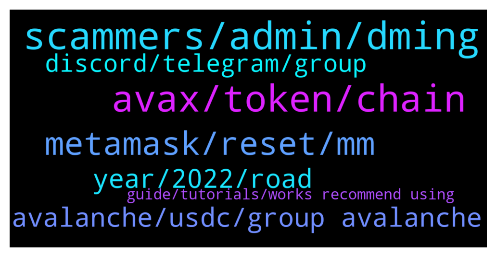

# **@avalancheavax**
 ## Analysis for **2022-02-01** - **2022-02-02**.

---

## 📊 **Basic Stats**

**n_messages_sent**: 119

---

---

## 🔝 **Top keywords and related messages**

1. **scammers, admin, dming**

    @Gengar622inu --- *Many scammers around here are sending me DMs.* **--->** [TG Discussion](https://t.me/avalancheavax/325799)

    @trading_crypt0 --- *I got 4 messages from fake admins asking for my seed phrase  Damn* **--->** [TG Discussion](https://t.me/avalancheavax/326026)

    @ccnkk --- *why, i don't understand? Is there a real admin who can answer me. all the scammers started typing.* **--->** [TG Discussion](https://t.me/avalancheavax/325837)

    @alrko616 --- *Scammer DMIng me suck your balls* **--->** [TG Discussion](https://t.me/avalancheavax/325891)

    @Shun --- *I swear this room has the most aggressive scammers* **--->** [TG Discussion](https://t.me/avalancheavax/325869)

    @Qadfariz --- *Someone named admin added me to an "Avax channel" where they said the were doing a 1800 USD giveaway and all I had to do was enter my private keys for the wallet. Man these scams.* **--->** [TG Discussion](https://t.me/avalancheavax/325810)

2. **avax, token, chain**

    @trading_crypt0 --- *Need help I transfered usdt to avax and now i only see it in the swap and not my wallet* **--->** [TG Discussion](https://t.me/avalancheavax/326016)

    @ccnkk --- *I forgot to make a buy token. Is my right to buy and 1 avax gone?* **--->** [TG Discussion](https://t.me/avalancheavax/325823)

    @Gengar622inu --- *Is there a brige between AVAX and BSC?* **--->** [TG Discussion](https://t.me/avalancheavax/325792)

    @John --- *hi, can i transfer avax directly from kucoin to my metamask wallet in avax? or i have to transfer to avax wallet first?* **--->** [TG Discussion](https://t.me/avalancheavax/325784)

    @bobbafetx --- *How do i sell my avax in metamask?* **--->** [TG Discussion](https://t.me/avalancheavax/325908)

    @Platemha --- *If one sends an nft on metamask to avax wallet c chain, it does not show up under collectibles. If you add the hft adress it shows but the preview doesn't show. Is there anyway of seeing the nft in avax wallet under collectibles?* **--->** [TG Discussion](https://t.me/avalancheavax/326018)

3. **metamask, reset, mm**

    @TheSEOdude --- *you need to reset your metamask, then redo the transactions.* **--->** [TG Discussion](https://t.me/avalancheavax/325878)

    @Wes --- *Is anyone else having issues with pending txs using MetaMask & ledger?  Everything was working fine until about 2 days ago.  I keep upping my gas rate but still can’t complete a new tx* **--->** [TG Discussion](https://t.me/avalancheavax/325877)

    @YoshiBowser --- *yes same here, I reset MM and tried to enter another transaction still the same. So i was supposed to buy XAVA at 6.6..* **--->** [TG Discussion](https://t.me/avalancheavax/325735)

    @Wes --- *That works with just my MetaMask transactions… but my MM via ledger txs still won’t go through. Is anyone else using ledger with MM?* **--->** [TG Discussion](https://t.me/avalancheavax/325879)

    @bobbafetx --- *If i swap in pangolin to bnb, will the bnb directly go to my metamask wallet?* **--->** [TG Discussion](https://t.me/avalancheavax/326002)

    @bobbafetx --- *Hi. Can some advise me how to send weth from pangolin to metamask?* **--->** [TG Discussion](https://t.me/avalancheavax/325995)

4. **avalanche, usdc, group avalanche**

    @Nicolas_A --- *You are in the wrong channel. Ask in the Avalaunch one https://t.me/avalaunch_app* **--->** [TG Discussion](https://t.me/avalancheavax/325916)

    @Mick1187k --- *There is a fake Avalanche Bridge showing up on Google search. Almost got caught 😮* **--->** [TG Discussion](https://t.me/avalancheavax/325753)

    @TheSEOdude --- *The e version is bridged one i.e not native to avalanche. Usdc is native one.* **--->** [TG Discussion](https://t.me/avalancheavax/325846)

    @m4rtin_tr --- *This group is for Avalanche not Avalaunch, so no one here can help you* **--->** [TG Discussion](https://t.me/avalancheavax/325840)

    @racdamen --- *Hello, anyone knows the difference between usdc and usdc.e in avalanche chain ?* **--->** [TG Discussion](https://t.me/avalancheavax/325844)

    @say0ga --- *When avalanche no suspend in exchange?* **--->** [TG Discussion](https://t.me/avalancheavax/325821)

5. **year, 2022, road**

    @elnaluan --- *By the way what's the road map for this project* **--->** [TG Discussion](https://t.me/avalancheavax/325943)

    @D --- *What is the price prediction for this year ?* **--->** [TG Discussion](https://t.me/avalancheavax/325949)

    @arcterex --- *Whats a good project thats coming up?* **--->** [TG Discussion](https://t.me/avalancheavax/325976)

    @angkou --- *wen wallet app wen new roadmap?* **--->** [TG Discussion](https://t.me/avalancheavax/326031)

    @oathtobarbatos --- *Please, move that question to the trading group https://t.me/avalanche_trading* **--->** [TG Discussion](https://t.me/avalancheavax/325951)

    @onecryptochick --- *As far as I know they have not released a 2022 roadmap as of yet.  Last I heard they're working on it, but than again that was 3 weeks ago.* **--->** [TG Discussion](https://t.me/avalancheavax/325946)

6. **discord, telegram, group**

    @elnaluan --- *I don't even know how discord works Is it an app* **--->** [TG Discussion](https://t.me/avalancheavax/325938)

    @web3nft --- *Anyone know how to deal with wickbot in discord?* **--->** [TG Discussion](https://t.me/avalancheavax/325937)

    @m4rtin_tr --- *You can ask to Avalaunch telegram group* **--->** [TG Discussion](https://t.me/avalancheavax/325833)

    @ccnkk --- *ı try but "Avalaunch telegram group"Sorry, this group is not accessible."* **--->** [TG Discussion](https://t.me/avalancheavax/325834)

    @ccnkk --- *yes i know but i can't join that group i don't understand why* **--->** [TG Discussion](https://t.me/avalancheavax/325841)

    @jesslynseah --- *anyone knows when this tele chat was created! i’m in sch doing research on social media influence on defi projects and your replies wld be greatly appreciated 😭* **--->** [TG Discussion](https://t.me/avalancheavax/325960)

7. **guide, tutorials, works recommend using**

    @oathtobarbatos --- *Yeah, you can use synapse protocol or celer bridge for that* **--->** [TG Discussion](https://t.me/avalancheavax/325793)

    @Nicolas_A --- *Not exactly sure how it works. I would just recommend using Kalao or equivalent to view your NFTs* **--->** [TG Discussion](https://t.me/avalancheavax/326024)

    @ipeltek --- *There are many tutorials for that, watch 3-4 of them , they will guide u* **--->** [TG Discussion](https://t.me/avalancheavax/325915)

    @oathtobarbatos --- *There are a few tutorials on the website* **--->** [TG Discussion](https://t.me/avalancheavax/325796)

    @Nicolas_A --- *Wen its ready. Have no info on this* **--->** [TG Discussion](https://t.me/avalancheavax/326032)

    @Gengar622inu --- *IDK what is that. Do you have any guide on that?* **--->** [TG Discussion](https://t.me/avalancheavax/325794)

