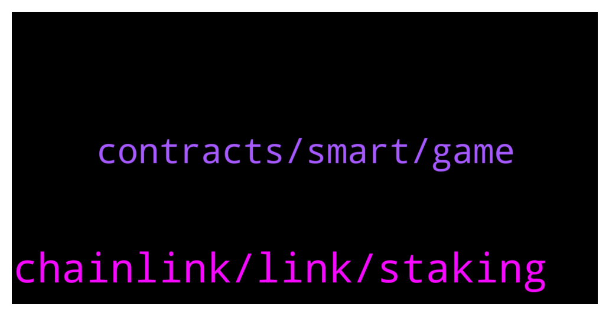

# **@chainlinkofficial**
 ## Analysis for **2022-02-01** - **2022-02-02**.

---

## 📊 **Basic Stats**

**n_messages_sent**: 75

---

---

## 🔝 **Top keywords and related messages**

1. **chainlink, link, staking**

    @Removsk --- *The $Link team had NOT released, after three years: DECO Mixicles Staking CCIP Threshold signatures Arbitrum validators All you got in three years is a new white paper.* **--->** [TG Discussion](https://t.me/chainlinkofficial/370974)

    @tjj0178 --- *Please can I talk to the admin??* **--->** [TG Discussion](https://t.me/chainlinkofficial/371055)

    @Peter --- *İs staking option started for chainlink?* **--->** [TG Discussion](https://t.me/chainlinkofficial/371207)

    @🌙 --- *Is chain link a solid project* **--->** [TG Discussion](https://t.me/chainlinkofficial/371109)

    @Removsk --- *Chainlink oracles are the best but link token has no utility* **--->** [TG Discussion](https://t.me/chainlinkofficial/370975)

    @guojinbtc --- *Hello friend! I am a member of a large investment institution, and I am currently researching the top 100 cryptocurrency data. The price of link has been dropping and dropped so much that the question for me is: is the link team still working hard? Is it worth the investment？* **--->** [TG Discussion](https://t.me/chainlinkofficial/371073)

2. **contracts, smart, game**

    @zzzvwww --- *lets start with Keepers, Data Feed* **--->** [TG Discussion](https://t.me/chainlinkofficial/371172)

    @elifhilalumucu --- *If you say you want to be interested in blockchain but don't know where to start, I would recommend this article to you:  https://blog.chain.link/what-is-blockchain/. 🙏🏻  Because, first of all, knowing how the Blockchain mechanism works and what it is makes things easier.  🙂If you are familiar with Blockchain but want to understand what smart contracts are, my recommendation is this article: https://chain.link/education/smart-contracts  Through this article you will understand the difference between real legal contracts and smart contracts ⚡️* **--->** [TG Discussion](https://t.me/chainlinkofficial/370813)

    @huang --- *Hi MOD, please share the latest roadmap* **--->** [TG Discussion](https://t.me/chainlinkofficial/370837)

    @elifhilalumucu --- *Hello, I just saw a great announcement.  I want to share with you.  🤩 A great opportunity for those who want to develop themselves in the field of Blockchain!   PhD opportunity as external doctoral candidate (m/f/d).  Isabell Welpe and Phillip Sander are searching for doctoral candidates in two fields. Please see the two offers below:  1) Blockchain technology, crypto assets, DeFi👌🏻  https://philippsandner.medium.com/phd-opportunity-as-external-doctoral-candidate-m-f-d-blockchain-technology-crypto-assets-defi-8b2fd3e0d388  2) Interdisciplinary (computer science/entrepreneurship) 👌🏻 research project on predicting startup success from secondary and trace data  https://philippsandner.medium.com/phd-opportunity-as-external-doctoral-candidate-m-f-d-interdisciplinary-computer-90907eca0355* **--->** [TG Discussion](https://t.me/chainlinkofficial/370811)

    @Yoshi --- *Serious question. If the metaverse will eventually be infinite just like the internet or space. Why would land be worth anything? What would stop someone from manifesting their own planet with their own mansions?* **--->** [TG Discussion](https://t.me/chainlinkofficial/370967)

    @marcromeron --- *Metaverse real estate sales top $500 million, and are projected to double this year.* **--->** [TG Discussion](https://t.me/chainlinkofficial/370958)

