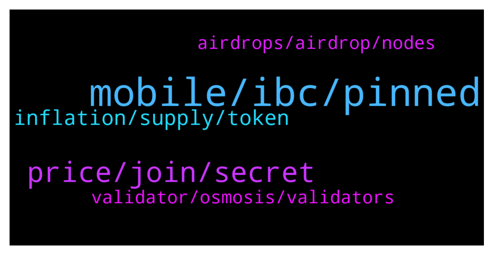

# **@cosmosproject**
 ## Analysis for **2022-02-01** - **2022-02-02**.

---

## 📊 **Basic Stats**

**n_messages_sent**: 214

---

---

## 🔝 **Top keywords and related messages**

1. **mobile, ibc, pinned**

    @Igweto --- *I prefer using Atomic Wallet as it is user friendly and trustworthy* **--->** [TG Discussion](https://t.me/cosmosproject/484691)

    @AtomJazz --- *It's the best and most used cosmos wallet https://medium.com/chainapsis/how-to-use-keplr-wallet-40afc80907f6?source=user_profile---------0----------------------------* **--->** [TG Discussion](https://t.me/cosmosproject/483991)

    @AtomJazz --- *It's a very interesting project co-founded by Zaki Manian and Jack Zampolin (core cosmos devs). You can read more about it by joining their telegram chat https://t.me/getsomm* **--->** [TG Discussion](https://t.me/cosmosproject/484191)

    @erik_io --- *I have an issue with a withdrawal from a CEX. Does anyone know how to contact Keplr?* **--->** [TG Discussion](https://t.me/cosmosproject/484770)

    @nazarksv --- *guys what is the best Cosmos Wallet ?* **--->** [TG Discussion](https://t.me/cosmosproject/484607)

    @elfilosofooo --- *Guys, is the app store keplr wallet legit?* **--->** [TG Discussion](https://t.me/cosmosproject/484634)

2. **price, join, secret**

    @ZoltanAtom --- *Always. Wish to know more details with you. But don’t have.* **--->** [TG Discussion](https://t.me/cosmosproject/484127)

    @kml_bgn --- *i did... but no answer ^^* **--->** [TG Discussion](https://t.me/cosmosproject/484222)

    @AtomJazz --- *No and you shouldn't be either 😉* **--->** [TG Discussion](https://t.me/cosmosproject/484167)

    @Fredmeister --- *If you say so im a little more tranquil* **--->** [TG Discussion](https://t.me/cosmosproject/484168)

    @erik_io --- *Doesn’t show me where to make a ticket or anything though I went to this site earlier today* **--->** [TG Discussion](https://t.me/cosmosproject/484775)

    @ls -al --- *Ah ok. Thanks for your patience.* **--->** [TG Discussion](https://t.me/cosmosproject/484126)

3. **inflation, supply, token**

    @Altaf1111 --- *Price will dump in future to less than 1$ if more coin daily comes in circulation* **--->** [TG Discussion](https://t.me/cosmosproject/484151)

    @ZoltanAtom --- *Atom is inflationary token. Inflation ratio is around %9 now.* **--->** [TG Discussion](https://t.me/cosmosproject/484144)

    @schooloffish --- *Any recommendations for swapping ETH to ATOM? lowest cost.* **--->** [TG Discussion](https://t.me/cosmosproject/484390)

    @Mirgiuly --- *In your opinion, at what price could ATOM arrive this year?* **--->** [TG Discussion](https://t.me/cosmosproject/484315)

    @h --- *so  who will receive these 9 percent atom?* **--->** [TG Discussion](https://t.me/cosmosproject/484574)

    @Andi_EWM --- *Well I am not an expert, but why is ATOM a token and not a coin! For me this sounds always not as good as having a coin! ETH is a coin and tokens are built on it... Why is this different at cosmos?* **--->** [TG Discussion](https://t.me/cosmosproject/484550)

4. **validator, osmosis, validators**

    @Abz_2021 --- *What validators are people staking with? I’m quite new to the ecosystem* **--->** [TG Discussion](https://t.me/cosmosproject/484616)

    @Secremento --- *Hi, everyone🤚 i want to stake my atom at keplr wallet. U think which validator is best?* **--->** [TG Discussion](https://t.me/cosmosproject/484329)

    @encrypted14 --- *What's better APR wise? Staking with keplr, or providing liquidity on Osmosis, given the IL risk?* **--->** [TG Discussion](https://t.me/cosmosproject/484673)

    @Crypto-Jesus --- *keplr for single staking and osmosis dex is good for LPing* **--->** [TG Discussion](https://t.me/cosmosproject/484389)

    @AtomJazz --- *Make sure you avoid exchange validators! Other than that...The best validator is always subjective, here are some factors that might help:   - Commission Rate:  This is the % of earned rewards that go to the validator. Not the % of your total stake, just to eliminate that confusion.   - Self-Bonded rate:  This is the % of bonded ATOM that belong to the validator. Think of this as their skin in the game.   - Decentralization:  Choosing the smaller validators helps to decentralize the network which improves security overall. Again, decentralization should be a priority. On this point, centralized exchanges are not the best choice as they don't really support the network at all.   You can learn more about each validator in their profiles on the wallets and explorers.  The 8-10% is almost for everyone, feel free to use this reward calculator  https://www.stakingrewards.com/earn/cosmos  Commissions can be changed anytime so keep an eye on your validator via telegram or twitter* **--->** [TG Discussion](https://t.me/cosmosproject/484617)

    @ZoltanAtom --- *Make sure you avoid exchange validators! Other than that...The best validator is always subjective, here are some factors that might help:   - Commission Rate:  This is the % of earned rewards that go to the validator. Not the % of your total stake, just to eliminate that confusion.   - Self-Bonded rate:  This is the % of bonded ATOM that belong to the validator. Think of this as their skin in the game.   - Decentralization:  Choosing the smaller validators helps to decentralize the network which improves security overall. Again, decentralization should be a priority. On this point, centralized exchanges are not the best choice as they don't really support the network at all.   You can learn more about each validator in their profiles on the wallets and explorers.  The 8-10% is almost for everyone, feel free to use this reward calculator  https://www.stakingrewards.com/earn/cosmos  Commissions can be changed anytime so keep an eye on your validator via telegram or twitter* **--->** [TG Discussion](https://t.me/cosmosproject/484330)

5. **airdrops, airdrop, nodes**

    @sav72 --- *Hello  i Just bought Atom and staked on Exodus wallet. Can i receive any airdrop or i have ti change wallet?* **--->** [TG Discussion](https://t.me/cosmosproject/484409)

    @Jonathan --- *Typically how much $ needed to stake to get a decent airdrop?  20k or more?* **--->** [TG Discussion](https://t.me/cosmosproject/484233)

    @Vadim_everstake --- *Stake $ATOM with Everstake.one validator  👉 525 000+ clients 👉 Eligible for airdrops in Cosmos Network 👉 Vast portfolio: reliable validator for 45 blockchains 👉~ 100% uptime (multiple servers, back-up nodes, dedicated DevOps for every chain) 👉 Support 24/7  Visit our website to calculate your rewards, find guides for different wallets and more: https://everstake.one/cosmos* **--->** [TG Discussion](https://t.me/cosmosproject/484360)

    @dd1one1 --- *hi admin ,   i have my atom on a ledger nano,,   ive been delegating them for the last year.,   when i just tried to undelegate them ,, it says unable to due to restricted access to this account.,,   has anyone had this issue,,,  the delegator is “castle,node” ,????  any help please 🙏????* **--->** [TG Discussion](https://t.me/cosmosproject/483987)

    @Matt_Blocks_United --- *To make sure you qualify for airdrops: 1. Avoid centralized exchange nodes, like Kraken or Binance 2. Avoid 0% commission nodes 3. Avoid the top 10 and even top 25 largest nodes  We have a tutorial that should answer most, if not all of your questions. You can check it out here:  https://blocksunited.com/how-to-choose-a-validator/  You're certainly welcome to stake with us at Blocks United.* **--->** [TG Discussion](https://t.me/cosmosproject/484735)

    @Matt_Blocks_United --- *Atomic wallet severely limits your access to the Cosmos ecosystem and you'll need to use Keplr to claim your airdrops (assuming you qualify). The good news is that you can import your Atomic seed phrase or private key into Keplr and then use both wallets. We have a tutorial that shows how to import seed phrases from Exodus, Atomic and Trust wallet. You can check it out here:  https://blocksunited.com/import-exodus-wallet-into-keplr/  Let me know how else I can help.* **--->** [TG Discussion](https://t.me/cosmosproject/484730)

