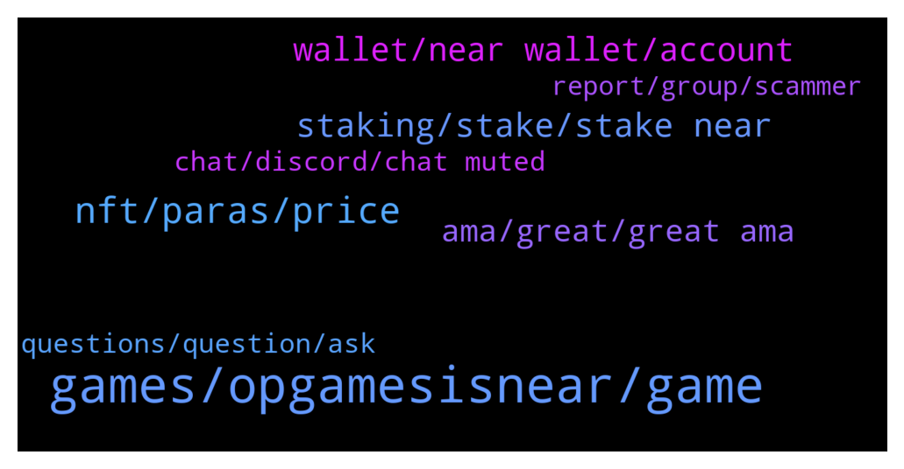

# **@cryptonear**
 ## Analysis for **2022-02-01** - **2022-02-02**.

---

## 📊 **Basic Stats**

**n_messages_sent**: 441

---

---

## 🔝 **Top keywords and related messages**

1. **games, opgamesisnear, game**

    @felicia_124 --- *2021 was the year where the team steadily built up its roster with world class talent to a 35-strong team in order to support our goal of empowering more game developers for Web 3.0. The team is composed of a mix of veterans in the game development / blockchain scene while we also welcomed members who were highly interested in shaping the future of Web 3 with us. 🙌  We're also hiring! View our job openings at https://twitter.com/OPGames_/status/1478717389877710849* **--->** [TG Discussion](https://t.me/cryptonear/325183)

    @chasefreo --- *I think in this new age of web3 this is definitely bound to happen. To bring players more skin in the game by giving them a level of ownership and for devs to have the backing of the community in a much deeper level.* **--->** [TG Discussion](https://t.me/cryptonear/325030)

    @jlaudybell --- *#OpGamesIsNear  Hi I see that OpGames has partnered with #YGG so Can you explain the extent of your relationship/partnership with YGG? Can you discuss with us what value this formed partnership can bring to the OPGames Ecosystem? How will this partnership help you in risk assessment, liquidity services, etc?* **--->** [TG Discussion](https://t.me/cryptonear/325067)

    @Kripto_Raptor --- *🎙 Op Games is bridging game developers to Web 3 by harnessing decentralized technologies to support our vibrant community of developers, creators, fans, and players.  Chase Freo, the CEO and Co-Founder of OP Games will join us for a Telegram AMA hosted by the NEAR community on Feb 2nd (Wed) at 4:00 PM UTC.   📍Venue: https://t.me/cryptonear 🎁 250$ USD worth of NEAR be rewarded to 5 selected winners who come in with thoughtful questions during the session.  See you!* **--->** [TG Discussion](https://t.me/cryptonear/324961)

    @GeorgePro1 --- *Finally we've got games. Let's play, let's enjoy! Joystick We couldn't wait for #GameFi on Aurora! https://twitter.com/MoonFarmers/status/1487400855066537988* **--->** [TG Discussion](https://t.me/cryptonear/324667)

    @chasefreo --- *OP Games is furthering its goal of bringing more gamers and game developers to Web 3 by teaming up with YGG. They're one of our official partners of OP Games’ Web 3 accelerator program hosted by our game publishing arm, GM Frens, launched at the start of the year. The said accelerator aims to train game developers in building blockchain games to produce a playable demo and receive funding from GM Frens or its network of investors. With this, YGG may also exercise their option to invest in some of the projects that will come out of the program. Developers who wish to publish their games with GM Frens can apply to do so on their website. Applications for the pilot accelerator program will be accepted from January 6 until February 4, 2022. https://www.gmfrens.games/* **--->** [TG Discussion](https://t.me/cryptonear/325174)

2. **nft, paras, price**

    @Taurus990 --- *I clicked on the NFT on the collectibles and it showed me that* **--->** [TG Discussion](https://t.me/cryptonear/323711)

    @kv9990 --- *If you've a Nft doesn't mean it has a value =)) list it on a marketplace like Paras/Mintbase ,if it's part of a collection then check it's floor price 👀* **--->** [TG Discussion](https://t.me/cryptonear/323712)

    @oppzsmoKe --- *Do you guys know any near NFT’s that offer passive income* **--->** [TG Discussion](https://t.me/cryptonear/323891)

    @GoldKinging --- *So many people here want to learn how to create their own NFT's, I will guide you on how to create and sell/buy NFT's* **--->** [TG Discussion](https://t.me/cryptonear/324609)

    @Taurus990 --- *Hello please how do i check the price of NFT’s on my NEAR WALLET ?* **--->** [TG Discussion](https://t.me/cryptonear/323703)

    @nakogiri --- *What is use cases for this NFTs?* **--->** [TG Discussion](https://t.me/cryptonear/324290)

3. **staking, stake, stake near**

    @smatch1234 --- *hi, how to stake near? and what's the benefits* **--->** [TG Discussion](https://t.me/cryptonear/324544)

    @PLAY2EARNCOMMUNITY --- *Looking for feedback on what is the best way to stake Near.  I mean for the best APY?* **--->** [TG Discussion](https://t.me/cryptonear/324259)

    @harryfrottercrypto --- *How many algorithmic lending protocols are arriving on aurora 😅😅* **--->** [TG Discussion](https://t.me/cryptonear/323851)

    @sanket_everstake --- *Hey, You can choose Everstake. The fee is 5% . Checkout guide to stake with NEAR wallet. Current staking APY in NEAR wallet is ~12.19% 😃  https://medium.com/everstake/how-to-stake-near-using-the-near-wallet-a-beginners-guide-7b089b0e9c19* **--->** [TG Discussion](https://t.me/cryptonear/324657)

    @catalinstanescu --- *Hello, guys! I'am trying to understand why there are staking pools with 100% fee?* **--->** [TG Discussion](https://t.me/cryptonear/324140)

    @rahulgoel007 --- *There are couple of ways you can stake near  Metapool  Near wallet  Binance   For Near wallet and metapool  Refer to below links and you will get the idea  https://t.me/cryptonear/289255  https://t.me/cryptonear/282216  For binance, they have locked system with 30 and 60 days and apy varies on that* **--->** [TG Discussion](https://t.me/cryptonear/324236)

4. **wallet, near wallet, account**

    @becausetelegram --- *link to explore apps on near wallet website is broken* **--->** [TG Discussion](https://t.me/cryptonear/323696)

    @johnwickcrypto --- *I just created a near wallet, I was asked to send at least 0.1 near. Is that necessary, does my account have to be activated with 0.1 near?* **--->** [TG Discussion](https://t.me/cryptonear/324101)

    @TeleHee --- *Hi admin,Google  play store Near wallet available?* **--->** [TG Discussion](https://t.me/cryptonear/324110)

    @rahulgoel007 --- *Follow below guide to create wallet  https://link.medium.com/9koby6J3fnb* **--->** [TG Discussion](https://t.me/cryptonear/324198)

    @TheGo1denBull --- *Ok reach out to the wallet support https://nearhelp.zendesk.com/hc/en-us/requests/new raise a ticket please* **--->** [TG Discussion](https://t.me/cryptonear/323787)

    @iamkemoo --- *one is the initial funding address, which has to be funded with 0.16 $near to activate the wallet. that one gets deleted afterwards and your name.near account will be activated* **--->** [TG Discussion](https://t.me/cryptonear/324896)

5. **ama, great, great ama**

    @felicia_124 --- *hi everyone! felicia here from OP Games 🙂* **--->** [TG Discussion](https://t.me/cryptonear/325178)

    @chasefreo --- *Im doing great. Thank you! 🙂 happy to be here* **--->** [TG Discussion](https://t.me/cryptonear/325005)

    @chasefreo --- *Hi everyone thanks for having me here!* **--->** [TG Discussion](https://t.me/cryptonear/325001)

    @Kripto_Raptor --- *Our AMA starts now. Let's follow top asked questions and answers from our guest!* **--->** [TG Discussion](https://t.me/cryptonear/324993)

    @NearFritz --- *Well Good night, =) See you tomorrow friend* **--->** [TG Discussion](https://t.me/cryptonear/323911)

    @rahulgoel007 --- *Thanks for the amazing session 🔥🔥* **--->** [TG Discussion](https://t.me/cryptonear/325199)

6. **chat, discord, chat muted**

    @Kripto_Raptor --- *the AMA is over. thanks for accompanying us #Nearians the chat is unmuted now* **--->** [TG Discussion](https://t.me/cryptonear/325195)

    @maksum01 --- *Emails are boring. Humans are great.. is there a human I can talk to ?* **--->** [TG Discussion](https://t.me/cryptonear/323675)

    @TheGo1denBull --- *Have you checked out near discord?* **--->** [TG Discussion](https://t.me/cryptonear/324436)

    @iforbusiness2 --- *NEAR Meet CV Labs Zug is live, feel free to join https://www.youtube.com/watch?v=-UfJpUIKvpg* **--->** [TG Discussion](https://t.me/cryptonear/323631)

    @Kripto_Raptor --- *Let me remind the Rules before opening the chat.* **--->** [TG Discussion](https://t.me/cryptonear/325061)

    @Kripto_Raptor --- *Op Games Near AMA will start in 10 minutes, please note that the chat will be muted during the AMA.* **--->** [TG Discussion](https://t.me/cryptonear/324962)

7. **questions, question, ask**

    @kv9990 --- *Isn't that a personal question? I don't see a reason why I should answer that ;)* **--->** [TG Discussion](https://t.me/cryptonear/323934)

    @iamkemoo --- *Hey, feel free to ask your question here* **--->** [TG Discussion](https://t.me/cryptonear/324244)

    @chasefreo --- *Wow, these are a lot of questions. Give me a moment lol 😂* **--->** [TG Discussion](https://t.me/cryptonear/325163)

    @iamkemoo --- *feel free to ask your question mate 👍* **--->** [TG Discussion](https://t.me/cryptonear/324898)

    @kv9990 --- *That's a nice question 😄 should ask them.* **--->** [TG Discussion](https://t.me/cryptonear/323945)

    @Kripto_Raptor --- *Let's move on to the next question then.* **--->** [TG Discussion](https://t.me/cryptonear/325018)

