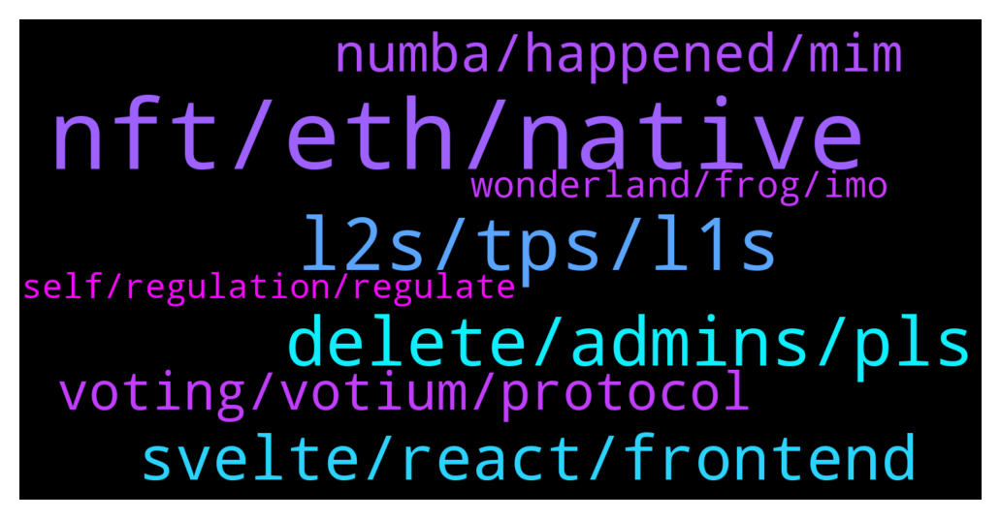

# **@lobsters_chat**
 ## Analysis for **2022-02-01** - **2022-02-02**.

---

## 📊 **Basic Stats**

**n_messages_sent**: 321

---

---

## 🔝 **Top keywords and related messages**

1. **nft, eth, native**

    @Ghost_Of_Projection --- *Total now is around 150k ETH, so prob around 5%?  https://dune.xyz/poma/tornado-cash_1* **--->** [TG Discussion](https://t.me/lobsters_chat/321869)

    @OrChromia --- *Hey, it's not new - we at chromia has a similar design where each dapp has it's own sidechain and everything is settled on the mainchain - on top of that all of the sideschains in chromia have their own IBC (similar to cosmos but can trade nft's, data and tokens between one and other)* **--->** [TG Discussion](https://t.me/lobsters_chat/322300)

    @DrGorilla_md --- *I might be too naive, but are banks that competent - ie to raise a flag of “hey that nft project looks like bought only by bots on OS” 😅?* **--->** [TG Discussion](https://t.me/lobsters_chat/321859)

    @ilkali --- *Yeah, seems like there's an NFT sale, so lots of people are paying 1-2 ETH in tips for priority* **--->** [TG Discussion](https://t.me/lobsters_chat/322020)

    @twpks --- *Yes, but if you 100x an NFT with no market except for your bots there is no chance in hell a competent bank will accept those funds.* **--->** [TG Discussion](https://t.me/lobsters_chat/321850)

    @gbr_kvk --- *gn lobs fam, i have a pretty dumb question, i guess why do NFT projects utilize Arweave rather than Filecoin/IPFS? what are the pros except for that "permanent storage" narrative and problems with zero incentivization for data retrievement in filecoin ?  may be tooling/usability, pls help dumb seafood to become smarter* **--->** [TG Discussion](https://t.me/lobsters_chat/322102)

2. **l2s, tps, l1s**

    @van0k --- *Is there a source with comparative analysis of how L2s actually perform? I was under an impression that Arbitrum was doing better than that* **--->** [TG Discussion](https://t.me/lobsters_chat/322273)

    @tesslerc --- *https://twitter.com/podcastdelphi/status/1488736151003602945?s=21  Interesting points by Emin about why L2s aren't the solution. His points are also relevant for L1s that act like many distinct blockchains for scale, eg Kadena.* **--->** [TG Discussion](https://t.me/lobsters_chat/322249)

    @Oxc4t --- *Every criticism stated for L2s can be attributed to altL1s. Also he definetly watches iguanas fuck.* **--->** [TG Discussion](https://t.me/lobsters_chat/322252)

    @tesslerc --- *Why won't L2s suffer from fragmentation? They too have scalability limitations as they are essentially blockchains. So multiple L2s means liquidity and usage is fragmented across ledgers.* **--->** [TG Discussion](https://t.me/lobsters_chat/322261)

    @Oxc4t --- *Long term L1s are to become used by L2s only, so you won't have fragmentation.* **--->** [TG Discussion](https://t.me/lobsters_chat/322255)

    @Crypto_McKenna --- *All L1s are cutting corners except ETH* **--->** [TG Discussion](https://t.me/lobsters_chat/322262)

3. **delete, admins, pls**

    @alexpgc21 --- *Hey 👋   We re using our bot:  https://t.me/lobster_watcher  And also filtering such recommendations to select only topics worth attention.  ~5 people are in duty every day.* **--->** [TG Discussion](https://t.me/lobsters_chat/321712)

    @Joel_john --- *hi admin @ivangbi pls dont ban me sir  https://twitter.com/joel_john95/status/1488430992310292484* **--->** [TG Discussion](https://t.me/lobsters_chat/321827)

    @Theeylon --- *lmao did you see the reply https://twitter.com/DAO_dude/status/1488519805086883848* **--->** [TG Discussion](https://t.me/lobsters_chat/321937)

    @Jecherio --- *there is  https://t.me/NFT_avenue so people like you can post without fear of getting banned.* **--->** [TG Discussion](https://t.me/lobsters_chat/321828)

    @amplice --- *mods pls forgive me and delete if this is not acceptable* **--->** [TG Discussion](https://t.me/lobsters_chat/322330)

    @cavkie --- *I remember it differently. So maybe admins will delete both of ours posts to not start unnecessary drama.* **--->** [TG Discussion](https://t.me/lobsters_chat/321955)

4. **svelte, react, frontend**

    @tatai_007 --- *Yeah I am a fan of Svelte. Just everything in web3 seems to revolve around React, so was a bit concerned if svelte is supported at all.* **--->** [TG Discussion](https://t.me/lobsters_chat/321766)

    @tatai_007 --- *Anyone uses Svelte for web3 stuff? How is the experience? Should I just give up svelte and learn react?* **--->** [TG Discussion](https://t.me/lobsters_chat/321763)

    @nathanclark --- *Yea I’ve exclusively been using svelte and esp sveltekit for dapps the past couple years and can’t even think about using something else. You can ship sooo fast once you get the hang of it* **--->** [TG Discussion](https://t.me/lobsters_chat/321764)

    @RobAnon --- *Svelte is so fantastic. We do everything in it* **--->** [TG Discussion](https://t.me/lobsters_chat/321771)

    @tatai_007 --- *I used to do React but haven't looked back since 2019-ish* **--->** [TG Discussion](https://t.me/lobsters_chat/321776)

    @RobAnon --- *I never even learned React, was that easy Every React dev I show it to falls in love* **--->** [TG Discussion](https://t.me/lobsters_chat/321772)

5. **voting, votium, protocol**

    @giganuke --- *What is the best voting protocol? (best tech currently)* **--->** [TG Discussion](https://t.me/lobsters_chat/321961)

    @banteg --- *voting with money is beyond dumb. the fact someone has 100x money doesn't mean they have 100x better judgement. on the contrary, after some point, they are probably checked out and too busy chilling.* **--->** [TG Discussion](https://t.me/lobsters_chat/321721)

    @clemensotto --- *"voter extractable value" sounds interesting. no idea if this concept has a chance though...* **--->** [TG Discussion](https://t.me/lobsters_chat/321987)

    @Sunny --- *i don't wanna pay $400 gas fee to vote* **--->** [TG Discussion](https://t.me/lobsters_chat/321734)

    @Figu3 --- *Votium has PMF on Convex. Anything else doesn't work (votemak did once for core events)* **--->** [TG Discussion](https://t.me/lobsters_chat/321985)

    @ivangbi --- *Votium is not a voting protocol, please be more specific then* **--->** [TG Discussion](https://t.me/lobsters_chat/321966)

6. **numba, happened, mim**

    @paulogouveia --- *When the whole @Sisyphus0x thing happened they said beerus life was in danger as well* **--->** [TG Discussion](https://t.me/lobsters_chat/321884)

    @arncarr --- *Memory of a goldfish is correct. @nourharidy you're wasting your time. When we got rugged on anubis by Sisyphus and co. everyone cared for a week then some new drama happened and everyone moved on. The guys didn't even take a hit to their reputations* **--->** [TG Discussion](https://t.me/lobsters_chat/322183)

    @hugeshoe --- *any guess what he’s next handle will be?* **--->** [TG Discussion](https://t.me/lobsters_chat/321834)

    @Moarrr999 --- *No one cares when numba go up. Fundamentals quickly change when numba go down.* **--->** [TG Discussion](https://t.me/lobsters_chat/322181)

    @StrategicReserve --- *Kind of silly everyone all of a sudden cares now.* **--->** [TG Discussion](https://t.me/lobsters_chat/322180)

    @coine_r --- *"remembered for a long time"  Surely you must be joking* **--->** [TG Discussion](https://t.me/lobsters_chat/322173)

7. **wonderland, frog, imo**

    @ArkyEvi --- *Defi is not a single organism and "we" do not control it or need to direct it into the "right" direction. Devs build, users invest into whatever they want, freedom* **--->** [TG Discussion](https://t.me/lobsters_chat/322212)

    @Figu3 --- *And Wonderland's bad rap is going to be paid by all of us* **--->** [TG Discussion](https://t.me/lobsters_chat/322214)

    @nourharidy --- *Even from a purely selfish stance, I don’t think that’s a good idea. Wonderland story will be remembered for a long time imo. At least some serious attempt of self-regulation by the end of that story would be doing all of us a great favor imo* **--->** [TG Discussion](https://t.me/lobsters_chat/322172)

    @raduciobanu --- *DeFi won't ever evolve from the wild-wild-west with this mentality, it'll stay a fun casino and that's it.* **--->** [TG Discussion](https://t.me/lobsters_chat/322197)

    @nourharidy --- *Never been part of any DeFi dramas, not to mention profited. This particular situation matters to me a LOT because practices of “the frog nation” go against everything I believe in honesty* **--->** [TG Discussion](https://t.me/lobsters_chat/322169)

    @SD107 --- *How is concave any better than wonderland tho? I would argue that wonderland treausury is more transparent than concave, yet you support them* **--->** [TG Discussion](https://t.me/lobsters_chat/322207)

