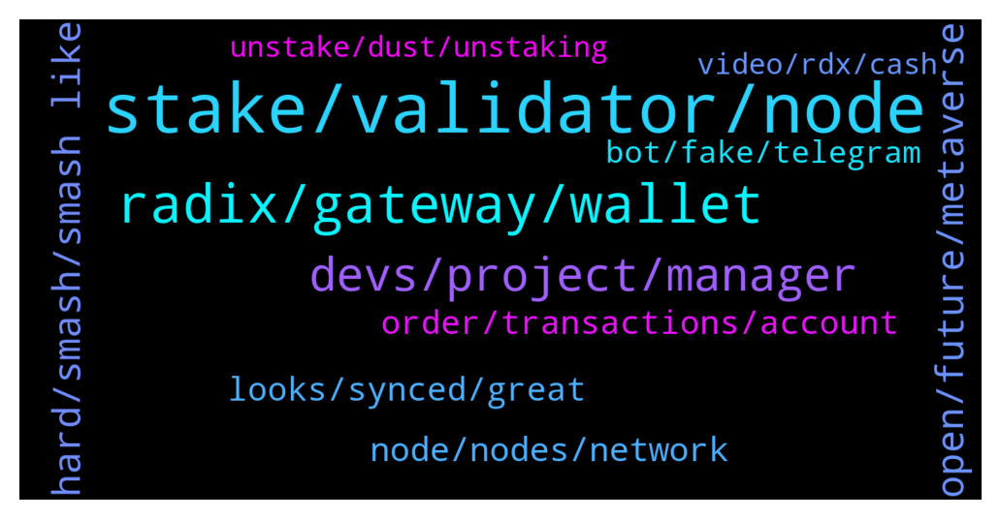

# **@radix_dlt**
 ## Analysis for **2022-02-01** - **2022-02-02**.

---

## 📊 **Basic Stats**

**n_messages_sent**: 844

---

---

## 🔝 **Top keywords and related messages**

1. **stake, validator, node**

    @Mik3ology --- *The counter argument is that people stake within the top 10 or 0% fee validators regardless of whether or not they're trustful.  I would suggest a  2% emmisions cap per validator. Any emmisions over 2% of total network emmisions for the epoch are burnt.  Just an idea, no idea if this would be possible or what security edge cases would bring* **--->** [TG Discussion](https://t.me/radix_dlt/349584)

    @TelgarKW --- *They charged me $5 to move 50k coins yesterday. Small fee but they do charge.* **--->** [TG Discussion](https://t.me/radix_dlt/349501)

    @propeterly --- *When you own 1 million XRD, you get ~10k from staking a month. Why not run a node for free then? I would do it.* **--->** [TG Discussion](https://t.me/radix_dlt/349617)

    @Mik3ology --- *Weather conditions are hardly the fault of the validator. And what slowed down? Transactions slower by less than 500ms* **--->** [TG Discussion](https://t.me/radix_dlt/349432)

    @Alex --- *I mean the issue there is simple and will only be resolved with Xi‘an really. As long as only the top 100 Validators receive compensation and unstaking takes 2weeks, people are scared to stake on the bottom 50 of the top 100 validators, since they fear that their validator may end up not being in the top 100 anymore after a marketing push of a new node through NFTs or whatsoever and don’t want to miss out on staking rewards while unstaking. So the obvious choice is to go safe and choose the top 50 validators. The thought behind is, why should I stake below and risk it and not someone else…* **--->** [TG Discussion](https://t.me/radix_dlt/349489)

    @PeterFATAss --- *It shouldn't be allowed to increase fees* **--->** [TG Discussion](https://t.me/radix_dlt/349685)

2. **radix, gateway, wallet**

    @Tom --- *It was kind of a joke bro. But having industry veterans in the team would not hurt for sure. Many people here don‘t understand that radix builds on top of existing concepts, that‘s all.* **--->** [TG Discussion](https://t.me/radix_dlt/349072)

    @Tom --- *That‘s not production. Introduce malicious nodes, introduce slow, fcked up nodes etc. As far as I remember, earlier radix iterations were shelved bcuz one dude with a shit connection joined, which caused unfixable issues* **--->** [TG Discussion](https://t.me/radix_dlt/349033)

    @Jazzer9F --- *Excellent article from Coin Telegraph highlighting the current issues faced by Solidity developers, and detailing how Radix will give developers the power to build quickly, securely, and know that scale will never be a bottleneck!  https://cointelegraph.com/news/watch-out-solidity-new-project-aims-to-tackle-downsides-of-coding-defi-projects* **--->** [TG Discussion](https://t.me/radix_dlt/349334)

    @BlAzAk --- *The new website is out: radix-collection.com !! 🎉🎉  Better place for next features: - Battles : The best collection? The best strategy? Earn $XRD and $RADC 🤑👊 - Guilds : Giant battles between kingdoms. Looting $XRD and $RADC 🛡🦥 - Raids : Only an army can overcome these bosses! Play to collect his treasure of $XRD, $RADC and more! 💰💰 - Marketplace NFT : Trade, sell, this is the best place to exchange your assets! 🔄 - More badges : Always more qualitative partners. We love Radix, we love its community, we love its projects! 💖💖🥇🥈🥉 - Decentralized messaging : Organize a raid, join a guild, chat? 💌 - More.... (we can't say everything) !!! ➕➕➕  Round 1 of CYBORGS NFTs (1/7) is over ! See you in a few weeks for Round 2 ! 🔚  This is the start of the KRAKENS NFTs (2/7) !! For a period of 10 days ! Hurry up, it's going very fast! Don't wait for Round 2 and pay x2. Good deals will be on the marketplace but the best are now ! 🔥🔥* **--->** [TG Discussion](https://t.me/radix_dlt/349870)

    @PeterFATAss --- *Is there any proof that flexathon and radflix is not just running on a normal server? Thanks* **--->** [TG Discussion](https://t.me/radix_dlt/350117)

    @giskard_rich --- *It’s an interesting dilemma. Radix is somewhat flying under the radar at the moment. When it starts to get attention, this could be a bit of an Achilles heel* **--->** [TG Discussion](https://t.me/radix_dlt/349531)

3. **devs, project, manager**

    @Tom --- *Hire more devs, as simple as that* **--->** [TG Discussion](https://t.me/radix_dlt/348916)

    @Tom --- *The devs usually only see and really understand parts or certain features of the codebase, they usually never completely understand the full project, that‘s why just letting them do what they want is usually not the best way in my experience, especially if they are working on features which depend on each other. An orchestrator (project manager) with the big picture in his mind is absolutely necessary and more important than any dev imo.* **--->** [TG Discussion](https://t.me/radix_dlt/349276)

    @ashley_tele --- *that's why there's one or more senior dev(s) who are the architect(s) - NOT a project manager. I shudder to think what would happen if a project manager is the only one across any of our complex systems. Worked with project manager(s) before for larger projects - head devs / architects design things, devs give estimates (more junior devs have theirs confirmed by senior devs). Then PMs: set and track the schedule based on the dev estimates; deal with stakeholder expectation management. Estimates / bigger picture / whatever all comes from the senior dev, not the project manager. The closest thing you're describing might be something like a Product Manager at, say, Amazon, but top tech companies just don't function like with that project managers in my experience. Giving a non-technical project manager who's basically a schedule tracker / stakeholder manager is a recipe for disaster imho (and it not how any FAANG works either FYI)* **--->** [TG Discussion](https://t.me/radix_dlt/349290)

    @ashley_tele --- *We've found the best devs are happiest when given the autonomy and scope to operate in their own space and make the decisions they think needs to be made. More senior the dev the more scope they get. Give them features / modules / sizeable chunks of code / apps / libraries / whatever to own and let them get to work. A project manager or TL or manager micromanaging on a daily or sometimes even weekly basis will just make them angry and they'll leave. If the dev make decisions that are not in the best interest of the company or wrong or anything else then it's reflected in their perf. When devs are asked what they want and value, one of the most common responses is autonomy* **--->** [TG Discussion](https://t.me/radix_dlt/349268)

    @Tom --- *Not sure what kind of project managers you have worked with in the past, but In my experience they have insanely deep technical know-how. Usually they were senior devs who took their career to the next level. They are also the ones who do all the estimations etc, because they have the experience. I do not know one single project manager with no technical know-how. Maybe this is a language issue and the job title is different in german speaking countries?* **--->** [TG Discussion](https://t.me/radix_dlt/349313)

    @Tom --- *If you are adding more devs to your projects and this does not speed up the project much, and almost proportionally (after the new devs had time to get to know everything) , then you probably are not as great a project manager as you think you are.* **--->** [TG Discussion](https://t.me/radix_dlt/349253)

4. **hard, smash, smash like**

    @fpieper --- *Nope, it is really hard coded* **--->** [TG Discussion](https://t.me/radix_dlt/349779)

    @Tom --- *If I like what I‘ll hear I‘ll smash that like button hard* **--->** [TG Discussion](https://t.me/radix_dlt/350029)

    @Jacob_XRD --- *Awesome. Dont forget to smash that like button.* **--->** [TG Discussion](https://t.me/radix_dlt/350027)

    @eosadmin --- *Unless I am missing something, that's an impossibility* **--->** [TG Discussion](https://t.me/radix_dlt/349299)

    @h0ll0wstick --- *Wat if there are moar hard coded let the hunt begin!* **--->** [TG Discussion](https://t.me/radix_dlt/349813)

    @Radvocate --- *YES. now thats something we rly need* **--->** [TG Discussion](https://t.me/radix_dlt/349591)

5. **open, future, metaverse**

    @TheWoodsman --- *I wonder what the play is there. They don't want a fight where they have to compete with a decentralised, open metaverse? Instead they want an open source world where they are free to monetise and monopolise attention? 🤔* **--->** [TG Discussion](https://t.me/radix_dlt/349162)

    @TheWoodsman --- *Yeah but presumably if they don't pay lip service to open source/decentralisation then their real aims are more obvious to everyone. So they have to pretend they value openness* **--->** [TG Discussion](https://t.me/radix_dlt/349167)

    @ITProfligate --- *Oh I don’t see anything noble in it at all. I find the very idea of FB Metaverse uterly repugnant. It is a very dangerous move which is an attempt to monetise people in their very essence. Governments complain about the existing crypto world while only having an arms length relationship to it so not having any understanding. Meanwhile it is perfectly OK for a huge corporation to create fictitious meta worlds that suck on people’s imaginations and basic feelings, and btw also pays as little tax as possible. So Meta will come along with virtual glasses into low income people’s worlds who live in tight conditions and offer them to purchase huge properties they can enjoy in the game verse. Meanwhile the super computer maps their every move. It is utterly dystopic.* **--->** [TG Discussion](https://t.me/radix_dlt/349184)

    @chrisijoyah --- *"The metaverse should be more interoperable and open than any computing platform before. Meta is proud to join the Crypto Open Patent Alliance to make our crypto patents available for anyone to use so we can all build this future together."— Mark Zuckerberg 👀* **--->** [TG Discussion](https://t.me/radix_dlt/349159)

    @Kafkafrate --- *I wonder who wants their crypto patents.* **--->** [TG Discussion](https://t.me/radix_dlt/349160)

    @mx471 --- *A bit offtopic but also fitting to the topic: I think public ledgers need privacy functionalities. Currently everything is publicly viewable and trackable (except in some networks like Monero). In TradFi are the account holder's banking activities not viewable by the public. If you were to buy something there at the sex store around the corner or other discreet shops/online stores, your neighbor, boss or even spouse or children would not know. In a public ledger it would be different. Everyone who knows who is behind a wallet (which could also happen by governments requiring clear names) knows what you are doing or buying. I think this is one of the reasons why crypto has not yet been able to establish itself as a means of payment.  I am curious what the future will bring, but I see black. Most governments and BigData companies are already on the surveillance train and will not move away from it. And crypto in its current stage would be even better suited for mass surveillance.  Orwell's 1984 sends its regards. First a blueprint for governments, some are now much further along. And currently I see only one direction for the future of humanity.* **--->** [TG Discussion](https://t.me/radix_dlt/349189)

6. **node, nodes, network**

    @CryptoRadix --- *this also doesnt seem like an edge case. I would imagine a node going down is not going to be a rare occurence* **--->** [TG Discussion](https://t.me/radix_dlt/349569)

    @Lexluttt --- *Really really bad distribution across nodes. Hopefully it changes in the future* **--->** [TG Discussion](https://t.me/radix_dlt/349482)

    @giskard_rich --- *Sure, but knocking out a 3% node seems to degrade significantly more than 3% damage* **--->** [TG Discussion](https://t.me/radix_dlt/349523)

    @Tom --- *Why does one bad node have such a big negative impact on everybody???* **--->** [TG Discussion](https://t.me/radix_dlt/349730)

    @Tom --- *So there is currently no mechanism to exclude nodes (temporarily?) which are down?* **--->** [TG Discussion](https://t.me/radix_dlt/349737)

    @Vorgesetzter --- *Shut down that node for good and let the team do what they're able to, which is not node running obviously!* **--->** [TG Discussion](https://t.me/radix_dlt/349782)

7. **order, transactions, account**

    @NotBen --- *No. The network orders related transactions* **--->** [TG Discussion](https://t.me/radix_dlt/349235)

    @NotBen --- *There is time stamping. But the network doesnt need to know the precise order within milliseconds* **--->** [TG Discussion](https://t.me/radix_dlt/349231)

    @eosadmin --- *How will my dapp know the order if there is no time stamping* **--->** [TG Discussion](https://t.me/radix_dlt/349229)

    @eosadmin --- *Couldn't that present issues especially with DeFi that is time and order sensitive* **--->** [TG Discussion](https://t.me/radix_dlt/349233)

    @NotBen --- *Not sure i understand. If it uses transactions that might impact each other, the network will order the transactions with respect to each other* **--->** [TG Discussion](https://t.me/radix_dlt/349226)

    @NotBen --- *Unrelated txns dont need to be ordered* **--->** [TG Discussion](https://t.me/radix_dlt/349217)

8. **looks, synced, great**

    @MCanCan3 --- *Thank you so much @Mik3ology and @yr12345678 for sharing your time with me* **--->** [TG Discussion](https://t.me/radix_dlt/349360)

    @mattiabe98 --- *Also why is your node "syncing"? Looks like from your website that it's actually synced?  https://www.viskositystaking.com/* **--->** [TG Discussion](https://t.me/radix_dlt/349771)

    @fpieper --- *Yeap, that's hard coded and showing synced the whole time 😂* **--->** [TG Discussion](https://t.me/radix_dlt/349772)

    @Jacob_XRD --- *@Mike_Fast now assisting with potential connection 🤙* **--->** [TG Discussion](https://t.me/radix_dlt/348901)

    @Bent --- *That looks really neat, will have to take a closer look at it.* **--->** [TG Discussion](https://t.me/radix_dlt/349566)

    @tednol --- *Yes nice to see! But one for @Radix_TRADER* **--->** [TG Discussion](https://t.me/radix_dlt/349580)

9. **bot, fake, telegram**

    @Radstakes --- *I believe Leo and Michael created a Telegram bot that can do just that: https://www.radixscan.io/EmmogluStakeryBot.shtml* **--->** [TG Discussion](https://t.me/radix_dlt/349565)

    @chrisijoyah --- *Most likely it was a bot, I was trying to share a picture* **--->** [TG Discussion](https://t.me/radix_dlt/349153)

    @NotBen --- *we're not hacking together a chatbot here* **--->** [TG Discussion](https://t.me/radix_dlt/348959)

    @Radstakes --- *You can DM me the screenshot* **--->** [TG Discussion](https://t.me/radix_dlt/349397)

    @ITProfligate --- *Crazy, I’ve posted pictures. I don’t understand that.* **--->** [TG Discussion](https://t.me/radix_dlt/349175)

    @Callum --- *I’ll DM them later.. don’t open until 9am* **--->** [TG Discussion](https://t.me/radix_dlt/349936)

10. **video, rdx, cash**

    @Cpt_Charles --- *What a low effort video lol, he doesnt know anything. Disgusting how he even has a patreon for his research lol* **--->** [TG Discussion](https://t.me/radix_dlt/349892)

    @Jazzer9F --- *The latest technical AMA between RDX Works Founder Dan Hughes, and CEO Piers Ridyard is now live on YouTube!  https://youtu.be/Jn2FfMFzq0U* **--->** [TG Discussion](https://t.me/radix_dlt/349905)

    @Tom --- *Didn‘t watch the video but I think we can all agree that mistakes were made between 2013 and now. Even the biggest hype boys will probably agree to that one.* **--->** [TG Discussion](https://t.me/radix_dlt/349987)

    @aus87 --- *If you watch in the streams you can see exactly what hes doing* **--->** [TG Discussion](https://t.me/radix_dlt/350121)

    @Cpt_Charles --- *Yea lol, those comments made me chuckle. There's so many of these clueless YouTubers these days. Most just read the front page of the website and call it a deep-dive lol.* **--->** [TG Discussion](https://t.me/radix_dlt/349990)

    @Magal36 --- *People also liked much the last video interview* **--->** [TG Discussion](https://t.me/radix_dlt/349111)

