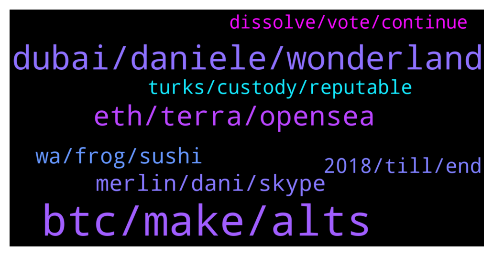

# **@shitpool**
 ## Analysis for **2022-02-01** - **2022-02-02**.

---

## 📊 **Basic Stats**

**n_messages_sent**: 234

---

---

## 🔝 **Top keywords and related messages**

1. **btc, make, alts**

    @wojackdegreate --- *Don’t forget to take profit before btc goes back to 33k and all that unrealized profit turns into an unrealized loss* **--->** [TG Discussion](https://t.me/shitpool/722338)

    @jonkeima --- *Indeed mate, its going to be an altseason again!* **--->** [TG Discussion](https://t.me/shitpool/722226)

    @cryptobaby3021 --- *Yeah once btc moves up, alts will follow.* **--->** [TG Discussion](https://t.me/shitpool/722230)

    @da0man --- *bitcoin will make ATH this year, alts will make ATH again. WE are all going to make it!* **--->** [TG Discussion](https://t.me/shitpool/722221)

    @krates98 --- *India just legalised crypto by imposing taxes on gains* **--->** [TG Discussion](https://t.me/shitpool/722284)

    @Horselorde --- *I got into PayPal, Amazon, Apple, and eBay all at $1.* **--->** [TG Discussion](https://t.me/shitpool/722621)

2. **dubai, daniele, wonderland**

    @da0man --- *He will team up with Daniele and restart the bull* **--->** [TG Discussion](https://t.me/shitpool/722412)

    @MoneroPal --- *This is comedy its all over Twitter he is mad and is just blaming it all on 3rd persons (shorters, attackers, haters)* **--->** [TG Discussion](https://t.me/shitpool/722132)

    @MoneroPal --- *He ran an unlicensed investment fund that produced fake front-projects to lure in investors and hid knowledge of convicted frauds managing it to raise money from investors, while using a sophisticated scheme to sell out of it. The attack vector here is Americans were harmed. He’ll eventually go down, they have it out for him already due to MIM and mentioned it at a senate hearing in the US. VC’s are all for this as well as it damages DeFi and digital assets industry overall goodwill.* **--->** [TG Discussion](https://t.me/shitpool/722457)

    @chatwithgera --- *dude will have all the jail time of bernie madoff with all the support of epstein when the feds get hold of him* **--->** [TG Discussion](https://t.me/shitpool/722455)

    @MoneroPal --- *Sam won’t touch Daniele with a 10 foot pole, 100% certain of that* **--->** [TG Discussion](https://t.me/shitpool/722418)

    @pizza_dog --- *He’s already touching him with his 10 foot hog* **--->** [TG Discussion](https://t.me/shitpool/722419)

3. **eth, terra, opensea**

    @MoneroPal --- *It is highly unlikely ETH will be dethroned anytime soon it just hasn’t happaned. Nothing of importance has been built on AVAX, FTM, Polygon, SOL, or any of the new L1’s. Literally all dog shit projects, rugs, or VC exit scams. ETH is still king, yes it sucks, yes it’s slow, but it’s king.* **--->** [TG Discussion](https://t.me/shitpool/722496)

    @Breddao --- *youll probably be front run, don't expect on-chain orders to work similar to cexes especially during wild moves* **--->** [TG Discussion](https://t.me/shitpool/722599)

    @wojackdegreate --- *Yea it’s just because the first mover advantage, and all the tvl is on eth* **--->** [TG Discussion](https://t.me/shitpool/722553)

    @rocket_fuel --- *if eth were like #7 - nobody would give a damn* **--->** [TG Discussion](https://t.me/shitpool/722552)

    @rocket_fuel --- *the only reason eth is worth anything is because its #2* **--->** [TG Discussion](https://t.me/shitpool/722550)

    @R0mster --- *Eth 2.0 needs to be a royal fuck up before anything flipping can be considered.* **--->** [TG Discussion](https://t.me/shitpool/722527)

4. **merlin, dani, skype**

    @OxZilla --- *I don’t think merlin is dani* **--->** [TG Discussion](https://t.me/shitpool/722169)

    @gonubie --- *Dani ama in time discord for any of you still in that project (10 mins from now)* **--->** [TG Discussion](https://t.me/shitpool/722602)

    @OxZilla --- *I like that Dani changed his pfp to a bayc the day before everything went to shit* **--->** [TG Discussion](https://t.me/shitpool/722209)

    @gonubie --- *its the team account but not dani per se* **--->** [TG Discussion](https://t.me/shitpool/722190)

    @pizza_dog --- *so if merlin is an alt account of dani* **--->** [TG Discussion](https://t.me/shitpool/722160)

    @OxZilla --- *Sbf needs a new car ffs* **--->** [TG Discussion](https://t.me/shitpool/722382)

5. **wa, frog, sushi**

    @wojackdegreate --- *This is how frog nation has to commute to eth Denver now* **--->** [TG Discussion](https://t.me/shitpool/722519)

    @MoneroPal --- *wa wa wee wa it’s ON* **--->** [TG Discussion](https://t.me/shitpool/722481)

    @wojackdegreate --- *All you can eat sushi, steak, lobster on the frog nations back* **--->** [TG Discussion](https://t.me/shitpool/722442)

    @da0man --- *T is coming. going to wear this shirt and shill all over the country. in Denver today* **--->** [TG Discussion](https://t.me/shitpool/722308)

    @wojackdegreate --- *I’ll see you guys at the night shift at Wendy’s ;(* **--->** [TG Discussion](https://t.me/shitpool/722108)

    @wojackdegreate --- *Same but I hope my frens get out* **--->** [TG Discussion](https://t.me/shitpool/722369)

6. **2018, till, end**

    @BeAMightyKing --- *Feels like a thousand years in waiting...* **--->** [TG Discussion](https://t.me/shitpool/722084)

    @OxZilla --- *Trying to compare 2018 to now is retarded* **--->** [TG Discussion](https://t.me/shitpool/722538)

    @da0man --- *that is why 2018 was so bad* **--->** [TG Discussion](https://t.me/shitpool/722351)

    @da0man --- *problem is if this is 2018, that is exactly when it will nuke* **--->** [TG Discussion](https://t.me/shitpool/722350)

    @Horselorde --- *I feel like this shit is gonna go for the entirety of 2022 lmao* **--->** [TG Discussion](https://t.me/shitpool/722328)

    @da0man --- *this will run from jan/Feb 2023 till July* **--->** [TG Discussion](https://t.me/shitpool/722115)

7. **turks, custody, reputable**

    @Moon --- *How is bitcoin suisse a reputable anything? 🤣 with all those turks and indians working there another swiss quality rugpull like shitfinity 🤣🤣🤣* **--->** [TG Discussion](https://t.me/shitpool/722072)

    @arbullz --- *coinbase reputable.. lol gimme a break* **--->** [TG Discussion](https://t.me/shitpool/722074)

    @MoneroPal --- *I see some Turks, but they’re mostly German turks with TradeFi experience. Not sure I see a connection with seedy Turkish money launderers or other scammers here* **--->** [TG Discussion](https://t.me/shitpool/722220)

    @MoneroPal --- *Offshore funds are scams, no hedge fund domiciles anywhere but AU, CA, US, NL, UK, SG, or HK. There are a few in the Nordics and China. The feeder funds are almost always Cayman Island or Bahamas based. The main management company is always in the other aforementioned jurisdictions though.* **--->** [TG Discussion](https://t.me/shitpool/722215)

    @MoneroPal --- *Their website looks awful. The team looks like stock photos from a nightclub. Their appears to be ZERO mention of any sort of hedge fund, it’s thesis, prospectus, performance, or any links to how it is managed, custody, prime brokerage, etc. It is 1000% a scam.* **--->** [TG Discussion](https://t.me/shitpool/722210)

    @MoneroPal --- *You must be confusing them with someone else ser. It’s a fairly small team of Swiss that are mostly former TradeFi. They offer a product for merchants to accpet crypto, prime brokerage, custody, lending, and opeate an exchange. They have a 250M CHF insurnace policy on custody. Explain how a rug would be possible. This isn’t some DeFi startup.* **--->** [TG Discussion](https://t.me/shitpool/722099)

