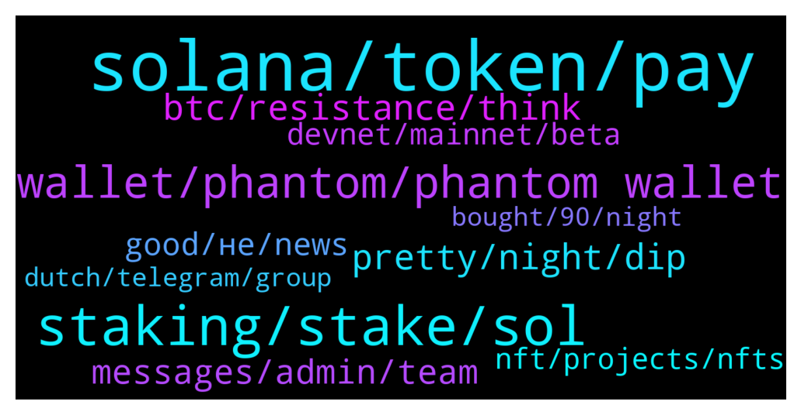

# **@solana**
 ## Analysis for **2022-02-01** - **2022-02-02**.

---

## 📊 **Basic Stats**

**n_messages_sent**: 448

---

---

## 🔝 **Top keywords and related messages**

1. **solana, token, pay**

    @pizdemale5 --- *Is it true that Solana might be listed at CryptoToday . com  among the first?  Telegram  -  list_token* **--->** [TG Discussion](https://t.me/solana/928552)

    @cryptolover1987 --- *Hello! Check this out 👇🏻👇🏻  1️⃣SPL Token CLI 🔗https://spl.solana.com/token  2️⃣Solana CLI 🔗https://docs.solana.com/cli/install-solana-cli-tools  3️⃣Solana/spl-token-registry 🔗 https://github.com/solana-labs/token-list  Other useful links  👉🏻Deploy a program: https://docs.solana.com/cli/deploy-a-program  👉🏻https://solana.com/developers* **--->** [TG Discussion](https://t.me/solana/929271)

    @Kbs --- *I cud bought as many as double solana with same amount.. So its a big loss* **--->** [TG Discussion](https://t.me/solana/926618)

    @JaIsGoed --- *My solana worth not much anymore* **--->** [TG Discussion](https://t.me/solana/928186)

    @CryptoAirck --- *So what's good area to find jobs using Solana* **--->** [TG Discussion](https://t.me/solana/927424)

    @Arnold --- *I have buy solana at 82 dollar 10 k* **--->** [TG Discussion](https://t.me/solana/927364)

2. **staking, stake, sol**

    @R --- *Can you stake SOL using trust wallet?* **--->** [TG Discussion](https://t.me/solana/927009)

    @Seba --- *what is max apr for staking SOL ?* **--->** [TG Discussion](https://t.me/solana/927017)

    @Eddyblow --- *Thanks . Is staking same as providing liquidity ?* **--->** [TG Discussion](https://t.me/solana/926145)

    @cryptolover1987 --- *It’s marinade staked SOL.  Please refer this 👇🏻 🔗 https://blog.saber.so/saber-partners-with-marinade-finance-to-make-staking-liquid-throughmsol-pool-1d5c75f63eb9?gi=d3d9b3e5385d* **--->** [TG Discussion](https://t.me/solana/928793)

    @cryptolover1987 --- *Yes it is! Please read this article to know everything about Solana staking system  📎https://solana.com/staking  👇🏻Check this out for APY👇🏻  1️⃣ Solana validators list 📎 https://solanabeach.io/validators  2️⃣ Staking reward(%) 📎 https://www.stakingrewards.com/earn/solana/providers?sort=balance_DESC  3️⃣ Solana validators performance ranking 📎 https://stakeview.app/* **--->** [TG Discussion](https://t.me/solana/927028)

    @Brian --- *Question. If I remove SOL from staking, does it take time for the balance to transfer back into my account?* **--->** [TG Discussion](https://t.me/solana/928066)

3. **wallet, phantom, phantom wallet**

    @JaIsGoed --- *I'm down so much.. How do i fix this* **--->** [TG Discussion](https://t.me/solana/928172)

    @thenoseycrow --- *Hi. Can anybody help with missing SOL that I sent from Phantom to KuCoin? KuCoin are not helping at all and Solscan shows all completed* **--->** [TG Discussion](https://t.me/solana/926169)

    @humpherylut --- *Hello I have issue with my wallet* **--->** [TG Discussion](https://t.me/solana/926302)

    @Crypto --- *I can’t connect my phantom wallet app on my iPhone to Raydium Swap* **--->** [TG Discussion](https://t.me/solana/928384)

    @RealPrinceOla --- *Try to send small SOL into the wallet before minting wallet address. Minting requires little SOL as fee.* **--->** [TG Discussion](https://t.me/solana/926457)

    @Kulmie --- *The Solana explore shows that I have 268 Sol  the I created the Solana wallet  called sollet  in order to add manually,  but iam getting  an error* **--->** [TG Discussion](https://t.me/solana/926431)

4. **pretty, night, dip**

    @AndreLunaMoon --- *Oh no way! UK doesn’t really get that cold weather normally. Rainy until summer time and the. It’s pretty good* **--->** [TG Discussion](https://t.me/solana/929310)

    @AndreLunaMoon --- *Oh really? It’s pretty mild here right now* **--->** [TG Discussion](https://t.me/solana/929308)

    @Monterrey_Rice --- *Its going good fam! Getting ready for a wintery blast!!* **--->** [TG Discussion](https://t.me/solana/929299)

    @AndreLunaMoon --- *Nice to e-meet you MonterryRice. How's it going!* **--->** [TG Discussion](https://t.me/solana/929292)

    @Monterrey_Rice --- *everyone wish @mahib45 a Happy Birthday!!!!* **--->** [TG Discussion](https://t.me/solana/926141)

    @Danieleea --- *A special day and Sol is green 😍 Happy Birthday Boss* **--->** [TG Discussion](https://t.me/solana/926153)

5. **btc, resistance, think**

    @The_Cryptionian --- *If btc breaks resistance upwards, whole market goes up and its trading there now.* **--->** [TG Discussion](https://t.me/solana/927328)

    @DEAD --- *If btc reaches around 42k today it's not going down for the next few months ig* **--->** [TG Discussion](https://t.me/solana/927331)

    @Kbs --- *Believe me I finally learned how to read chart... Btc definitely going to 36.5-37k....bringing sol to 95-100* **--->** [TG Discussion](https://t.me/solana/927886)

    @Kbs --- *Yeah red line keep crossing... Selling pressure is higher than buying.. Btc wil further dip.. Also reverse triangle was formed before dip* **--->** [TG Discussion](https://t.me/solana/927911)

    @עומר --- *Sol will reach 5000$? What do u think? And when?* **--->** [TG Discussion](https://t.me/solana/929018)

    @עומר --- *I think it will rise more then 5k .* **--->** [TG Discussion](https://t.me/solana/929027)

6. **messages, admin, team**

    @viXll90 --- *That @ChloeAbegnale is asking me to send her $21. Admins inbox me. I have screenshot of her messages* **--->** [TG Discussion](https://t.me/solana/926915)

    @viXll90 --- *Wanted to show screenshot of messages by @ChloeAbegnale. She is asking people to send her 21usdt* **--->** [TG Discussion](https://t.me/solana/926922)

    @Enigmatox --- *Hey is the admin or customer service around?* **--->** [TG Discussion](https://t.me/solana/928908)

    @cryptolover1987 --- *Hello  Kindly submit a ticket for help from their support team!  https://help.phantom.app/hc/en-us/requests/new* **--->** [TG Discussion](https://t.me/solana/928968)

    @cryptolover1987 --- *Hello! Well, I don’t think so. But please join our discord channel. Our dev team will be able to help you on this..  https://discord.gg/solana* **--->** [TG Discussion](https://t.me/solana/928783)

    @Monterrey_Rice --- *Sure! You can always check here too: https://status.solana.com/* **--->** [TG Discussion](https://t.me/solana/926209)

7. **good, не, news**

    @pizdemale5 --- *Yes, there will be community vote.* **--->** [TG Discussion](https://t.me/solana/928564)

    @investooooor --- *I guess there will be some kind of voting to get listed?* **--->** [TG Discussion](https://t.me/solana/928563)

    @Sharon --- *I think that's is really good news* **--->** [TG Discussion](https://t.me/solana/928554)

    @itsschad --- *thinking it’s too good to be true* **--->** [TG Discussion](https://t.me/solana/928373)

    @Monterrey_Rice --- *i've heard only good things so far* **--->** [TG Discussion](https://t.me/solana/927479)

    @The_Cryptionian --- *More adoption, so likely to break up though* **--->** [TG Discussion](https://t.me/solana/927333)

8. **devnet, mainnet, beta**

    @itsschad --- *but how can i add money to it if it’s not real and just for testing* **--->** [TG Discussion](https://t.me/solana/928350)

    @genuinedeveloper --- *Hello everyone. Please Help me What should I do to deploy the rust program to devnet?* **--->** [TG Discussion](https://t.me/solana/929142)

    @itsschad --- *what’s the difference between mainnet and devnet?* **--->** [TG Discussion](https://t.me/solana/926537)

    @itsschad --- *no, i have money on SOL bc someone told me to download this app but they said to choose devnet first before anything so i’m assuming the money doesn’t exist?* **--->** [TG Discussion](https://t.me/solana/928358)

    @mahib45 --- *Hello!  Mainnet is launched! It was launched in March 2020 and is successfully working and updating, (done billion transactions already) as well as getting new functions. For your understanding - Yes, we were first calling it beta because it was just launched and not every function was available.   We will keep the suffix "beta" for a year or so because we want to check the mainnet stability in long term and make sure we have a great product. But it's a working network.* **--->** [TG Discussion](https://t.me/solana/927728)

    @itsschad --- *turn on devnet “alright” now what’s your address “send address” there’s $2500 worth of SOL. that’s what happened lmao but is that real or nah* **--->** [TG Discussion](https://t.me/solana/928369)

9. **nft, projects, nfts**

    @kraytos1 --- *Any tips of getting into solana nfts?* **--->** [TG Discussion](https://t.me/solana/927231)

    @Kareemelazab --- *First of all you have to understand what an nft is, then find projects you like and that you think will blow up when released(consult their twitter and discord server, the more people  the better ) then create a wallet with solana tokens ( maybe phantom or even coinbase wallet )  and invest in the project (or more projects) you find interesting.  This is not a giude, for that I highly suggest passing 3/4 hours on youtube and hearing the youtubers opinion on the theme.* **--->** [TG Discussion](https://t.me/solana/927244)

    @g_v_d_s --- *I’m curious, I think it will do great things for solana based nfts* **--->** [TG Discussion](https://t.me/solana/928661)

    @mahib45 --- *you can try Solana nft marketplace  https://t.me/solana/895277* **--->** [TG Discussion](https://t.me/solana/928029)

    @Fawaz --- *Hey where do I buy $sol nfts from?* **--->** [TG Discussion](https://t.me/solana/928026)

    @Kareemelazab --- *Yeah the solana nft market is really going up thanks to the new projects creating hype in the community* **--->** [TG Discussion](https://t.me/solana/927229)

10. **bought, 90, night**

    @Avinash --- *I have bought it at $88 lets see now* **--->** [TG Discussion](https://t.me/solana/929049)

    @official_hashtag01 --- *Yeah i just bought in at 90* **--->** [TG Discussion](https://t.me/solana/927841)

    @Lovepeace000 --- *Me too... and it went down to 82 and i just hold cause i know the potential and ath of this project... and it was oversold* **--->** [TG Discussion](https://t.me/solana/927846)

    @Claymore02 --- *Wow. I wish I had bought at that price too* **--->** [TG Discussion](https://t.me/solana/929103)

    @My --- *Is this price buyable or not* **--->** [TG Discussion](https://t.me/solana/927790)

    @Kbs --- *Yeah but I bought at 98 also.. Then it went to 89?wt il do?* **--->** [TG Discussion](https://t.me/solana/926605)

