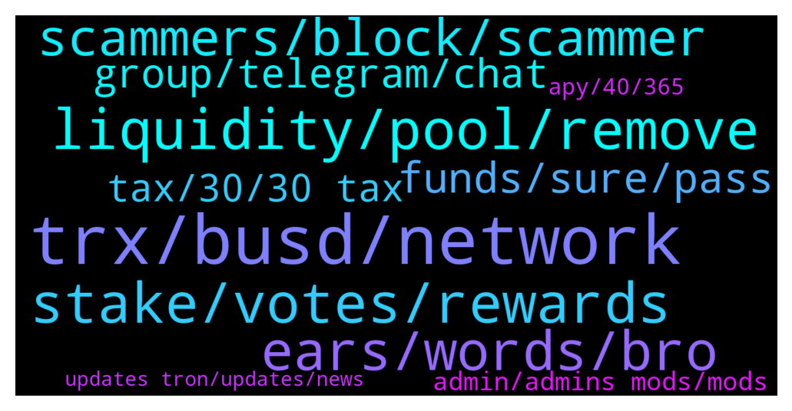

# **@tronnetworkEN**
 ## Analysis for **2022-02-01** - **2022-02-02**.

---

## 📊 **Basic Stats**

**n_messages_sent**: 221

---

---

## 🔝 **Top keywords and related messages**

1. **trx, busd, network**

    @Moneyversac --- *You can ask questions here about TRX. Ignore all DMs just check here 🤗* **--->** [TG Discussion](https://t.me/tronnetworkEN/3865747)

    @fa_hua --- *I am not familiar with TRX. The ecosystem looks more complicated than what I am used to* **--->** [TG Discussion](https://t.me/tronnetworkEN/3867165)

    @Aleksandr_dlg --- *MY question is not related to the TRX exchange rate forecast.  My question is related to the development of the TRX eco system, as well as the development of the TRX itself.* **--->** [TG Discussion](https://t.me/tronnetworkEN/3865761)

    @Oemer000 --- *Trx when do you make marketing* **--->** [TG Discussion](https://t.me/tronnetworkEN/3867806)

    @Hồ --- *Will TRX token futures burn to reduce supply?* **--->** [TG Discussion](https://t.me/tronnetworkEN/3867531)

    @yourfriend_support --- *Smart contract from which TRX tokens are withdrawn* **--->** [TG Discussion](https://t.me/tronnetworkEN/3866660)

2. **liquidity, pool, remove**

    @fa_hua --- *I unstaked from LP mining page yes, but restaked on « pool » within the « swap » tab* **--->** [TG Discussion](https://t.me/tronnetworkEN/3867155)

    @fa_hua --- *Yeah but the pool as ended so I don’t see it there 😜* **--->** [TG Discussion](https://t.me/tronnetworkEN/3867180)

    @KingsDove_TRX --- *all the has tells me is that you provided liquidity* **--->** [TG Discussion](https://t.me/tronnetworkEN/3867171)

    @fa_hua --- *Hi all, I just realized the LP pools have been ended on January 21 but now it seems I can’t remove my liquidity?* **--->** [TG Discussion](https://t.me/tronnetworkEN/3867131)

    @fa_hua --- *I actually unstaked. And it did go to my wallet. But I thought I made a mistake so I went back and added it again 😢 now I can see my liquidity but cannot remove nor see it in the pool as it is ended* **--->** [TG Discussion](https://t.me/tronnetworkEN/3867135)

    @fa_hua --- *On sunswap, it’s possible to add liquidity in « swap » / « pool »* **--->** [TG Discussion](https://t.me/tronnetworkEN/3867142)

3. **stake, votes, rewards**

    @alpha0247 --- *i voted for smart consensus 11 days ago and till now have not received any reward. why this ?* **--->** [TG Discussion](https://t.me/tronnetworkEN/3867796)

    @chrizzy000 --- *hey can anyone help me with the tronlink wallet? when i stake my trx do i only get bandwith and energy? do i not get trx? 🤔* **--->** [TG Discussion](https://t.me/tronnetworkEN/3866454)

    @simon866 --- *You can check the name of the SR you voted for here and then find their channels and see what the pay out dates are 👍  https://www.tokengoodies.com/* **--->** [TG Discussion](https://t.me/tronnetworkEN/3867849)

    @Akshay271sharma --- *Soo what can i do means how to stake my tron* **--->** [TG Discussion](https://t.me/tronnetworkEN/3866148)

    @chrizzy000 --- *ok thanks that helped me a lot but another Question is where do i find or see the votes i get?* **--->** [TG Discussion](https://t.me/tronnetworkEN/3866496)

    @agentpiki --- *Check the rewards calculator and be amazed.* **--->** [TG Discussion](https://t.me/tronnetworkEN/3865371)

4. **ears, words, bro**

    @danielcryptomafia --- *go to hell, I hate it(((* **--->** [TG Discussion](https://t.me/tronnetworkEN/3866264)

    @MilNoslen --- *I literally just told you where to go* **--->** [TG Discussion](https://t.me/tronnetworkEN/3867200)

    @R.E.D --- *Where I come from we say.  Your words. In gods ears* **--->** [TG Discussion](https://t.me/tronnetworkEN/3865248)

    @georgewhite01 --- *did you just speak to me?* **--->** [TG Discussion](https://t.me/tronnetworkEN/3866265)

    @simon866 --- *I think your in the wrong place mate* **--->** [TG Discussion](https://t.me/tronnetworkEN/3867600)

    @k0de12 --- *Your words, in God's ears! 🙂🙏* **--->** [TG Discussion](https://t.me/tronnetworkEN/3865307)

5. **scammers, block, scammer**

    @ElkhatirYoussef --- *send contract in this officiel Group not in Private!!* **--->** [TG Discussion](https://t.me/tronnetworkEN/3867568)

    @Carlos_TRX --- *No, all bots are fake, beware* **--->** [TG Discussion](https://t.me/tronnetworkEN/3867016)

    @simon866 --- *No and any claiming such is a scam so stay away from them 👍* **--->** [TG Discussion](https://t.me/tronnetworkEN/3866245)

    @k0de12 --- *This very true, I am getting a lot of scammers messaging me first since I joined this group. Be careful and stay vigilant everyone!* **--->** [TG Discussion](https://t.me/tronnetworkEN/3865952)

    @simon866 --- *They never DM first, anyone that does is a pure scammer, check rules below 👍* **--->** [TG Discussion](https://t.me/tronnetworkEN/3865927)

    @agentpiki --- *You can 1 scammer, it will lay eggs and come back with 3 more. Wtf* **--->** [TG Discussion](https://t.me/tronnetworkEN/3865355)

6. **funds, sure, pass**

    @KingsDove_TRX --- *just lend is your friend 😁* **--->** [TG Discussion](https://t.me/tronnetworkEN/3867173)

    @Zany246 --- *I have 1 milion tron ♥️🙃* **--->** [TG Discussion](https://t.me/tronnetworkEN/3865028)

    @Sorena_hkh --- *I'm a holder I want to know* **--->** [TG Discussion](https://t.me/tronnetworkEN/3867423)

    @MilNoslen --- *If you have enough, should be able to receive* **--->** [TG Discussion](https://t.me/tronnetworkEN/3867099)

    @EvaPretti --- *Am sure you made millions 👍* **--->** [TG Discussion](https://t.me/tronnetworkEN/3866823)

    @simon866 --- *Not sure but the more security levels you pass the more you can trade so if you need large amounts make sure to pass all their security checks 👍* **--->** [TG Discussion](https://t.me/tronnetworkEN/3866694)

7. **group, telegram, chat**

    @alpha0247 --- *yes i do not know there website or telegram group. please if you can help me* **--->** [TG Discussion](https://t.me/tronnetworkEN/3867845)

    @Aleksandr_dlg --- *Otherwise, what is this chat for?* **--->** [TG Discussion](https://t.me/tronnetworkEN/3865769)

    @agentpiki --- *Before I answer that, how did you come across this channel?* **--->** [TG Discussion](https://t.me/tronnetworkEN/3865704)

    @Aleksandr_dlg --- *What is this chat?  and what is its purpose?* **--->** [TG Discussion](https://t.me/tronnetworkEN/3865716)

    @Aleksandr_dlg --- *Hello.  Can you tell me what channel or group this is?* **--->** [TG Discussion](https://t.me/tronnetworkEN/3865703)

    @simon866 --- *Maybe check their telegram or website 🤷‍♂️* **--->** [TG Discussion](https://t.me/tronnetworkEN/3867831)

8. **tax, 30, 30 tax**

    @Fabs_trx --- *Maybe. In some countries there is a tax for professional crypto traders and exchanges already. They might do the same* **--->** [TG Discussion](https://t.me/tronnetworkEN/3865922)

    @Fabs_trx --- *Better 30% tax than a crypto ban* **--->** [TG Discussion](https://t.me/tronnetworkEN/3865916)

    @Gomer77777 --- *I think 30% tax is not for ordinary holders and crypto players... This tax is primarily for Indian crypto exchanges* **--->** [TG Discussion](https://t.me/tronnetworkEN/3865920)

    @simon866 --- *I can't stress how important it is for you you to do your own research in crypto* **--->** [TG Discussion](https://t.me/tronnetworkEN/3867851)

    @Fabs_trx --- *Crypto is legal in india with a 30% tax on digital assets sales says Bloomberg  🔥🔥🔥* **--->** [TG Discussion](https://t.me/tronnetworkEN/3865821)

    @RAFTMP4 --- *I want to study about crypto currency* **--->** [TG Discussion](https://t.me/tronnetworkEN/3865776)

9. **admin, admins mods, mods**

    @agentpiki --- *You think admins and mods are fools?* **--->** [TG Discussion](https://t.me/tronnetworkEN/3866269)

    @ENTENDEV --- *Plase no ban This person wants to unlock it, he didn’t write anything, which is bad!* **--->** [TG Discussion](https://t.me/tronnetworkEN/3867548)

    @ENTENDEV --- *Admin Tell me, please, because he was blocked, he did nothing!* **--->** [TG Discussion](https://t.me/tronnetworkEN/3867534)

    @agentpiki --- *Only admins and mods can send images* **--->** [TG Discussion](https://t.me/tronnetworkEN/3864975)

    @agentpiki --- *It may contain banned words or links* **--->** [TG Discussion](https://t.me/tronnetworkEN/3864973)

    @ENTENDEV --- *Please unblock him, he did not write anything for which he was banned, is there an admin here or not?* **--->** [TG Discussion](https://t.me/tronnetworkEN/3867538)

10. **apy, 40, 365**

    @sanitarysourcingservices --- *i think none of official project is there that offer 40% APY ... or is any? he might intend to some other project?* **--->** [TG Discussion](https://t.me/tronnetworkEN/3865384)

    @TopCat4u2c --- *Is 365 the length of time reqd to get the 40% rate ? What’s the fee if withdrawn early ?* **--->** [TG Discussion](https://t.me/tronnetworkEN/3865374)

    @kamelion --- *That's 800% apy. Sounds like a scam.* **--->** [TG Discussion](https://t.me/tronnetworkEN/3865706)

    @TopCat4u2c --- *40% not sure if I put that in the two good to be true column or it’s a real deal?* **--->** [TG Discussion](https://t.me/tronnetworkEN/3865369)

    @agentpiki --- *The staking has flexible terms.  Daily conversion should be calculated like:  APY% ÷ 365 days = daily  This is common sense.* **--->** [TG Discussion](https://t.me/tronnetworkEN/3865381)

    @MilNoslen --- *Google what APY means, and you only need energy and bandwidth to withdraw at anytime* **--->** [TG Discussion](https://t.me/tronnetworkEN/3865377)

