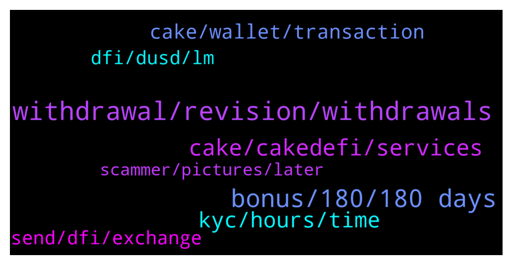

# **@CakeDeFi_EN**
 ## Analysis for **2022-02-02** - **2022-02-03**.

---

## 📊 **Basic Stats**

**n_messages_sent**: 319

---

---

## 🔝 **Top keywords and related messages**

1. **withdrawal, revision, withdrawals**

    @DmgBautista --- *Yes, usually is fast, but sometimes can indeed happen that gets flagged for manual revision and in that case, not gonna lie, it can take a while.* **--->** [TG Discussion](https://t.me/CakeDeFi_EN/171257)

    @DmgBautista --- *As informed by the bot, withdrawals can take up to 72h. The fact that usually the vast majority of withdrawals are processed in under an hour, does not means that sometimes the system does not make a random flag for manual revision. Also the same for bigger amounts or sequential withdrawals.* **--->** [TG Discussion](https://t.me/CakeDeFi_EN/171169)

    @DmgBautista --- *If it helps with some ansiety you may experience, after it gets processed, you can check the progress of your withdrawals/deposits using defiscan.live by submiting there your Txid 🙂* **--->** [TG Discussion](https://t.me/CakeDeFi_EN/171253)

    @DmgBautista --- *Txid's are only created after the withdrawal gets completed. If your withdrawal is still under processing, there will be no Txid as there is still no transit of that transference in the blockchain* **--->** [TG Discussion](https://t.me/CakeDeFi_EN/171278)

    @DmgBautista --- *Usually it's fast, but if for some reason the system put that withdrawal into a cue for manual revision (big ammount, sequential withdrawals or even just random checks), it may take more time.* **--->** [TG Discussion](https://t.me/CakeDeFi_EN/171280)

    @DmgBautista --- *Honestly don't know, I don't have excess to that data. What I can say is that it may take up to 72h in extreme cases, as per message that appears always that any user makes a withdrawal* **--->** [TG Discussion](https://t.me/CakeDeFi_EN/171282)

2. **bonus, 180, 180 days**

    @Michael_Schredl --- *You can withdraw your sign up bonus after 180 days* **--->** [TG Discussion](https://t.me/CakeDeFi_EN/171563)

    @Wu --- *Yes, I did. Maybe the promotion only works once* **--->** [TG Discussion](https://t.me/CakeDeFi_EN/170996)

    @TadekNorek --- *After 180 days can withdraw bonus* **--->** [TG Discussion](https://t.me/CakeDeFi_EN/171189)

    @erikaa1997 --- *Tell me about the $50 referral bonus* **--->** [TG Discussion](https://t.me/CakeDeFi_EN/171032)

    @Kassius84 --- *Your referral bonus is locked for 180 days in the freezer 🥶👍* **--->** [TG Discussion](https://t.me/CakeDeFi_EN/171059)

    @Kassius84 --- *Are you talking about the referrer or the referee bonus? To receive the sign up bonus, you need to deposit at least crypto worth $50.* **--->** [TG Discussion](https://t.me/CakeDeFi_EN/171066)

3. **cake, cakedefi, services**

    @Malii007 --- *it doesn't matter, I trust cakedefi exchange😊* **--->** [TG Discussion](https://t.me/CakeDeFi_EN/171259)

    @paospace --- *I'm fairly new to Cake. I'm wondering what determines the APR for the liquidity mining and what factors drive them down or up.* **--->** [TG Discussion](https://t.me/CakeDeFi_EN/171570)

    @Michael_Schredl --- *Hey welcome. Start your DeFi Journey Here: Cake  DeFi Services Simply Explained https://support.cakedefi.com/hc/en-us/articles/900003427506-Cake-Service-simply-explained* **--->** [TG Discussion](https://t.me/CakeDeFi_EN/171631)

    @DmgBautista --- *In case of need, you can contact Cake support for the below link  https://cake.zendesk.com/hc/en-us/requests/new* **--->** [TG Discussion](https://t.me/CakeDeFi_EN/171287)

    @mm_phoenix --- *cakedefi is a central company offering defi products.  More -> https://support.cakedefi.com/hc/en-us/articles/900003427506-Cake-Service-einfach-erkl%C3%A4rt* **--->** [TG Discussion](https://t.me/CakeDeFi_EN/171180)

    @Kassius84 --- *Hey welcome. Start your DeFi Journey Here: Cake  DeFi Services Simply Explained https://support.cakedefi.com/hc/en-us/articles/900003427506-Cake-Service-simply-explained* **--->** [TG Discussion](https://t.me/CakeDeFi_EN/171367)

4. **kyc, hours, time**

    @KlausLberger --- *Up to 72 hrs. Mostly faster ;-)* **--->** [TG Discussion](https://t.me/CakeDeFi_EN/170793)

    @Malii007 --- *waiting in the process i asked for it* **--->** [TG Discussion](https://t.me/CakeDeFi_EN/171238)

    @Harunn73 --- *It's been 6 months but I can't get it why* **--->** [TG Discussion](https://t.me/CakeDeFi_EN/171585)

    @Lebroncuk --- *it hasn't happened for 14 hours* **--->** [TG Discussion](https://t.me/CakeDeFi_EN/171568)

    @sunilpnwr --- *Why is KYC taking so much time? It's almost over a day I have submitted my documents.* **--->** [TG Discussion](https://t.me/CakeDeFi_EN/170798)

    @cigicigi --- *Hi. My account kyc pending 2 days. Please help me* **--->** [TG Discussion](https://t.me/CakeDeFi_EN/171064)

5. **cake, wallet, transaction**

    @danielflorendo --- *Did the transaction on my laptop ealier. Withdrawed from cake.   Currently am holding my phone only* **--->** [TG Discussion](https://t.me/CakeDeFi_EN/171267)

    @montoderooij --- *Is it normal that i cannot see my dETH transaction to my cake wallet?* **--->** [TG Discussion](https://t.me/CakeDeFi_EN/170802)

    @art_vandaly --- *hi, i can't withdrawal because "withdrawals to addresses of other Cake users are not allowed." how can i fixed this problem?* **--->** [TG Discussion](https://t.me/CakeDeFi_EN/170846)

    @healmeplsss --- *okay sir thanks for the information. just got an email from cakedefi that my deposit is being processed and waiting.* **--->** [TG Discussion](https://t.me/CakeDeFi_EN/170892)

    @montoderooij --- *Yeah thats why i was panicking a bit because defiscan does not show the transaction. I’ll wait for a bit* **--->** [TG Discussion](https://t.me/CakeDeFi_EN/170809)

    @MehmetnuriDilek --- *my friend the problem is that the withdrawals have been transferred from my account to the cake defi wallet and you do not approve* **--->** [TG Discussion](https://t.me/CakeDeFi_EN/171413)

6. **dfi, dusd, lm**

    @valeaaurie --- *Hi eevryone, stupid question. I added liquidity in paid DUSD-DFI.   Are these shares then the amount of DFI I will get if i withdram and swap everything in DFI back ?  So if I remove liquidity now will I have 498 DFI ?* **--->** [TG Discussion](https://t.me/CakeDeFi_EN/171020)

    @valeaaurie --- *So 796$ is approx 306DFI.   Then on top of that I get 329 ?  And what is the share then ?  Thanks for your reply* **--->** [TG Discussion](https://t.me/CakeDeFi_EN/171022)

    @Kassius84 --- *yes it's correct, while entering the LM-pool, you're buying LP tokens. Here you can find am overview over the total amount of LP-Tokens https://www.defichain-analytics.com/liquidityMining?entry=liquidityToken  The number of LP-Tokens can change.Thus, a percentage display of the shares would also fluctuate.  I don't know if it's helpful when someone sees that their percentage has changed in the per thousand range. Personally, I find a static indication of the LP tokens and the number of coins to be expected when sold gives a better overall picture.* **--->** [TG Discussion](https://t.me/CakeDeFi_EN/171051)

    @Tracey --- *when I add DUSD and DFI of equal amt to LM,  gives me a share number for DUSD-DFI.  Is this the number of shares I hold in the LP ?   where can I find the total number of shares for the LP?    It's more intuitive to express this in terms of percentage instead of nnumber of shares you own, since the total number of shares in the LP is unknown.* **--->** [TG Discussion](https://t.me/CakeDeFi_EN/171050)

    @DmgBautista --- *In LM, you rewards will be about 99.9...% in DFI, as they come from blockchain emission, therefore in DFI. Any remaining rewards you receive will be coming in the other coin in your pair, originating from the DEX fees* **--->** [TG Discussion](https://t.me/CakeDeFi_EN/171480)

    @Kassius84 --- *You're owing 498 LM-Tokens vor the DFI-dUSD Pool. If you sell them, at the moment you would receive 796 dUSD and 329 DFI* **--->** [TG Discussion](https://t.me/CakeDeFi_EN/171026)

7. **send, dfi, exchange**

    @montoderooij --- *Can i send it to Metamask? To swap on uniswap?* **--->** [TG Discussion](https://t.me/CakeDeFi_EN/170783)

    @Michael_Schredl --- *Yes, you can send dfi from you DeFiChain or Exchange Wallet to his Account* **--->** [TG Discussion](https://t.me/CakeDeFi_EN/171671)

    @Malii007 --- *yes I used DFI chain. I had withdraw before, it took a very short time. Now I'm surprised it took so long.* **--->** [TG Discussion](https://t.me/CakeDeFi_EN/171255)

    @montoderooij --- *So i can not swap DFI to Eth?!* **--->** [TG Discussion](https://t.me/CakeDeFi_EN/170781)

    @DmgBautista --- *Highly doubt that may exist a problem. Being a first time deposit and if you withdraw DFI using the defichain network for a compatible and supported exchange, everything will work ok :) Will surelly be on manual revision for it. But if it's the case, may take up to 72h for that verification.* **--->** [TG Discussion](https://t.me/CakeDeFi_EN/171252)

    @Malii007 --- *I submitted a DFI withdrawal request.* **--->** [TG Discussion](https://t.me/CakeDeFi_EN/171241)

