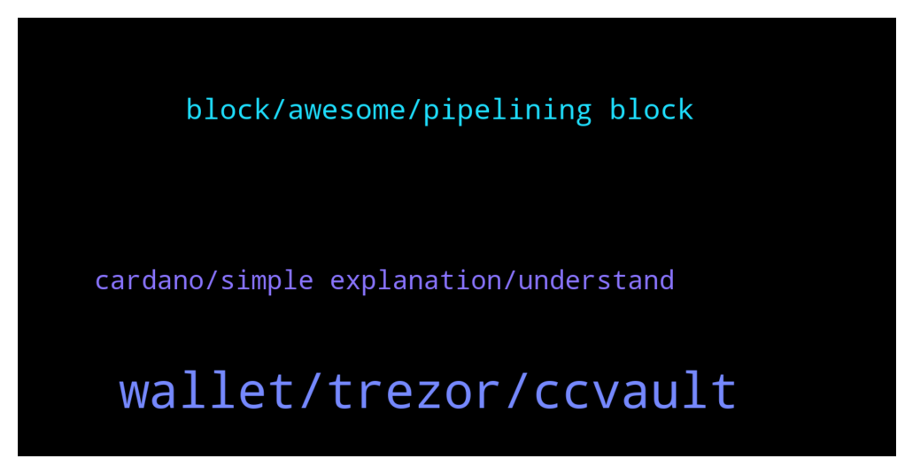

# **@Cardano**
 ## Analysis for **2022-02-02** - **2022-02-03**.

---

## 📊 **Basic Stats**

**n_messages_sent**: 85

---

---

## 🔝 **Top keywords and related messages**

1. **wallet, trezor, ccvault**

    @Denicio_Bernier --- *The network is heavily congested atm. There have been more reports of failed transactions from other wallets as well   Viewing you posted this several hours before, is it safe to assume you’ve now been successful to submit your transaction?* **--->** [TG Discussion](https://t.me/Cardano/777748)

    @domib97 --- *Does anyone tried https://transak.com/ yet? This is from the TerraLuna ecosystem and could help mainstream people to get some ADA too, without big complicated exchanges. As an EU-citizen I can do SEPA Bank Transfer.  I think this is a game changer.* **--->** [TG Discussion](https://t.me/Cardano/778048)

    @glitch04 --- *click the "pair" option after you click the "add wallet" section* **--->** [TG Discussion](https://t.me/Cardano/777978)

    @OlNick --- *Its basically just a send to the wrong address error* **--->** [TG Discussion](https://t.me/Cardano/778054)

    @glitch04 --- *You just sync the device with the new ccvault wallet* **--->** [TG Discussion](https://t.me/Cardano/777943)

    @trollthetyrants --- *Hi.   so i have accessed my yoroi wallet in ccvault.io  I can see my ADA on the left hand side.  Over on the right side under the Staking tab, it correctly lists the pool where my account is delegated to.  my question is, should i have received any sundae tokens by now? if so, where can i see them?  thank you* **--->** [TG Discussion](https://t.me/Cardano/777693)

2. **block, awesome, pipelining block**

    @chalk01 --- *Yes finally went through. Thanks all the same 👍* **--->** [TG Discussion](https://t.me/Cardano/777749)

    @ollenotnA --- *… this will improve the user experience. Means more TXs in a single block. 💪 https://twitter.com/inputoutputhk/status/1488608404381786113?s=21* **--->** [TG Discussion](https://t.me/Cardano/777763)

    @AI_Kapone --- *Does anyone known if Yoroi is impacted by this?... https://cointelegraph.com/news/hodlers-beware-new-malware-targets-metamask-and-40-other-crypto-wallets?utm_source=Telegram&utm_medium=social* **--->** [TG Discussion](https://t.me/Cardano/778068)

    @Deji --- *Awesome!  That's what I wanted to hear!* **--->** [TG Discussion](https://t.me/Cardano/778084)

    @Naamanytree --- *Love it! Boss always there to fight FUD, misinformation or ignorance about the protocol!  Keep going team!* **--->** [TG Discussion](https://t.me/Cardano/778052)

    @Denicio_Bernier --- *Happy to see you were successful 👍🏽* **--->** [TG Discussion](https://t.me/Cardano/777750)

3. **cardano, simple explanation, understand**

    @Deji --- *Please Mr. Charles Hoskinson.  Don't let cardano be a total s-show like Eth.* **--->** [TG Discussion](https://t.me/Cardano/778044)

    @Grip9 --- *Kraken 👏 awsome Cardano overview  https://kraken.docsend.com/view/mi9zz8t55jzjgzy7* **--->** [TG Discussion](https://t.me/Cardano/778101)

    @CesarVapor --- *What's Emurgo since google gives me a really simple explanation that don't know what connects it with ADA, what is doing Cardano in Africa, a simple explanation of the roadmap apart from that video of Charles that is impossible to understand hahahah* **--->** [TG Discussion](https://t.me/Cardano/777917)

    @CesarVapor --- *God where can I learn about Cardano? Really one thinks he has a general idea of the ecosystem of cryptos and then just don't understand a single thing from ADA-related interviews or whatever* **--->** [TG Discussion](https://t.me/Cardano/777913)

    @SummersDream --- *Can anyone tell me where i can look out for up and coming NFT releases on Cardano please? I have found the market place thanks to Apatic* **--->** [TG Discussion](https://t.me/Cardano/777716)

    @SummersDream --- *Guys where is the Cardano NFT site* **--->** [TG Discussion](https://t.me/Cardano/777708)

