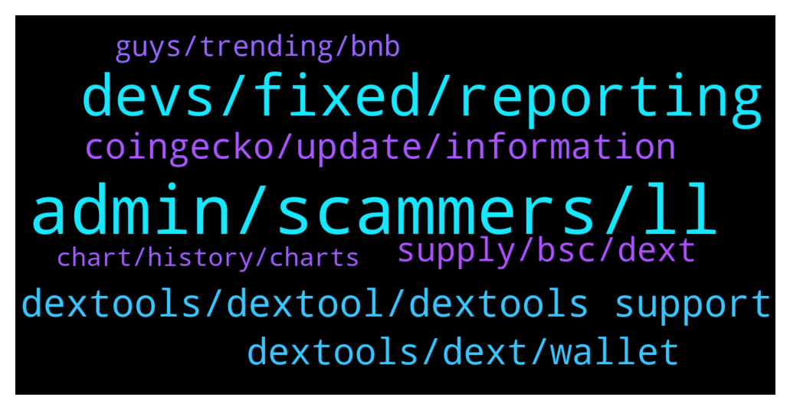

# **@DEXToolsCommunity**
 ## Analysis for **2022-02-01** - **2022-02-03**.

---

## 📊 **Basic Stats**

**n_messages_sent**: 346

---

---

## 🔝 **Top keywords and related messages**

1. **admin, scammers, ll**

    @Wnaqeeb --- *Hi Mr.  I would like to suggest you that  how about establishing an Arabic TG Channel for the Arabic community cuz as u know crypto is getting popular in the middle east. And I'm certain of that you guys will go big after CMC listing. Therefore, If you are interested plz let me know Mr.    By the way, I'm Waleed Alnaqeeb broadcasting from Yemen  and I have enough experience building crypto communities 👍* **--->** [TG Discussion](https://t.me/DEXToolsCommunity/330777)

    @granini7 --- *Ok I now, but I must send 319 DXT also yes?* **--->** [TG Discussion](https://t.me/DEXToolsCommunity/329831)

    @stanes --- *Hi, Please DM @guillermorodriguez78 he is the person-in-charge.  Be aware of scammers, HE WILL NEVER DM YOU FIRST.* **--->** [TG Discussion](https://t.me/DEXToolsCommunity/330040)

    @e_nois_na_fita --- *That your admin @pablojan  dm me first* **--->** [TG Discussion](https://t.me/DEXToolsCommunity/330984)

    @napascual --- *He WONT DM FIRST. Be aware of scammers* **--->** [TG Discussion](https://t.me/DEXToolsCommunity/330775)

    @Shah_of_Prussia --- *thanks. I dmed him, if you could let him know that'd be great.* **--->** [TG Discussion](https://t.me/DEXToolsCommunity/330041)

2. **devs, fixed, reporting**

    @stanes --- *It looks fine now for me.* **--->** [TG Discussion](https://t.me/DEXToolsCommunity/330669)

    @Cryptoflencer --- *ffs disable the function until you fixed it. Should be a fking basic move.* **--->** [TG Discussion](https://t.me/DEXToolsCommunity/330682)

    @stanes --- *Devs just fixed the issue. Thanks for reporting 👍* **--->** [TG Discussion](https://t.me/DEXToolsCommunity/330399)

    @napascual --- *It has been fixed and regenerated already* **--->** [TG Discussion](https://t.me/DEXToolsCommunity/330530)

    @napascual --- *It’s already fixed, no need to move anything* **--->** [TG Discussion](https://t.me/DEXToolsCommunity/330683)

    @FloooCrypto --- *Okay great, thank you very much!* **--->** [TG Discussion](https://t.me/DEXToolsCommunity/330395)

3. **dextools, dextool, dextools support**

    @bastardganpunk --- *must be a general issue on dextools side I guess. The devs are looking into it now 🙂* **--->** [TG Discussion](https://t.me/DEXToolsCommunity/330495)

    @whaleishh --- *Smh dextools. Get your shit together.* **--->** [TG Discussion](https://t.me/DEXToolsCommunity/330546)

    @rapido30 --- *A fail on dextools has been exploited ?* **--->** [TG Discussion](https://t.me/DEXToolsCommunity/330496)

    @George --- *How can we trend on dextool* **--->** [TG Discussion](https://t.me/DEXToolsCommunity/330300)

    @napascual --- *Hi @Harbzym this is Dextools Support channel, feel free to share your findings on https://t.me/DEXTtraderslounge* **--->** [TG Discussion](https://t.me/DEXToolsCommunity/329982)

    @hmk18990 --- *this is dextools support, you can use https://t.me/DEXTtraderslounge for other talks.* **--->** [TG Discussion](https://t.me/DEXToolsCommunity/330140)

4. **dextools, dext, wallet**

    @oni_o_n --- *good morning all, can someone please inform me how to update the dextools info for a token that I deployed* **--->** [TG Discussion](https://t.me/DEXToolsCommunity/330265)

    @napascual --- *There are 1M tokens around, you need to DYOR. Dextools metrics are automatic checks, they help you out, but won’t advise you to buy a token* **--->** [TG Discussion](https://t.me/DEXToolsCommunity/330766)

    @Mr --- *Where Can I stake DEXT ?Admin,plz* **--->** [TG Discussion](https://t.me/DEXToolsCommunity/330013)

    @♡𝚉𝙰𝙷𝚁𝙰♡ --- *How to pay for Dex currency subscription in the standard???* **--->** [TG Discussion](https://t.me/DEXToolsCommunity/330753)

    @LandoftheUniBot --- *guys dextools is a very trustfull platfrom i cant imagine any team wallet would sell* **--->** [TG Discussion](https://t.me/DEXToolsCommunity/330531)

    @Hardik8898 --- *Not listed yet.. we fill up form.. with dextool link.. but they reply us we can not track* **--->** [TG Discussion](https://t.me/DEXToolsCommunity/330873)

5. **coingecko, update, information**

    @HeiHei1985 --- *I click on the token, and other tokens will appear.* **--->** [TG Discussion](https://t.me/DEXToolsCommunity/330909)

    @HeiHei1985 --- *The token cannot be displayed before entering the contract.* **--->** [TG Discussion](https://t.me/DEXToolsCommunity/330901)

    @CryptoFatherBoard --- *This token seems to have many contact, which one is safe* **--->** [TG Discussion](https://t.me/DEXToolsCommunity/330857)

    @HeiHei1985 --- *For example, I click 1token, but it will become a 5 token.* **--->** [TG Discussion](https://t.me/DEXToolsCommunity/330911)

    @CryptoFatherBoard --- *What's the real time utility that surround the token aside from the website* **--->** [TG Discussion](https://t.me/DEXToolsCommunity/330894)

    @HODLnomix --- *Howdy. I have a token, and I'm curious how do we add the information needed like reddit, telegram, etc... so we can crease our information score?* **--->** [TG Discussion](https://t.me/DEXToolsCommunity/330381)

6. **supply, bsc, dext**

    @stanes --- *What is important is the supply on Ethereum. Supply on BSC will never represent the total supply unless 100% of the tokens are bridged.* **--->** [TG Discussion](https://t.me/DEXToolsCommunity/330890)

    @CryptoFatherBoard --- *Okay, am just trying to learn how supply on Ethereum side is more higher than the binance side* **--->** [TG Discussion](https://t.me/DEXToolsCommunity/330886)

    @stanes --- *Both are rights, it only depends if you want to buy on ETh or BSC.* **--->** [TG Discussion](https://t.me/DEXToolsCommunity/330883)

    @CryptoFatherBoard --- *This particular contract shows 2.8 million supply on BSCScan... 👇👇👇👇0xe91a8d2c584ca93c7405f15c22cdfe53c29896e3* **--->** [TG Discussion](https://t.me/DEXToolsCommunity/330877)

    @bastardganpunk --- *well the tx failed, so a swpa didnt happen* **--->** [TG Discussion](https://t.me/DEXToolsCommunity/330525)

    @CryptoFatherBoard --- *This particular bsc contract has supply of 2.8 million token, while the other contract on dextool website says 200 million token supply.. Can you explain sir* **--->** [TG Discussion](https://t.me/DEXToolsCommunity/330874)

7. **guys, trending, bnb**

    @Tether --- *Bro you guys system was trending it for over 24 hours* **--->** [TG Discussion](https://t.me/DEXToolsCommunity/329984)

    @Tether --- *Lost 5 bnb due to you guys trending a honey pot* **--->** [TG Discussion](https://t.me/DEXToolsCommunity/329973)

    @FomoSapien --- *i am releasing a new coin called Excrement Token and I was wondering how much it would cost for trending on the ticker? i did not see anything about it when i looked* **--->** [TG Discussion](https://t.me/DEXToolsCommunity/330764)

    @Ravi --- *No. They cannot and suspect a rug pull or a whale attack* **--->** [TG Discussion](https://t.me/DEXToolsCommunity/330609)

    @stanes --- *There is not the warning anymore but indeed makers are still wrong.* **--->** [TG Discussion](https://t.me/DEXToolsCommunity/330674)

    @giova0096 --- *Every 5 minutes alert turn off and on with “dev team sold 3.2 bnb”* **--->** [TG Discussion](https://t.me/DEXToolsCommunity/330445)

