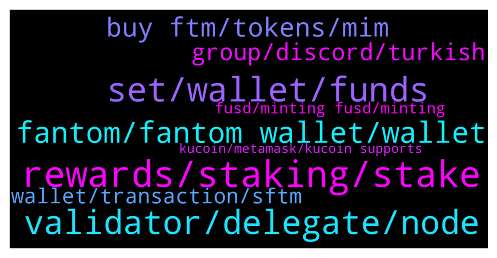

# **@Fantom_English**
 ## Analysis for **2022-02-02** - **2022-02-03**.

---

## 📊 **Basic Stats**

**n_messages_sent**: 175

---

---

## 🔝 **Top keywords and related messages**

1. **rewards, staking, stake**

    @stevenn00 --- *so if circulation supply max 3.1Bil how can give the reward staking* **--->** [TG Discussion](https://t.me/Fantom_English/646499)

    @Mcjig --- *Rewards: currently ~13% APY (Normal APY on self-stake + 15% of delegators' rewards). APY varies based on staked %* **--->** [TG Discussion](https://t.me/Fantom_English/646657)

    @Mcjig --- *the reserved rewards will run out in about 2 years* **--->** [TG Discussion](https://t.me/Fantom_English/646502)

    @slickrick6 --- *You can select the lock period when staking* **--->** [TG Discussion](https://t.me/Fantom_English/646109)

    @TheBDan --- *So can you give an estimated for the current delegators reward?* **--->** [TG Discussion](https://t.me/Fantom_English/646660)

    @stevenn00 --- *after 2years can we stake or no?* **--->** [TG Discussion](https://t.me/Fantom_English/646505)

2. **set, wallet, funds**

    @Chucky --- *Damn sorry to hear that. Can I ask how was it hacked? Want to make sure I don’t make the same mistake… this chat has the most scammer btw* **--->** [TG Discussion](https://t.me/Fantom_English/646670)

    @daily paper --- *scammers get fck out from me* **--->** [TG Discussion](https://t.me/Fantom_English/646131)

    @zenkert --- *Some scammer's aren't even person's, they are scam bots operated by criminals.* **--->** [TG Discussion](https://t.me/Fantom_English/646410)

    @RussellNash20 --- *pay attention guys, full of scammers writing you in private. DO NOT GIVE NEVER YOUR KEYS !! in particular when you are in panic mode due to some issues!!* **--->** [TG Discussion](https://t.me/Fantom_English/646470)

    @WILD5STYL3 --- *don't message to sync my wallet f**ing scammers* **--->** [TG Discussion](https://t.me/Fantom_English/646482)

    @Mcjig --- *[Forwarded from Mcjigs(will never dm first)] Common sense rules to help protect your crypto 1. Never ever share your seed phrase( thats like giving your password to access your funds) 2. Admins or support will never private message you first If you receive a private message with offers to help 99% of the time its a scam 3. Best security is to use a cold wallet(ledger,trezor) 4. There is no such thing as visiting a website to resync or validate your wallet 5. 100% of the time. Issues can be fixed. Seed phrase is never required 6. Always write down your seed phrase and store in a safe place and download your keystore If you dont have either of those. Then you will never be able to access your funds 7. There are NO Airdrops. If your asked to send funds with a promise of more funds in return* **--->** [TG Discussion](https://t.me/Fantom_English/646675)

3. **validator, delegate, node**

    @Mcjig --- *validator and delegating is 2 different things* **--->** [TG Discussion](https://t.me/Fantom_English/646005)

    @TheBDan --- *How much does a validator node earns compared to just staking your ftm for a year?* **--->** [TG Discussion](https://t.me/Fantom_English/646654)

    @thiagorochaoc --- *do you need 500k FTM to become a network validator or is it enough to have 500k delegated?* **--->** [TG Discussion](https://t.me/Fantom_English/645999)

    @thiagorochaoc --- *I know. Let me explain again: anyone needs 500k FTM staked to be a validator. My question is, does it really need 500k FTM or does that amount take into account the delegated values for that validator?* **--->** [TG Discussion](https://t.me/Fantom_English/646010)

    @Mcjig --- *2/3 rds of the validators have to come to a consensus to approve* **--->** [TG Discussion](https://t.me/Fantom_English/646077)

    @Mcjig --- *the vote is lower the requirement to become a validator/ so it would make a easier entry to become one* **--->** [TG Discussion](https://t.me/Fantom_English/646494)

4. **fantom, fantom wallet, wallet**

    @Janevietani --- *community can make one but fantom foundations will not paid* **--->** [TG Discussion](https://t.me/Fantom_English/646304)

    @oppzsmoKe --- *Does Fantom have a NFT marketplace* **--->** [TG Discussion](https://t.me/Fantom_English/646175)

    @Luke --- *Not really related to fantom in any way but are you able to send USDT from coinbase pro to KuCoin on the tron network? Or is it only the entherum network?* **--->** [TG Discussion](https://t.me/Fantom_English/646701)

    @jimmycarbone --- *What evm version does fantom run? Deploying smart contracts that are using a ton of gas. Not sure if I need to specify a different evm version or something* **--->** [TG Discussion](https://t.me/Fantom_English/646864)

    @Mercurywood --- *Is FANTOM safu from this kind of hack* **--->** [TG Discussion](https://t.me/Fantom_English/646646)

    @Mcjig --- *look in the links there are a few of them* **--->** [TG Discussion](https://t.me/Fantom_English/646178)

5. **buy ftm, tokens, mim**

    @jj --- *What exchange to use in swapping MIM to ftm?* **--->** [TG Discussion](https://t.me/Fantom_English/646038)

    @Val_Val10 --- *what better price to buy ftm Please* **--->** [TG Discussion](https://t.me/Fantom_English/646651)

    @Apemonkeyallin --- *Been looking to get heavy in ftm instead of Btc. But I guess it’s smart to wait a bit. Love ftm though* **--->** [TG Discussion](https://t.me/Fantom_English/646517)

    @ICahyo --- *Amazing FTM sponsorship for petronas and F1* **--->** [TG Discussion](https://t.me/Fantom_English/646340)

    @Mcjig --- *they have 7.6 mil ftm liquidity* **--->** [TG Discussion](https://t.me/Fantom_English/646605)

    @zenkert --- *Damn!!!!!  What about FTM on Binance?* **--->** [TG Discussion](https://t.me/Fantom_English/646404)

6. **group, discord, turkish**

    @Haro_House --- *Its okey but i am looking for offical  Turkish group as many people have already asked for it here. Making Turkish group ll be good for creating turkish community* **--->** [TG Discussion](https://t.me/Fantom_English/646303)

    @SamSakamoto --- *Migrating this group to discord would help with eliminating all these bots* **--->** [TG Discussion](https://t.me/Fantom_English/646418)

    @slickrick6 --- *We have a group on discord* **--->** [TG Discussion](https://t.me/Fantom_English/646419)

    @SamSakamoto --- *Dammn you guys have a lot of bots in the group* **--->** [TG Discussion](https://t.me/Fantom_English/646327)

    @Omid currency --- *Allow with we make group Iranian 🙏🙏🙏* **--->** [TG Discussion](https://t.me/Fantom_English/646316)

    @sbabcd --- *You literally posted this in all crypto tg groups 🤣* **--->** [TG Discussion](https://t.me/Fantom_English/646266)

7. **wallet, transaction, sftm**

    @RussellNash20 --- *Hi guys, I would need a confirmation: unfortunately my metamask was hacked and they stole some sFTM (staked FTM). I still see "my" FTM in the FTM wallet and tomorrow they will be unlocked ... my question: not having anymore the sFTM, what happened when the FTM will be unlocked? Will I be able to send to another wallet, or they will go directly to who has the sFTM now ?* **--->** [TG Discussion](https://t.me/Fantom_English/646458)

    @Jay --- *Hi, i sent some ftm token from one of my mm wallet addres to another (no cross bridge used) i haven't received them in my second wallet* **--->** [TG Discussion](https://t.me/Fantom_English/646469)

    @JacobBerry --- *I put 700 gas and I don't even get a transaction to show up on ftm scan lol* **--->** [TG Discussion](https://t.me/Fantom_English/646559)

    @WILD5STYL3 --- *tried it, transaction is not even starting. FTMScan shows no new TX since the one that failed ..* **--->** [TG Discussion](https://t.me/Fantom_English/646503)

    @WILD5STYL3 --- *Hey guys, I can't unstake from a vault after a failed transaction. I got this on FTM Scan "Warning! Error encountered during contract execution [Reverted] "* **--->** [TG Discussion](https://t.me/Fantom_English/646478)

    @charliepopoyo --- *You will have to be at alert once your FTM is unstaked send it out before the scammers does that* **--->** [TG Discussion](https://t.me/Fantom_English/646460)

8. **fusd, minting fusd, minting**

    @Mcjig --- *i wouldnt reccomend minting anything other than fusd. and not trying to sell the fusd. since there isnt liquidity for fusd* **--->** [TG Discussion](https://t.me/Fantom_English/646405)

    @EmaPede --- *Sorry other 2 questions: 1) I cannot find the fee for minting fUSD from sFTM. How much they are? 2) How much they are the wFTM reward for minting fUSD from fFTM?* **--->** [TG Discussion](https://t.me/Fantom_English/646398)

    @pajamasfreak --- *don't have access to coinbase, pretty sure you can choose some upon withdrawal.* **--->** [TG Discussion](https://t.me/Fantom_English/646704)

    @pajamasfreak --- *You can use stablecoins coins like usdt/usdc or bnb or cex like binance. Right now no liquidity on bridge* **--->** [TG Discussion](https://t.me/Fantom_English/646690)

    @Awan9091 --- *Coinbase exchange when is the listing* **--->** [TG Discussion](https://t.me/Fantom_English/646297)

    @Seamarshal --- *Is there something like burn mechanism for this coin?* **--->** [TG Discussion](https://t.me/Fantom_English/646320)

9. **kucoin, metamask, kucoin supports**

    @Mcjig --- *kucoin supports mainnet and erc20 but at the moment kucoin isnt letting mainnet ftm withdraws* **--->** [TG Discussion](https://t.me/Fantom_English/646402)

    @BauPhan --- *I think I messed up.  Sent USDC from Metamask on Fantom Opera to Kucoin and havent recieved the funds after 4 hours.  Is there something I can do?  Thanks in advance.* **--->** [TG Discussion](https://t.me/Fantom_English/646246)

    @Mcjig --- *they do. but at this time it looks like kucoin has withdraws suspended* **--->** [TG Discussion](https://t.me/Fantom_English/646599)

    @slickrick6 --- *With draw over the network that you desire to your MetaMask address. Kucoin supports bother erc and opera withdrawals* **--->** [TG Discussion](https://t.me/Fantom_English/646582)

    @Crypto24z --- *How do I get FTM from kucoin to METAMASK* **--->** [TG Discussion](https://t.me/Fantom_English/646567)

    @pajamasfreak --- *You need to contact kucoin support for help* **--->** [TG Discussion](https://t.me/Fantom_English/646247)

