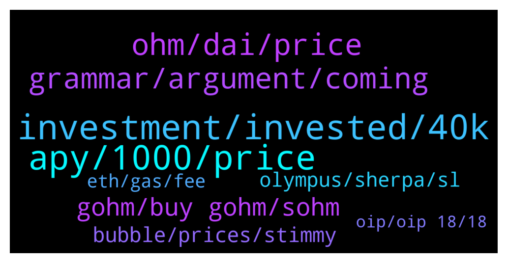

# **@OlympusTG**
 ## Analysis for **2022-02-02** - **2022-02-03**.

---

## 📊 **Basic Stats**

**n_messages_sent**: 675

---

---

## 🔝 **Top keywords and related messages**

1. **investment, invested, 40k**

    @David IL --- *Seriously it's bad. Wasting 12 months to break even. Wtf. How about investing in Btc at least you can make 10% profit and not losing sleep* **--->** [TG Discussion](https://t.me/OlympusTG/177486)

    @David IL --- *It's not. But god damn it i wish i invested my 50000$ in BTC and top 10 market cap coins.* **--->** [TG Discussion](https://t.me/OlympusTG/177293)

    @David IL --- *I really wish 🥲🥲 lost over 40000$ yep 40K* **--->** [TG Discussion](https://t.me/OlympusTG/177201)

    @David IL --- *I invested 50000$ USD. After the price crashed i only have 8000$ left. * (- 42000$ LOSE  )* **--->** [TG Discussion](https://t.me/OlympusTG/177209)

    @David IL --- *Sorry. I will never use it again. I am just angry i'm sure you understand hos it feels losing 40K usd dollars.* **--->** [TG Discussion](https://t.me/OlympusTG/177350)

    @M --- *If -50% isn't a crash will you wait until down -80% to sell* **--->** [TG Discussion](https://t.me/OlympusTG/177596)

2. **apy, 1000, price**

    @cdp279 --- *Just do the maths. You probs bought at the top. Even if price goes down another 50% and if apy stay 1000% you will make your money back. I don’t think we’ll be going down much further and I think it’s all up from here (NFA)* **--->** [TG Discussion](https://t.me/OlympusTG/177852)

    @David IL --- *And how you expect people to trust this if the price keeps getting lower and apy getting lower? 95% down is another story* **--->** [TG Discussion](https://t.me/OlympusTG/177415)

    @nfwaple --- *no I am pretty sure it will stay 500% minimum within the token supply range at the moment, if they want to decrease the APY before we hit the upper token supply range, there would probably be a proposal* **--->** [TG Discussion](https://t.me/OlympusTG/177903)

    @timon_k --- *how much is the apy going to go down in the next few months?  I don’t think the price would go down much more, but the APY keeps declining, can’t calculate against that if I don’t know* **--->** [TG Discussion](https://t.me/OlympusTG/178103)

    @nfwaple --- *learn about the protocol, the apy is not for this purpose, the supply expands by the same percentage as well* **--->** [TG Discussion](https://t.me/OlympusTG/177221)

    @TNrafi2109 --- *Yes it still can go below 500% or even to 100%. Because the apy is the function of supply and other variables* **--->** [TG Discussion](https://t.me/OlympusTG/177900)

3. **ohm, dai, price**

    @theMagicUnicorn --- *this is an amazing video Waple found about OHM, please check it out! 💚💚https://youtu.be/jETcS1nnv8U* **--->** [TG Discussion](https://t.me/OlympusTG/178505)

    @Palancapa --- *you guys will regret selling ohm in a year or two* **--->** [TG Discussion](https://t.me/OlympusTG/177146)

    @Jimjim82 --- *Where can I buy Ohm? Pls give me contract add* **--->** [TG Discussion](https://t.me/OlympusTG/178536)

    @M --- *If you bought Ohm at ATH you are fucked* **--->** [TG Discussion](https://t.me/OlympusTG/177554)

    @Rudra44 --- *True..... I m not in OHM but other reserve currency protocol and this system is awesome for long term* **--->** [TG Discussion](https://t.me/OlympusTG/177151)

    @M --- *Why would Ohm ever go back to ATH ,* **--->** [TG Discussion](https://t.me/OlympusTG/177533)

4. **grammar, argument, coming**

    @NHRAracer --- *Tell y’all what. I’m an old dude. This instant gratification generation ain’t gonna make it!* **--->** [TG Discussion](https://t.me/OlympusTG/177382)

    @Rita --- *Good night. Tomorrow will be better* **--->** [TG Discussion](https://t.me/OlympusTG/178579)

    @Host_Matt --- *im now down many iq points* **--->** [TG Discussion](https://t.me/OlympusTG/177709)

    @bike4peace --- *Good night to all of you, wrote a big tweet about what I am doing on this bike trip and now heading to bed: https://twitter.com/bike4peace_/status/1488750647533084672* **--->** [TG Discussion](https://t.me/OlympusTG/177861)

    @Ossyboi --- *He is going for the vaccine argument* **--->** [TG Discussion](https://t.me/OlympusTG/177646)

    @nfwaple --- *yea sure whatver, you're definitely the smartest person in here* **--->** [TG Discussion](https://t.me/OlympusTG/177610)

5. **gohm, buy gohm, sohm**

    @Jon214u --- *Hi, i'm trying to migrate my sohm v1 to gohm. I approved already but when i click max it always say 0.0 amount to wrap to gohm. Any advise? Thanks* **--->** [TG Discussion](https://t.me/OlympusTG/177906)

    @nfwaple --- *I think potentially the one from the wrap page is for sOHM v2* **--->** [TG Discussion](https://t.me/OlympusTG/177919)

    @Nimz2350 --- *Hi guys, are there interest bearing opportunities for holding gOHM on polygon?* **--->** [TG Discussion](https://t.me/OlympusTG/177747)

    @J --- *so whos getting me a gohm* **--->** [TG Discussion](https://t.me/OlympusTG/178570)

    @chitangxxx --- *I should really sell my time and buy more gohm* **--->** [TG Discussion](https://t.me/OlympusTG/178330)

    @nfwaple --- *double check if you own gOHM or sOHM* **--->** [TG Discussion](https://t.me/OlympusTG/177907)

6. **bubble, prices, stimmy**

    @hootie1233 --- *Bunch of weak arses with crypto atm. Everything is just sideways and then a drop.* **--->** [TG Discussion](https://t.me/OlympusTG/178133)

    @nfwaple --- *the discussion is getting too retarded, from crypto price to random insults* **--->** [TG Discussion](https://t.me/OlympusTG/177669)

    @M --- *Now you loved through the crypto bubble* **--->** [TG Discussion](https://t.me/OlympusTG/177508)

    @nfwaple --- *we must keep calling crypto bubble* **--->** [TG Discussion](https://t.me/OlympusTG/177553)

    @TurboLaserClip --- *Lol just noticed,  treasury runaway 374 days,  my breakeven 380 days :DDD* **--->** [TG Discussion](https://t.me/OlympusTG/178189)

    @Ossyboi --- *I have heard of the dot.com bubble. What has that got to do with crypto. Are you sure you should be here?* **--->** [TG Discussion](https://t.me/OlympusTG/177515)

7. **olympus, sherpa, sl**

    @Anselmo007 --- *If not the apy what is the reason for invest in olympus?* **--->** [TG Discussion](https://t.me/OlympusTG/177402)

    @theMagicUnicorn --- *We are pleased to announce that Vesta Finance has joined Olympus Incubator and will LBP on January 31st, 2022 with official launch a few days after the three day event. Our partnership through the Olympus Incubator program, will bring utility to Ohmies and bring further value to the backing of OHM  https://olympusdao.medium.com/vesta-finance-x-olympus-incubator-f2f7103dd34* **--->** [TG Discussion](https://t.me/OlympusTG/178285)

    @SMNFT7 --- *Jessie did a well job explaining what is happening with Olympus, watch this video:   https://www.youtube.com/watch?v=jETcS1nnv8U* **--->** [TG Discussion](https://t.me/OlympusTG/178062)

    @nfwaple --- *yep if annualised, Olympus is less than one year old, so I assume they use the 8 or 9 months of revenue, then annualised it* **--->** [TG Discussion](https://t.me/OlympusTG/178246)

    @Jon214u --- *I see. A bit misleading coz i followed the instructions in docs.olympusdao* **--->** [TG Discussion](https://t.me/OlympusTG/177923)

    @caesargi85 --- *Thank you. So I need Eth to do it on the Olympus app? Right? :)* **--->** [TG Discussion](https://t.me/OlympusTG/178009)

8. **eth, gas, fee**

    @Mitch --- *Does anyone know how to unstake or get my money out when I only have $16 in Eth? (Besides buying more Eth) I have about $170 in wrapped ohm and just want to get it out.* **--->** [TG Discussion](https://t.me/OlympusTG/177274)

    @metaconvict --- *To buy eth ...and transfer in MetaMask ...now again I m charged with lots of $* **--->** [TG Discussion](https://t.me/OlympusTG/178430)

    @metaconvict --- *I loose 44$ to wrap eth to with* **--->** [TG Discussion](https://t.me/OlympusTG/178403)

    @noexec --- *Tbh I have some eth ready for when we go a little bit down. Still not done buying* **--->** [TG Discussion](https://t.me/OlympusTG/177855)

    @Mitch --- *Thanks. I hate Eth but will have to buy some more just to get a few bucks out. Smh* **--->** [TG Discussion](https://t.me/OlympusTG/177278)

    @metaconvict --- *Eth fees is to kuch high* **--->** [TG Discussion](https://t.me/OlympusTG/178361)

