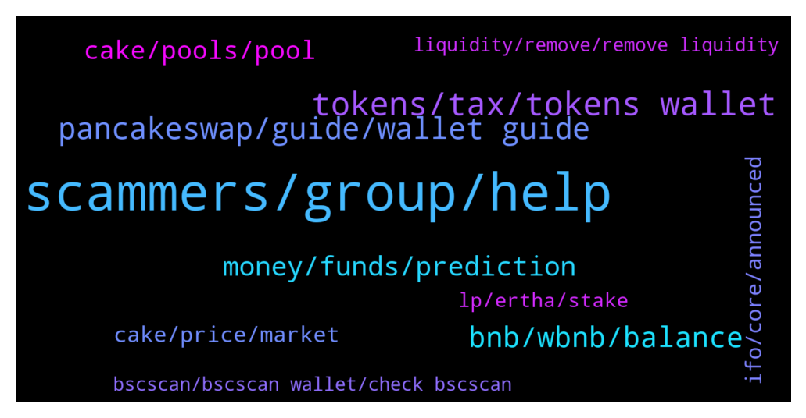

# **@PancakeSwap**
 ## Analysis for **2022-02-02** - **2022-02-03**.

---

## 📊 **Basic Stats**

**n_messages_sent**: 722

---

---

## 🔝 **Top keywords and related messages**

1. **scammers, group, help**

    @khurram101 --- *Please read my upper bigger message Sir...We are facing a very big issue..!* **--->** [TG Discussion](https://t.me/PancakeSwap/2318729)

    @Sarah --- *Why you delete my text and give me warning ? If you r legit then answer instead of deleting and warning* **--->** [TG Discussion](https://t.me/PancakeSwap/2317103)

    @Sharuk0000 --- *Who is marketing admin I am promoter youtuber* **--->** [TG Discussion](https://t.me/PancakeSwap/2318331)

    @Shitcoin --- *im dev to ser pls dont ban me* **--->** [TG Discussion](https://t.me/PancakeSwap/2316321)

    @Luukku1 --- *The scammers propably have bots watching transactions through bscscan and automatically sending to any wallet spotted* **--->** [TG Discussion](https://t.me/PancakeSwap/2316994)

    @QV_zz --- *ill be honest. i dont know myself. some of the stuff the chefs are working on is confidential. pretty excited myself* **--->** [TG Discussion](https://t.me/PancakeSwap/2318947)

2. **tokens, tax, tokens wallet**

    @TomorrowlandForLife --- *your tokens are in your wallet* **--->** [TG Discussion](https://t.me/PancakeSwap/2317299)

    @Re1naldoch4 --- *Hey...any admins around? My nft tokens are gone from trustwallet* **--->** [TG Discussion](https://t.me/PancakeSwap/2316825)

    @god_rider --- *I must say that It's not a scam token It seems that my tokens are "locked in approval transaction" so I can not make other transaction any idea please!* **--->** [TG Discussion](https://t.me/PancakeSwap/2317318)

    @TomorrowlandForLife --- *Your tokens are in your wallet You just need to add the token to your wallet* **--->** [TG Discussion](https://t.me/PancakeSwap/2316703)

    @elliot13458 --- *i need to add this custom token* **--->** [TG Discussion](https://t.me/PancakeSwap/2316638)

    @Crypto --- *the token was 4bnb... can i do anything on my end* **--->** [TG Discussion](https://t.me/PancakeSwap/2319071)

3. **pancakeswap, guide, wallet guide**

    @Beautykakat --- *Is it possible to connect pancakeswap to coinbase ?* **--->** [TG Discussion](https://t.me/PancakeSwap/2318325)

    @Spoletik --- *Is it real to publish my own pictures like NFTs on pancakeswap?* **--->** [TG Discussion](https://t.me/PancakeSwap/2317127)

    @WisdomINaction --- *ok but why did i get them when i just done my first swap in pancakeswap..?* **--->** [TG Discussion](https://t.me/PancakeSwap/2316986)

    @WisdomINaction --- *Yes i know, but im referring to inside pancakeswap website, how can someone know that? because theres no option to check in the website to see if that token you are swapping is the one you want?* **--->** [TG Discussion](https://t.me/PancakeSwap/2317000)

    @WisdomINaction --- *Thanks. So if a token i want to swap which is LOA (League of ancient) is not in those 2 'top 100' & 'extended'  options, i can just click on the 'tokens' tab then put in the projects contract address then it will give me the correct project im looking for correct? because in coingecko it shows that this project is tradable in pancakeswap* **--->** [TG Discussion](https://t.me/PancakeSwap/2317019)

    @S --- *I think pancakeswap should do more to protect its users from scams* **--->** [TG Discussion](https://t.me/PancakeSwap/2318740)

4. **bnb, wbnb, balance**

    @god_rider --- *my BNB sent to 0x3597852fa8308b67945c5dc2c5023f41575ee8b4 already* **--->** [TG Discussion](https://t.me/PancakeSwap/2318084)

    @Ceddi200 --- *Here is your balance. Go to the exchange and unwrap 0.419 wbnb to bnb* **--->** [TG Discussion](https://t.me/PancakeSwap/2317541)

    @foolofall --- *Have you added / imported  BNB token in your wallet?* **--->** [TG Discussion](https://t.me/PancakeSwap/2317526)

    @Mark_LCL --- *Sorry keep asking questions but when I try to unwrap using my account (0x52b23Fc2a5C796B34da4a6f6e2D6aA82333D9dA8) it shows a wbnb balance of 0 so I can't exchange into BNB* **--->** [TG Discussion](https://t.me/PancakeSwap/2317551)

    @elliot13458 --- *i swapped bnb for eartha on the pancakseswap site* **--->** [TG Discussion](https://t.me/PancakeSwap/2316620)

    @Mark_LCL --- *Yes.  Looking at the TXN it looks like it was transferred back to me as wrapped BNB* **--->** [TG Discussion](https://t.me/PancakeSwap/2317527)

5. **money, funds, prediction**

    @slovvmotherrfucker --- *You charger me for a prediction, and you not done that. I want to bet prediction i click confirm, the transaction try to going thrue, and its not and my money gone from my wallet. What is that, i want my money back.* **--->** [TG Discussion](https://t.me/PancakeSwap/2317600)

    @Crypto --- *i tried to make a swap and it failed that is why i came on here i got a DM to connect my wallet to a site and send QR code to retrieve funds I sent QR code is there anyway I can still retrieve my funds...* **--->** [TG Discussion](https://t.me/PancakeSwap/2319084)

    @TomorrowlandForLife --- *if the tx didn't go through your money is still in your wallet and never got out* **--->** [TG Discussion](https://t.me/PancakeSwap/2317603)

    @slovvmotherrfucker --- *Im reading, but i still don't have my funds here* **--->** [TG Discussion](https://t.me/PancakeSwap/2317656)

    @khayows --- *I still can't understand, how soon today he did that, he stole the money I had to make a down payment on my house tomorrow.. I'm going to lose the financing it took me so long to get. God have mercy on this guy, he just destroyed a chance I had to start over, but anyway, thank you so much for the help buddy, all the best to everyone and good luck* **--->** [TG Discussion](https://t.me/PancakeSwap/2318577)

    @god_rider --- *So where my money gone? If pc v2 tokau was exceeded, it must be in previous one* **--->** [TG Discussion](https://t.me/PancakeSwap/2318055)

6. **cake, pools, pool**

    @wilmone --- *hi! i got many cakes in auto pool, is it possible that i lost some recent profit when i added more in staking? i was waiting for harvesting a couple of cake but they gone to 0 after placing new cakes in stake...* **--->** [TG Discussion](https://t.me/PancakeSwap/2317444)

    @Luukku1 --- *Yes, you will get Cake corresponding to the APY displayed next to the pool!* **--->** [TG Discussion](https://t.me/PancakeSwap/2316973)

    @P --- *Hi, I want to know if I stak Cake in IFO pool then my cake is increasing or not ?* **--->** [TG Discussion](https://t.me/PancakeSwap/2316972)

    @Quarter_Bitcoin --- *I have pools but none are cake no* **--->** [TG Discussion](https://t.me/PancakeSwap/2318844)

    @TomorrowlandForLife --- *you didn't lose anything. That amount is only informative. The amount of CAKE earned are already IN the Pool added to the ones you stake at the begining* **--->** [TG Discussion](https://t.me/PancakeSwap/2317447)

    @QV_zz --- *the pools are: Stake CAKE to earn CAKE or another token* **--->** [TG Discussion](https://t.me/PancakeSwap/2318849)

7. **cake, price, market**

    @Bikku77 --- *Why the cake price is falling down  even the staked cake is increasing? Anything that we holders can do to increase the price?? What the cake team doing for the increasing of price?? I am totally loss in cake,how long should I wait till it goes all time high??will it be 20 dollor even??any experts??and team??admin??* **--->** [TG Discussion](https://t.me/PancakeSwap/2317771)

    @batchdenbitcoinlaus --- *Dude Cake is up 300x since last year. The price is high. Everything above 1$ is bullish* **--->** [TG Discussion](https://t.me/PancakeSwap/2317782)

    @TOOLSCUBE --- *ANY PRICE FOR CAKE  IS CHEAP ®️🎂* **--->** [TG Discussion](https://t.me/PancakeSwap/2316405)

    @xuanminh300595 --- *Other wise cake  price would down more* **--->** [TG Discussion](https://t.me/PancakeSwap/2318513)

    @rahulkuhad --- *Then where is it allowed ? Because I almost got more than 1200 cake at 18 usdt ! And it just makes me loose confidence in cake* **--->** [TG Discussion](https://t.me/PancakeSwap/2316928)

    @MiguelCastle --- *Anyways is bear market CAKE is power* **--->** [TG Discussion](https://t.me/PancakeSwap/2317784)

8. **ifo, core, announced**

    @Diegovrq --- *I cannot find anywhere where to get this announcements 🥲* **--->** [TG Discussion](https://t.me/PancakeSwap/2317231)

    @QV_zz --- *you got that right. expect the floor to go up from ppl who havent planned ahead haha* **--->** [TG Discussion](https://t.me/PancakeSwap/2318944)

    @stevensmith001 --- *I know,But when? Nothing is going on,devs are too slow….come on guys* **--->** [TG Discussion](https://t.me/PancakeSwap/2317463)

    @Besir --- *@QV_zz man another question :) When will PCS get blue tick in twitter?* **--->** [TG Discussion](https://t.me/PancakeSwap/2318961)

    @Besir --- *everyone ready for ifo 3.1. Have you setup your squads as profile pics?* **--->** [TG Discussion](https://t.me/PancakeSwap/2318937)

    @P --- *Now when next ifo coming ?* **--->** [TG Discussion](https://t.me/PancakeSwap/2316974)

9. **lp, ertha, stake**

    @elliot13458 --- *i still cant stake even after swapping for eartha* **--->** [TG Discussion](https://t.me/PancakeSwap/2316628)

    @xxanobody1 --- *does someone know where i can stake stablecoins without kyc* **--->** [TG Discussion](https://t.me/PancakeSwap/2318669)

    @elliot13458 --- *do i need to stake in order to earn tokens?* **--->** [TG Discussion](https://t.me/PancakeSwap/2316608)

    @Aasp1999 --- *If you add liquidity, you need an lp. This is half/half. So if you want to add ertha-bnb lp you need half worth of ertha and half of bnb (so u need both coins). However, always be beware of the risk of impermanent loss* **--->** [TG Discussion](https://t.me/PancakeSwap/2316615)

    @Aasp1999 --- *Yes an lp does, but you can stake coins on several dapps. Like you can stake cake on pancake without having to have two coins.* **--->** [TG Discussion](https://t.me/PancakeSwap/2316655)

    @Aasp1999 --- *Yes stake or add liquidity, idk what coin you have. Also ignore all dms you get* **--->** [TG Discussion](https://t.me/PancakeSwap/2316610)

10. **bscscan, bscscan wallet, check bscscan**

    @TomorrowlandForLife --- *did you check bscscan.com or any dashboard?* **--->** [TG Discussion](https://t.me/PancakeSwap/2317332)

    @Mark_LCL --- *Yes I checked on bscscan and it shows the transfer to my CA but it isn't there* **--->** [TG Discussion](https://t.me/PancakeSwap/2317522)

    @jShiz --- *Just go to bscscan and and search In the top search bar “Binance-pegged”* **--->** [TG Discussion](https://t.me/PancakeSwap/2316551)

    @QV_zz --- *dude go to bscscan.com and paste your address there* **--->** [TG Discussion](https://t.me/PancakeSwap/2319121)

    @QV_zz --- *you can look up your address on bscscan.com* **--->** [TG Discussion](https://t.me/PancakeSwap/2319108)

    @Aosh1ma --- *you sent to smart contract and you can all functions via bscscan* **--->** [TG Discussion](https://t.me/PancakeSwap/2318688)

