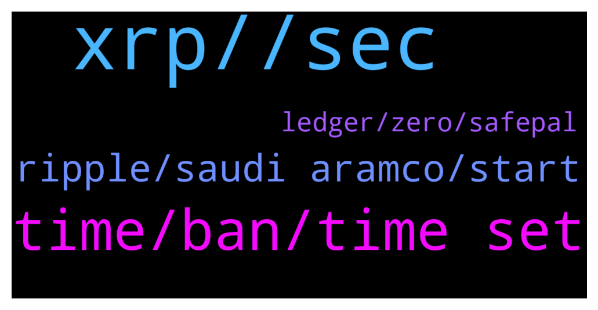

# **@Ripple**
 ## Analysis for **2022-02-02** - **2022-02-03**.

---

## 📊 **Basic Stats**

**n_messages_sent**: 99

---

---

## 🔝 **Top keywords and related messages**

1. **xrp, , sec**

    @pasco_esso --- *35k per coin the end of this year* **--->** [TG Discussion](https://t.me/Ripple/3048615)

    @Likeitorpumpit --- *Prob be more like $5 to $8 dollars in 4 yrs* **--->** [TG Discussion](https://t.me/Ripple/3048706)

    @JustNNM --- *Price wise i have no idea.  It doesn’t need to be a stable currency to bridge different currencies.  Ill break it down to the most simple understanding Us sends $10 > XRP bridges with $10 worth > out pops the other currency equivalent to the $10  XRP could be priced at 1 billion but you only need $10 worth for that bridge, so a drop of an XRP* **--->** [TG Discussion](https://t.me/Ripple/3048495)

    @arunmaster --- *Xrp behaving like dead coin. my god* **--->** [TG Discussion](https://t.me/Ripple/3048486)

    @Cheapsuit --- *RippleNet has had it's most lucrative year to date. If that doesn't tell people that XRP price is being strategically supressed, then nothing will.* **--->** [TG Discussion](https://t.me/Ripple/3048712)

    @Yagiz342935 --- *Please correct me if I misunderstood.  Is the idea of ​​xrp holders or community that xrp will be the only coin in world money transfer transactions?* **--->** [TG Discussion](https://t.me/Ripple/3048589)

2. **time, ban, time set**

    @ReiTeh --- *I see okok. I'll read up the link you send. Thx. If there is more questions I'll just ask 👍* **--->** [TG Discussion](https://t.me/Ripple/3048509)

    @TheRealPrussian --- *Let me know how easy or hard the setup is.  I like to hear from real people.* **--->** [TG Discussion](https://t.me/Ripple/3048348)

    @Cheapsuit --- *Comments like this is what makes others think we are loonies.* **--->** [TG Discussion](https://t.me/Ripple/3048701)

    @stonecoldstone55 --- *What do you guys think honestly* **--->** [TG Discussion](https://t.me/Ripple/3048559)

    @JinQSim --- *Not sure if allowed to share link here. John Deaton's petition. https://chng.it/4FdJWDqG7q* **--->** [TG Discussion](https://t.me/Ripple/3048428)

    @anuj90322 --- *Will let u know when I get chance.. problem is I am in another city* **--->** [TG Discussion](https://t.me/Ripple/3048357)

3. **ripple, saudi aramco, start**

    @Blockchain2018 --- *Let’s think Saudi aramco making $800m daily. Now let’s put that on ripples odl hub, no questions 🌝* **--->** [TG Discussion](https://t.me/Ripple/3048646)

    @Baptiste_EOS --- *I am looking to know more.. If I can use ripple to start transfer money for my company. I can start a big project with that blockchain.* **--->** [TG Discussion](https://t.me/Ripple/3048376)

    @TheRealPrussian --- *Read it this morning.  Regardless of what happens with the lawsuit it appears they are posturing for growth into Europe.* **--->** [TG Discussion](https://t.me/Ripple/3048381)

    @Troy4321 --- *They will go in by a lot especially if requested by the companies exporting the oil 🚀* **--->** [TG Discussion](https://t.me/Ripple/3048654)

    @Cheapsuit --- *250-500 by December lawsuit or not.* **--->** [TG Discussion](https://t.me/Ripple/3048414)

    @arianaparker --- *Haha that’s sweet in words but saudi Aramco won’t go 100% because they have daily expenses and also need to keep some cash ahead of time for workers salary because they are currently paying with fiats* **--->** [TG Discussion](https://t.me/Ripple/3048649)

4. **ledger, zero, safepal**

    @TheRealPrussian --- *No worries or rush.  I got a little cheap SafePal hardware that a friend recommended while I wait on the Zero and following the videos and directions didn’t work once I needed to add the currencies.  Must have been a bug.  Do not recommend.  Plus it only works with SafePal so that’s an issue as well.* **--->** [TG Discussion](https://t.me/Ripple/3048354)

    @TheRealPrussian --- *If I had android I would have went with the nano as well.  It’s cold and you can get 3 for the price of 1 ledger x!  It’s a good buy in my opinion.* **--->** [TG Discussion](https://t.me/Ripple/3048346)

    @TheRealPrussian --- *Personally I’m on the waiting list for the NGRAVE Zero.  It’s supposed to be the coldest of the cold wallets.  Not sure on the price but seemed like it would be comparable to the ledger x price wise.* **--->** [TG Discussion](https://t.me/Ripple/3048344)

    @TheRealPrussian --- *It’s a good one just not OS operation system compatible unfortunately.* **--->** [TG Discussion](https://t.me/Ripple/3048342)

    @anuj90322 --- *Yeah I got the ledger nano s recently* **--->** [TG Discussion](https://t.me/Ripple/3048339)

