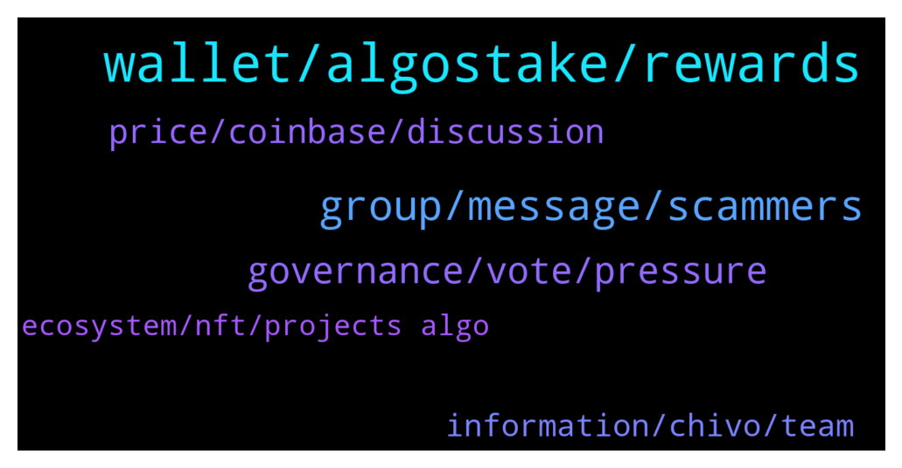

# **@algorand**
 ## Analysis for **2022-02-02** - **2022-02-03**.

---

## 📊 **Basic Stats**

**n_messages_sent**: 129

---

---

## 🔝 **Top keywords and related messages**

1. **wallet, algostake, rewards**

    @Ferdi_Carrefour --- *Hi, can i stake algo on yieldly while i am in govrernance with the same amount?* **--->** [TG Discussion](https://t.me/algorand/336637)

    @Shetty2505 --- *Hello Any idea when will algorand touch 5$* **--->** [TG Discussion](https://t.me/algorand/336564)

    @willywonkaflavour --- *So guys which tokken can one get on algo that will make a good profit in short time* **--->** [TG Discussion](https://t.me/algorand/336444)

    @Tjopchie --- *i have an algorand wallet but i don't have it inported in algosigner. can i still make all the transactions and other things i wish to do with my wallet without the algosigner desktop wallet? With other things i mean claiming tokens from a website and accepting staking etc etc. (please answer me here and not in dm, thanks :D)* **--->** [TG Discussion](https://t.me/algorand/336671)

    @. --- *Hi i have some question anyone ask me ? What is the total amount of fees generated on Algorand since the first block* **--->** [TG Discussion](https://t.me/algorand/336549)

    @MackDenver --- *Hello Coliba,  You don't need to stake ALGO, just hold your ALGO in the official ALGO wallet, you will get staking rewards automatically.* **--->** [TG Discussion](https://t.me/algorand/336646)

2. **group, message, scammers**

    @Shane --- *Type in this chat and within 1 minute receive scam message lol.* **--->** [TG Discussion](https://t.me/algorand/336492)

    @billy_7 --- *Interesting since joining this group yesterday I've had several spam messages from females that I have no idea who they are, I've been on telegram over a year with no issues, join this group and the spam floods in* **--->** [TG Discussion](https://t.me/algorand/336524)

    @billy_7 --- *Guess I'll have to leave the group then, I was looking forward to being part of it but I'm not subjecting myself to unsolicited messages just by joining a group* **--->** [TG Discussion](https://t.me/algorand/336530)

    @M6R6T --- *Hi admin I have a question* **--->** [TG Discussion](https://t.me/algorand/336533)

    @Nicksof --- *Oh how did you do that* **--->** [TG Discussion](https://t.me/algorand/336445)

    @MackDenver --- *Please use the report and block button.* **--->** [TG Discussion](https://t.me/algorand/336532)

3. **governance, vote, pressure**

    @abovyanv --- *why are you spitting in the face of your members like that? I was very disappointed in this blockchain. Let members vote without pressure* **--->** [TG Discussion](https://t.me/algorand/336661)

    @Todd --- *Governance is a commitment not to spend.  Best apy currently that i know of.* **--->** [TG Discussion](https://t.me/algorand/336425)

    @MackDenver --- *Members can vote by their own choice. Both options are open and available to vote.* **--->** [TG Discussion](https://t.me/algorand/336663)

    @Steven --- *Hi all, I accidentally went under my committed amount for governance and now I'm ineligible. Is there anyway to get back in? I already voted before.  I'm so mad at myself. Was swapping ASA tokens on tinyman and took too much algo out of my wallet.* **--->** [TG Discussion](https://t.me/algorand/336432)

    @Telemenop --- *While trying to submit my vote in governance im getting   ‘[RequestError.NotAuthorized] The extension user does not authorise the request.’  Anybody know what that is ?* **--->** [TG Discussion](https://t.me/algorand/336642)

    @Edosall --- *Hi no it is not an issue. I ve much more Algo since the registration period and my vote is registered* **--->** [TG Discussion](https://t.me/algorand/336662)

4. **price, coinbase, discussion**

    @alli_dunn --- *Good morning, a question what do you think of Coinbase? I have always used binance* **--->** [TG Discussion](https://t.me/algorand/336552)

    @NightAlgorand --- *here is not the place for price discussion* **--->** [TG Discussion](https://t.me/algorand/336565)

    @Pablo_cast --- *Offers a cheap and simple solution* **--->** [TG Discussion](https://t.me/algorand/336591)

    @AbuRidwan16 --- *Hi!  I have a online store, how can i accept Algorand as payment method?* **--->** [TG Discussion](https://t.me/algorand/336558)

    @NightAlgorand --- *Please refrain from price discussion here. Here is the price discussion group-   https://t.me/algorand_price* **--->** [TG Discussion](https://t.me/algorand/336686)

    @NightAlgorand --- *Please contact https://algorand.foundation/contact so that the team could review your store and get back to you with guidance* **--->** [TG Discussion](https://t.me/algorand/336561)

5. **information, chivo, team**

    @MackDenver --- *You can hear more from Chivo or their team, we don't have any information about it atm.* **--->** [TG Discussion](https://t.me/algorand/336520)

    @MackDenver --- *I don't have any news information about it.* **--->** [TG Discussion](https://t.me/algorand/336510)

    @Olaxy17 --- *You have their website or any social?* **--->** [TG Discussion](https://t.me/algorand/336658)

    @S --- *When will the foundation announce Sean’s replacement?* **--->** [TG Discussion](https://t.me/algorand/336610)

    @DlHKl --- *what's the update on why the Sean Lee CEO of Algorand Foundation left?  been days since his termination* **--->** [TG Discussion](https://t.me/algorand/336612)

    @NightAlgorand --- *We don't have the information regarding that yet, please stay tuned 🙂* **--->** [TG Discussion](https://t.me/algorand/336611)

6. **ecosystem, nft, projects algo**

    @MKT1236 --- *Any look into new crypto project on Algorand block chain. Just came out yesterday. Digileaf io. Same people that created blockcreate* **--->** [TG Discussion](https://t.me/algorand/336609)

    @lightjoegee --- *Please someone should recommend some good resource to learn Dapp with algorand* **--->** [TG Discussion](https://t.me/algorand/336571)

    @khunpon --- *I hope It not direct relate to Algorand technology* **--->** [TG Discussion](https://t.me/algorand/336517)

    @Thechixixi --- *Does Algo support nft , where can I be seeing upcoming projects on Algo ecosystem both nft* **--->** [TG Discussion](https://t.me/algorand/336653)

    @MackDenver --- *Please check the ecosystem projects here: https://www.algorand.com/ecosystem/use-cases* **--->** [TG Discussion](https://t.me/algorand/336655)

    @MackDenver --- *Applications are now open for the eMerge Americas 2022 Global Startup Showcase!   With innovation accelerating across Miami’s thriving tech ecosystem, we are excited to continue to empower founders and developers building applications and solutions of the future: https://www.prnewswire.com/news-releases/emerge-americas-partners-with-algorand-florida-funders--panoramic-ventures-for-the-2022-global-startup-showcase-301471124.html* **--->** [TG Discussion](https://t.me/algorand/336489)

