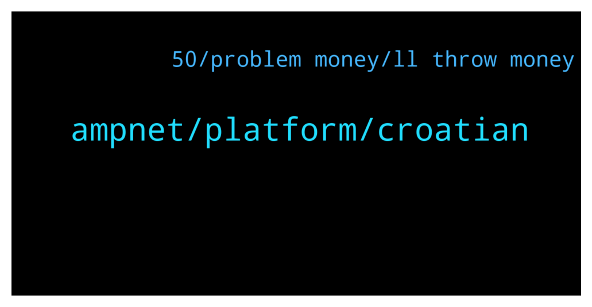

# **@ampnetapxchat**
 ## Analysis for **2022-01-29** - **2022-02-03**.

---

## 📊 **Basic Stats**

**n_messages_sent**: 59

---

---

## 🔝 **Top keywords and related messages**

1. **ampnet, platform, croatian**

    @MelonHusk --- *I have never seen a project recover from -98.5% losses.* **--->** [TG Discussion](https://t.me/ampnetapxchat/36820)

    @jakovtradingmentor --- *well i'm told we as ampnet cant really go around and shill the projects on our platform, something about the legality around it doesnt allow us to do so* **--->** [TG Discussion](https://t.me/ampnetapxchat/36779)

    @mislavjavor --- *Hey all, the bar counts until hard cap is reached, the percentage until the hard cap i* **--->** [TG Discussion](https://t.me/ampnetapxchat/36808)

    @MelonHusk --- *Don't tell me Ampnet is raising more money?* **--->** [TG Discussion](https://t.me/ampnetapxchat/36814)

    @Tinus_Tussengas_1984 --- *is there somewhere we can see the progress on the prudenzzafc fan token seed sale?* **--->** [TG Discussion](https://t.me/ampnetapxchat/36828)

    @jakovtradingmentor --- *could you elaborate by what you mean with shilling to chilliz community?* **--->** [TG Discussion](https://t.me/ampnetapxchat/36776)

2. **50, problem money, ll throw money**

    @Tinus_Tussengas_1984 --- *thanks m8. that loading bar is looking strange btw... i assume its to see the progress in time to the deadline instead of the percentage of funding 😋* **--->** [TG Discussion](https://t.me/ampnetapxchat/36806)

    @runex_x1 --- *did my part :). Hope it gets funded, maybe even with an extension* **--->** [TG Discussion](https://t.me/ampnetapxchat/36920)

    @runex_x1 --- *almost feel sorry to have not invested in biznisport 😊, but can't invest everywhere :)* **--->** [TG Discussion](https://t.me/ampnetapxchat/36893)

    @runex_x1 --- *I wish the team all the luck on this one. We can use some positive investment news after all this technical progress* **--->** [TG Discussion](https://t.me/ampnetapxchat/36883)

    @North --- *Anybody able to confirm? I'll throw some of my own money in if it looks like it isn't getting funded and it would be a problem* **--->** [TG Discussion](https://t.me/ampnetapxchat/36876)

    @North --- *Three I've made money from are Unibright, Strong, Thor. Countless others.  You couldn't even be bothered to research who is raising funds here, so I'm not surprised you miss these opportunities* **--->** [TG Discussion](https://t.me/ampnetapxchat/36825)

