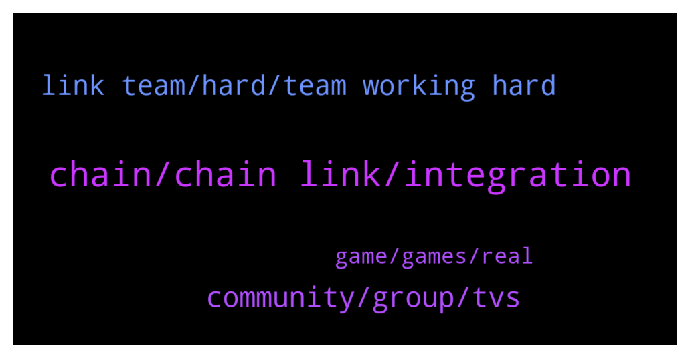

# **@chainlinkofficial**
 ## Analysis for **2022-02-02** - **2022-02-03**.

---

## 📊 **Basic Stats**

**n_messages_sent**: 81

---

---

## 🔝 **Top keywords and related messages**

1. **chain, chain link, integration**

    @Sylvarantt --- *Hi Sam, you can always request a new price feed by clicking on the "Request price feed" button at the top-right of https://data.chain.link/ or even talk with several node operators so they can satisfy your on-chain data needs. Either way, if you are a dApp developer/ representative looking to integrate Chainlink, feel free to DM me more details about it and I'll be happy to connect you with the right people* **--->** [TG Discussion](https://t.me/chainlinkofficial/371398)

    @🌙 --- *Is chain link a solid project* **--->** [TG Discussion](https://t.me/chainlinkofficial/371109)

    @B4s3d --- *Somebody just DM'ed me about an 'airdrop' of Chainlink. A reminder to everyone here that there are NO airdrops. Blocked and reported this guy. Stay safe.* **--->** [TG Discussion](https://t.me/chainlinkofficial/371215)

    @SeriousSam22 --- *thx for this useful information! right now i'm also trying to find out what is the benefit of using a chainlink datafeed instead of calculating the price by myself by using the getReserves method from the LiquidityPool* **--->** [TG Discussion](https://t.me/chainlinkofficial/371400)

    @zzzvwww --- *Hello, how much chainlink services/products cost?* **--->** [TG Discussion](https://t.me/chainlinkofficial/371165)

    @davidkohcw --- *Hi! I was wondering but how many chainlink nodes are there currently?* **--->** [TG Discussion](https://t.me/chainlinkofficial/371388)

2. **community, group, tvs**

    @tjj0178 --- *Please can I talk to the admin??* **--->** [TG Discussion](https://t.me/chainlinkofficial/371055)

    @Hakanbilgehan --- *Hello, is there an official/unofficial price discussion channel?* **--->** [TG Discussion](https://t.me/chainlinkofficial/371102)

    @juankaramoy --- *Hi Welcome! We do not have German telegram group but we do have other EU groups 🙂 https://chain.link/community* **--->** [TG Discussion](https://t.me/chainlinkofficial/371360)

    @Joypokkamol --- *Hi there! China has a telegram group. It’s called @chainlinkfans (unofficial) and please also feel free to check out our Chinese communities (official) here: https://blog.chain.link/chainlink-chinese-communities/* **--->** [TG Discussion](https://t.me/chainlinkofficial/371356)

    @juankaramoy --- *Price/market discussion is beyond this group. Please refer to the pinned message* **--->** [TG Discussion](https://t.me/chainlinkofficial/371358)

    @Hakanbilgehan --- *thank you. sure, ill be aware and beware. i just want to track price expectations of the community.* **--->** [TG Discussion](https://t.me/chainlinkofficial/371105)

3. **link team, hard, team working hard**

    @Removsk --- *The $Link team had NOT released, after three years: DECO Mixicles Staking CCIP Threshold signatures Arbitrum validators All you got in three years is a new white paper.* **--->** [TG Discussion](https://t.me/chainlinkofficial/370974)

    @Peter --- *İs staking option started for chainlink?* **--->** [TG Discussion](https://t.me/chainlinkofficial/371207)

    @guojinbtc --- *Hello friend! I am a member of a large investment institution, and I am currently researching the top 100 cryptocurrency data. The price of link has been dropping and dropped so much that the question for me is: is the link team still working hard? Is it worth the investment？* **--->** [TG Discussion](https://t.me/chainlinkofficial/371073)

    @guojinbtc --- *If the link team members do not work hard, funds such as Three Arrows Capital and Grayscale will sell all link* **--->** [TG Discussion](https://t.me/chainlinkofficial/371070)

    @Jc_00111 --- *Are you link with metadrace they are holding 4m linka token* **--->** [TG Discussion](https://t.me/chainlinkofficial/371083)

    @rrr4m --- *Hi, just jumped into link and was wondering is the staking for link live now?* **--->** [TG Discussion](https://t.me/chainlinkofficial/371343)

4. **game, games, real**

    @elifhilalumucu --- *It is a good resource for those who want to do research on making money by playing games and who want to have information about the future of this industry!🤩🤩* **--->** [TG Discussion](https://t.me/chainlinkofficial/371025)

    @elifhilalumucu --- *There is a lot of work going on in this industry right now.  Many emerging blockchain-based games are working to give players verifiable digital ownership of their in-game items through NFTs and connecting in-game currency to real-world markets through tokens🙂* **--->** [TG Discussion](https://t.me/chainlinkofficial/371024)

    @elifhilalumucu --- *For example, In “gachapon games” such as Genshin Impact, which incentivize players to continually spend real-world money on loot boxes in order to gain the best items and characters, in-game value makes up a considerable portion of the game developer’s revenue* **--->** [TG Discussion](https://t.me/chainlinkofficial/371023)

    @elifhilalumucu --- *In the article, we first need to understand what is 'in-game value':  👉🏻In-game value refers to the phenomenon of in-game items that have real-world value👌🏻* **--->** [TG Discussion](https://t.me/chainlinkofficial/371021)

    @elifhilalumucu --- *This article explores the impact of this fundamental shift to play-to-earn gaming on blockchains, with players tangibly rewarded for the time, effort, and money that they put into games 🏓🏸📱💻* **--->** [TG Discussion](https://t.me/chainlinkofficial/371020)

    @elifhilalumucu --- *The Entertainment Software Association (ESA) estimates that 227 million Americans play video games—that’s around 66% of the country’s population 😮🤩* **--->** [TG Discussion](https://t.me/chainlinkofficial/371019)

