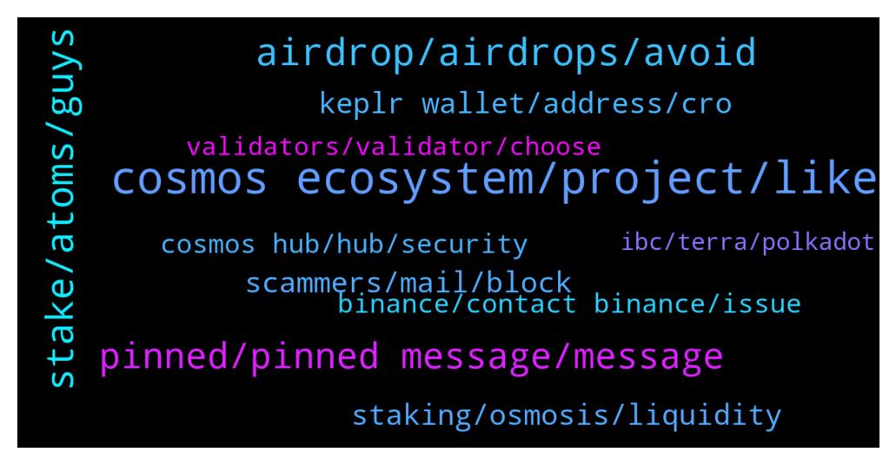

# **@cosmosproject**
 ## Analysis for **2022-02-02** - **2022-02-03**.

---

## 📊 **Basic Stats**

**n_messages_sent**: 257

---

---

## 🔝 **Top keywords and related messages**

1. **cosmos ecosystem, project, like**

    @Julius_megusta30 --- *Any news regarding sagan already? ❤️* **--->** [TG Discussion](https://t.me/cosmosproject/484419)

    @Wafa7872 --- *Hi guy. How are you? Sorry to bother. I’m a new member of the Cosmos group  I want to do some research on Cosmos platform but I didn’t have any data on it. I want to know if there is any simple course to read or watch without looking after difficult Youtube video’s, Reddit  or the Whitepaper, to see if this project is good for investing or not. I will appreciate you to send me to start my research on this project* **--->** [TG Discussion](https://t.me/cosmosproject/484895)

    @TaiVerse224 --- *Hello Cosmo community I’m new to the platform* **--->** [TG Discussion](https://t.me/cosmosproject/484580)

    @h --- *if luna and ust crashed would cosmos ecosystem be ill ?* **--->** [TG Discussion](https://t.me/cosmosproject/484999)

    @LorenzoLory --- *Guys can i ask a question, if i stack my cosmos at their currently prices, if Cosmos After 1 week grow of 10% , Will my stacked Cosmos grow too? Or they remain in the prices of One week ago?* **--->** [TG Discussion](https://t.me/cosmosproject/484599)

    @amitkarpe --- *Any auto compounding project like beefy or auto farmer for cosmos/ Osmo/ Juno?* **--->** [TG Discussion](https://t.me/cosmosproject/484428)

2. **airdrop, airdrops, avoid**

    @TicoJohnny --- *Snapshot is the recorded time for when the airdrop eligibility requirements are made (i.e did you have ATOM staked on February 18th for Osmosis.)* **--->** [TG Discussion](https://t.me/cosmosproject/484930)

    @Shahid --- *I already staked some Atom in Cosmo Station since 21 of January 2022. But I really don't know may I eligible for last airdrop? And do you have any airdrop in February and coming next month 2022? Thanks in advance* **--->** [TG Discussion](https://t.me/cosmosproject/484939)

    @Matt_Blocks_United --- *To make sure you qualify for airdrops: 1. Avoid centralized exchange nodes, like Kraken or Binance 2. Avoid 0% commission nodes 3. Avoid the top 10 and even top 25 largest nodes  We have a tutorial that should answer most, if not all of your questions. You can check it out here:  https://blocksunited.com/how-to-choose-a-validator/  You're certainly welcome to stake with us at Blocks United.* **--->** [TG Discussion](https://t.me/cosmosproject/484735)

    @Luke --- *When I see people talking about airdrops, they also mention the date when it’s available but also the snapshot, what’s a snapshot?* **--->** [TG Discussion](https://t.me/cosmosproject/484929)

    @TalcHands --- *Is sentinel a validator that can get airdrops?* **--->** [TG Discussion](https://t.me/cosmosproject/485040)

    @TicoJohnny --- *Feel free to hop into the airdrop channel do to your own research on what you may have had dropped to you: https://www.reddit.com/r/CosmosAirdrops* **--->** [TG Discussion](https://t.me/cosmosproject/484941)

3. **stake, atoms, guys**

    @DAD_DEFI --- *just sold my ETH for ATOM and ready to stake* **--->** [TG Discussion](https://t.me/cosmosproject/485129)

    @h --- *i have got 132 atom now so where to stake is best🥺* **--->** [TG Discussion](https://t.me/cosmosproject/484700)

    @x3ideRaven --- *Re: the future shared security upgrade; what will determine the % of staking rewards other projects will commit to atom stakers if they choose to lease consensus from the main hub?* **--->** [TG Discussion](https://t.me/cosmosproject/485012)

    @schooloffish --- *Any recommendations for swapping ETH to ATOM? lowest cost.* **--->** [TG Discussion](https://t.me/cosmosproject/484390)

    @ZoltanAtom --- *You have an option to “redelegate” your Atoms* **--->** [TG Discussion](https://t.me/cosmosproject/485177)

    @ZoltanAtom --- *Sure,but you will need to use Keplr web wallet to “redelegate with another validator or undelegate your Atoms”* **--->** [TG Discussion](https://t.me/cosmosproject/485173)

4. **pinned, pinned message, message**

    @AtomJazz --- *If you're feeling uncertain about it you also have direct links in the pinned message* **--->** [TG Discussion](https://t.me/cosmosproject/484636)

    @ZoltanAtom --- *Happy to help. Good luck with your project!* **--->** [TG Discussion](https://t.me/cosmosproject/485244)

    @elfilosofooo --- *Thank you, i just found it strange that it has only 9 ratings* **--->** [TG Discussion](https://t.me/cosmosproject/484637)

    @Contents_unknown --- *I am on the mobile app if that matters* **--->** [TG Discussion](https://t.me/cosmosproject/485159)

    @ZoltanAtom --- *Unfortunately there is no other way. What kind of help do you need?* **--->** [TG Discussion](https://t.me/cosmosproject/484777)

    @ZoltanAtom --- *Have a look at this one;  https://github.com/cosmos/ibc/tree/marius/ccv-init-and-vsc/spec/app/ics-028-cross-chain-validation* **--->** [TG Discussion](https://t.me/cosmosproject/485014)

5. **scammers, mail, block**

    @WaveDave1988 --- *I know that.. but who would fall for such a stupid stuff?😂 Its not like my tg-account is linked to my wallet* **--->** [TG Discussion](https://t.me/cosmosproject/485060)

    @erik_io --- *I am wondering if TXid they gave me is just an internal one or something* **--->** [TG Discussion](https://t.me/cosmosproject/484784)

    @WaveDave1988 --- *Hmm.. my screenshot couldnt be sent... This is what i got in a dm: Your wallet is currently facing a Bot response delay due some hashscript, And there’s a error and bug inflation detected on your account* **--->** [TG Discussion](https://t.me/cosmosproject/485054)

    @CryptoZachP --- *thanks, I had sent one to business@, I should forward to support@ ?* **--->** [TG Discussion](https://t.me/cosmosproject/485233)

    @WaveDave1988 --- *I mean wtf? How would they even know about my wallet?😂* **--->** [TG Discussion](https://t.me/cosmosproject/485052)

    @AndreLunaMoon --- *Best to check brother. These Damn scammers are everywhere 🤝* **--->** [TG Discussion](https://t.me/cosmosproject/484776)

6. **staking, osmosis, liquidity**

    @encrypted14 --- *What's better APR wise? Staking with keplr, or providing liquidity on Osmosis, given the IL risk?* **--->** [TG Discussion](https://t.me/cosmosproject/484673)

    @Farhus2007 --- *The osmosis platform is also good for staking right?* **--->** [TG Discussion](https://t.me/cosmosproject/484993)

    @Crypto-Jesus --- *gotta pick and choose the ones you think are best depending on your risk tolerance and which pools/staking options you prefer* **--->** [TG Discussion](https://t.me/cosmosproject/484934)

    @Crypto-Jesus --- *keplr for single staking and osmosis dex is good for LPing* **--->** [TG Discussion](https://t.me/cosmosproject/484389)

    @Luke --- *I get ya, but how would you have atom staked on osmosis, would an example be like providing liquidity in a pool for atom and osmo? If so, how would you provide evidence, with the osmosis dex?* **--->** [TG Discussion](https://t.me/cosmosproject/484932)

    @TicoJohnny --- *You'd have it staked on Keplr or Cosmostation, . Bonded in a Liquidity Pool is a different action entirely.* **--->** [TG Discussion](https://t.me/cosmosproject/484937)

7. **keplr wallet, address, cro**

    @h --- *yes it's in my keplr thanks and i'll do my own research* **--->** [TG Discussion](https://t.me/cosmosproject/484703)

    @AtomJazz --- *You will have to export your mnemonic code to Keplr* **--->** [TG Discussion](https://t.me/cosmosproject/484410)

    @elfilosofooo --- *Guys, is the app store keplr wallet legit?* **--->** [TG Discussion](https://t.me/cosmosproject/484634)

    @Contents_unknown --- *Where can I find the cro wallet in keplr, ibc wallet doesnt show it. Has osmosis, regen, stargaze etc but no cro network* **--->** [TG Discussion](https://t.me/cosmosproject/485158)

    @ZoltanAtom --- *Hi there,there is Cro address at Keplr wallet. All you need to do is sending your native Cro to Keplr.* **--->** [TG Discussion](https://t.me/cosmosproject/485153)

    @AtomJazz --- *Need to connect your Keplr wallet to it* **--->** [TG Discussion](https://t.me/cosmosproject/484848)

8. **binance, contact binance, issue**

    @PureSeeds --- *oh no! I chose Biance since it was the only name I recognised 😳* **--->** [TG Discussion](https://t.me/cosmosproject/485175)

    @redpiyo2003 --- *Hi did anyone experience issue with binance withdrawal or issit just me* **--->** [TG Discussion](https://t.me/cosmosproject/484676)

    @fuiser --- *guys i bought atom and want to withdraw from binance but its taking some hours is that common now?* **--->** [TG Discussion](https://t.me/cosmosproject/484875)

    @Abz_2021 --- *I went with strangelove…they’re 35th surely that should be okay?* **--->** [TG Discussion](https://t.me/cosmosproject/484818)

    @AtomJazz --- *No idea. You should contact Binance customer service for details.* **--->** [TG Discussion](https://t.me/cosmosproject/484878)

    @AtomJazz --- *Apparently Binance has a problem processing withdrawals again. It's not on Cosmos side* **--->** [TG Discussion](https://t.me/cosmosproject/484876)

9. **cosmos hub, hub, security**

    @michaeleolin --- *What is different of Cosmos SDK, Cosmos Hub, IBC, IBC genk. Make me confuse ? Please someone tell me.* **--->** [TG Discussion](https://t.me/cosmosproject/485223)

    @WT --- *Is atom the native coin of cosmos network?* **--->** [TG Discussion](https://t.me/cosmosproject/484523)

    @ZoltanAtom --- *Cosmos SDK is framework for building blockchains  Cosmos Hub is “Interchain services provider” Atom is the governance token of Cosmoshub.   IBC is inter-blockchain communication protocol   IBCGang is blockchains which are enabled ibc protocol.* **--->** [TG Discussion](https://t.me/cosmosproject/485225)

    @ZoltanAtom --- *💥INTERCHAIN SECURITY COMING TO COSMOS HUB! 💥   🟪Interchain Security will allow Cosmos chains to lease security to each other. What this means, in practice, is that validators on one chain (the security provider) will be able to validate on another (the security consumer).  Earning Rewards On Many Chains  🟪Interchain Security will allow ATOM holders to earn staking rewards on a large number of Cosmos chains, just by staking their ATOMs. Consumer chains will benefit both from robust security from the Cosmos Hub validator set, and by getting their tokens in the hands of the Cosmos community of early adopters.  📄 For More Details Read This Blog Post* **--->** [TG Discussion](https://t.me/cosmosproject/485197)

    @ZoltanAtom --- *Hi there, Cosmos is different than Eth it’s because each chain is sovereign specific application. Each chain has its own governance token. You should understand the “Tech” not important if it’s coin or token. Eth is smart contract platfrom,Cosmos builds “Internet of Blockchains”* **--->** [TG Discussion](https://t.me/cosmosproject/484560)

    @ZoltanAtom --- *⚙️Ready to build your sovereign blockchain?   🔹Starport provides a low-friction, easy-to-use developer experience for building blockchains using the Cosmos SDK framework.   🔎4 main reasons more developers are building w/ Starport* **--->** [TG Discussion](https://t.me/cosmosproject/485227)

10. **validators, validator, choose**

    @ZoltanAtom --- *Just avoid exchange validators.  Do not choose validators which offer 0 commission.  Better to separate your Atom with various validators.  Better to choose out of top 20 to keep decentralization safe and spreading voter power.* **--->** [TG Discussion](https://t.me/cosmosproject/485131)

    @Abz_2021 --- *What validators are people staking with? I’m quite new to the ecosystem* **--->** [TG Discussion](https://t.me/cosmosproject/484616)

    @Tonieped --- *Hello, please is there a TG channel for validators* **--->** [TG Discussion](https://t.me/cosmosproject/484449)

    @DAD_DEFI --- *by the way, why would we not go to validators offering 0% commission? and how can they profit if comm is 0%?* **--->** [TG Discussion](https://t.me/cosmosproject/485137)

    @DAD_DEFI --- *who are the validators that contribute to the community?* **--->** [TG Discussion](https://t.me/cosmosproject/485133)

    @AtomJazz --- *Make sure you avoid exchange validators! Other than that...The best validator is always subjective, here are some factors that might help:   - Commission Rate:  This is the % of earned rewards that go to the validator. Not the % of your total stake, just to eliminate that confusion.   - Self-Bonded rate:  This is the % of bonded ATOM that belong to the validator. Think of this as their skin in the game.   - Decentralization:  Choosing the smaller validators helps to decentralize the network which improves security overall. Again, decentralization should be a priority. On this point, centralized exchanges are not the best choice as they don't really support the network at all.   You can learn more about each validator in their profiles on the wallets and explorers.  The 8-10% is almost for everyone, feel free to use this reward calculator  https://www.stakingrewards.com/earn/cosmos  Commissions can be changed anytime so keep an eye on your validator via telegram or twitter* **--->** [TG Discussion](https://t.me/cosmosproject/484617)

